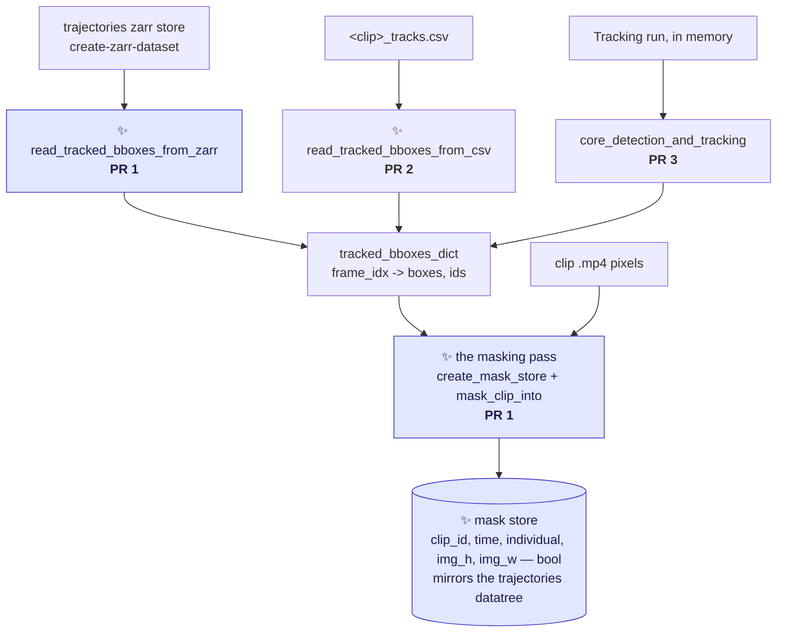

# Plan: masking tracked crabs with SAM2

The umbrella document for three PRs across three proposals. It says **what is being built, in what
order, and why** — the proposals carry the design detail and the argument for each decision.

> [!NOTE]
> **Scope reading.** "Two PRs, and `detect-and-track-mask` last" is taken to mean the two-PR staging
> of `mask-tracked-crabs` (zarr first, csv second), *plus* `detect-and-track-mask` after them —
> **three PRs, one proposal each**. If that is a misreading, PR 1 and PR 2 merge into one and nothing
> else changes.

---

## The goal

Turn tracked bounding boxes into **per-crab segmentation masks**, by prompting SAM2 with boxes that
have already been computed. Masks are the input the orientation work needs; boxes are not.

Nothing here runs a detector or a tracker. The boxes come from somewhere that already has them:

| source | what it is | who produced the boxes |
|---|---|---|
| a **trajectories zarr store** | what [`create-zarr-dataset`](../crabs/zarr/create_dataset.py) writes — many clips, many videos, with clip metadata | VIA tracks files, so: whatever produced those |
| a **`<clip>_tracks.csv`** | one clip's output from a `detect-and-track-video` run | SORT, in that run |
| a **`Tracking` run in memory** | the same, without the round trip through disk | SORT, in the same process |

All three produce the same thing — a mapping of frame index to boxes and IDs — and all three write
the same store. That is the whole architecture.

**The masking pass never learns where the boxes came from.** Each source is a reader; the pass takes
the dict. That is what makes PR 2 and PR 3 small.

---

## The three PRs

| | PR | entry point | boxes from | proposal | size |
|---|---|---|---|---|---|
| **1** | mask from a trajectories store | ✨ `mask-tracked-crabs` | `--boxes <store>.zarr` | [`proposal-mask-tracked-crabs.md`](proposal-mask-tracked-crabs.md) | ~330 lines |
| **2** | widen it to a tracks csv | same command | `--boxes <clip>_tracks.csv` | [`proposal-mask-tracked-crabs-from-csv.md`](proposal-mask-tracked-crabs-from-csv.md) | ~60 lines |
| **3** | mask in the same run as tracking | ✨ `detect-and-track-mask` | a `Tracking` run, in memory | [`proposal-detect-and-track-mask.md`](proposal-detect-and-track-mask.md) | ~60 lines |

### PR 1 — `mask-tracked-crabs`, reading a trajectories store

Carries everything the other two build on:

- **the masking pass** — `create_mask_store`, `mask_clip_into`, `predict_masks_into`,
  `load_sam2_predictor`
- **the store format** — `(clip_id, time, individual, img_h, img_w)` bool, one group per video,
  mirroring the trajectories datatree so masks and tracks align 1:1
- `read_tracked_bboxes_from_zarr`, and the loop over videos and clips
- `to_label_image` (the read side), `mask_config.yaml`, the opt-in `masks` dependency group
- a new pooch fixture: a small trajectories store plus the clip `.mp4`s it names

It is first because it is the path that will actually be used, and because its multi-clip loop is
what justifies the `create_mask_store` / `mask_clip_into` split. Shipping the split first with only
a single-clip caller would have been speculative generality.

### PR 2 — the same command, widened to a tracks csv

`--boxes` stops rejecting `.csv`. Adds `read_tracked_bboxes_from_csv` and `generate_masks`, the
one-clip path through the same pass — the wrapper PR 3 then calls. Useful for masking a fresh tracking run's output — iterating on SAM2 settings without
re-running the detector — and for clips that are in no trajectories store.

### PR 3 — `detect-and-track-mask`

Runs `detect-and-track-video` unchanged, then masks the tracked boxes in the same command, from the
in-memory dict. One added line in `track_video.py`, a parser split so the new command inherits every
tracking argument, and ~40 lines of entry point.

---

## Decisions already settled

Each is argued where it is listed; this table exists so they are not re-opened by accident.

| Decision | Where |
|---|---|
| **One entry point taking `--boxes`, dispatching on the file's suffix** — not two commands, and not a mutually-exclusive pair of flags | [proposal §1](proposal-mask-tracked-crabs.md) |
| **The store mirrors the trajectories datatree** — chosen up front so there is never a second, incompatible mask format | [proposal §5](proposal-mask-tracked-crabs.md) |
| **Identity is an explicit `individual` coordinate**, copied from whatever produced the boxes — no `track_id - 1` convention, and `M` is the emitted ID count rather than `max(id)` | [proposal §5](proposal-mask-tracked-crabs.md) |
| **One boolean plane per crab, not a label image** — overlap is representable, so nothing is discarded and there is no overlap policy baked into the store | [proposal §5](proposal-mask-tracked-crabs.md) |
| **Chunk per plane, shard per 128 planes**, and the whole-frame write that sharding forces | [proposal §6](proposal-mask-tracked-crabs.md) |
| **Flattening to a label image happens on read**, per consumer, per call | [proposal §7](proposal-mask-tracked-crabs.md) |
| **SAM2 is an opt-in dependency group**, not a hard requirement | [proposal, Dependencies](proposal-mask-tracked-crabs.md) |

---

## Prerequisites and open questions

**Resolved.** The `time`-coordinate defect that would have made a trajectories store unsafe to read
was fixed by [PR #291](https://github.com/SainsburyWellcomeCentre/crabs-exploration/pull/291)
(`99a2fcb`, *Make zarr time axis dense*). Stores built since then have a dense, clip-anchored `time`
axis, so row *p* is clip frame *p* by construction. PR 1 keeps a cheap guard that refuses an older
store rather than silently masking the wrong frames —
[`audit-zarr-time-coordinate.md`](audit-zarr-time-coordinate.md) is what the guard is checking for,
and is still worth running over any store built before 291 that is still in use.

**Open, and not blocking:**

- **`M` is not yet known, but it is a lookup rather than an estimate.** The dense write buffer is
  `M × H × W` bool — 207 MB at M=100 and 1920×1080. For PR 1, `M` is **exactly the input store's
  `individual` axis size** for a video group, because the mask store copies that coordinate
  verbatim. So it can be read off any existing store right now, without running anything:
  `max(len(node.ds.individual) for node in dt.leaves)`. Only [PR 2](proposal-mask-tracked-crabs-from-csv.md) has an `M` that is a
  different quantity — the distinct SORT IDs in one clip's csv — and that one is bounded by the same
  scene.
- **⚠️ The detector may be running at its detection cap.** `fasterrcnn_resnet50_fpn_v2` is built with
  no kwargs ([models.py:82](../crabs/detector/models.py#L82)), so torchvision's default
  `box_detections_per_img=100` applies to a scene with ~100 crabs per frame. That caps what any mask
  store can ever cover. It affects PR 3 directly and everything upstream of PR 1's inputs. **Worth
  its own issue.**
- **Whether the trajectories store should carry its clip video paths.** PR 1 takes `--videos` and
  derives `<video_id>-<clip_id>.mp4`; an attr on the store would make it self-sufficient, but only
  for stores built afterwards.

---

## Related work, not in this plan

| Document | Relationship |
|---|---|
| [`proposal-mask-zarr-dtype.md`](proposal-mask-zarr-dtype.md) | Fixes the existing [`generate_masks_from_bboxes.py`](../scripts/generate_masks_from_bboxes.py) store, which declares `bool` and writes `int16` IDs into it. Independent; nothing here depends on it |
| [`proposal-tracking-score-alignment.md`](proposal-tracking-score-alignment.md) | The `confidence` column in `<clip>_tracks.csv` is misaligned with the boxes beside it. Why [PR 2](proposal-mask-tracked-crabs-from-csv.md)'s reader drops it rather than parsing it back |
| [`audit-zarr-time-coordinate.md`](audit-zarr-time-coordinate.md) | Measures which pre-291 stores are affected. Not a blocker; see above |
| [`this-repo-collects-tools-pure-kernighan.md`](this-repo-collects-tools-pure-kernighan.md) | All three PRs together are a scoped-down first slice of its Phase 3 |
| Issue [#249](https://github.com/SainsburyWellcomeCentre/crabs-exploration/issues/249) | "Uncouple pipeline steps". PRs 1 and 2 are an instance of it; PR 3 is the recoupled convenience command on top |

**Explicitly out of scope for all three.** No ellipse fitting, no orientation, no angle in the CSV,
no changes to the detector or to SORT. The masks are the deliverable; geometry comes later, offline,
from the mask store.
