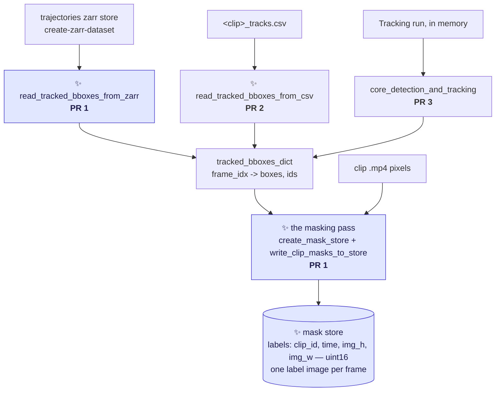

# Plan: masking tracked crabs with SAM2

The umbrella document for three PRs across three proposals. It says **what is being built, in what
order, and why** — the proposals carry the design detail and the argument for each decision.

> [!NOTE]
> **Scope reading.** "Two PRs, and `detect-and-track-mask` last" is taken to mean the two-PR staging
> of `mask-tracked-crabs` (zarr first, csv second), *plus* `detect-and-track-mask` after them —
> **three PRs, one proposal each**. If that is a misreading, PR 1 and PR 2 merge into one and nothing
> else changes.

---

## The goal

Turn tracked bounding boxes into **per-crab segmentation masks**, by prompting SAM2 with boxes that
have already been computed. Masks are the input the orientation work needs; boxes are not.

Nothing here runs a detector or a tracker. The boxes come from somewhere that already has them:

| source | what it is | who produced the boxes |
|---|---|---|
| a **trajectories zarr store** | what [`create-zarr-dataset`](../crabs/zarr/create_dataset.py) writes — many clips, many videos, with clip metadata | VIA tracks files, so: whatever produced those |
| a **`<clip>_tracks.csv`** | one clip's output from a `detect-and-track-video` run | SORT, in that run |
| a **`Tracking` run in memory** | the same, without the round trip through disk | SORT, in the same process |

All three produce the same thing — a mapping of frame index to boxes and IDs — and all three write
the same store. That is the whole architecture.

**The masking pass never learns where the boxes came from.** Each source is a reader; the pass takes
the dict. That is what makes PR 2 and PR 3 small.

---

## The three PRs

| | PR | entry point | boxes from | proposal | size |
|---|---|---|---|---|---|
| **1** | mask from a trajectories store | ✨ `mask-tracked-crabs` | `--boxes <store>.zarr` | [`proposal-mask-tracked-crabs.md`](proposal-mask-tracked-crabs.md) | ~330 lines |
| **2** | widen it to a tracks csv | same command | `--boxes <clip>_tracks.csv` | [`proposal-mask-tracked-crabs-from-csv.md`](proposal-mask-tracked-crabs-from-csv.md) | ~60 lines |
| **3** | mask in the same run as tracking | ✨ `detect-and-track-mask` | a `Tracking` run, in memory | [`proposal-detect-and-track-mask.md`](proposal-detect-and-track-mask.md) | ~60 lines |

### PR 1 — `mask-tracked-crabs`, reading a trajectories store

Carries everything the other two build on:

- **the masking pass** — `create_mask_store`, `write_clip_masks_to_store`, `predict_masks_into`,
  `load_sam2_predictor`
- **the store format** — `labels (clip_id, time, img_h, img_w)` uint16, one label image per frame,
  one group per video, with the trajectories store's own `clip_id` and `individual` coordinates so
  masks and tracks align 1:1
- `read_tracked_bboxes_from_zarr`, and the loop over videos and clips
- `label_of`, the explicit individual → pixel-value mapping; `mask_config.yaml`; the opt-in `masks`
  dependency group
- a new pooch fixture: a small trajectories store plus the clip `.mp4`s it names

It is first because it is the path that will actually be used, and because its multi-clip loop is
what justifies the `create_mask_store` / `write_clip_masks_to_store` split. Shipping the split first
with only a single-clip caller would have been speculative generality.

### PR 2 — the same command, widened to a tracks csv

`--boxes` stops rejecting `.csv`. Adds `read_tracked_bboxes_from_csv` and `generate_masks`, the
one-clip path through the same pass — the wrapper PR 3 then calls. Useful for masking a fresh tracking run's output — iterating on SAM2 settings without
re-running the detector — and for clips that are in no trajectories store.

### PR 3 — `detect-and-track-mask`

Runs `detect-and-track-video` unchanged, then masks the tracked boxes in the same command, from the
in-memory dict. One added line in `track_video.py`, a parser split so the new command inherits every
tracking argument, and ~40 lines of entry point.

---

## Decisions already settled

Each is argued where it is listed; this table exists so they are not re-opened by accident.

| Decision | Where |
|---|---|
| **One entry point taking `--boxes`, dispatching on the file's suffix** — not two commands, and not a mutually-exclusive pair of flags | [proposal §1](proposal-mask-tracked-crabs.md) |
| **The store mirrors the trajectories datatree** — chosen up front so there is never a second, incompatible mask format | [proposal §5](proposal-mask-tracked-crabs.md) |
| **Identity is an explicit `label_of` mapping**, individual → pixel value, so no reader ever needs to know the writer's offset. The `individual` coordinate is copied verbatim from whatever produced the boxes | [proposal §5](proposal-mask-tracked-crabs.md) |
| **A label image, not one boolean plane per crab** — so the store opens in napari and feeds `regionprops` with no conversion. Decided on measurement: at the real `M` of 791–8,082 the plane layout needs a 1.6–16.8 GB write buffer and 54k–979k files per clip | [proposal §5, §7](proposal-mask-tracked-crabs.md) |
| **Chunk = one frame, shard = 32 frames**, blosc-zstd-9 + bitshuffle. Bigger chunks were measured to give identical compression and 5.7× slower frame reads | [proposal §6](proposal-mask-tracked-crabs.md) |
| **Occlusion is resolved on write**, `smallest_wins`, recorded in `.attrs`. Measured: 94% of crabs never overlap, 0.62% of box area is contested. `n_px_lost` was considered and **dropped** — affected crabs are found on read by adjacency in the label image | [proposal §5a](proposal-mask-tracked-crabs.md) |
| **SAM2 is an opt-in dependency group**, not a hard requirement | [proposal, Dependencies](proposal-mask-tracked-crabs.md) |
| **SAM2 runs frame by frame, through `SAM2ImagePredictor`** — not `SAM2VideoPredictor`, whose point is to propagate a few prompted frames across a clip. Three reasons: every frame already carries a box for every tracked crab, so there is **nothing to propagate**; propagation would make SAM2 a **second owner of identity**, competing with the SORT ids the `individual` coordinate copies verbatim, which is what keeps the three box sources interchangeable; and `init_state` over a whole clip **fights the one-pass streaming write**, which is what holds peak memory flat in clip length. The cost is **no temporal consistency** — a crab's mask can flicker between frames and nothing smooths it, deliberately, in the same way occlusion is resolved once, at write time, rather than tracked per frame. Argued from the input rather than measured: the two predictors have not been run against each other on a real clip, worth doing when `-tiny` and `-base-plus` are compared | *here* |

---

## Prerequisites and open questions

**Resolved: the `time`-coordinate defect.** [PR #291](https://github.com/SainsburyWellcomeCentre/crabs-exploration/pull/291)
(`99a2fcb`, *Make zarr time axis dense*) made the axis dense and clip-anchored, so row *p* is clip
frame *p* by construction.

**And it never bit this data.** Checked on both an old store (`CrabTracks-slurm3012633.zarr`,
pre-291) and a new one (`CrabTracks-slurm3644250.zarr`): **all 234 clips of both** store exactly
`clip_last - clip_first + 1` frames. The bug only manifests when a VIA tracks file has a frame with
no boxes at all, and with ~60 crabs on screen that never happens. So
[`audit-zarr-time-coordinate.md`](audit-zarr-time-coordinate.md) does not need running for these two
stores.

**The version discriminator is the dimension name, not the frame count.** The pre-291 store uses
`individuals` (plural), the current one `individual` — a `movement` naming change. PR 1 refuses the
old spelling outright rather than trying to infer the version from the data, which the measurement
shows cannot be done.

**Measured scale**, from `CrabTracks-slurm3644250.zarr`: 27 videos, 234 clips, **4,949,234 frames**
at 4096×2160, ~60 crabs per frame, ~297M masks. **137 GPU-hours** at 10 fps (275 at 5 fps), which is
1.9–9.1 h per video — one SLURM array task per video, inside the existing 20 h limit.

**Open, and not blocking:**

- **How much store, and how ragged the masks are.** Measured at ~**131 GB** for the whole store
  (4.95M frames at 4096×2160, blosc-zstd-9 + bitshuffle), with ~80 GB as a floor and ~300 GB if SAM2
  segments the legs rather than just the carapace. That spread is the one number a first real clip
  settles, and it is a `du -sh` after one job.

- **The detector's detection cap — probably not binding, but unconfirmed.**
  `fasterrcnn_resnet50_fpn_v2` is built with no kwargs
  ([models.py:82](../crabs/detector/models.py#L82)), so torchvision's default
  `box_detections_per_img=100` applies. Sampling the trajectories store gives a **maximum of 81
  crabs in any frame** (median ~60), which is evidence against the cap binding — though that count is
  post-tracking and possibly post-filtering, so it is not conclusive. Still worth its own issue, and
  it matters most for PR 3, the one that runs the detector.
- **Whether the trajectories store should carry its clip video paths.** PR 1 takes `--videos` and
  derives `<video_id>-<clip_id>.mp4`; an attr on the store would make it self-sufficient, but only
  for stores built afterwards.

---

## Related work, not in this plan

| Document | Relationship |
|---|---|
| [`proposal-mask-zarr-dtype.md`](proposal-mask-zarr-dtype.md) | Fixes the existing [`generate_masks_from_bboxes.py`](../scripts/generate_masks_from_bboxes.py) store, which declares `bool` and writes `int16` IDs into it. Independent; nothing here depends on it |
| [`proposal-tracking-score-alignment.md`](proposal-tracking-score-alignment.md) | The `confidence` column in `<clip>_tracks.csv` is misaligned with the boxes beside it. Why [PR 2](proposal-mask-tracked-crabs-from-csv.md)'s reader drops it rather than parsing it back |
| [`audit-zarr-time-coordinate.md`](audit-zarr-time-coordinate.md) | Measures which pre-291 stores are affected. Not a blocker; see above |
| [`this-repo-collects-tools-pure-kernighan.md`](this-repo-collects-tools-pure-kernighan.md) | All three PRs together are a scoped-down first slice of its Phase 3 |
| Issue [#249](https://github.com/SainsburyWellcomeCentre/crabs-exploration/issues/249) | "Uncouple pipeline steps". PRs 1 and 2 are an instance of it; PR 3 is the recoupled convenience command on top |

**Explicitly out of scope for all three.** No ellipse fitting, no orientation, no angle in the CSV,
no changes to the detector or to SORT. The masks are the deliverable; geometry comes later, offline,
from the mask store.
