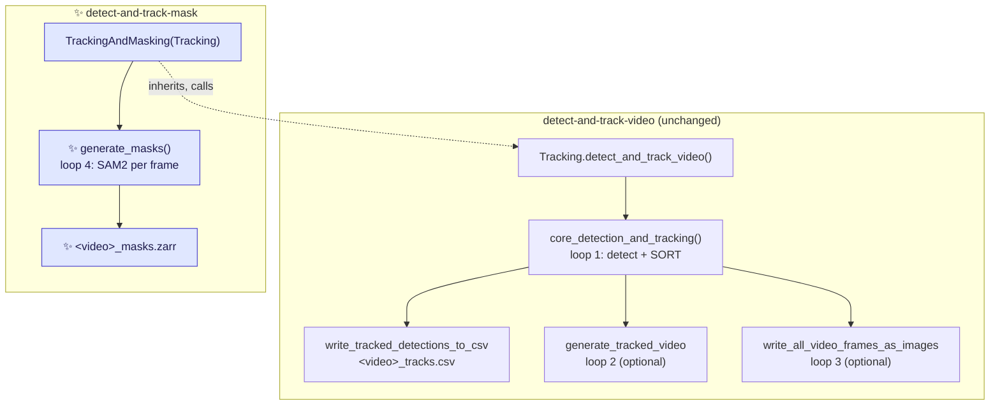
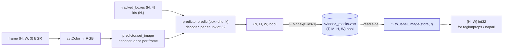

# Proposal for a `detect-and-track-mask` entry point

## Description

This document proposes a **new CLI entry point, `detect-and-track-mask`** in the crabs backage.

This entry point runs the existing
`detect-and-track-video` pipeline unchanged, then prompts SAM2 with the **tracked** boxes and
writes one boolean mask per crab per frame, each stored in a plane indexed by that crab's
**track ID**.


> [!NOTE]
> Nomenclature clarifications
> * **Prompt** — a hint telling SAM2 *which* object to segment. Here, one bounding box in
> `[x1, y1, x2, y2]` pixel coordinates per tracked crab.
>
> * **Instance plane** — a 2-D boolean array holding exactly one crab's mask. The store is a stack
> of these, indexed by track ID. This is what is written to disk.
> * **Label image** — a 2-D integer array where `0` is background and every other value identifies
> one object. This is the array `skimage.measure.regionprops` takes. Here it is **derived on read**
> from the instance planes (§3), never stored.


## References
It is a scoped-down
first slice of Phase 3 of
[`this-repo-collects-tools-pure-kernighan.md`](this-repo-collects-tools-pure-kernighan.md).

---

## Key aspects of suggested implementation


### 1. A subclass, so the diff is one new file

* `Tracking.detect_and_track_video` already produces exactly what SAM2 needs — tracked boxes and
IDs per frame.
* It already re-loops over the video twice (for `--save_video` and
`--save_frames`). Masking is a third such loop.



* The **entire feature is two new modules**: `crabs/tracker/track_and_mask_video.py` (the write
path) and `crabs/tracker/utils/masks.py` (the read-side helper, §3). The second exists only
because the overlap decision moved to read time; it imports neither `sam2` nor torch.

* There are **two changes to existing Python**, both in
[`crabs/tracker/track_video.py`](../crabs/tracker/track_video.py):
    - one added line, so `generate_masks`in `crabs/tracker/track_and_mask_video.py` can see the boxes:

    ```diff
    --- a/crabs/tracker/track_video.py
    +++ b/crabs/tracker/track_video.py
    @@ def detect_and_track_video(self) -> None:
        # Run detection and tracking over all frames in video
        tracked_bboxes_dict = self.core_detection_and_tracking()
    +   self.tracked_bboxes_dict = tracked_bboxes_dict
    ```
    - splitting `tracking_parse_args` into a parser builder and the call to `parse_args`, so the
    new entry point can inherit the tracking arguments with `parents=[...]` (§5). Behaviour of
    `detect-and-track-video` is unchanged.

* `prep_outputs` in `generate_masks` needs no change:
    - `generate_masks`  can derive its output path from `self.tracking_output_dir` and `self.input_video_file_root`, in the same way as it does already.

* The masks are
the third optional artefact in the same directory as the video `--save_video` writes and the raw PNGs `--save_frames` writes.
    ```
    tracking_output_<timestamp>/
    ├── <video>_tracks.csv
    ├── <video>_tracks.mp4          # --save_video
    ├── <video>_frames/             # --save_frames
    └── <video>_masks.zarr          # ✨ always, for this entry point
    ```

### 2. Output format: a zarr `(T, M, H, W)` boolean array, one plane per track ID

```
<video>_masks.zarr/                  # zarr group, matching the existing store layout
└── masks   (T, M, H, W) bool        # dims: image_id, id, img_h, img_w
```

* Axis 1 is indexed by track ID, with `m = track_id - 1`. That mapping is exact, not a convention:
`KalmanBoxTracker` numbers itself from a 0-based class counter
([sort.py:76-77](../crabs/tracker/sort.py#L76-L77)) and `Sort.update` emits `trk.id + 1`
([sort.py:210](../crabs/tracker/sort.py#L210)), so the IDs in `<video>_tracks.csv` are 1-based.

    ```python
    import zarr

    masks = zarr.open("<video>_masks.zarr", mode="r")["masks"]
    masks[t, track_id - 1]     # (H, W) bool — one crab in one frame, SAM2's output verbatim
    masks[t]                   # (M, H, W)   — every crab in frame t
    masks[:, track_id - 1]     # (T, H, W)   — one crab's whole trajectory, in a single slice
    ```

* **Why per-instance planes and not a single label image.** A label image cannot represent two
crabs occupying the same pixel, and this scene has ~100 frequently touching individuals — so
flattening would silently discard one crab's overlapping pixels. Here each crab owns its plane:
overlap is representable, nothing is discarded, and there is **no overlap policy to choose**. The
ellipse fits Phase 3 is aiming at are therefore not biased by neighbours.

* **It is the shape the existing consumer already builds by hand.**
[`notebook_visualise_masks_from_zarr.py`](../notebooks/notebook_visualise_masks_from_zarr.py)
takes a `(T, H, W)` label image and one-hot expands it into exactly
`(image_id, id, img_h, img_w)` boolean with a dask `map_blocks`
([:142-174](../notebooks/notebook_visualise_masks_from_zarr.py#L142-L174)), under the comment
*"CONS: can be slow to compute"*. Writing the planes directly deletes that expansion and its cost,
and `sel(image_id=..., id=...)`
([:181](../notebooks/notebook_visualise_masks_from_zarr.py#L181)) keeps working unchanged. The dim
names above are taken from that notebook.

* **`bool`, and the whole dtype question disappears.** Identity now lives in the *axis*, not in the
pixel values, so there is nothing to encode and no `int16`/`int32`/`uint16` ceiling to argue about
— the `100 × n_frames` bound on track IDs no longer constrains the format at all. This also
disarms the trap in the existing script rather than merely guarding against it:

> [!NOTE]
> [`generate_masks_from_bboxes.py`](../scripts/generate_masks_from_bboxes.py) opens its store as
> `dtype="bool"` ([:120](../scripts/generate_masks_from_bboxes.py#L120)) but writes an `int16`
> ID-encoded array into it ([:191](../scripts/generate_masks_from_bboxes.py#L191)), so every ID is
> silently coerced to `True` and the instance IDs are lost. Under this format `bool` is the
> *correct* dtype, because no ID is ever stored in a pixel. The bug cannot be expressed.

* **`M` is known before the masking loop starts**, so the array is never resized: §1 runs detection
and tracking to completion first, so `M = max(track_id)` over `self.tracked_bboxes_dict`. Not
every ID in `1..M` is necessarily emitted — a tracker suppressed below `min_hits` still burns a
counter value — so a few planes stay empty for the whole video. Those are never written.

* **Chunking, and the one real cost of this shape.** `chunks=(1, 1, H, W)` — one chunk per
(frame, crab), the unit every access pattern above reads. A chunk is 2.07 MB raw at 1920×1080 and
~0.17% non-zero, so it compresses to a few KB, and zarr does not write all-`False` chunks at all.
The count is the problem: ~`n_frames × n_crabs` ≈ **300,000 chunks** for a 3000-frame clip, which
means 300,000 files in a directory store — genuinely bad on the cluster's network filesystem. The
mitigation is zarr 3's **sharding codec**, `shards=(1, 128, H, W)`, packing 128 planes per file and
cutting that to `n_frames × ceil(M/128)`. The writer emits a whole frame at a time, so each shard
is filled in one pass, and `zarr` is declared as `>=3` for it (§6). See *Points to discuss*.

* Metadata in `.attrs` on the group:

```python
{
    "timestamp": ..., "sam2_model": ..., "device": ...,
    "source_video": str(self.input_video_path),
    "tracks_csv": str(self.csv_file_path),      # the file these IDs refer to
    "n_frames": ..., "image_shape": [H, W],
    "dims": ["image_id", "id", "img_h", "img_w"],
    "mask_encoding": "instance_planes",          # asserted against the array dtype (bool)
    "track_id_offset": 1,                        # m = track_id - track_id_offset
    "n_track_ids": ...,                          # M, the size of axis 1
    "n_track_ids_emitted": ...,                  # planes non-empty in at least one frame
    "kalman_box_tracker_count": ...,             # KalmanBoxTracker.count, for cross-checking
    "prompt_type": "bounding_box",
    "prompt_source": "tracked_boxes",            # not raw detections — see §4
    "multimask_output": False,
}
```

There is deliberately **no `overlap_policy` and no `background_label`** key: this format has
neither, which is the point of it.

### 3. Writing planes, and rebuilding a label image on read

SAM2 already returns per-instance masks, so the write path has **no combining step at all** — the
masks go straight into their planes. The flattening that `regionprops` needs happens on the read
side, where the caller chooses the policy and nothing on disk is affected.



**Write side** — one orthogonal-index assignment per chunk of prompts, no helper needed:

```python
mask_zarr.oindex[frame_idx, track_ids - 1] = masks   # (N, H, W) bool into N planes
```

`oindex` rather than plain `[...]` because zarr implements vectorised integer indexing through
orthogonal indexing; `track_ids` are scattered along axis 1, not contiguous.

**Read side** — one helper in a new `crabs/tracker/utils/masks.py`, pure (no `sam2`, no torch), so
it is unit-testable on CI:

```python
def to_label_image(mask_planes, track_ids=None, policy="higher_track_id_wins"):
    """(M, H, W) bool -> (H, W) int32 label image, for regionprops and napari.

    This is where the overlap decision now lives: it is the caller's, per call,
    and it never touches what is stored.
    """
```

`to_label_image` is the old `paint_masks_as_label_image` moved to the read side and given a
`policy` argument. `ellipses_from_labels` in the notebook
([:52](../notebooks/notebook_visualise_masks_from_zarr.py#L52)) consumes its output unchanged.

**What this costs.** The store is no longer directly openable in napari — `viewer.add_labels` on a
`(T, M, H, W)` boolean array gives a slider over crabs, not a frame view. Callers go through
`to_label_image` instead, which is one line at the two call sites in the notebook
([:219](../notebooks/notebook_visualise_masks_from_zarr.py#L219),
[:226-229](../notebooks/notebook_visualise_masks_from_zarr.py#L226-L229)). That is the honest
trade for losslessness; the notebook change is listed in *Files changed*.

### 4. Prompting with tracked boxes: what you get, and what it costs

Per the request, the prompts are the **tracked** boxes. That is what makes the plumbing trivial —
the mask rows and the CSV rows are the same rows, so there is no index bookkeeping at all, and no
change to `sort.py`.

Two consequences worth stating plainly, neither of which blocks this:

- **SORT does not return the detector's box.** `Sort.update` emits `trk.get_state()` =
  `convert_x_to_bbox(self.kf.x)` ([sort.py:204](../crabs/tracker/sort.py#L204)) — a Kalman-filtered
  estimate in `(cx, cy, area, aspect_ratio)` space, lagged and with its aspect ratio pulled towards
  the track's history. The masks are therefore segmented from an approximate box.
- **Only tracked crabs get a mask.** Detections that SORT suppresses (below `min_hits`) produce no
  row and no mask. With `min_hits: 1` in the current config this is nearly all of them.

The compute difference is negligible either way: the expensive image encoder runs **once per
frame** regardless, and prompts only touch the small mask decoder.


### 5. Configuration: a separate mask config

The three knobs go in a **new config file of their own**, not into the tracking config:

```yaml
# crabs/tracker/config/mask_config.yaml   ✨ new file
sam2_model_id: facebook/sam2.1-hiera-base-plus   # matches the existing script's default
max_prompts_per_batch: 32                        # see §7
shard_n_planes: 128                              # see §2; null disables sharding
```

**Why not a `masks:` block in `tracking_config.yaml`.** Nothing would break if it went there —
config keys are read individually rather than splatted, so `Sort` is built from three named keys
([track_video.py:155-159](../crabs/tracker/track_video.py#L155-L159)) and an unknown key is inert.
The reasons are about shape, not safety:

- [`tracking_config.yaml`](../crabs/tracker/config/tracking_config.yaml) is currently **four flat
  SORT scalars**. A `masks:` block would be the first nested structure in it, and would put two
  models' settings in one file for an entry point that only uses one of them.
- The two have unrelated tuning lifecycles. *Points to discuss* anticipates comparing `-tiny` /
  `-small` / `-base-plus`, which is mask-config churn that should never touch SORT parameters.
- It removes a wart rather than documenting one: the integration test fetches its
  `tracking_config.yaml` from the pooch/GIN registry
  ([test_inference.py:45](../tests/test_integration/test_inference.py#L45)) and **that file has no
  `masks:` key**, so a merged block would have to be defensively defaulted. A separate file with
  its own default path never has the problem.
- It is the shape issue [#249](https://github.com/SainsburyWellcomeCentre/crabs-exploration/issues/249)
  ("Uncouple pipeline steps") will want: a later `--tracking_output_dir` mode would pass a mask
  config and no tracking config at all.

**The new flag is added by inheriting the tracking parser.** `tracking_parse_args` currently builds
its parser and parses in one function ([track_video.py:350-451](../crabs/tracker/track_video.py#L350-L451)).
Splitting the building out into `tracking_parser` lets the new entry point reuse every tracking
argument through argparse's own `parents` mechanism, and adds `--mask_config_file` alongside them:

```diff
--- a/crabs/tracker/track_video.py
+++ b/crabs/tracker/track_video.py
+def tracking_parser() -> argparse.ArgumentParser:
+    """Build a parser with the arguments for tracking.
+
+    The parser is defined with ``add_help=False`` so that it can be used as a
+    parent parser (see ``parents`` in argparse).
+    """
+    parser = argparse.ArgumentParser(add_help=False)
+    ...   # every add_argument call, unchanged
+    return parser
+
+
 def tracking_parse_args(args):
     """Parse command-line arguments for tracking."""
-    parser = argparse.ArgumentParser()
-    ...
+    parser = argparse.ArgumentParser(parents=[tracking_parser()])
     return parser.parse_args(args)
```

```python
# crabs/tracker/track_and_mask_video.py
DEFAULT_MASK_CONFIG = str(Path(__file__).parent / "config" / "mask_config.yaml")


def mask_parse_args(args):
    """Parse command-line arguments for tracking and masking."""
    parser = argparse.ArgumentParser(parents=[tracking_parser()])
    parser.add_argument(
        "--mask_config_file",
        type=str,
        default=DEFAULT_MASK_CONFIG,
        help=(
            "Location of YAML config to control masking. "
            "Default: "
            "crabs-exploration/crabs/tracker/config/mask_config.yaml. "
        ),
    )
    return parser.parse_args(args)
```

This follows the shape the other entry points already have — one `*_parse_args(args)` per entry
point, returning one namespace — so `main` and `app_wrapper` take a single `args` as everywhere
else in the package, and `--mask_config_file` shows up in `detect-and-track-mask --help` next to
the tracking options.

The `add_help=False` on `tracking_parser` is what makes it usable as a parent: two parsers each
defining `-h` would raise `ArgumentError` on the child. Both callers therefore wrap it in a real
parser that adds the help option itself.

`tracking_parse_args` is only called from `app_wrapper` in the same module, so the split has no
other callers to update.

Read the file as `{**MASK_DEFAULTS, **yaml.safe_load(open(args.mask_config_file))}`. The
defaults dict is still needed, so that a user's older config missing `shard_n_planes` does not
fail.


### 6. Dependencies
On dependencies:

- **`sam-2` is not on PyPI, and a plain `pip install` from git pulls a second torch.** The only
  source is the git URL used in
  [generate_masks_from_bboxes.py:35](../scripts/generate_masks_from_bboxes.py#L35). SAM2's own
  [`pyproject.toml`](https://github.com/facebookresearch/sam2/blob/main/pyproject.toml) declares
  `torch>=2.5.1` as a **build** requirement (its `setup.py` imports `torch.utils.cpp_extension` to
  build the CUDA extension), so `pip install "sam-2 @ git+..."` downloads an entire extra torch
  into the isolated build environment — possibly a different variant from the one already
  installed. That, not the clone, is the slow surprise on the cluster.

  **So declare it as a PEP 735 dependency group, and disable build isolation for it:**

  ```toml
  # pyproject.toml
  [dependency-groups]
  masks = ["sam-2 @ git+https://github.com/facebookresearch/sam2.git"]

  [tool.uv]
  no-build-isolation-package = ["sam-2"]   # build sam-2 against the env's torch
  ```

  Installed with `uv sync --group masks` (or `pip install --group masks` on pip ≥ 25.1 — the
  pips on this machine are older, so I have not run that form).

  Dependency groups are **never written into distribution metadata**, so the sdist built by
  [test_and_deploy.yml:59](../.github/workflows/test_and_deploy.yml#L59) is untouched — which is
  what a PEP 508 direct reference in `[project.dependencies]` could not have promised. Everything
  else about §6 stands: the group is opt-in, the lazy import inside `generate_masks` still raises
  the actionable error, nothing in the default install pulls SAM2, and CI keeps running the unit
  suite on ubuntu and macOS without it.

  <details>
  <summary>Two alternatives, and why not</summary>

  - **An optional extra plus `[tool.uv.sources]`.** Checked rather than assumed: built with
    uv 0.7.15, both the wheel and the sdist come out carrying `Requires-Dist: sam-2; extra ==
    "masks"` — the URL *is* stripped, so the sdist would stay publishable. But the published
    package would then advertise a `sam-2` that PyPI cannot resolve, so `pip install crabs[masks]`
    fails for anyone not building from this repo. The group has neither problem.
  - **A prebuilt wheel.** `sam_2-1.0.dist-info/direct_url.json` in the local `.venv` shows the
    copy currently installed here came from
    `https://github.com/horsto/sam2/releases/download/v0.0.2/sam_2-1.0-py3-none-any.whl` — pure
    Python, no build step and no torch build dependency at all. The simplest of the three, at the
    cost of trusting a third-party fork's release artefact rather than Meta's repo. Worth keeping
    in mind if the source build proves painful on the cluster.
  </details>

- **Licence: Apache-2.0 for both the code and the weights.** The `sam-2` package is Apache-2.0
  (read from the installed `dist-info`), and the checkpoints are too: the Hugging Face model cards
  for `facebook/sam2.1-hiera-tiny`, `-small`, `-base-plus` and `-large` all declare
  `license: apache-2.0` in their card metadata (all four checked on 2026-09-11). So there is no
  licence conflict on either the code or the weights, and none of the `-tiny`/`-small`/`-base-plus`
  swaps in *Points to discuss* #3 changes that.

- **The conda/pip path still needs a plain command.** [README.md:33-42](../README.md#L33-L42) and
  the HPC guides install with conda + `pip install -e .[dev]`, and `uv` appears in neither the
  guides nor [test_and_deploy.yml](../.github/workflows/test_and_deploy.yml). The README section
  therefore documents both routes: `uv sync --group masks` for a uv checkout, and, for a conda
  environment with torch already installed,

  ```bash
  pip install --no-build-isolation "sam-2 @ git+https://github.com/facebookresearch/sam2.git"
  ```

- **`zarr` is imported directly but not declared** — [`crabs/zarr/create_dataset.py:21`](../crabs/zarr/create_dataset.py#L21)
  relies on it arriving transitively via `movement`. This proposal adds a second direct importer,
  so it is worth declaring now, as `zarr>=3` — §2's sharding needs 3.x. (A local `uv.lock` here
  resolves 3.x, but that file is gitignored ([.gitignore:110](../.gitignore#L110)) and untracked,
  so it is not evidence about anyone else's environment.)

### 7. Three SAM2 details that will silently degrade or crash this

| Detail | Consequence | Handling |
|---|---|---|
| `cv2.VideoCapture.read()` returns **BGR**; `set_image` documents **RGB** (`sam2_image_predictor.py:86-98`) | Silently worse masks — no error, no warning. The existing script never hit this because it reads RGB PNGs via PIL. | `cv2.cvtColor(frame, cv2.COLOR_BGR2RGB)` |
| `predict()` ends with `masks.squeeze(0)`: returns `(N, 1, H, W)` for N>1 but `(1, H, W)` for N==1 | Crash or wrong axis on any frame with exactly one tracked crab. The same latent bug is in [generate_masks_from_bboxes.py:171](../scripts/generate_masks_from_bboxes.py#L171). | `masks.reshape(len(boxes), *masks.shape[-2:])` |
| Every prompt gets a **full-frame** mask: `_predict` upsamples to `self._orig_hw`, then `predict()` does `.float().cpu().numpy()` | At 1920×1080 that is 8.29 MB per prompt in float32 — **829 MB on CPU for a 100-crab frame**, and 100 prompts is the exact worst case, since the detector caps detections per image at 100 (§2) | Chunk the prompts (`max_prompts_per_batch`, default 32 → 265 MB peak) and write each chunk's planes to zarr before releasing it |

Also: skip SAM2 entirely on frames with zero tracked boxes, rather than calling `set_image` and
then `predict` with an empty array.

**Explicitly out of scope:** no ellipse fitting, no orientation, no angle in the CSV, no changes to
the detector or to SORT. The masks are the deliverable; geometry comes later, offline, from the
mask store.


---

## Detailed implementation

### The 7 changes

| # | Change | Signature / diff |
|---|---|---|
| 1 | **new** `crabs/tracker/track_and_mask_video.py` — the whole feature, ~150 lines | see below |
| 2 | **new** `crabs/tracker/utils/masks.py` — the read-side helper, ~25 lines | `to_label_image` (§3) |
| 3 | [`crabs/tracker/track_video.py`](../crabs/tracker/track_video.py) — expose the tracked boxes, and the parser | `+ self.tracked_bboxes_dict = tracked_bboxes_dict` (one line, §1); split `tracking_parse_args` into `tracking_parser()` + `parse_args` (§5) |
| 4 | **new** `crabs/tracker/config/mask_config.yaml` | the three SAM2/store knobs (§5) |
| 5 | [`pyproject.toml`](../pyproject.toml) | `detect-and-track-mask = "crabs.tracker.track_and_mask_video:app_wrapper"`; declare `zarr>=3`; add the `masks` dependency group and `[tool.uv] no-build-isolation-package` (§6) |
| 6 | **new** `tests/test_unit/test_track_and_mask_video.py` | unit tests for the pure helpers (no `sam2` needed) |
| 7 | [`crabs/tracker/README.md`](../crabs/tracker/README.md) + [`guides/DetectAndTrackHPC.md`](../guides/DetectAndTrackHPC.md) | how to install the `masks` group (§6), pass `--mask_config_file`, and read the store back |


<details>
<summary><b>1. The new module in full outline</b></summary>

Five module-level functions plus a subclass, with the read-side helper in `utils/masks.py`.
Everything except `load_sam2_predictor` and `predict_masks_for_frame` is pure — no `sam2`, no
torch, no I/O beyond zarr and the config file — which is what makes the unit tests possible on CI.

```python
"""Detect, track and mask crabs in a video."""

DEFAULT_MASK_CONFIG = str(Path(__file__).parent / "config" / "mask_config.yaml")

MASK_DEFAULTS = {
    "sam2_model_id": "facebook/sam2.1-hiera-base-plus",
    "max_prompts_per_batch": 32,
    "shard_n_planes": 128,          # §2; None disables sharding
}


def mask_parse_args(args):
    """Parse command-line arguments for tracking and masking.  [§5]"""
    parser = argparse.ArgumentParser(parents=[tracking_parser()])   # inherits every tracking arg
    parser.add_argument("--mask_config_file", type=str, default=DEFAULT_MASK_CONFIG, help=...)
    return parser.parse_args(args)


def load_mask_config(path) -> dict:
    """Read the mask config, backfilled with MASK_DEFAULTS.  [§5]"""
    with open(path) as f:
        return {**MASK_DEFAULTS, **(yaml.safe_load(f) or {})}


def create_mask_zarr(path, n_frames, n_track_ids, image_shape, metadata_dict) -> zarr.Array:
    """Open a (T, M, H, W) bool array named "masks" in a group at `path`.

    chunks=(1, 1, H, W), shards=(1, shard_n_planes, H, W), fill_value=False.
    Asserts the array dtype is bool, matching metadata["mask_encoding"]
    == "instance_planes" — the guard that keeps §2's warning from recurring.
    """


def load_sam2_predictor(model_id: str, device: str):
    """Import sam2 lazily and return a SAM2ImagePredictor.  [§6]"""
    try:
        from sam2.sam2_image_predictor import SAM2ImagePredictor
    except ImportError as e:
        raise ImportError(
            "detect-and-track-mask needs SAM2. Install it with:\n"
            "  uv sync --group masks\n"
            "or, in a conda env with torch already installed:\n"
            '  pip install --no-build-isolation "sam-2 @ git+https://github.com/facebookresearch/sam2.git"'
        ) from e
    return SAM2ImagePredictor.from_pretrained(model_id, device=device)


def predict_masks_for_frame(predictor, frame_bgr, boxes, max_prompts_per_batch):
    """(H, W, 3) BGR + (N, 4) boxes -> (N, H, W) bool.  [§5]"""
    predictor.set_image(cv2.cvtColor(frame_bgr, cv2.COLOR_BGR2RGB))
    out = []
    FOR EACH chunk OF boxes, size max_prompts_per_batch:
        masks, _iou, _low_res = predictor.predict(box=chunk, multimask_output=False)
        out.append(masks.reshape(len(chunk), *masks.shape[-2:]).astype(bool))
    RETURN np.concatenate(out)


class TrackingAndMasking(Tracking):
    """Extend Tracking with a SAM2 masking pass over the tracked boxes."""

    def __init__(self, args, mask_config):
        super().__init__(args)           # unchanged; reads the tracking config
        self.mask_config = mask_config   # separate file, §5

    def prep_mask_outputs(self): ...     # output path + M (below)
    def generate_masks(self): ...        # the loop, below


def main(args):
    inference = TrackingAndMasking(args, load_mask_config(args.mask_config_file))
    inference.detect_and_track_video()   # inherited, unchanged
    inference.generate_masks()


def app_wrapper():
    logging.getLogger().setLevel(logging.INFO)
    torch.set_float32_matmul_precision("medium")
    main(mask_parse_args(sys.argv[1:]))   # same shape as the other entry points, §5
```

`generate_masks`, mirroring the structure of `write_all_video_frames_as_images`
([io.py:205](../crabs/tracker/utils/io.py#L205)):

```python
def generate_masks(self):
    predictor = load_sam2_predictor(cfg["sam2_model_id"], self.accelerator)

    # M is knowable here: tracking has already finished  [§2]
    n_track_ids = max(
        frame["ids"].max() for frame in self.tracked_bboxes_dict.values() if len(frame["ids"])
    )
    mask_zarr = create_mask_zarr(path, total_n_frames, n_track_ids, (H, W), metadata)

    input_video_object = open_video(self.input_video_path)
    frame_idx = 0
    WHILE input_video_object.isOpened():
        ret, frame = input_video_object.read()
        IF not ret:
            parse_video_frame_reading_error_and_log(frame_idx, total_n_frames)
            break

        frame_data = self.tracked_bboxes_dict[frame_idx]
        boxes, ids = frame_data["tracked_boxes"], frame_data["ids"]
        IF len(boxes) > 0:                                    # [§5]
            masks = predict_masks_for_frame(predictor, frame, boxes, chunk_size)
            mask_zarr.oindex[frame_idx, ids.astype(int) - 1] = masks   # [§3]
        frame_idx += 1

    input_video_object.release()
```

Frames with no tracked boxes are left at the store's `fill_value=False`, and those chunks are never
written — correct by construction, and one fewer branch.

Two invariants worth asserting at the end of the run, both cheap and both about the ID↔axis
mapping the format now depends on: every emitted track ID is in `1..M`, and
`KalmanBoxTracker.count >= M` (it can exceed `M` when a tracker was suppressed below `min_hits`,
never fall below it).

**Rejected alternative — masking inside `core_detection_and_tracking`.** It saves one video pass,
but it puts SAM2 in the middle of the detection loop, changes an existing method, and makes the
feature impossible to skip. A fourth pass matches the pattern the file already uses twice and
keeps the diff to `track_video.py` down to the one added line.

**Rejected alternative — a post-pass over an existing `_tracks.csv`.** More decoupled, and
attractive later, but it means re-parsing VIA JSON and re-deriving the frame index from filenames
when the same data is already in memory. It also could not reuse `Tracking` at all. Worth
revisiting once the format is settled.
</details>

<details>
<summary><b>2. Formats considered and rejected</b></summary>

All four are lossless-or-not on overlap, and all four are `regionprops`-shaped at read time. The
choice came down to what the downstream access pattern is.

| Format | Lossless on overlap | `masks[:, tid]` per-crab slice | Opens in napari as-is | Note |
|---|---|---|---|---|
| **`(T, M, H, W)` bool, plane per track ID** ✅ chosen | yes | **yes, one slice** | no | chunk count is the cost (§2) |
| `(T, H, W)` int32 label image | **no** | no | yes | simplest; discards the lower-ID crab's overlapping pixels |
| `(T, K, H, W)` int32 overlap layers | yes | no | plane 0 ≈ whole frame | `K`≈2–4; needs a greedy packing pass at write time |
| bbox-local crops + index table | yes | no (needs a scan) | no | ~500× smaller raw, but ragged and no time-slicing |

**Why not the label image.** It was the original proposal. It cannot represent two crabs on one
pixel, and the ellipse fits Phase 3 wants would be biased by exactly the neighbours that touch
most. Rejected on losslessness, not on size — zarr compresses a label image well enough that size
was never the deciding argument.

**Why not overlap layers.** Genuinely close, and better on chunk count and napari. It loses because
the axis carries no identity, so `masks[:, tid]` — one crab's whole trajectory in a single read —
is not expressible. That slice is what the orientation work will be built on.

**Why not crops.** Much the smallest, and the only one that scales to long clips without thought.
Rejected for now because it is ragged (two arrays plus offset bookkeeping), needs a scan to
assemble one crab's time series, and cannot be read without the repo's helpers. Worth revisiting
if *Points to discuss* #1 or #2 comes back badly.
</details>

---

## Files changed

| File | Change |
|---|---|
| `crabs/tracker/track_and_mask_video.py` | **new** — the entire write path |
| `crabs/tracker/utils/masks.py` | **new** — `to_label_image` (§3) |
| [`crabs/tracker/track_video.py`](../crabs/tracker/track_video.py) | one added line (store the tracked boxes on `self`); split `tracking_parse_args` into `tracking_parser()` + `parse_args`, so the new entry point can inherit it with `parents=[...]` (§5) |
| `crabs/tracker/config/mask_config.yaml` | **new** — SAM2 and store knobs, separate from the tracking config (§5) |
| [`pyproject.toml`](../pyproject.toml) | new `detect-and-track-mask` script; declare `zarr>=3`; `[dependency-groups] masks` + `[tool.uv] no-build-isolation-package` (§6) |
| `tests/test_unit/test_track_and_mask_video.py` | **new** |
| [`notebooks/notebook_visualise_masks_from_zarr.py`](../notebooks/notebook_visualise_masks_from_zarr.py) | drop the one-hot `map_blocks` expansion ([:142-174](../notebooks/notebook_visualise_masks_from_zarr.py#L142-L174)) — the store is already 4-D; route the two napari calls through `to_label_image` (§3) |
| [`crabs/tracker/README.md`](../crabs/tracker/README.md) | document the entry point, `--mask_config_file`, the store layout and how to read it back |
| [`guides/DetectAndTrackHPC.md`](../guides/DetectAndTrackHPC.md) | installing the `masks` group on the cluster (and the `--no-build-isolation` pip line for the conda envs, §6); staging the second config file |

Nothing else is touched. In particular: no change to `sort.py`, to `utils/io.py`, to
`tracking_config.yaml`, to the CSV format, to `evaluate_tracker.py`, or to the detector.

---

## Overview of tests to write

**Pure unit — must pass with no `sam2` installed (this is the CI shape)**

1. **The ID↔axis mapping, which is now the core contract.** Write three masks with IDs `[7, 3, 12]`
   via `oindex[t, ids - 1]`, then assert `masks[t, 6]`, `masks[t, 2]` and `masks[t, 11]` are the
   masks that went in, and that every other plane in frame `t` is all-`False`.
2. **Overlap is preserved.** Two masks with IDs `3` and `12` sharing a block of pixels: both planes
   still contain the shared pixels in full, and each plane's `sum()` equals its input's. This is
   the test that would fail under the label-image format, and it is the reason for the change.
3. `to_label_image`: non-overlapping planes give a label image whose non-zero values are exactly
   `{3, 7, 12}`, regions in the right places; overlapping planes resolve by `policy`, and the
   result does not depend on plane order.
4. Round-trip through the consumer: feed `to_label_image` output to `skimage.measure.regionprops`
   and assert `{p.label for p in props} == {3, 7, 12}`. The property the read path exists for.
5. A frame with no tracked boxes leaves every plane all-`False` and does not raise.
6. `create_mask_zarr`: dtype is `bool`, `fill_value` is `False`, chunks are `(1, 1, H, W)`, shards
   are `(1, 128, H, W)`, and `.attrs["mask_encoding"] == "instance_planes"` — plus a test that the
   internal assertion **fires** if the dtype and the declared encoding disagree (the guard that
   keeps §2's `dtype="bool"` bug from being reintroduced from the other direction).
7. `load_sam2_predictor` raises `ImportError` with the install command in the message when `sam2`
   is absent (`monkeypatch` the import) — assert the message names `uv sync --group masks`, so it
   cannot drift from the group actually declared in `pyproject.toml`.
8. **`mask_parse_args` (§5).** Three cases, since this is the only new CLI surface: the namespace
   carries `mask_config_file` when the flag is passed, and `DEFAULT_MASK_CONFIG` when it is not;
   every tracking argument is inherited (assert that `vars(mask_parse_args(argv + mask_flag))`
   minus `mask_config_file` equals `vars(tracking_parse_args(argv))` for the same `argv`); and
   `--help` exits `0` with both `--mask_config_file` and `--config_file` in the usage text — the
   property the `parents=[...]` refactor buys, and the one that would regress if
   `tracking_parser` were ever given `add_help=True`.
9. `load_mask_config`: a config missing `shard_n_planes` is backfilled from `MASK_DEFAULTS`, and
   an empty file yields the defaults rather than raising — the guard against
   `yaml.safe_load` returning `None`.

**Existing tests that must stay green, unmodified**

10. `pytest tests/test_unit` — in particular
   [`test_tracking_io.py`](../tests/test_unit/test_tracking_io.py) (the CSV is untouched) and
   [`test_track_video.py`](../tests/test_unit/test_track_video.py) (neither the one-line change to
   `detect_and_track_video` nor the parser split must alter behaviour). The parser split has no
   existing test covering it — `tracking_parse_args` is called only from `app_wrapper` — so add
   one: `tracking_parse_args` on a minimal valid argv still returns the same defaults, and
   `detect-and-track-video --help` still lists every tracking option.
11. [`test_entry_points.py`](../tests/test_unit/test_entry_points.py) — extend with
   `detect-and-track-mask` following the existing pattern.

**Integration (slow, opt-in)**

12. A `test_detect_and_track_mask` alongside
   [`test_detect_and_track_video`](../tests/test_integration/test_inference.py), reusing the
   `pooch_registry` fixture and the 3-frame clip, `@pytest.mark.skipif` on `sam2` being importable.
   Assert the store exists, has shape `(3, M, H, W)` and dtype `bool`, and that for each frame the
   set of planes with any `True` pixel is exactly `{tid - 1 for tid in that frame's CSV rows}`.
   That last assertion is the real contract of this feature.

   Note this test now passes the registry's `tracking_config.yaml` **unchanged** and lets
   `--mask_config_file` fall back to its packaged default — with a separate config there is nothing
   to add to the GIN registry file (§5).

---

## Verifications for agent to run

```bash
# lint + full unit suite (no sam2 needed)
pre-commit run --all-files
pytest tests

# slow end-to-end CLI tests (pooch downloads test data on first run)
pytest -m slow tests/test_integration/test_inference.py
```

Manual check on a real clip:

```bash
uv sync --group masks   # §6; in a conda env instead:
# pip install --no-build-isolation "sam-2 @ git+https://github.com/facebookresearch/sam2.git"

detect-and-track-mask \
    --trained_model_path <ckpt> \
    --video_path <clip.mp4> \
    --mask_config_file <mask_config.yaml> \   # optional; defaults to the packaged one
    --config_file <tracking_config.yaml> \
    --accelerator=gpu \
    --output_dir_no_timestamp
```

then confirm the contract and eyeball the masks:

```python
import zarr, numpy as np
from skimage.measure import regionprops
from crabs.tracker.utils.masks import to_label_image

root = zarr.open("tracking_output/<clip>_masks.zarr", mode="r")
masks = root["masks"]
print(masks.shape, masks.dtype, dict(root.attrs))   # (T, M, H, W) bool

# the contract: which planes are populated in frame 0
print(sorted(np.flatnonzero(masks[0].any(axis=(1, 2))) + 1))   # == track IDs in frame 0 of the CSV

# the read path
props = regionprops(to_label_image(masks[0]))
print([p.area for p in props][:10])       # sanity: no zero-area or whole-frame regions
```

[`notebooks/notebook_visualise_masks_from_zarr.py`](../notebooks/notebook_visualise_masks_from_zarr.py)
loads this shape into napari once its one-hot expansion is dropped (*Files changed*); overlaying it
on the frames written by `--save_frames` is the fastest qualitative check that the masks are on the
crabs and not on the background.

Also worth recording once, since both decide the format's viability: `du -sh` **and the file count**
(`find ... | wc -l`) of the store for one real clip, and the wall-clock time of the masking pass
versus the detection pass.

---

## Points to discuss

1. **Chunk count is this format's one weak spot, and it is unmeasured.** Per-instance planes mean
   ~`n_frames × n_crabs` ≈ 300,000 chunks for a 3000-frame clip (§2). Sharding at
   `(1, 128, H, W)` should cut that to `n_frames × ceil(M/128)`, but I have not measured either the
   file count or whether zarr 3's sharding writer behaves well with `oindex` writes of a frame's
   scattered IDs — it may do a read-modify-write per shard. This is the number I would check first
   on the cluster, and `shard_n_planes` is a config value precisely so it can be tuned without a
   format change. If sharding disappoints, the fallback is a zip store.
2. **Store size.** Raw `(T, M, H, W)` bool is enormous — 622 GB for `T=3000, M=100` — but it is
   never stored: each plane is ~0.17% non-zero, all-`False` chunks are not written at all, and only
   ~`n_frames × n_crabs` chunks ever exist. My estimate is the same order as the label image would
   have compressed to (a few hundred MB to ~1 GB), but I have not measured it and will not guess.
   Note this format has no `uint16`/`int32` lever to pull because there is no ID in the data — if
   it comes out too big the levers are a stronger compressor, or storing bbox-local crops rather
   than full-frame planes (which would drop the raw volume by ~500× but costs the direct
   `masks[:, tid-1]` slicing that motivated this shape).
3. **`sam2_model_id` default.** I have matched the existing script's `-base-plus`
   ([generate_masks_from_bboxes.py:307](../scripts/generate_masks_from_bboxes.py#L307)) so the two
   agree. `-tiny` / `-small` are considerably faster and may well be enough at this object size —
   easy to compare once the entry point exists, since it is a config value, and with the separate
   mask config (§5) swapping it never touches the tracking parameters.

5. **Should the entry point re-run detection, or accept an existing tracking output?**
    * As proposed
   it re-runs everything, which is the simplest thing and matches the name.
   * The cost is that
   iterating on SAM2 settings means re-running the detector each time.
   * A `--tracking_output_dir`
   flag that skips straight to `generate_masks` would fix that and fits issue
   [#249](https://github.com/SainsburyWellcomeCentre/crabs-exploration/issues/249)
   ("Uncouple pipeline steps"), but it needs the tracks CSV parsed back in. Deliberately left out;
   easy to add later without changing the format — and the separate mask config (§5) is already the
   right shape for it, since that mode would pass a mask config and no tracking config at all.

6. **⚠️ The detector is running at its detection cap.**
    * `fasterrcnn_resnet50_fpn_v2` is constructed
   with no kwargs ([models.py:82](../crabs/detector/models.py#L82)), so torchvision's default
   `box_detections_per_img=100` applies — and this scene has **~100 crabs per frame**.
   * Dense frames
   are therefore plausibly being truncated to the top 100 by score, silently, before tracking and
   before any masking.
   * This does not change anything in this proposal — the masks follow whatever
   the tracker emits — but it caps what the masks can ever cover, and it is invisible in the
   outputs.
   * Worth its own issue and a quick check: log
   `max(len(boxes) for boxes in detections)` over a real clip and see how often it sits at exactly 100.

7. **The dependency group only helps a uv checkout, and this repo is not one yet.**
    * `uv.lock` is
   gitignored and untracked, and the install docs are conda + pip throughout, so `uv sync --group
   masks` documents a workflow the repo does not otherwise have — which is why §6 keeps the
   `pip install --no-build-isolation` line alongside it.
   * If you would rather commit `uv.lock` and
   make uv the documented path (which would also pin the SAM2 commit, rather than tracking
   whatever `main` is on the day someone installs), that is a bigger, separate decision and I have
   not assumed it here.
8. **Two more things found while reading, both out of scope.**
    (a) `--max_frames_to_read` is parsed at
   [track_video.py:440](../crabs/tracker/track_video.py#L440) and never used by anything — see PR
   [#245](https://github.com/SainsburyWellcomeCentre/crabs-exploration/pull/245). It would make
   iterating on this entry point much cheaper (because we could run things for a limited amount of frames).

   (b) `write_tracked_detections_to_csv` zips the
   tracked boxes against `detections_dict["scores"]`, which holds *all raw, unthresholded*
   detections in detector order ([track_video.py:267](../crabs/tracker/track_video.py#L267),
   [io.py:77-82](../crabs/tracker/utils/io.py#L77-L82)) — different length and different order, so
   the CSV `confidence` column is effectively arbitrary.

   Neither affects the masks; both are worth
   separate PRs.
