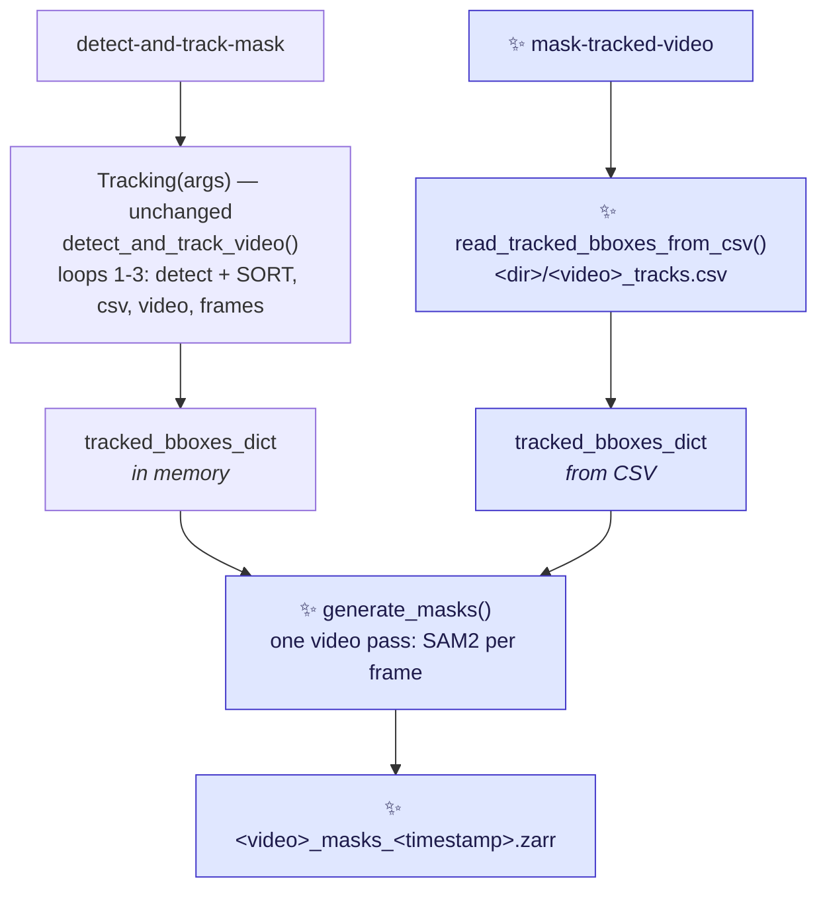
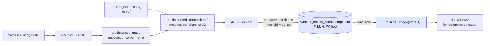

# Proposal for `detect-and-track-mask` and `mask-tracked-video` entry points

## Description

This document proposes **two new CLI entry points** in the crabs package.

**`detect-and-track-mask`** runs the existing
`detect-and-track-video` pipeline unchanged, then prompts SAM2 with the **tracked** boxes and
writes one boolean mask per crab per frame, each stored in a plane indexed by that crab's
**track ID**.

**`mask-tracked-video`** ✨ reads the `<video>_tracks.csv` of a
previous run and goes straight to masking, so SAM2 settings can be iterated without paying for the
detector each time. It needs no trained model. It is a first, narrow instance of issue
[#249](https://github.com/SainsburyWellcomeCentre/crabs-exploration/issues/249)
("Uncouple pipeline steps").

> [!NOTE]
> Nomenclature clarifications
> * **Prompt** — a hint telling SAM2 *which* object to segment. Here, one bounding box in
> `[x1, y1, x2, y2]` pixel coordinates per tracked crab.
>
> * **Instance plane** — a 2-D boolean array holding exactly one crab's mask. The store is a stack
> of these, indexed by track ID. This is what is written to disk.
> * **Label image** — a 2-D integer array where `0` is background and every other value identifies
> one object. This is the array `skimage.measure.regionprops` takes. Here it is **derived on read**
> from the instance planes (§3), never stored.


## References
It is a scoped-down
first slice of Phase 3 of the Claude plan at
[`this-repo-collects-tools-pure-kernighan.md`](this-repo-collects-tools-pure-kernighan.md).

---

## Key aspects of suggested implementation


### 1. Two entry points, one masking pass — so it is a function, not a subclass

The masking pass needs exactly four things: the **video path**, a **`tracked_bboxes_dict`**, an
**output directory**, and the **accelerator**. Two entry points supply those four things two
different ways and share everything downstream of them.

| | `detect-and-track-mask` | ✨ `mask-tracked-video` |
|---|---|---|
| Detection + SORT | re-run | skipped |
| `tracked_bboxes_dict` from | `Tracking.detect_and_track_video()`, in memory | ✨ `<dir>/<video>_tracks.csv`, parsed back |
| Arguments | every tracking argument, plus `--mask_config_file` | ✨ **four**: `--video_path`, `--tracking_output_dir`, `--mask_config_file`, `--accelerator` |
| Needs a checkpoint | yes | **no** |
| Tracking config read | yes | no |
| Store written to | the new `tracking_output_<timestamp>/` | ✨ the `--tracking_output_dir` it was given |



**Why not a `TrackingAndMasking(Tracking)` subclass**.
* `Tracking.__init__` loads the checkpoint eagerly — it calls
`get_mlflow_parameters_from_ckpt` and `get_config_from_ckpt` on `args.trained_model_path`
([track_video.py:56-68](../crabs/tracker/track_video.py#L56-L68)), and then `prep_outputs` creates
a *new* timestamped output directory ([track_video.py:104-111](../crabs/tracker/track_video.py#L104-L111)).
* In `mask-tracked-video` there is no checkpoint and the output directory already exists, so
the subclass could only be constructed by bypassing its own parent's `__init__` and hand-setting
the five attributes the masking pass happens to read. That is a silent dependency on the parent's
internals. A module-level `generate_masks(...)` taking those things as explicit arguments makes the
difference between the two entry points disappear into how each one builds its arguments, and it
keeps `Tracking` itself untouched.

**Why two entry points rather than one with a `--tracking_output_dir` flag.**
* A single command
would have to inherit the whole tracking parser and then explain that seven of its arguments —
`--trained_model_path`, `--config_file`, `--save_video`, `--save_frames`, `--annotations_file`,
`--output_dir`, `--output_dir_no_timestamp` — do nothing when the flag is passed, which means both
a validation function and a `--help` that lists options inert in half its uses.
* Two commands have
no such arguments to explain: `mask-tracked-video` declares its four and nothing else. It is also
the grain of the repo — all six existing entry points are flat and single-purpose, none uses
subparsers, and the burrow pipeline is [four separate scripts chained by
files](../scripts/burrows/README.md). Because `generate_masks` is a plain function, the second
entry point costs one more `*_parse_args` and one more `app_wrapper`.

* The feature is still **two new modules**:
    * `crabs/tracker/track_and_mask_video.py` (the entry point
and the masking pass), and
    * `crabs/tracker/utils/masks.py` (the read-side helper, §3, which imports
neither `sam2` nor torch).

    The CSV reader is not a third — it goes into the existing
[`crabs/tracker/utils/tracking.py`](../crabs/tracker/utils/tracking.py), next to the row parser it
reuses.

* There are **three changes to existing Python**:
    - one added line in [`crabs/tracker/track_video.py`](../crabs/tracker/track_video.py), so `main`
    can see the boxes without changing the signature of `detect_and_track_video`:

    ```diff
    --- a/crabs/tracker/track_video.py
    +++ b/crabs/tracker/track_video.py
    @@ def detect_and_track_video(self) -> None:
        # Run detection and tracking over all frames in video
        tracked_bboxes_dict = self.core_detection_and_tracking()
    +   self.tracked_bboxes_dict = tracked_bboxes_dict
    ```
    - splitting `tracking_parse_args` into a parser builder and the call to `parse_args`, so that:
        - `detect-and-track-mask` can inherit the tracking arguments with `parents=[...]` (§5).
        - `--trained_model_path` keeps `required=True`, because the only entry point that inherits it
    needs it.
        - Behaviour of `detect-and-track-video` is unchanged.
    - ✨ a new `read_tracked_bboxes_from_csv` in
    [`crabs/tracker/utils/tracking.py`](../crabs/tracker/utils/tracking.py) — **~15 lines**, because
    the per-row parsing already exists there as `extract_bounding_box_info`
    ([tracking.py:47-86](../crabs/tracker/utils/tracking.py#L47-L86)) and is already unit-tested
    ([test_tracking_utils.py:10](../tests/test_unit/test_tracking_utils.py#L10)). See §4a.

* The masks are
the third optional artefact in the same directory as the video `--save_video` writes and the raw PNGs `--save_frames` writes.
    ```
    tracking_output_<timestamp>/
    ├── <video>_tracks.csv
    ├── <video>_tracks.mp4          # --save_video
    ├── <video>_frames/             # --save_frames
    └── <video>_masks_<timestamp>.zarr   # ✨ always, for this entry point
    ```
    `mask-tracked-video` writes its store into **the directory it was given**, beside the CSV it
    was derived from — which is what the `tracks_csv` metadata key (§2) already assumes. The
    CSV path is derived from that directory and `Path(--video_path).stem` by the same rule
    `prep_outputs` uses ([track_video.py:114-117](../crabs/tracker/track_video.py#L114-L117)), so a
    `--video_path` that does not match the directory fails as a missing file rather than silently
    masking the wrong clip.

* **The store filename is timestamped, `<video>_masks_<YYYYMMDD_HHMMSS>.zarr`**, which is what both
existing SAM2/SAM3 mask scripts in this repo already do — `masks_{timestamp}.zarr` in
[generate_masks_from_bboxes.py:219-221](../scripts/generate_masks_from_bboxes.py#L219-L221) and in
[segment_burrows_sam3.py:181-184](../scripts/burrows/segment_burrows_sam3.py#L181-L184), the latter
documented as *"timestamped so runs don't collide"*
([scripts/burrows/README.md](../scripts/burrows/README.md)). It matters in both entry points, not
just the second: re-masking the same directory with a different SAM2 model never clobbers the
previous store, and in `detect-and-track-mask` it is what makes `--output_dir_no_timestamp` — which
the integration tests use — safe to re-run. The cost is that readers glob for the store instead of
naming it; see *Verifications*.

### 2. Output format: a zarr `(T, M, H, W)` boolean array, one plane per track ID

```
<video>_masks_<timestamp>.zarr/      # zarr group, matching the existing store layout
└── masks   (T, M, H, W) bool        # dims: image_id, id, img_h, img_w
```

* Axis 1 is indexed by track ID, with `m = track_id - 1`. That mapping is exact, not a convention:
`KalmanBoxTracker` numbers itself from a 0-based class counter
([sort.py:76-77](../crabs/tracker/sort.py#L76-L77)) and `Sort.update` emits `trk.id + 1`
([sort.py:210](../crabs/tracker/sort.py#L210)), so the IDs in `<video>_tracks.csv` are 1-based.

    ```python
    import zarr

    masks = zarr.open("<video>_masks_<timestamp>.zarr", mode="r")["masks"]
    masks[t, track_id - 1]     # (H, W) bool — one crab in one frame, SAM2's output verbatim
    masks[t]                   # (M, H, W)   — every crab in frame t
    masks[:, track_id - 1]     # (T, H, W)   — one crab's whole trajectory, in a single slice
    ```

* **Why per-instance planes and not a single label image.** A label image cannot represent two
crabs occupying the same pixel, and this scene has ~100 frequently touching individuals — so
flattening would silently discard one crab's overlapping pixels. Here each crab owns its plane:
overlap is representable, nothing is discarded, and there is **no overlap policy to choose**. The
ellipse fits Phase 3 is aiming at are therefore not biased by neighbours.

* **It is the shape the existing consumer already builds by hand.**
[`notebook_visualise_masks_from_zarr.py`](../notebooks/notebook_visualise_masks_from_zarr.py)
takes a `(T, H, W)` label image and one-hot expands it into exactly
`(image_id, id, img_h, img_w)` boolean with a dask `map_blocks`
([:142-174](../notebooks/notebook_visualise_masks_from_zarr.py#L142-L174)), under the comment
*"CONS: can be slow to compute"*. Writing the planes directly deletes that expansion and its cost,
and `sel(image_id=..., id=...)`
([:181](../notebooks/notebook_visualise_masks_from_zarr.py#L181)) keeps working unchanged. The dim
names above are taken from that notebook.

* **`bool`, and the whole dtype question disappears.** Identity now lives in the *axis*, not in the
pixel values, so there is nothing to encode and no `int16`/`int32`/`uint16` ceiling to argue about
— the `100 × n_frames` bound on track IDs no longer constrains the format at all. This also
disarms the trap in the existing script rather than merely guarding against it:

> [!NOTE]
> [`generate_masks_from_bboxes.py`](../scripts/generate_masks_from_bboxes.py) opens its store as
> `dtype="bool"` ([:120](../scripts/generate_masks_from_bboxes.py#L120)) but writes an `int16`
> ID-encoded array into it ([:191](../scripts/generate_masks_from_bboxes.py#L191)), so every ID is
> silently coerced to `True` and the instance IDs are lost. Under this format `bool` is the
> *correct* dtype, because no ID is ever stored in a pixel. The bug cannot be expressed.

* **The whole shape is known before the masking loop starts**, so the array is never resized, and
**both entry points know it the same way**. `T`, `H` and `W` come from the video, via the existing
`get_video_parameters` ([io.py:21](../crabs/tracker/utils/io.py#L21)); `M = max(track_id)` over the
`tracked_bboxes_dict`, whether that dict was just computed or just parsed back from the CSV. Not
every ID in `1..M` is necessarily emitted — a tracker suppressed below `min_hits` still burns a
counter value — so a few planes stay empty for the whole video. Those are never written.

* **Chunking, and the one real cost of this shape.** `chunks=(1, 1, H, W)` — one chunk per
(frame, crab), the unit every access pattern above reads. A chunk is 2.07 MB raw at 1920×1080 and
~0.17% non-zero, so it compresses to a few KB, and zarr does not write all-`False` chunks at all.
The count is the problem: ~`n_frames × n_crabs` ≈ **300,000 chunks** for a 3000-frame clip, which
means 300,000 files in a directory store — genuinely bad on the cluster's network filesystem. The
mitigation is zarr 3's **sharding codec**, `shards=(1, 128, H, W)`, packing 128 planes per file and
cutting that to `n_frames × ceil(M/128)`; `zarr` is declared as `>=3` for it (§6).

  **This is measured, not assumed** (zarr 3.2.1, 60 frames at 1920×1080, M=100; full numbers in
  *Points to discuss* #1). Sharding delivers: **61 files instead of 6001**, 1.80 MB vs 1.68 MB on
  disk, and a whole-frame write is no slower than unsharded. But it dictates **how** the writer
  must write. A frame has to go in as a single dense `(M, H, W)` assignment: writing its planes
  one at a time into a shard costs a read-modify-write *per plane* — 58× write amplification, 26×
  slower — and indexed assignment (`arr[t, ids - 1] = ...`, `oindex` alike) does not merely
  degrade, it raises `ValueError` on a sharded array in both zarr 3.2.1 and 3.3.0. §3 writes the
  dense frame for exactly this reason.

* Metadata in `.attrs` on the group:

```python
{
    "timestamp": ..., "sam2_model": ..., "device": ...,
    "source_video": str(input_video_path),
    "tracks_csv": str(csv_file_path),           # the file these IDs refer to
    "boxes_source": "tracker" | "tracks_csv",   # ✨ which entry point wrote this (§1)
    "n_frames": ..., "image_shape": [H, W],
    "dims": ["image_id", "id", "img_h", "img_w"],
    "mask_encoding": "instance_planes",          # asserted against the array dtype (bool)
    "track_id_offset": 1,                        # m = track_id - track_id_offset
    "n_track_ids": ...,                          # M, the size of axis 1
    "n_track_ids_emitted": ...,                  # planes non-empty in at least one frame
    "kalman_box_tracker_count": ...,             # KalmanBoxTracker.count, for cross-checking
    "prompt_type": "bounding_box",
    "prompt_source": "tracked_boxes",            # not raw detections — see §4
    "multimask_output": False,
}
```

There is deliberately **no `overlap_policy` and no `background_label`** key: this format has
neither, which is the point of it.

### 3. Writing planes, and rebuilding a label image on read

SAM2 already returns per-instance masks, so the write path has **no combining step at all** — the
masks go straight into their planes. The flattening that `regionprops` needs happens on the read
side, where the caller chooses the policy and nothing on disk is affected.



**Write side** — one assignment per frame, of a dense `(M, H, W)` buffer:

```python
dense[:] = False                  # (M, H, W) bool, allocated once outside the frame loop
dense[track_ids - 1] = masks      # (N, H, W) scattered into N of the M planes
mask_zarr[frame_idx] = dense      # one whole-frame write
```

A dense buffer, rather than the obvious `mask_zarr.oindex[frame_idx, track_ids - 1] = masks`,
because **indexed assignment into a sharded zarr array does not work**. It raises

```
ValueError: shape mismatch: value array of shape (N, H, W)
            could not be broadcast to indexing result of shape (H*W,)
```

from inside zarr's sharding partial-write path. Verified on zarr 3.2.1 and on 3.3.0, the current
release; `oindex` and plain `arr[t, ids - 1]` fail identically, so the spelling is not the issue,
and it is not about the IDs being scattered — contiguous IDs and a single-element list fail the
same way. Unsharded, both spellings work. The incompatibility is with `shards`, which §2 wants.

> [!IMPORTANT]
> If sharding is ever disabled (`shard_n_planes: null`), indexed assignment starts working again —
> so this must not be "simplified" back to `oindex` after a test run without shards. Test 6a
> (*Overview of tests*) pins the dense write against a sharded store.

The dense write is the fast path, not merely the working one: it fills each shard in a single pass
with no read-modify-write (measurements in *Points to discuss* #1). Its cost is the buffer itself —
`M × H × W` bool, **207 MB at M=100 and 1920×1080** — which is why §7 now counts it against the
per-frame memory budget. The empty planes in it cost nothing on disk: zarr omits all-`False` chunks
from the shard, and measured store size scales with the number of *populated* planes, not with `M`.

**Read side** — one helper in a new `crabs/tracker/utils/masks.py`, pure (no `sam2`, no torch), so
it is unit-testable on CI:

```python
def to_label_image(mask_planes, track_ids=None, policy="higher_track_id_wins"):
    """(M, H, W) bool -> (H, W) int32 label image, for regionprops and napari.

    This is where the overlap decision now lives: it is the caller's, per call,
    and it never touches what is stored.
    """
```

`to_label_image` is the old `paint_masks_as_label_image` moved to the read side and given a
`policy` argument. `ellipses_from_labels` in the notebook
([:52](../notebooks/notebook_visualise_masks_from_zarr.py#L52)) consumes its output unchanged.

**What this costs.** The store is no longer directly openable in napari — `viewer.add_labels` on a
`(T, M, H, W)` boolean array gives a slider over crabs, not a frame view. Callers go through
`to_label_image` instead, which is one line at the two call sites in the notebook
([:219](../notebooks/notebook_visualise_masks_from_zarr.py#L219),
[:226-229](../notebooks/notebook_visualise_masks_from_zarr.py#L226-L229)). That is the honest
trade for losslessness; the notebook change is listed in *Files changed*.

### 4. Prompting with tracked boxes: what you get, and what it costs

Per the request, the prompts are the **tracked** boxes. That is what makes the plumbing trivial —
the mask rows and the CSV rows are the same rows, so there is no index bookkeeping at all, and no
change to `sort.py`.

Two consequences worth stating plainly, neither of which blocks this:

- **SORT does not return the detector's box.** `Sort.update` emits `trk.get_state()` =
  `convert_x_to_bbox(self.kf.x)` ([sort.py:204](../crabs/tracker/sort.py#L204)) — a Kalman-filtered
  estimate in `(cx, cy, area, aspect_ratio)` space, lagged and with its aspect ratio pulled towards
  the track's history. The masks are therefore segmented from an approximate box.
- **Only tracked crabs get a mask.** Detections that SORT suppresses (below `min_hits`) produce no
  row and no mask. With `min_hits: 1` in the current config this is nearly all of them.
- ✨ **In `mask-tracked-video` the prompts are up to 1 px smaller**, because the CSV is a
  lossy record of the boxes — see §4a. The masks from the two entry points are therefore very close but
  **not bit-identical**, which the integration test has to allow for (test #15).

The compute difference is negligible either way: the expensive image encoder runs **once per
frame** regardless, and prompts only touch the small mask decoder.

### 4a. Reading the boxes back: ~15 lines, and one lossy column pair

The first draft left this out on the grounds that "it needs the tracks CSV parsed back in".
That turned out to be cheap: **both halves already exist in the repo**. `extract_bounding_box_info`
parses one VIA row ([tracking.py:47-86](../crabs/tracker/utils/tracking.py#L47-L86)), including
recovering the frame index from the `frame_{:08d}.png` filename, and `TrackerEvaluate` already
reassembles corner coordinates and IDs from its output
([evaluate_tracker.py:73-105](../crabs/tracker/evaluate_tracker.py#L73-L105)). The new function is
that same loop, regrouped into the `tracked_bboxes_dict` shape:

```python
# crabs/tracker/utils/tracking.py                                            ✨ new
def read_tracked_bboxes_from_csv(csv_file_path: str) -> dict:
    """Read a <video>_tracks.csv back into the dict core_detection_and_tracking returns.

    Maps frame index -> {"tracked_boxes": (n, 4) float64, "ids": (n,) float64}.
    float64, not float32: that is what Sort.update emits (sort.py:204-210), so
    this matches the in-memory dict exactly rather than approximately.

    The "scores" key is deliberately absent: masking never reads it, and the
    confidence column is known to be unreliable (Points to discuss #7c).
    """
```

> [!NOTE]
> **What the CSV does and does not preserve.** `write_tracked_detections_to_csv` stores
> `x`, `y`, `width`, `height` ([io.py:84-98](../crabs/tracker/utils/io.py#L84-L98)), and the reader
> rebuilds `[x, y, x + width, y + height]`. `x` and `y` are written through an f-string on a numpy
> float64, whose `str` is the round-tripping repr, so they come back **bit-identical** — but only
> if the reader stays in float64; narrowing to float32 (as `TrackerEvaluate` does for ground truth,
> [evaluate_tracker.py:95](../crabs/tracker/evaluate_tracker.py#L95)) would quietly lose that.
> `width` and `height`, by contrast, are written through `int(...)` — **truncated, not rounded** —
> so `xmax` and `ymax` come back up to 1 px small, and never large. Track IDs round-trip exactly
> (`int(id)` out, `int(float(...))` back in).
>
> Checked numerically rather than assumed, over 10,000 synthetic boxes through the real
> format string: `x`/`y` bit-exact in 10,000 cases out of 10,000, `xmax`/`ymax` error in
> `(-1, 0]` px, and float32 narrowing bit-exact in **0** of 10,000.

Two shape differences from the in-memory dict, both of which the masking loop must tolerate:

- **Frames with no tracked boxes have no rows**, so they are simply absent as keys — whereas
  `core_detection_and_tracking` emits a key for every frame
  ([track_video.py:264-268](../crabs/tracker/track_video.py#L264-L268)). The loop therefore uses
  `tracked_bboxes_dict.get(frame_idx)` and skips on `None`, which also covers the empty-frame case
  §7 already wanted skipped.
- **There is no `"scores"` key**, as above. Nothing in the masking pass reads one.

One cheap validity check at load time, which is what catches a CSV that belongs to a different
clip: every frame index parsed from the CSV must be in `0..T-1` for the video passed as
`--video_path`. Combined with the filename-derived CSV path (§1), that makes the mismatch loud.


### 5. Configuration: a separate mask config

The three knobs go in a **new config file of their own**, not into the tracking config:

```yaml
# crabs/tracker/config/mask_config.yaml   ✨ new file
sam2_model_id: facebook/sam2.1-hiera-base-plus   # matches the existing script's default
max_prompts_per_batch: 32                        # see §7
shard_n_planes: 128                              # see §2; null disables sharding
```

**Why not a `masks:` block in `tracking_config.yaml`.** Nothing would break if it went there —
config keys are read individually rather than splatted, so `Sort` is built from three named keys
([track_video.py:155-159](../crabs/tracker/track_video.py#L155-L159)) and an unknown key is inert.
The reasons are about shape, not safety:

- [`tracking_config.yaml`](../crabs/tracker/config/tracking_config.yaml) is currently **four flat
  SORT scalars**. A `masks:` block would be the first nested structure in it, and would put two
  models' settings in one file for an entry point that only uses one of them.
- The two have unrelated tuning lifecycles. *Points to discuss* anticipates comparing `-tiny` /
  `-small` / `-base-plus`, which is mask-config churn that should never touch SORT parameters.
- It removes a wart rather than documenting one: the integration test fetches its
  `tracking_config.yaml` from the pooch/GIN registry
  ([test_inference.py:45](../tests/test_integration/test_inference.py#L45)) and **that file has no
  `masks:` key**, so a merged block would have to be defensively defaulted. A separate file with
  its own default path never has the problem.
- It is the shape `mask-tracked-video` **needs**, not just one it would like: that entry point
  never reads the tracking config at all (§1), so the SAM2 knobs cannot live inside it. This is the
  strongest of the four reasons, and it is only strong because that entry point is now in scope.

**`detect-and-track-mask` inherits the tracking parser; `mask-tracked-video` inherits nothing.**
`tracking_parse_args` currently builds its parser and parses in one function
([track_video.py:350-451](../crabs/tracker/track_video.py#L350-L451)). Splitting the building out
into `tracking_parser` lets `detect-and-track-mask` reuse every tracking argument through argparse's
own `parents` mechanism. No argument changes: because the second entry point is separate rather
than a mode, **`--trained_model_path` keeps `required=True`**
([track_video.py:353-358](../crabs/tracker/track_video.py#L353-L358)) and there is nothing to
un-require — which argparse has no clean way to do anyway.

```diff
--- a/crabs/tracker/track_video.py
+++ b/crabs/tracker/track_video.py
+def tracking_parser() -> argparse.ArgumentParser:
+    """Build a parser with the arguments for tracking.
+
+    The parser is defined with ``add_help=False`` so that it can be used as a
+    parent parser (see ``parents`` in argparse).
+    """
+    parser = argparse.ArgumentParser(add_help=False)
+    ...   # every add_argument call, unchanged
+    return parser
+
+
 def tracking_parse_args(args):
     """Parse command-line arguments for tracking."""
-    parser = argparse.ArgumentParser()
-    ...
+    parser = argparse.ArgumentParser(parents=[tracking_parser()])
     return parser.parse_args(args)
```

`detect-and-track-video` is unaffected — same arguments, same `required`, same help text.

```python
# crabs/tracker/track_and_mask_video.py — both entry points live here
DEFAULT_MASK_CONFIG = str(Path(__file__).parent / "config" / "mask_config.yaml")

MASK_CONFIG_HELP = (
    "Location of YAML config to control masking. "
    "Default: crabs-exploration/crabs/tracker/config/mask_config.yaml. "
)


def mask_parse_args(args):
    """Parse arguments for detect-and-track-mask: tracking, plus the mask config."""
    parser = argparse.ArgumentParser(
        parents=[tracking_parser()],
        formatter_class=argparse.RawDescriptionHelpFormatter,   # see below
        epilog=(                                  # ✨ the pointer to the other command
            "To mask an existing tracking output without re-running detection, "
            "use mask-tracked-video."
        ),
    )
    parser.add_argument(
        "--mask_config_file", type=str,
        default=DEFAULT_MASK_CONFIG, help=MASK_CONFIG_HELP,
    )
    return parser.parse_args(args)


def mask_from_tracks_parse_args(args):      # ✨ mask-tracked-video
    """Parse arguments for mask-tracked-video. Four arguments, no inheritance."""
    parser = argparse.ArgumentParser()
    parser.add_argument(
        "--video_path", type=str, required=True,
        help="Location of the video the tracks refer to. SAM2 reads its pixels.",
    )
    parser.add_argument(
        "--tracking_output_dir", type=str, required=True,
        help=(
            "Location of an existing tracking output directory, holding the "
            "<video-name>_tracks.csv written by detect-and-track-video or "
            "detect-and-track-mask. The mask store is written into this same "
            "directory, with a timestamp in its name so runs do not collide. "
        ),
    )
    parser.add_argument(
        "--mask_config_file", type=str,
        default=DEFAULT_MASK_CONFIG, help=MASK_CONFIG_HELP,
    )
    parser.add_argument(
        "--accelerator", type=str, default="gpu",
        help="Accelerator for Pytorch. Valid inputs are: cpu, mps, or gpu. Default: gpu.",
    )
    return parser.parse_args(args)
```

**Every argument on `mask-tracked-video` is one it actually uses**, so there is no validation
function, no "ignored argument" logging, and no `--help` entry that does nothing. `--video_path`
and `--tracking_output_dir` are both `required=True` because neither has a sensible default and
neither can be derived from the other.

**The `epilog` is what keeps two entry points discoverable.** Splitting the command in two means
somebody holding a tracking output has to know the second one exists, and documentation alone
(change 8) only helps the people who read it. One line at the bottom of
`detect-and-track-mask --help` names `mask-tracked-video` at exactly the moment a user is looking
at the expensive command.

`formatter_class=argparse.RawDescriptionHelpFormatter` is **required**, not cosmetic. Checked
against Python 3.12: the default `HelpFormatter` re-wraps the epilog to the terminal width and
happily breaks on the hyphens in the command name, rendering it as `mask-` / `tracked-video`
across two lines — un-copy-pasteable, and it would defeat the `--help` assertion in test #8. The
raw formatter leaves the epilog exactly as written and, verified in the same check, still wraps
ordinary argument help strings normally, so nothing about the inherited tracking options changes.

The two duplicated help strings (`--video_path`, `--accelerator`) are copied rather than inherited,
because inheriting them means inheriting the other nine as well. That is four lines of duplication
against seven inert arguments — see *Points to discuss* #4.

This follows the shape the other entry points already have — one `*_parse_args(args)` per entry
point, returning one namespace — so every `main` and `app_wrapper` takes a single `args` as
everywhere else in the package.

The `add_help=False` on `tracking_parser` is what makes it usable as a parent: two parsers each
defining `-h` would raise `ArgumentError` on the child. Both callers therefore wrap it in a real
parser that adds the help option itself.

`tracking_parse_args` is only called from `app_wrapper` in the same module, so the split has no
other callers to update.

Read the file as `{**MASK_DEFAULTS, **yaml.safe_load(open(args.mask_config_file))}`. The
defaults dict is still needed, so that a user's older config missing `shard_n_planes` does not
fail.


### 6. Dependencies
On dependencies:

- **`sam-2` is not on PyPI, and a plain `pip install` from git pulls a second torch.** The only
  source is the git URL used in
  [generate_masks_from_bboxes.py:35](../scripts/generate_masks_from_bboxes.py#L35). SAM2's own
  [`pyproject.toml`](https://github.com/facebookresearch/sam2/blob/main/pyproject.toml) declares
  `torch>=2.5.1` as a **build** requirement (its `setup.py` imports `torch.utils.cpp_extension` to
  build the CUDA extension), so `pip install "sam-2 @ git+..."` downloads an entire extra torch
  into the isolated build environment — possibly a different variant from the one already
  installed. That, not the clone, is the slow surprise on the cluster.

  **So declare it as a PEP 735 dependency group, and disable build isolation for it:**

  ```toml
  # pyproject.toml
  [dependency-groups]
  masks = ["sam-2 @ git+https://github.com/facebookresearch/sam2.git"]

  [tool.uv]
  no-build-isolation-package = ["sam-2"]   # build sam-2 against the env's torch
  ```

  Installed with `uv sync --group masks` (or `pip install --group masks` on pip ≥ 25.1 — the
  pips on this machine are older, so I have not run that form).

  Dependency groups are **never written into distribution metadata**, so the sdist built by
  [test_and_deploy.yml:59](../.github/workflows/test_and_deploy.yml#L59) is untouched — which is
  what a PEP 508 direct reference in `[project.dependencies]` could not have promised. Everything
  else about §6 stands: the group is opt-in, the lazy import inside `generate_masks` still raises
  the actionable error, nothing in the default install pulls SAM2, and CI keeps running the unit
  suite on ubuntu and macOS without it.

  <details>
  <summary>Two alternatives, and why not</summary>

  - **An optional extra plus `[tool.uv.sources]`.** Checked rather than assumed: built with
    uv 0.7.15, both the wheel and the sdist come out carrying `Requires-Dist: sam-2; extra ==
    "masks"` — the URL *is* stripped, so the sdist would stay publishable. But the published
    package would then advertise a `sam-2` that PyPI cannot resolve, so `pip install crabs[masks]`
    fails for anyone not building from this repo. The group has neither problem.
  - **A prebuilt wheel.** `sam_2-1.0.dist-info/direct_url.json` in the local `.venv` shows the
    copy currently installed here came from
    `https://github.com/horsto/sam2/releases/download/v0.0.2/sam_2-1.0-py3-none-any.whl` — pure
    Python, no build step and no torch build dependency at all. The simplest of the three, at the
    cost of trusting a third-party fork's release artefact rather than Meta's repo. Worth keeping
    in mind if the source build proves painful on the cluster.
  </details>

- **Licence: Apache-2.0 for both the code and the weights.** The `sam-2` package is Apache-2.0
  (read from the installed `dist-info`), and the checkpoints are too: the Hugging Face model cards
  for `facebook/sam2.1-hiera-tiny`, `-small`, `-base-plus` and `-large` all declare
  `license: apache-2.0` in their card metadata (all four checked on 2026-09-11). So there is no
  licence conflict on either the code or the weights, and none of the `-tiny`/`-small`/`-base-plus`
  swaps in *Points to discuss* #3 changes that.

- **The conda/pip path still needs a plain command.** [README.md:33-42](../README.md#L33-L42) and
  the HPC guides install with conda + `pip install -e .[dev]`, and `uv` appears in neither the
  guides nor [test_and_deploy.yml](../.github/workflows/test_and_deploy.yml). The README section
  therefore documents both routes: `uv sync --group masks` for a uv checkout, and, for a conda
  environment with torch already installed,

  ```bash
  pip install --no-build-isolation "sam-2 @ git+https://github.com/facebookresearch/sam2.git"
  ```

- **`zarr` is imported directly but not declared** — [`crabs/zarr/create_dataset.py:21`](../crabs/zarr/create_dataset.py#L21)
  relies on it arriving transitively via `movement`. This proposal adds a second direct importer,
  so it is worth declaring now, as `zarr>=3` — §2's sharding needs 3.x. (A local `uv.lock` here
  resolves 3.x, but that file is gitignored ([.gitignore:110](../.gitignore#L110)) and untracked,
  so it is not evidence about anyone else's environment.)

### 7. Three SAM2 details that will silently degrade or crash this

| Detail | Consequence | Handling |
|---|---|---|
| `cv2.VideoCapture.read()` returns **BGR**; `set_image` documents **RGB** (`sam2_image_predictor.py:86-98`) | Silently worse masks — no error, no warning. The existing script never hit this because it reads RGB PNGs via PIL. | `cv2.cvtColor(frame, cv2.COLOR_BGR2RGB)` |
| `predict()` ends with `masks.squeeze(0)`: returns `(N, 1, H, W)` for N>1 but `(1, H, W)` for N==1 | Crash or wrong axis on any frame with exactly one tracked crab. The same latent bug is in [generate_masks_from_bboxes.py:171](../scripts/generate_masks_from_bboxes.py#L171). | `masks.reshape(len(boxes), *masks.shape[-2:])` |
| Every prompt gets a **full-frame** mask: `_predict` upsamples to `self._orig_hw`, then `predict()` does `.float().cpu().numpy()` | At 1920×1080 that is 8.29 MB per prompt in float32 — **829 MB on CPU for a 100-crab frame**, and 100 prompts is the exact worst case, since the detector caps detections per image at 100 (§2) | Chunk the prompts (`max_prompts_per_batch`, default 32 → 265 MB peak) and scatter each chunk into the frame's dense `bool` buffer, releasing the float masks before predicting the next chunk |
| ✨ The dense `(M, H, W)` bool buffer the sharded store requires (§3) | `M × H × W` bytes — **207 MB at M=100, 1920×1080** — and it scales with `M = max(track_id)`, *not* with crabs-per-frame, so a churny tracker makes it bigger without more crabs on screen | Allocate it **once**, outside the frame loop, and `dense[:] = False` per frame. It is live at the same time as the 265 MB above, so budget ~0.5 GB for the masking pass |

Also: skip SAM2 entirely on frames with zero tracked boxes, rather than calling `set_image` and
then `predict` with an empty array.

**Explicitly out of scope:** no ellipse fitting, no orientation, no angle in the CSV, no changes to
the detector or to SORT. The masks are the deliverable; geometry comes later, offline, from the
mask store.


---

## Detailed implementation

### The 8 changes

| # | Change | Signature / diff |
|---|---|---|
| 1 | **new** `crabs/tracker/track_and_mask_video.py` — the whole feature, both entry points, ~200 lines | see below |
| 2 | **new** `crabs/tracker/utils/masks.py` — the read-side helper, ~25 lines | `to_label_image` (§3) |
| 3 | [`crabs/tracker/track_video.py`](../crabs/tracker/track_video.py) — expose the tracked boxes, and the parser | `+ self.tracked_bboxes_dict = tracked_bboxes_dict` (one line, §1); split `tracking_parse_args` into `tracking_parser()` + `parse_args`, no argument changes (§5) |
| 4 | ✨ [`crabs/tracker/utils/tracking.py`](../crabs/tracker/utils/tracking.py) — read the CSV back, ~15 lines | `read_tracked_bboxes_from_csv(csv_file_path) -> dict` (§4a), reusing `extract_bounding_box_info` |
| 5 | **new** `crabs/tracker/config/mask_config.yaml` | the three SAM2/store knobs (§5) |
| 6 | [`pyproject.toml`](../pyproject.toml) | **two** new scripts — `detect-and-track-mask = "...track_and_mask_video:app_wrapper"` and ✨ `mask-tracked-video = "...track_and_mask_video:app_wrapper_from_tracking_output"`; declare `zarr>=3`; add the `masks` dependency group and `[tool.uv] no-build-isolation-package` (§6) |
| 7 | **new** `tests/test_unit/test_track_and_mask_video.py` | unit tests for the pure helpers (no `sam2` needed) |
| 8 | [`crabs/tracker/README.md`](../crabs/tracker/README.md) + [`guides/DetectAndTrackHPC.md`](../guides/DetectAndTrackHPC.md) | how to install the `masks` group (§6), **both entry points and when to reach for each**, pass `--mask_config_file`, and read the store back |


<details>
<summary><b>1. The new module in full outline</b></summary>

Module-level functions only — no new class, for the reason in §1. Everything except
`load_sam2_predictor`, `predict_masks_into` and the video loop in `generate_masks` is pure —
no `sam2`, no torch, no I/O beyond zarr and the config file — which is what makes the unit tests
possible on CI. The read-side helper lives in `utils/masks.py` and the CSV reader in
`utils/tracking.py`.

```python
"""Detect, track and mask crabs in a video."""

DEFAULT_MASK_CONFIG = str(Path(__file__).parent / "config" / "mask_config.yaml")

MASK_DEFAULTS = {
    "sam2_model_id": "facebook/sam2.1-hiera-base-plus",
    "max_prompts_per_batch": 32,
    "shard_n_planes": 128,          # §2; None disables sharding
}


def mask_parse_args(args):
    """Arguments for detect-and-track-mask: every tracking arg, plus the config.  [§5]"""
    parser = argparse.ArgumentParser(
        parents=[tracking_parser()],
        formatter_class=argparse.RawDescriptionHelpFormatter,   # else the name wraps, §5
        epilog="... use mask-tracked-video.",   # ✨ names the other entry point, §5
    )
    parser.add_argument("--mask_config_file", type=str, default=DEFAULT_MASK_CONFIG, help=...)
    return parser.parse_args(args)


def mask_from_tracks_parse_args(args):    # ✨
    """Arguments for mask-tracked-video: four, declared outright.  [§5]"""
    parser = argparse.ArgumentParser()
    parser.add_argument("--video_path", type=str, required=True, help=...)
    parser.add_argument("--tracking_output_dir", type=str, required=True, help=...)
    parser.add_argument("--mask_config_file", type=str, default=DEFAULT_MASK_CONFIG, help=...)
    parser.add_argument("--accelerator", type=str, default="gpu", help=...)
    return parser.parse_args(args)


def load_mask_config(path) -> dict:
    """Read the mask config, backfilled with MASK_DEFAULTS.  [§5]"""
    with open(path) as f:
        return {**MASK_DEFAULTS, **(yaml.safe_load(f) or {})}


def create_mask_zarr(path, n_frames, n_track_ids, image_shape, metadata_dict) -> zarr.Array:
    """Open a (T, M, H, W) bool array named "masks" in a group at `path`.

    chunks=(1, 1, H, W), shards=(1, shard_n_planes, H, W), fill_value=False.
    Asserts the array dtype is bool, matching metadata["mask_encoding"]
    == "instance_planes" — the guard that keeps §2's warning from recurring.
    """


def load_sam2_predictor(model_id: str, device: str):
    """Import sam2 lazily and return a SAM2ImagePredictor.  [§6]"""
    try:
        from sam2.sam2_image_predictor import SAM2ImagePredictor
    except ImportError as e:
        raise ImportError(
            "detect-and-track-mask needs SAM2. Install it with:\n"
            "  uv sync --group masks\n"
            "or, in a conda env with torch already installed:\n"
            '  pip install --no-build-isolation "sam-2 @ git+https://github.com/facebookresearch/sam2.git"'
        ) from e
    return SAM2ImagePredictor.from_pretrained(model_id, device=device)


def predict_masks_into(predictor, frame_bgr, boxes, track_ids, dense, max_prompts_per_batch):
    """SAM2 on one frame, scattered straight into the caller's (M, H, W) bool buffer.  [§5]

    Writes into `dense` rather than returning (N, H, W), so each prompt chunk's
    float masks are released before the next chunk is predicted (§7), and so the
    caller holds exactly one frame-sized buffer for the whole pass (§3).
    """
    predictor.set_image(cv2.cvtColor(frame_bgr, cv2.COLOR_BGR2RGB))
    FOR EACH (box_chunk, id_chunk) OF (boxes, track_ids), size max_prompts_per_batch:
        masks, _iou, _low_res = predictor.predict(box=box_chunk, multimask_output=False)
        dense[id_chunk - 1] = masks.reshape(len(box_chunk), *masks.shape[-2:]).astype(bool)


def generate_masks(video_path, tracked_bboxes_dict, output_dir,
                   csv_file_path, device, mask_config, boxes_source):
    """The masking pass. Takes what it needs, so both entry points share it.  [§1]"""


def accelerator_to_device(accelerator):
    """"gpu" -> "cuda", mirroring Tracking.__init__ (track_video.py:79-82).

    Three lines, duplicated rather than refactored out of Tracking, so that
    track_video.py keeps a one-line diff.
    """


def main(args):                            # detect-and-track-mask
    inference = Tracking(args)             # the existing class, unchanged
    inference.detect_and_track_video()     # the existing method, unchanged
    generate_masks(
        args.video_path,
        inference.tracked_bboxes_dict,     # the one added line, §1
        inference.tracking_output_dir,
        inference.csv_file_path,
        accelerator_to_device(args.accelerator),
        load_mask_config(args.mask_config_file),
        boxes_source="tracker",
    )


def main_from_tracking_output(args):       # ✨ mask-tracked-video
    output_dir = Path(args.tracking_output_dir)
    csv_file_path = output_dir / f"{Path(args.video_path).stem}_tracks.csv"
    IF not csv_file_path.exists():
        raise FileNotFoundError(...)       # names the path it looked for
    generate_masks(
        args.video_path,
        read_tracked_bboxes_from_csv(csv_file_path),    # §4a
        output_dir,
        csv_file_path,
        accelerator_to_device(args.accelerator),
        load_mask_config(args.mask_config_file),
        boxes_source="tracks_csv",
    )


def app_wrapper():                         # detect-and-track-mask
    logging.getLogger().setLevel(logging.INFO)
    torch.set_float32_matmul_precision("medium")
    main(mask_parse_args(sys.argv[1:]))    # same shape as the other entry points, §5


def app_wrapper_from_tracking_output():    # ✨ mask-tracked-video
    logging.getLogger().setLevel(logging.INFO)
    torch.set_float32_matmul_precision("medium")
    main_from_tracking_output(mask_from_tracks_parse_args(sys.argv[1:]))
```

Both entry points live in the one module: they share `generate_masks` and everything under it, and
splitting them across two files would mean one importing the other anyway.

`generate_masks`, mirroring the structure of `write_all_video_frames_as_images`
([io.py:205](../crabs/tracker/utils/io.py#L205)):

```python
def generate_masks(video_path, tracked_bboxes_dict, output_dir,
                   csv_file_path, device, mask_config, boxes_source):
    predictor = load_sam2_predictor(mask_config["sam2_model_id"], device)

    # The whole shape is knowable here, identically for both entry points  [§2]
    video_params = get_video_parameters(video_path)        # io.py:21
    total_n_frames = video_params["total_frames"]
    H, W = video_params["frame_height"], video_params["frame_width"]
    n_track_ids = max(
        int(frame["ids"].max()) for frame in tracked_bboxes_dict.values() if len(frame["ids"])
    )
    timestamp = datetime.now().strftime("%Y%m%d_%H%M%S")      # §1; same format as the repo
    mask_zarr = create_mask_zarr(
        output_dir / f"{Path(video_path).stem}_masks_{timestamp}.zarr",
        total_n_frames, n_track_ids, (H, W), metadata,     # metadata records boxes_source
    )

    input_video_object = open_video(video_path)
    dense = np.zeros((n_track_ids, H, W), dtype=bool)   # allocated once  [§3, §7]
    frame_idx = 0
    WHILE input_video_object.isOpened():
        ret, frame = input_video_object.read()
        IF not ret:
            parse_video_frame_reading_error_and_log(frame_idx, total_n_frames)
            break

        # .get, not [...]: the CSV path has no key for a frame with no boxes  [§4a]
        frame_data = tracked_bboxes_dict.get(frame_idx)
        IF frame_data is not None and len(frame_data["tracked_boxes"]) > 0:     # [§7]
            dense[:] = False
            predict_masks_into(
                predictor, frame, frame_data["tracked_boxes"],
                frame_data["ids"].astype(int), dense,
                mask_config["max_prompts_per_batch"],
            )
            mask_zarr[frame_idx] = dense      # one whole-frame write  [§3]
        frame_idx += 1

    input_video_object.release()
```

Frames with no tracked boxes are left at the store's `fill_value=False`, and those chunks are never
written — correct by construction, whether the frame was absent from the dict (read from the CSV)
or present and empty (straight from the tracker).

Two invariants worth asserting at the end of the run, both cheap and both about the ID↔axis
mapping the format now depends on: every emitted track ID is in `1..M`, and
`KalmanBoxTracker.count >= M` (it can exceed `M` when a tracker was suppressed below `min_hits`,
never fall below it).

**Rejected alternative — masking inside `core_detection_and_tracking`.** It saves one video pass,
but it puts SAM2 in the middle of the detection loop, changes an existing method, and makes the
feature impossible to skip. A fourth pass matches the pattern the file already uses twice and
keeps the diff to `track_video.py` down to the one added line.

**Adopted, having been rejected in the first draft — a post-pass over an existing `_tracks.csv`.**
It was rejected as "re-parsing VIA JSON and re-deriving the frame index from filenames". Both of
those turned out to be one call to an existing, already-tested helper
([tracking.py:47-86](../crabs/tracker/utils/tracking.py#L47-L86)), so the objection does not
survive contact with the file. It is now the `mask-tracked-video` entry point rather than a
replacement for `detect-and-track-mask`: running end to end stays the headline command, because it
is the only one that guarantees the masks match boxes nothing has rounded (§4a).

**Rejected alternative — keep `TrackingAndMasking(Tracking)` and add an alternative constructor.**
A `from_tracking_output(cls, args, mask_config)` classmethod using `cls.__new__` could skip
`Tracking.__init__` and set the five attributes the masking pass reads. It keeps `main` symmetric
and the subclass framing of the first draft, but it hard-codes, in the child, which of the parent's
attributes matter — so adding an attribute to `Tracking.__init__` that `generate_masks` later
depends on breaks the second entry point silently, at runtime, in a way no type checker sees. Passing the
four values as arguments makes that dependency a signature.
</details>

<details>
<summary><b>2. Formats considered and rejected</b></summary>

All four are lossless-or-not on overlap, and all four are `regionprops`-shaped at read time. The
choice came down to what the downstream access pattern is.

| Format | Lossless on overlap | `masks[:, tid]` per-crab slice | Opens in napari as-is | Note |
|---|---|---|---|---|
| **`(T, M, H, W)` bool, plane per track ID** ✅ chosen | yes | **yes, one slice** | no | chunk count is the cost — answered by sharding (§2), at the price of a whole-frame write (§3) |
| `(T, H, W)` int32 label image | **no** | no | yes | simplest; discards the lower-ID crab's overlapping pixels |
| `(T, K, H, W)` int32 overlap layers | yes | no | plane 0 ≈ whole frame | `K`≈2–4; needs a greedy packing pass at write time |
| bbox-local crops + index table | yes | no (needs a scan) | no | ~500× smaller raw, but ragged and no time-slicing |

**Why not the label image.** It was the original proposal. It cannot represent two crabs on one
pixel, and the ellipse fits Phase 3 wants would be biased by exactly the neighbours that touch
most. Rejected on losslessness, not on size — zarr compresses a label image well enough that size
was never the deciding argument.

**Why not overlap layers.** Genuinely close, and better on chunk count and napari. It loses because
the axis carries no identity, so `masks[:, tid]` — one crab's whole trajectory in a single read —
is not expressible. That slice is what the orientation work will be built on.

**Why not crops.** Much the smallest, and the only one that scales to long clips without thought.
Rejected for now because it is ragged (two arrays plus offset bookkeeping), needs a scan to
assemble one crab's time series, and cannot be read without the repo's helpers. Worth revisiting
if *Points to discuss* #1 or #2 comes back badly.

**✨ Why not one chunk per frame** — `chunks=(1, M, H, W)`, same format, coarser chunking. It is
the obvious way to kill the file-count problem without the sharding codec at all, and it makes the
write trivially correct (a whole-frame assignment is the only thing you *can* do), so it deserves
an answer rather than silence. Measured, 60 frames at 1920×1080, M=100, against the chosen layout:

| layout | files | disk | `masks[t, tid]` | `masks[t]` | `masks[:, tid]` |
|---|---|---|---|---|---|
| per-instance chunks, unsharded | 6001 | 1.68 MB | 0.6 ms | 15.9 ms | 9.9 ms |
| **per-instance chunks + `shards=(1,128,H,W)`** ✅ | **61** | 1.80 MB | **0.9 ms** | 23.5 ms | **22.1 ms** |
| `chunks=(1, M, H, W)`, one per frame | 61 | 1.42 MB | 5.4 ms | 10.5 ms | **170.5 ms** |

Extrapolated to 3000 frames, one crab's trajectory costs **1.1 s** chunked-and-sharded versus
**8.5 s** with per-frame chunks. Three reasons it loses:

1. **It buys nothing sharding does not.** Both give 3050 files. Sharding *is* the mechanism for
   "many chunks, one file", so per-frame chunking gives up per-plane granularity for free.
2. **`masks[:, tid]` costs ~8× more**, because reading one crab means decompressing every frame's
   entire `M`-plane chunk — ~100× more data than asked for. That slice is why this format was
   chosen over overlap layers, and it is what the orientation work is built on.
3. **The chunk size scales with `M`, and `M` is not bounded by 100.** `M = max(track_id)`, not
   crabs-per-frame. A chunk is zarr's minimum decompression unit, so a per-frame chunk means every
   read — napari asking for a single plane included — decompresses `M × H × W`:

   | layout | M | chunk raw size | `masks[:, tid]` |
   |---|---|---|---|
   | `chunks=(1, M, H, W)` | 100 | 52 MB | 17.4 ms |
   | `chunks=(1, M, H, W)` | 400 | **207 MB** | 40.1 ms |
   | `chunks=(1,1,H,W)` + shards | 100 | 1 MB | 14.2 ms |
   | `chunks=(1,1,H,W)` + shards | 400 | **1 MB** | 14.2 ms |

   (540×960 here, so the raw sizes are a quarter of full resolution — at 1920×1080 with M=400 a
   per-frame chunk is 829 MB.) Sharding holds the chunk at 2.07 MB whatever `M` does, and just
   packs more chunks per file.
</details>

---

## Files changed

| File | Change |
|---|---|
| `crabs/tracker/track_and_mask_video.py` | **new** — the entire write path, and both entry points (§1) |
| `crabs/tracker/utils/masks.py` | **new** — `to_label_image` (§3) |
| [`crabs/tracker/track_video.py`](../crabs/tracker/track_video.py) | one added line (store the tracked boxes on `self`); split `tracking_parse_args` into `tracking_parser()` + `parse_args`, so `detect-and-track-mask` can inherit it with `parents=[...]`. No argument changes (§5) |
| ✨ [`crabs/tracker/utils/tracking.py`](../crabs/tracker/utils/tracking.py) | one added function, `read_tracked_bboxes_from_csv` (§4a), built on the `extract_bounding_box_info` already in the file |
| `crabs/tracker/config/mask_config.yaml` | **new** — SAM2 and store knobs, separate from the tracking config (§5) |
| [`pyproject.toml`](../pyproject.toml) | new `detect-and-track-mask` **and** ✨ `mask-tracked-video` scripts; declare `zarr>=3`; `[dependency-groups] masks` + `[tool.uv] no-build-isolation-package` (§6) |
| `tests/test_unit/test_track_and_mask_video.py` | **new** |
| [`notebooks/notebook_visualise_masks_from_zarr.py`](../notebooks/notebook_visualise_masks_from_zarr.py) | drop the one-hot `map_blocks` expansion ([:142-174](../notebooks/notebook_visualise_masks_from_zarr.py#L142-L174)) — the store is already 4-D; route the two napari calls through `to_label_image` (§3); glob for the timestamped store name (§1) |
| [`crabs/tracker/README.md`](../crabs/tracker/README.md) | document both entry points, `--mask_config_file`, the store layout and how to read it back |
| [`guides/DetectAndTrackHPC.md`](../guides/DetectAndTrackHPC.md) | installing the `masks` group on the cluster (and the `--no-build-isolation` pip line for the conda envs, §6); staging the second config file |

Nothing else is touched. In particular: no change to `sort.py`, to `utils/io.py`, to
`tracking_config.yaml`, to the CSV format, to `evaluate_tracker.py`, or to the detector.

---

## Overview of tests to write

**Pure unit — must pass with no `sam2` installed (this is the CI shape)**

1. **The ID↔axis mapping, which is now the core contract.** Scatter three masks with IDs
   `[7, 3, 12]` into a dense `(M, H, W)` buffer and write it as `masks[t] = dense` (§3), then
   assert `masks[t, 6]`, `masks[t, 2]` and `masks[t, 11]` are the masks that went in, and that
   every other plane in frame `t` is all-`False`.
2. **Overlap is preserved.** Two masks with IDs `3` and `12` sharing a block of pixels: both planes
   still contain the shared pixels in full, and each plane's `sum()` equals its input's. This is
   the test that would fail under the label-image format, and it is the reason for the change.
3. `to_label_image`: non-overlapping planes give a label image whose non-zero values are exactly
   `{3, 7, 12}`, regions in the right places; overlapping planes resolve by `policy`, and the
   result does not depend on plane order.
4. Round-trip through the consumer: feed `to_label_image` output to `skimage.measure.regionprops`
   and assert `{p.label for p in props} == {3, 7, 12}`. The property the read path exists for.
5. A frame with no tracked boxes leaves every plane all-`False` and does not raise.
6. `create_mask_zarr`: dtype is `bool`, `fill_value` is `False`, chunks are `(1, 1, H, W)`, shards
   are `(1, 128, H, W)`, and `.attrs["mask_encoding"] == "instance_planes"` — plus a test that the
   internal assertion **fires** if the dtype and the declared encoding disagree (the guard that
   keeps §2's `dtype="bool"` bug from being reintroduced from the other direction).

   **6a.** ✨ **The write path against a *sharded* store — the one zarr will not forgive.** Build
   the store through `create_mask_zarr` (so `shards` is set, as in production — *not* a bare
   `zarr.create_array` with chunks only), write two frames of scattered IDs through the dense
   assignment, and round-trip them. This is the regression test for §3: indexed assignment
   (`arr[t, ids - 1] = ...` or `oindex`) raises `ValueError` on a sharded array in zarr 3.2.1 and
   3.3.0 but works fine unsharded — so a test built on an unsharded fixture would pass while
   production crashed on frame 0. Assert the fixture is sharded, so the test cannot quietly stop
   covering the thing it exists to cover.
7. `load_sam2_predictor` raises `ImportError` with the install command in the message when `sam2`
   is absent (`monkeypatch` the import) — assert the message names `uv sync --group masks`, so it
   cannot drift from the group actually declared in `pyproject.toml`.
8. **`mask_parse_args` (§5).** The namespace carries `mask_config_file` when the flag is passed and
   `DEFAULT_MASK_CONFIG` when it is not; every tracking argument is inherited (assert that
   `vars(mask_parse_args(argv + mask_flag))` minus `mask_config_file` equals
   `vars(tracking_parse_args(argv))` for the same `argv`); and `--help` exits `0` with both
   `--mask_config_file` and `--config_file` in the usage text — the property the `parents=[...]`
   refactor buys, and the one that would regress if `tracking_parser` were ever given
   `add_help=True`. ✨ Also assert `--help` output contains the **unbroken** string
   `mask-tracked-video`, so the epilog (§5) cannot be dropped silently — it is the only in-product
   signpost between the two commands — and so that dropping
   `formatter_class=RawDescriptionHelpFormatter` fails the test rather than quietly hyphenating
   the command name across two lines.
9. ✨ **`mask_from_tracks_parse_args` (§5).** Its namespace has **exactly** the four expected
   attributes — `set(vars(...)) == {"video_path", "tracking_output_dir", "mask_config_file",
   "accelerator"}`. That equality, not a subset check, is the test that the second entry point
   never acquires an inert argument: it fails the moment somebody "helpfully" gives this parser
   `parents=[tracking_parser()]`. Plus: `--video_path` and `--tracking_output_dir` each missing
   exits `2`, and `--help` exits `0` and does **not** mention `--trained_model_path`.
10. ✨ **`read_tracked_bboxes_from_csv` (§4a), against a CSV written by the real writer.** Build a
   small `tracked_bboxes_dict`, write it with `write_tracked_detections_to_csv`, read it back, and
   assert: the frame indices recovered are exactly those that had at least one box; `ids` are
   exactly equal (integers round-trip); `xmin`/`ymin` are exactly equal; and `xmax`/`ymax` are
   within `[original - 1, original]` — **asserting the truncation as a property rather than
   pretending the round-trip is exact**. `test_tracking_io.py`
   ([:51](../tests/test_unit/test_tracking_io.py#L51)) already has a fixture of this shape to build
   from. Also: a frame whose boxes are all absent yields no key, and a CSV with only a header
   yields `{}`, and the returned arrays are `float64` — the dtype the exactness above depends on
   (§4a).
11. `load_mask_config`: a config missing `shard_n_planes` is backfilled from `MASK_DEFAULTS`, and
   an empty file yields the defaults rather than raising — the guard against
   `yaml.safe_load` returning `None`.

**Existing tests that must stay green, unmodified**

12. `pytest tests/test_unit` — in particular
   [`test_tracking_io.py`](../tests/test_unit/test_tracking_io.py) (the CSV is untouched),
   [`test_tracking_utils.py`](../tests/test_unit/test_tracking_utils.py) (`extract_bounding_box_info`
   gains a caller but no change) and
   [`test_track_video.py`](../tests/test_unit/test_track_video.py) (neither the one-line change to
   `detect_and_track_video` nor the parser split must alter behaviour). The parser split has no
   existing test covering it — `tracking_parse_args` is called only from `app_wrapper` — so add
   one: `tracking_parse_args` on a minimal valid argv still returns the same defaults,
   `detect-and-track-video --help` still lists every tracking option, and `detect-and-track-video`
   with no `--trained_model_path` still exits `2`.
13. [`test_entry_points.py`](../tests/test_unit/test_entry_points.py) — extend with **both**
   `detect-and-track-mask` and `mask-tracked-video`, following the existing pattern.

**Integration (slow, opt-in)**

14. A `test_detect_and_track_mask` alongside
   [`test_detect_and_track_video`](../tests/test_integration/test_inference.py), reusing the
   `pooch_registry` fixture and the 3-frame clip, `@pytest.mark.skipif` on `sam2` being importable.
   Assert the store exists, has shape `(3, M, H, W)` and dtype `bool`, and that for each frame the
   set of planes with any `True` pixel is exactly `{tid - 1 for tid in that frame's CSV rows}`.
   That last assertion is the real contract of this feature. The store is found by globbing
   `<video>_masks_*.zarr`, since the name is timestamped (§1).

   Note this test now passes the registry's `tracking_config.yaml` **unchanged** and lets
   `--mask_config_file` fall back to its packaged default — with a separate config there is nothing
   to add to the GIN registry file (§5).
15. ✨ **The two entry points agree, end to end, in one test.** Run `detect-and-track-mask` on the
   3-frame clip, then run `mask-tracked-video --video_path=<clip> --tracking_output_dir=<that dir>`
   — with no checkpoint anywhere on the command line. Assert:
   - the second run exits `0` and writes a **second** `<video>_masks_*.zarr` into the directory it
     was given, leaving the first store intact — the timestamped-name property from §1, and the
     one that would regress if the store name were ever made deterministic again;
   - its `.attrs["boxes_source"] == "tracks_csv"`, the first run's is `"tracker"`;
   - both stores have the **same shape**, and the same set of populated `(frame, plane)` pairs —
     the contract that the CSV round-trip loses no crab and no identity;
   - the masks are **close but not asserted equal** — §4a means the prompts differ by up to 1 px,
     so compare with a tolerance on per-plane `sum()` (a few percent), not with `array_equal`.

   The "no checkpoint anywhere" part is the point: it is the only test that proves the second entry
   point genuinely does not need a trained model, which is the whole reason it exists.

---

## Verifications for agent to run

```bash
# lint + full unit suite (no sam2 needed)
pre-commit run --all-files
pytest tests

# slow end-to-end CLI tests (pooch downloads test data on first run)
pytest -m slow tests/test_integration/test_inference.py
```

Manual check on a real clip:

```bash
uv sync --group masks   # §6; in a conda env instead:
# pip install --no-build-isolation "sam-2 @ git+https://github.com/facebookresearch/sam2.git"

# 1. the full pipeline: detect, track, then mask
detect-and-track-mask \
    --trained_model_path <ckpt> \
    --video_path <clip.mp4> \
    --mask_config_file <mask_config.yaml> \   # optional; defaults to the packaged one
    --config_file <tracking_config.yaml> \
    --accelerator=gpu \
    --output_dir_no_timestamp

# 2. mask an existing tracking output — no checkpoint, no detector  ✨
mask-tracked-video \
    --video_path <clip.mp4> \
    --tracking_output_dir tracking_output \
    --mask_config_file <mask_config_tiny.yaml> \
    --accelerator=gpu
```

Run the second one twice with different `sam2_model_id` values and you get two stores side by side
in the same directory, because the name is timestamped (§1) — which is how you compare `-tiny`
against `-base-plus` (*Points to discuss* #3) without re-running the detector once. Worth timing
both commands: the gap between them is the whole justification for the second entry point, and it
is the number that says whether the detector or SAM2 dominates the run.

Three failure paths are worth confirming by hand, since they are the ones a user will hit:

```bash
# exits 2: --tracking_output_dir is required
mask-tracked-video --video_path <clip.mp4>

# exits 2: unrecognised argument (it is not inherited, which is the point)
mask-tracked-video --video_path <clip.mp4> \
    --tracking_output_dir tracking_output --trained_model_path <ckpt>

# raises FileNotFoundError naming <other>_tracks.csv, rather than masking the wrong clip
mask-tracked-video --video_path <other_clip.mp4> \
    --tracking_output_dir tracking_output
```

then confirm the contract and eyeball the masks:

```python
import zarr, numpy as np
from pathlib import Path
from skimage.measure import regionprops
from crabs.tracker.utils.masks import to_label_image

# the store name carries a timestamp (§1), so glob for the most recent one
store = sorted(Path("tracking_output").glob("<clip>_masks_*.zarr"))[-1]
root = zarr.open(store, mode="r")
masks = root["masks"]
print(masks.shape, masks.dtype, dict(root.attrs))   # (T, M, H, W) bool
print(root.attrs["boxes_source"])   # "tracker" or "tracks_csv" — which command wrote this

# the contract: which planes are populated in frame 0
print(sorted(np.flatnonzero(masks[0].any(axis=(1, 2))) + 1))   # == track IDs in frame 0 of the CSV

# the read path
props = regionprops(to_label_image(masks[0]))
print([p.area for p in props][:10])       # sanity: no zero-area or whole-frame regions
```

[`notebooks/notebook_visualise_masks_from_zarr.py`](../notebooks/notebook_visualise_masks_from_zarr.py)
loads this shape into napari once its one-hot expansion is dropped (*Files changed*); overlaying it
on the frames written by `--save_frames` is the fastest qualitative check that the masks are on the
crabs and not on the background.

Also worth recording once, since both decide the format's viability: `du -sh` **and the file count**
(`find ... | wc -l`) of the store for one real clip, and the wall-clock time of the masking pass
versus the detection pass. Expected, from the measurements in *Points to discuss* #1–2:
`n_frames × ceil(M/128)` files (~3000, not 300,000) and a store of order 100 MB. A file count near
`n_frames × n_crabs` means sharding is not actually on; a masking pass that crawls means the
whole-frame write has regressed to a per-plane one, which is the read-modify-write case.

---

## Points to discuss

1. **Chunk count was this format's one weak spot. It is now measured, and sharding answers it —
   but it changes the write path.** Per-instance planes mean ~`n_frames × n_crabs` ≈ 300,000 chunks
   for a 3000-frame clip (§2), and sharding at `(1, 128, H, W)` does cut that to
   `n_frames × ceil(M/128)` as hoped. Measured on zarr 3.2.1, 20 frames × 100 planes at 270×480,
   with the store instrumented to count every `get`/`set` and byte:

   | write pattern | files | ms/frame | shard rewrites | bytes re-read | write amplification |
   |---|---|---|---|---|---|
   | unsharded, indexed write | 2001 | 125 | 0 | 0 | ×1.0 |
   | shard 128, **plane at a time** | 21 | **703** | **1980** | **14.1 MB** | **×58.6** |
   | shard 128, **whole frame** | 21 | **27** | **0** | **0** | **×1.0** |
   | shard 32, plane at a time | 81 | 922 | 1920 | 4.0 MB | ×17.4 |
   | shard 32, whole frame | 81 | 26 | 0 | 0 | ×1.0 |

   So the read-modify-write I was worried about is **real** — writing a frame's planes individually
   rewrites the shard once per plane — and it is **entirely avoided** by assigning the whole frame
   at once, which is what §3 now does. At full resolution (1920×1080, 60 frames) sharded and
   unsharded write at the same speed, 221 vs 242 ms/frame, for 61 files instead of 6001.

   Two things I got wrong in the first draft, both now fixed in §3:
   * **`oindex` into a sharded array does not work at all.** It is not slow, it raises
     `ValueError` from zarr's sharding partial-write path, on 3.2.1 and on 3.3.0. Plain
     `arr[t, ids - 1]` fails identically, so this is not a spelling problem, and it is not about
     scattered IDs — contiguous IDs and a one-element list fail the same way. Nearest upstream
     work is [zarr-python #4284](https://github.com/zarr-developers/zarr-python/issues/4284) and
     [#3763](https://github.com/zarr-developers/zarr-python/issues/3763), same family of
     drop-axis/partial-shard bugs, fixed for other shapes but not this one. **Worth filing.**
   * The draft asserted "the writer emits a whole frame at a time, so each shard is filled in one
     pass". The reasoning was right; the code in §3 did not do it. It does now.

   `shard_n_planes` stays a config value so it can be tuned without a format change, and the
   zip-store fallback is **no longer needed**. What is still unmeasured is the cluster's network
   filesystem specifically — these numbers are local APFS, and 3000 files vs 300,000 is the kind
   of gap that only widens on a network store, so the direction holds.
2. **Store size.**
    * Raw `(T, M, H, W)` bool is enormous — 622 GB for `T=3000, M=100` — but it is
   never stored: each plane is ~0.17% non-zero, all-`False` chunks are not written at all, and only
   ~`n_frames × n_crabs` chunks ever exist.
   * My estimate is the same order as the label image would
   have compressed to (a few hundred MB to ~1 GB). A synthetic check — 60 frames at 1920×1080 with
   all 100 planes populated, sharded — gives 1.80 MB, which extrapolates to **~90 MB for 3000
   frames**: comfortably inside that range, and slightly *under* it. Treat that as a floor rather
   than the answer, since my synthetic masks are solid rectangles and compress better than real
   SAM2 output. The real clip is still the number that counts.
   * Sharding does not cost size, and does not break the sparsity argument: measured store size
   scales with the number of *populated* planes (0.06 / 0.14 / 0.24 MB for 10 / 50 / 100 of 100
   planes), so all-`False` chunks stay free even inside a shard.
   * If
   it comes out too big the levers are:
        * a stronger compressor, or
        * storing bbox-local crops rather
   than full-frame planes (which would drop the raw volume by ~500× but costs the direct
   `masks[:, tid-1]` slicing that motivated this shape).

3. **`sam2_model_id` default.**
    * I have matched the existing script's `-base-plus`
   ([generate_masks_from_bboxes.py:307](../scripts/generate_masks_from_bboxes.py#L307)) so the two
   agree.
   * `-tiny` / `-small` are considerably faster and may well be enough at this object size —
   easy to compare once the entry point exists, since it is a config value, and with the separate
   mask config (§5) swapping it never touches the tracking parameters.

4. **`mask-tracked-video` is now in (§1, §4a, §5) — some things about it are still open.** What is left:
   * **The four-argument parser duplicates two help strings** (`--video_path`, `--accelerator`)
     rather than inheriting them, because inheriting means inheriting all eleven. Four lines of
     duplication, and they can drift from the tracking parser's wording. The alternative is to
     split `tracking_parser` into two smaller parent parsers — a shared "video + hardware" one and
     a "detector" one — which removes the duplication at the cost of a bigger refactor of
     `track_video.py` than the one line this proposal otherwise needs. **I have gone for the
     duplication**; the finer-grained split is worth doing if a third entry point ever wants the
     same pair.
   * **A directory, not a CSV path.** `--tracking_output_dir` takes the directory and derives
     `<video>_tracks.csv` from `--video_path`, so a mismatched pair fails as a missing file (§1).
     Accepting a CSV path directly would be more flexible and would lose that check. I have gone
     for the check.
   * **This is a narrow slice of [#249](https://github.com/SainsburyWellcomeCentre/crabs-exploration/issues/249).**
     It uncouples *masking* from *detection+tracking*. It does **not** uncouple detection from
     tracking, which is the harder half of that issue and needs the raw detections persisted —
     they are currently discarded. Nothing here blocks that; nothing here does it either.

5. **⚠️ The detector is running at its detection cap.**
    * `fasterrcnn_resnet50_fpn_v2` is constructed
   with no kwargs ([models.py:82](../crabs/detector/models.py#L82)), so torchvision's default
   `box_detections_per_img=100` applies — and this scene has **~100 crabs per frame**.
   * Dense frames
   are therefore plausibly being truncated to the top 100 by score, silently, before tracking and
   before any masking.
   * This does not change anything in this proposal — the masks follow whatever
   the tracker emits — but it caps what the masks can ever cover, and it is invisible in the
   outputs.
   * Worth its own issue and a quick check: log
   `max(len(boxes) for boxes in detections)` over a real clip and see how often it sits at exactly 100.

6. **The dependency group only helps a uv checkout, and this repo is not one yet.**
    * `uv.lock` is
   gitignored and untracked, and the install docs are conda + pip throughout, so `uv sync --group
   masks` documents a workflow the repo does not otherwise have — which is why §6 keeps the
   `pip install --no-build-isolation` line alongside it.

   * If you would rather commit `uv.lock` and
   make uv the documented path (which would also pin the SAM2 commit, rather than tracking
   whatever `main` is on the day someone installs), that is a bigger, separate decision and I have
   not assumed it here.

7. **Three more things found while reading, all out of scope.**

    (a) `--max_frames_to_read` is parsed at
   [track_video.py:440](../crabs/tracker/track_video.py#L440) and never used by anything — see PR
   [#245](https://github.com/SainsburyWellcomeCentre/crabs-exploration/pull/245). It would make
   iterating on this entry point much cheaper (because we could run things for a limited amount of frames).

   (b) `write_tracked_detections_to_csv` writes box `width`/`height` through `int(...)`
   ([io.py:85-86](../crabs/tracker/utils/io.py#L85-L86)), which **truncates** rather than rounds,
   so every box in every `_tracks.csv` is up to 1 px narrower and shorter than the box the tracker
   produced — a small, systematic, one-directional shrink. It slightly biases the IoU that MOTA is
   computed from, and it is the whole reason `mask-tracked-video`'s prompts are not identical to
   `detect-and-track-mask`'s (§4a). `int(round(...))` would make the error unbiased and halve it.
   **Deliberately not changed here**: it alters the CSV that the VIA manual-correction workflow
   and [test_tracking_io.py:64](../tests/test_unit/test_tracking_io.py#L64) both pin, which is far
   outside a masking PR. Worth its own issue.

   (c) `write_tracked_detections_to_csv` zips the tracked boxes against `detections_dict["scores"]`, which holds *all raw, unthresholded* detections in detector order ([track_video.py:267](../crabs/tracker/track_video.py#L267), [io.py:77-82](../crabs/tracker/utils/io.py#L77-L82)) — different length and different order, so the CSV `confidence` column is effectively arbitrary.

   None of the three changes the masks this proposal writes; all three are worth
   separate PRs.
