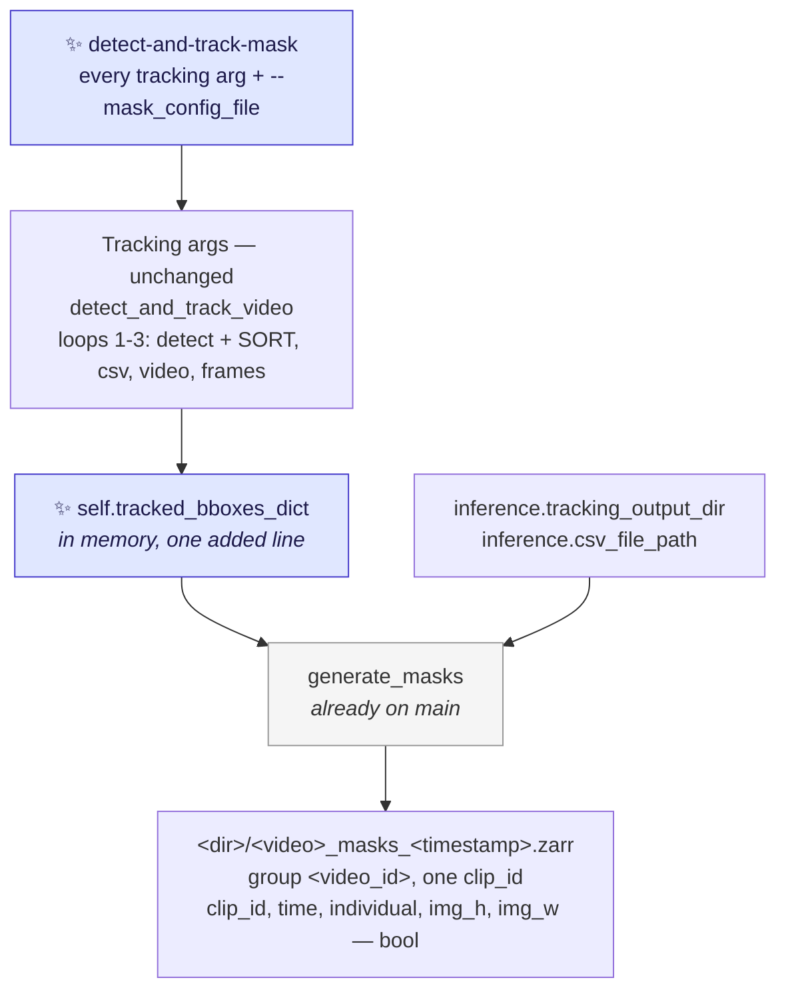
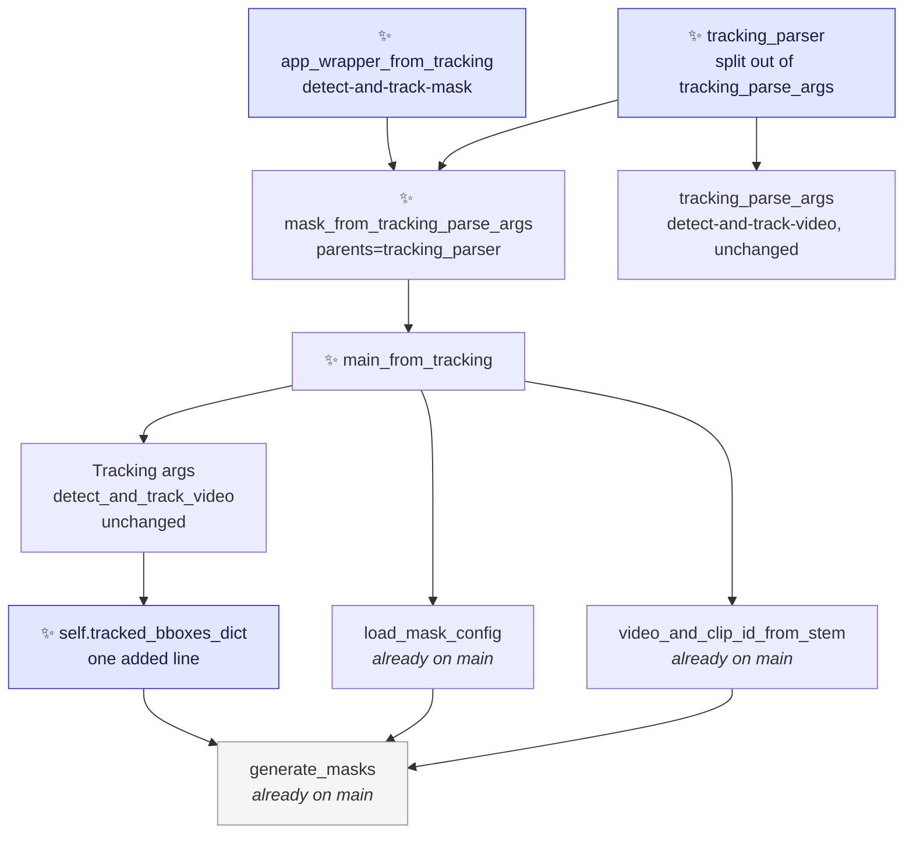

# Proposal for the `detect-and-track-mask` entry point

Part of [`plan-masking-crabs.md`](plan-masking-crabs.md). This document covers **PR 3**, the last of
the three; [`proposal-mask-tracked-crabs.md`](proposal-mask-tracked-crabs.md) covers PR 1 and
[`proposal-mask-tracked-crabs-from-csv.md`](proposal-mask-tracked-crabs-from-csv.md) covers PR 2.

## Description

A new CLI entry point, `detect-and-track-mask`, that runs the existing `detect-and-track-video`
pipeline unchanged and then masks the tracked boxes in the same command.

It adds no new masking code: the masking pass, the store format and the config file all ship in
[`proposal-mask-tracked-crabs.md`](proposal-mask-tracked-crabs.md), which this PR builds on.



Arrows point from an input to the step that consumes it. ✨ marks what is new in this PR; the grey
node is what the earlier PRs already landed.

Node → code legend:

- `Tracking` / `detect_and_track_video` → [`crabs/tracker/track_video.py:38`](../crabs/tracker/track_video.py#L38)
- `generate_masks` → `crabs/tracker/mask_video.py`, landed by
  [`proposal-mask-tracked-crabs-from-csv.md`](proposal-mask-tracked-crabs-from-csv.md) (PR 2)
- `tracking_output_dir` / `csv_file_path` → [`prep_outputs`](../crabs/tracker/track_video.py#L93-L132)

> [!NOTE]
> **Prompt** — a hint telling SAM2 *which* object to segment. Here, one bounding box in
> `[x1, y1, x2, y2]` pixel coordinates per tracked crab. The other terms this document uses
> (*instance plane*, *label image*, *trajectories store*) are defined in
> [`proposal-mask-tracked-crabs.md`](proposal-mask-tracked-crabs.md).

---

## References

- [`plan-masking-crabs.md`](plan-masking-crabs.md) — the umbrella plan and the PR ordering.
- **[`proposal-mask-tracked-crabs.md`](proposal-mask-tracked-crabs.md) (PR 1) and
  [`proposal-mask-tracked-crabs-from-csv.md`](proposal-mask-tracked-crabs-from-csv.md) (PR 2) — the
  prerequisites.** PR 1 ships the masking pass, the store format, `mask_config.yaml`, the `masks`
  dependency group and the read-side helper; PR 2 ships `generate_masks`, the one-clip wrapper this
  PR calls, and `video_and_clip_id_from_stem`. This PR is not implementable before **both** land,
  and is ~60 lines once they have.
- Issue [#249](https://github.com/SainsburyWellcomeCentre/crabs-exploration/issues/249)
  ("Uncouple pipeline steps") — PRs 1 and 2 are the uncoupling; this PR is the recoupled convenience
  command on top.
- [`this-repo-collects-tools-pure-kernighan.md`](this-repo-collects-tools-pure-kernighan.md) — all
  three PRs together are a scoped-down first slice of its Phase 3.

---

## Overview of steps

1. Expose the tracked boxes on the `Tracking` object: one added line in
   [`crabs/tracker/track_video.py`](../crabs/tracker/track_video.py).
2. Split `tracking_parse_args` into a parser builder, `tracking_parser()`, and the call to
   `parse_args` — so the new entry point can inherit every tracking argument. No argument changes.
3. Add `mask_from_tracking_parse_args`, `main_from_tracking` and `app_wrapper_from_tracking` to
   `crabs/tracker/mask_video.py`.
4. Register the `detect-and-track-mask` script in [`pyproject.toml`](../pyproject.toml).
5. Add unit tests for the new parser and the parser split, and one integration test that this
   command and `mask-tracked-crabs` agree.
6. Document the new entry point alongside the one the earlier PRs added.

---

## Key aspects of suggested implementation

### 1. Two entry points, one masking pass

By the time this PR starts, `mask-tracked-crabs` already reads boxes from two sources through one
`--boxes` argument ([prerequisite §1](proposal-mask-tracked-crabs.md)). This PR adds a **third**
source — a `Tracking` run in memory — and it is the one source that cannot be a value of `--boxes`,
because it is not a file.

| | ✨ `detect-and-track-mask` | `mask-tracked-crabs` |
|---|---|---|
| Detection + SORT | re-run | skipped |
| boxes from | ✨ `Tracking.detect_and_track_video()`, in memory | a file: a trajectories store, or a `<clip>_tracks.csv` |
| Arguments | ✨ every tracking argument, plus `--mask_config_file` | `--boxes`, `--videos`, `--output_dir`, `--match`, `--mask_config_file`, `--accelerator` |
| Needs a checkpoint | ✨ yes | no |
| Tracking config read | ✨ yes | no |
| Clips per run | ✨ one | one or many |
| Store written to | ✨ the new `tracking_output_<timestamp>/` | `--output_dir` |

**Why this is a separate command rather than another `--boxes` value.**

- **There is no file to name.** The other two sources are paths; this one is a pipeline that has to
  run first. `--boxes` dispatches on a suffix, and there is no suffix for "run the detector".
- **It needs seven arguments the other command has no use for** — `--trained_model_path`,
  `--config_file`, `--save_video`, `--save_frames`, `--annotations_file`, `--output_dir`,
  `--output_dir_no_timestamp`. Folding them in would mean a `--help` listing options inert in most
  of its uses, plus a validation function to explain them. That is the count that made a merged
  command wrong here and a merged `--boxes` right there.
- **It is the grain of the repo.** All existing entry points are flat and single-purpose, none uses
  subparsers, and the burrow pipeline is
  [four separate scripts chained by files](../scripts/burrows/README.md).

**Why a function rather than a `TrackingAndMasking(Tracking)` subclass.** The prerequisite made the
masking pass module-level functions taking explicit arguments, so the difference between the entry
points disappears into how each builds its arguments, and `Tracking` itself is left almost untouched.
See [`proposal-mask-tracked-crabs.md`](proposal-mask-tracked-crabs.md) §2.

### 2. Everything this PR needs already exists

| What this PR calls | Where it landed |
|---|---|
| `generate_masks(video_path, tracked_bboxes_dict, output_dir, boxes_file, device, mask_config, boxes_source, id_source, video_id, clip_id)` | `crabs/tracker/mask_video.py`, [PR 2](proposal-mask-tracked-crabs-from-csv.md) |
| `create_mask_store`, `mask_clip_into` — under `generate_masks`, not called directly here | `crabs/tracker/mask_video.py`, PR 1 |
| `accelerator_to_device(accelerator)` | `crabs/tracker/mask_video.py`, PR 1 |
| `load_mask_config(path)` — there is no `MASK_DEFAULTS`; each knob is defaulted at its use site | `crabs/tracker/mask_video.py`, PR 1 |
| `DEFAULT_MASK_CONFIG`, `MASK_CONFIG_HELP` | inline literals in PR 1's parser — **this PR promotes them** to module constants, since it is the second caller ([§5](#5-the-new-parser-the-tracking-arguments-plus-one-flag)) |
| `video_and_clip_id_from_stem(stem)` | `crabs/tracker/utils/tracking.py`, [PR 2](proposal-mask-tracked-crabs-from-csv.md) — this PR calls it for the same reason the csv path does ([§3](#3-one-added-line-in-track_videopy-so-main-can-see-the-boxes)) |
| `boxes_source="tracker"` as an `.attrs` value | the key is already written, with `"trajectories_zarr"` and `"tracks_csv"` as its other values. `id_source` is `"sort_track_id"`, the same value the csv path writes |
| The `(clip_id, time, individual, img_h, img_w)` bool store, its chunking and sharding | `create_mask_store` |
| The `masks` dependency group, `zarr>=3` and `xarray` | [`pyproject.toml`](../pyproject.toml) |
| `to_label_image` | `crabs/tracker/utils/masks.py` |

**`generate_masks` needs no change to accept the tracker's dict**, which is the one thing that could
have made this PR big. The two dicts differ in two ways, and the prerequisite handles both and pins
them with a test:

- **The tracker emits a key for every frame**, including frames with zero boxes
  ([track_video.py:264-269](../crabs/tracker/track_video.py#L264-L269)); the file-based readers have
  no key for such a frame. The pass uses `.get(frame_idx)` and skips on `None` *or* on an empty box
  array, so both are covered.
- **The tracker's dict carries a `"scores"` key**
  ([track_video.py:267](../crabs/tracker/track_video.py#L267)); the file-derived ones do not. The
  pass never reads `"scores"` and never validates the key set.

One thing that is *not* a difference: **`ids`**. The tracker emits floats
([track_video.py:266](../crabs/tracker/track_video.py#L266)), and so does the csv reader, and both
are stringified to build the `individual` coordinate. So this PR writes the same `id_source` and the
same label style as PR 2 — which is what makes [test 5](#tests) able to compare the two stores by
label.

> [!IMPORTANT]
> If the prerequisite's forward-compatibility test (its test 17 — `generate_masks` on a dense dict
> with a `"scores"` key) is not on `main`, add it here before anything else. It is the only thing
> standing between this PR and a debugging session.

### 3. One added line in `track_video.py`, so `main` can see the boxes

`detect_and_track_video` currently computes the tracked boxes and lets them go out of scope. Store
them on `self`, rather than changing the method's signature or its return type:

```diff
--- a/crabs/tracker/track_video.py
+++ b/crabs/tracker/track_video.py
@@ def detect_and_track_video(self) -> None:
     # Run detection and tracking over all frames in video
     tracked_bboxes_dict = self.core_detection_and_tracking()
+    self.tracked_bboxes_dict = tracked_bboxes_dict
```

- **The signature and return type of `detect_and_track_video` are unchanged**, so every existing
  caller and every existing test is unaffected.
- **The output directory and CSV path are already attributes.** `prep_outputs` sets
  `self.tracking_output_dir` ([track_video.py:105-111](../crabs/tracker/track_video.py#L105-L111))
  and `self.csv_file_path` ([:114-118](../crabs/tracker/track_video.py#L114-L118)), so `main` reads
  all three of the values `generate_masks` needs off the same object.
- **`video_id` and `clip_id` come from the video filename**, through the same
  `video_and_clip_id_from_stem` PR 2 added — so a clip masked by this command lands in the same group
  and under the same `clip_id` as one masked by `mask-tracked-crabs`. That is what
  [test 5](#tests) compares.

**Rejected alternative — masking inside `core_detection_and_tracking`.** It saves one video pass, but
puts SAM2 in the middle of the detection loop, changes an existing method, and makes the feature
impossible to skip. A fourth pass matches the pattern the file already uses twice and keeps the diff
to `track_video.py` down to the one added line.

### 4. Splitting the tracking parser, so the new entry point inherits it

`tracking_parse_args` currently builds its parser and parses in one function
([track_video.py:350-451](../crabs/tracker/track_video.py#L350-L451)). Splitting the building out
lets `detect-and-track-mask` reuse every tracking argument through argparse's `parents` mechanism:

```diff
--- a/crabs/tracker/track_video.py
+++ b/crabs/tracker/track_video.py
+def tracking_parser() -> argparse.ArgumentParser:
+    """Build a parser with the arguments for tracking.
+
+    The parser is defined with ``add_help=False`` so that it can be used as a
+    parent parser (see ``parents`` in argparse).
+    """
+    parser = argparse.ArgumentParser(add_help=False)
+    ...   # every add_argument call, unchanged
+    return parser
+
+
 def tracking_parse_args(args):
     """Parse command-line arguments for tracking."""
-    parser = argparse.ArgumentParser()
-    ...
+    parser = argparse.ArgumentParser(parents=[tracking_parser()])
     return parser.parse_args(args)
```

- **`detect-and-track-video` is unaffected** — same arguments, same `required`, same help text.
- **`--trained_model_path` keeps `required=True`.** Because this is a separate command rather than a
  mode of the other one, there is nothing to un-require — which argparse has no clean way to do
  anyway.
- **`add_help=False` is what makes `tracking_parser` usable as a parent**: two parsers each defining
  `-h` would raise `ArgumentError` on the child. Both callers wrap it in a real parser that adds the
  help option itself.
- **`tracking_parse_args` is only called from `app_wrapper` in the same module**, so the split has no
  other callers to update.

### 5. The new parser: the tracking arguments, plus one flag

```python
# crabs/tracker/mask_video.py — added beside the mask-tracked-crabs parser
def mask_from_tracking_parse_args(args):
    """Parse arguments for detect-and-track-mask: tracking, plus the mask config."""
    parser = argparse.ArgumentParser(
        parents=[tracking_parser()],
        formatter_class=argparse.RawDescriptionHelpFormatter,   # see below
        epilog=(                                  # ✨ the pointer to the other command
            "To mask boxes that have already been computed — a trajectories zarr "
            "store, or a previous run's tracks csv — use mask-tracked-crabs."
        ),
    )
    parser.add_argument(
        "--mask_config_file", type=str,
        default=DEFAULT_MASK_CONFIG, help=MASK_CONFIG_HELP,
    )
    return parser.parse_args(args)
```

**This PR promotes the mask-config default path and help string to module constants.** PR 1 wrote
them as inline literals, because it had one call site and a constant would have existed only for a
caller that did not yet exist. This PR is that caller, so the two literals move to
`DEFAULT_MASK_CONFIG` and `MASK_CONFIG_HELP` at module level and both parsers refer to them — a
three-line change inside `mask_video.py`.

**The `epilog` is what keeps the two commands discoverable**, and the two point at each other:
`mask-tracked-crabs --help` already names this command
([prerequisite §9](proposal-mask-tracked-crabs.md)), and this one names it back. Splitting an
expensive command from a cheap one means somebody holding a tracking output has to know the cheap one
exists, and documentation alone only helps the people who read it. One line at the bottom of `--help`
names the alternative at exactly the moment a user is looking at the expensive command.

> [!NOTE]
> An **epilog** is argparse's term for text printed at the **bottom of `--help`**, after the
> arguments — the counterpart to `description`, which prints above them. It is the only place a
> command can mention another command without that other command becoming an argument of it.

**`formatter_class=argparse.RawDescriptionHelpFormatter` is required, not cosmetic.** Checked against
Python 3.12: the default `HelpFormatter` re-wraps the epilog to the terminal width and happily breaks
on the hyphens in the command name, rendering it as `mask-` / `tracked-crabs` across two lines —
un-copy-pasteable, and it would defeat the `--help` assertion in [test 3](#tests). The raw formatter
leaves the epilog exactly as written and, verified in the same check, still wraps ordinary argument
help strings normally, so nothing about the inherited tracking options changes.

### 6. Where the masks land

The masks are the third optional artefact in the same directory as the video `--save_video` writes
and the raw PNGs `--save_frames` writes:

```
tracking_output_<timestamp>/
├── <video>_tracks.csv
├── <video>_tracks.mp4                  # --save_video
├── <video>_frames/                     # --save_frames
└── <video>_masks_<timestamp>.zarr/     # ✨ always, for this entry point
    └── <video_id>/                     #    one group, one clip_id
```

**The store name is timestamped**, which PR 1 already established. It matters here too: it is what
makes `--output_dir_no_timestamp` — which the integration tests use — safe to re-run without
clobbering the previous store. The cost is that readers glob for the store instead of naming it.

---

## Detailed implementation



Arrows point from a caller to what it calls, except `tracking_parser → tracking_parse_args`, which is
the parent-parser relationship. Grey nodes landed in the earlier PRs.

### The 6 changes

| # | Change | Signature / diff |
|---|---|---|
| 0 | `crabs/tracker/mask_video.py` — promote the mask-config default path and help string from inline literals to `DEFAULT_MASK_CONFIG` and `MASK_CONFIG_HELP` ([§5](#5-the-new-parser-the-tracking-arguments-plus-one-flag)) | three lines, no behaviour change |
| 1 | [`crabs/tracker/track_video.py`](../crabs/tracker/track_video.py) — expose the tracked boxes | `+ self.tracked_bboxes_dict = tracked_bboxes_dict` ([§3](#3-one-added-line-in-track_videopy-so-main-can-see-the-boxes)) |
| 2 | [`crabs/tracker/track_video.py`](../crabs/tracker/track_video.py) — split the parser | `tracking_parser() -> argparse.ArgumentParser`, with `tracking_parse_args` calling it ([§4](#4-splitting-the-tracking-parser-so-the-new-entry-point-inherits-it)) |
| 3 | `crabs/tracker/mask_video.py` — three added functions, ~40 lines | `mask_from_tracking_parse_args`, `main_from_tracking`, `app_wrapper_from_tracking` (below) |
| 4 | [`pyproject.toml`](../pyproject.toml) | one new script, `detect-and-track-mask = "crabs.tracker.mask_video:app_wrapper_from_tracking"` |
| 5 | [`crabs/tracker/README.md`](../crabs/tracker/README.md) + [`guides/DetectAndTrackHPC.md`](../guides/DetectAndTrackHPC.md) | document the command and **when to reach for each** |

<details>
<summary><b>1. The three added functions, in full</b></summary>

```python
# crabs/tracker/mask_video.py — appended beside the mask-tracked-crabs code

def mask_from_tracking_parse_args(args):
    """Arguments for detect-and-track-mask: every tracking arg, plus the config.  [§5]"""
    parser = argparse.ArgumentParser(
        parents=[tracking_parser()],
        formatter_class=argparse.RawDescriptionHelpFormatter,   # else the name wraps, §5
        epilog="... use mask-tracked-crabs.",   # names the other entry point, §5
    )
    parser.add_argument("--mask_config_file", type=str, default=DEFAULT_MASK_CONFIG,
                        help=MASK_CONFIG_HELP)
    return parser.parse_args(args)


def main_from_tracking(args):              # detect-and-track-mask
    inference = Tracking(args)             # the existing class, unchanged
    inference.detect_and_track_video()     # the existing method, unchanged
    video_id, clip_id = video_and_clip_id_from_stem(Path(args.video_path).stem)   # §3
    generate_masks(
        args.video_path,
        inference.tracked_bboxes_dict,     # the one added line, §3
        inference.tracking_output_dir,
        inference.csv_file_path,
        accelerator_to_device(args.accelerator),
        load_mask_config(args.mask_config_file),
        boxes_source="tracker",
        id_source="sort_track_id",
        video_id=video_id,
        clip_id=clip_id,
    )


def app_wrapper_from_tracking():           # detect-and-track-mask
    logging.getLogger().setLevel(logging.INFO)
    torch.set_float32_matmul_precision("medium")
    main_from_tracking(mask_from_tracking_parse_args(sys.argv[1:]))
```

`main_from_tracking` is the whole feature. Every other line of the masking pass is already on `main`
from the earlier PRs.

**All three entry points live in the one module**: they share `generate_masks` and everything under
it, and splitting them across files would mean one importing the other anyway. See the prerequisite's
*Points to discuss* #2 for when that stops being true.

**Rejected alternative — a `TrackingAndMasking(Tracking)` subclass with an alternative
constructor.** A `from_tracking_output(cls, args, mask_config)` classmethod using `cls.__new__` could
skip `Tracking.__init__` and set the attributes the masking pass reads. It keeps `main` symmetric
across entry points, but it hard-codes, in the child, which of the parent's attributes matter — so
adding an attribute to `Tracking.__init__` that `generate_masks` later depends on breaks the other
entry point silently, at runtime, in a way no type checker sees. Passing the values as arguments
makes that dependency a signature.

</details>

<details>
<summary><b>2. How this entry point's output differs from <code>mask-tracked-crabs</code>'s, and why that is fine</b></summary>

The prompts are the **tracked** boxes in both, which is what makes the plumbing trivial — the mask
planes and the CSV rows are the same rows, so there is no index bookkeeping at all and no change to
[`sort.py`](../crabs/tracker/sort.py).

Two consequences worth stating plainly, neither of which blocks this, and both of which apply to the
csv path of `mask-tracked-crabs` equally:

- **SORT does not return the detector's box.** `Sort.update` emits `trk.get_state()` =
  `convert_x_to_bbox(self.kf.x)` ([sort.py:204](../crabs/tracker/sort.py#L204)) — a Kalman-filtered
  estimate in `(cx, cy, area, aspect_ratio)` space, lagged and with its aspect ratio pulled towards
  the track's history. The masks are therefore segmented from an approximate box.
- **Only tracked crabs get a mask.** Detections that SORT suppresses (below `min_hits`) produce no
  row and no mask. With `min_hits: 1` in the current config this is nearly all of them.

Two differences are specific to this PR:

- **This entry point's prompts are up to 1 px larger than the csv path's**, because the CSV is a lossy
  record of the boxes: `write_tracked_detections_to_csv` writes `width` and `height` through
  `int(...)`, which truncates rather than rounds. `x` and `y` round-trip bit-exactly, and track IDs
  round-trip exactly. The masks from the two are therefore very close but **not bit-identical**, which
  [test 5](#tests) has to allow for.
- **It writes one clip, always.** `mask-tracked-crabs` given a trajectories store writes many. Both
  write the same shape; this one's `clip_id` axis has length 1
  ([prerequisite §5](proposal-mask-tracked-crabs.md)).

**The compute difference from prompting is negligible either way**: the expensive image encoder runs
once per frame regardless, and prompts only touch the small mask decoder. The difference between the
commands is the detector pass, not the masking.

</details>

---

## Files changed

| File | Change |
|---|---|
| [`crabs/tracker/track_video.py`](../crabs/tracker/track_video.py) | one added line (store the tracked boxes on `self`); split `tracking_parse_args` into `tracking_parser()` + `parse_args`. No argument changes |
| `crabs/tracker/mask_video.py` | three added functions, plus promoting two literals to module constants |
| [`pyproject.toml`](../pyproject.toml) | new `detect-and-track-mask` script |
| `tests/test_unit/test_mask_video.py` | the parser tests for this entry point |
| [`tests/test_unit/test_track_video.py`](../tests/test_unit/test_track_video.py) | regression tests for the parser split |
| [`tests/test_unit/test_entry_points.py`](../tests/test_unit/test_entry_points.py) | add `detect-and-track-mask` to the parametrised list |
| [`tests/test_integration/test_inference.py`](../tests/test_integration/test_inference.py) | `test_detect_and_track_mask` and the two-command agreement test |
| [`crabs/tracker/README.md`](../crabs/tracker/README.md) | document the command and when to reach for each |
| [`guides/DetectAndTrackHPC.md`](../guides/DetectAndTrackHPC.md) | the end-to-end command on the cluster |

**Nothing else is touched.** In particular: no change to the store format, to `mask_config.yaml`, to
`generate_masks`, to `create_mask_store` or `mask_clip_into`, to
`crabs/tracker/utils/masks.py`, to [`sort.py`](../crabs/tracker/sort.py), to
[`utils/io.py`](../crabs/tracker/utils/io.py), to
[`create_dataset.py`](../crabs/zarr/create_dataset.py), to `tracking_config.yaml`, to the CSV format,
or to the detector.

> [!NOTE]
> **The store format was settled in [PR 1](proposal-mask-tracked-crabs.md), not here.** It mirrors the trajectories datatree so that
> masking from a [`create-zarr-dataset`](../crabs/zarr/create_dataset.py) store and masking from a
> single clip fill the same array rather than two incompatible ones. This PR writes a single-clip
> store into it and is otherwise unaffected; the shape is visible here only in `generate_masks`'
> arguments and in the assertions in [tests 5 and 6](#tests).

---

## Tests

Mostly about not regressing `detect-and-track-video`. The format contract is already covered by the
prerequisite's tests.

**Unit — must pass with no `sam2` installed.**

1. **`mask_from_tracking_parse_args` inherits the tracking arguments.** The namespace carries
   `mask_config_file` when the flag is passed and `DEFAULT_MASK_CONFIG` when it is not; and
   `vars(mask_from_tracking_parse_args(argv + mask_flag))` minus `mask_config_file` equals
   `vars(tracking_parse_args(argv))` for the same `argv`. That equality is the property the
   `parents=[...]` refactor buys.
2. **`--help` exits `0` and lists both `--mask_config_file` and `--config_file`** — the property that
   would regress if `tracking_parser` were ever given `add_help=True`.
3. **`--help` output contains the unbroken string `mask-tracked-crabs`**, so the epilog cannot be
   dropped silently — it is the only in-product signpost between the commands — and so that dropping
   `formatter_class=RawDescriptionHelpFormatter` fails the test rather than quietly hyphenating the
   command name across two lines ([§5](#5-the-new-parser-the-tracking-arguments-plus-one-flag)).
4. **The parser split changes nothing for `detect-and-track-video`.** There is no existing test
   covering `tracking_parse_args` — it is called only from `app_wrapper` — so add one in
   [`test_track_video.py`](../tests/test_unit/test_track_video.py): on a minimal valid argv it still
   returns the same defaults; `detect-and-track-video --help` still lists every tracking option; and
   `detect-and-track-video` with no `--trained_model_path` still exits `2`.

**Existing tests that must stay green, unmodified.** `pytest tests/test_unit` — in particular
[`test_track_video.py`](../tests/test_unit/test_track_video.py), where neither the one-line change to
`detect_and_track_video` nor the parser split must alter behaviour. Extend
[`test_entry_points.py`](../tests/test_unit/test_entry_points.py) with `detect-and-track-mask`.

**Integration (slow, opt-in)**, in [`test_inference.py`](../tests/test_integration/test_inference.py),
reusing the `input_data_paths` fixture and the 3-frame clip, `@pytest.mark.skipif` on `sam2` being
importable.

5. **✨ The two commands agree, end to end, in one test.** Run `detect-and-track-mask` on the 3-frame
   clip, then run `mask-tracked-crabs --boxes <that dir>/<video>_tracks.csv --videos <clip>` — with no
   checkpoint on the second command line. Assert:
    - both exit `0`, and the directory holds **two** `<video>_masks_*.zarr` stores, the first intact;
    - the first run's `.attrs["boxes_source"] == "tracker"`, the second's is `"tracks_csv"`, and both
      have `id_source == "sort_track_id"`;
    - both stores have the **same shape**, the **same `individual` coordinate in the same order**, and
      the same set of populated `(frame, individual)` pairs — the contract that the CSV round trip
      loses no crab and no identity. The coordinate equality is the sharper half: it would catch a
      producer that emitted the right masks under the wrong labels, which a plane-index comparison
      could not;
    - the masks are **close but not asserted equal** — the CSV truncation means the prompts differ by
      up to 1 px, so compare with a tolerance on per-plane `sum()` (a few percent), not with
      `array_equal`.

    This is the test that justifies having two commands at all: it proves they produce the same thing,
    so a user can pick either.

6. **`test_detect_and_track_mask` on its own**, alongside
   [`test_detect_and_track_video`](../tests/test_integration/test_inference.py). Opened with
   `xr.open_datatree`, assert the store has one group named for the clip's `video_id`, holding `masks`
   of shape `(1, 3, M, H, W)` and dtype `bool`, and that for each frame the set of `individual` labels
   with any `True` pixel is exactly the set of track IDs in that frame's CSV rows, as strings. The
   store is found by globbing `<video>_masks_*.zarr`, since the name is timestamped.

    This test passes the registry's `tracking_config.yaml` **unchanged** and lets `--mask_config_file`
    fall back to its packaged default — with a separate mask config there is nothing to add to the GIN
    registry file.

> [!NOTE]
> The registry's clip is `04.09.2023-04-Right_RE_test_3_frames.mp4`, which has **no `-Loop`** in its
> name, so it exercises `video_and_clip_id_from_stem`'s fallback: `video_id == clip_id == the full
> stem`. Tests 5 and 6 must assert against whatever that helper returns, not against a hard-coded
> `"Loop<NN>"`. The loop-clip naming rule is covered by the prerequisite's unit test 15 and by its
> own pooch fixture.

---

## Documentation updates

Yes, two files, both of which the earlier PRs already touched.

- [`crabs/tracker/README.md`](../crabs/tracker/README.md) — add the `detect-and-track-mask` section
  next to the `mask-tracked-crabs` one, and **one paragraph on when to reach for each**: this command
  for a first run on a new clip, the other one for a labelled collection or for iterating on SAM2
  settings without re-running the detector.
- [`guides/DetectAndTrackHPC.md`](../guides/DetectAndTrackHPC.md) — the end-to-end command, including
  that it needs both config files staged.

---

## Verifications for agent to run

```bash
# lint + full unit suite (no sam2 needed)
pre-commit run --all-files
pytest tests

# slow end-to-end CLI tests (pooch downloads test data on first run)
pytest -m slow tests/test_integration/test_inference.py
```

Manual check on a real clip:

```bash
uv sync --group masks   # in a conda env instead:
# pip install --no-build-isolation "sam-2 @ git+https://github.com/facebookresearch/sam2.git"

# the full pipeline: detect, track, then mask
detect-and-track-mask \
    --trained_model_path <ckpt> \
    --video_path <clip.mp4> \
    --config_file <tracking_config.yaml> \
    --mask_config_file <mask_config.yaml> \   # optional; defaults to the packaged one
    --accelerator=gpu \
    --output_dir_no_timestamp

# the same boxes can then be re-masked with different SAM2 settings, no detector
mask-tracked-crabs \
    --boxes tracking_output/<clip>_tracks.csv \
    --videos <clip.mp4> \
    --output_dir tracking_output \
    --mask_config_file <mask_config_tiny.yaml> \
    --accelerator=gpu
```

**Time both commands.** The gap between them is the whole justification for having two, and it is the
number that says whether the detector or SAM2 dominates the run.

Two things to check by hand that are specific to this PR:

```bash
# the epilog is present and not broken across lines
detect-and-track-mask --help | grep -- "mask-tracked-crabs"

# detect-and-track-video is unchanged by the parser split
detect-and-track-video --help
detect-and-track-video --video_path <clip.mp4>        # still exits 2, no --trained_model_path
```

Then confirm the two stores agree:

```python
import xarray as xr, numpy as np
from pathlib import Path

stores = sorted(Path("tracking_output").glob("<clip>_masks_*.zarr"))
# read through xarray, not zarr: the raw array is int8 (prerequisite §5)
a, b = (xr.open_datatree(s, engine="zarr", chunks={})["<video_id>"] for s in stores[-2:])
print(a.attrs["boxes_source"], b.attrs["boxes_source"])         # "tracker", "tracks_csv"
print(a.masks.shape == b.masks.shape, a.masks.dtype)            # True, bool
print(list(a.individual.values) == list(b.individual.values))   # True — same crabs, same order

# same crabs in the same frames, masks within a few percent of each other
pa, pb = (
    m.masks.isel(clip_id=0, time=0).any(dim=("img_h", "img_w")).values for m in (a, b)
)
print(np.array_equal(pa, pb))                                   # True
```

---

## Points to discuss

| # | To discuss | Conclusion |
|---|---|---|
| 1 | **This PR must land after PR 1 and PR 2.** It is ~60 lines on top of them and cannot be built first without moving the whole masking pass into this PR instead. It needs [PR 2](proposal-mask-tracked-crabs-from-csv.md) specifically, for `generate_masks` and `video_and_clip_id_from_stem`. | |
| 2 | **The two epilogs point at each other.** Symmetric, unlike an earlier draft where only the expensive command carried the pointer. The cost is two strings to keep in sync with two command names; tests [3](#tests) here and 11 in the prerequisite pin both. | |
| 3 | **`accelerator_to_device` duplicates three lines from `Tracking.__init__`** ([track_video.py:79-82](../crabs/tracker/track_video.py#L79-L82)). It was duplicated in PR 1 so that `track_video.py` was not touched at all there. Now that this PR touches `track_video.py` anyway, the duplication could be removed — but it would add a third change to a file this PR otherwise edits twice, for three lines. Recommend leaving it. | |
| 4 | **Should `detect-and-track-mask` always write masks, or gate them behind a flag?** As proposed it always does, matching the command's name; `--save_video` and `--save_frames` are the flags for the other two artefacts. A `--no_masks` flag would make the command a strict superset of `detect-and-track-video`, which is arguably worse, not better. Recommend always. | |
| 5 | **⚠️ The detector is running at its detection cap.** `fasterrcnn_resnet50_fpn_v2` is constructed with no kwargs ([models.py:82](../crabs/detector/models.py#L82)), so torchvision's default `box_detections_per_img=100` applies — and this scene has ~100 crabs per frame. Dense frames are plausibly being truncated to the top 100 by score, silently, before tracking. It matters more here than in the other command, because this is the one that runs the detector. Worth its own issue. | |
