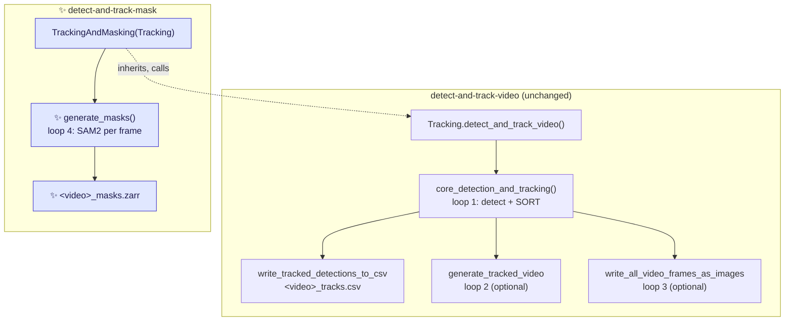
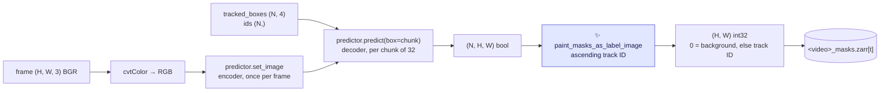

# Proposal for a `detect-and-track-mask` entry point

## Description

This document proposes a **new CLI entry point, `detect-and-track-mask`** in the crabs backage.

This entry point runs the existing
`detect-and-track-video` pipeline unchanged, then prompts SAM2 with the **tracked** boxes and
writes one ID-encoded mask per frame, where each mask carries its **track ID**. 


> [!NOTE]
> Nomenclature clarifications
> * **Prompt** — a hint telling SAM2 *which* object to segment. Here, one bounding box in
> `[x1, y1, x2, y2]` pixel coordinates per tracked crab.
> * **Label image** — a 2-D integer array where `0` is background and every other value identifies
> one object. This is the array `skimage.measure.regionprops` takes.


## References
It is a scoped-down
first slice of Phase 3 of
[`this-repo-collects-tools-pure-kernighan.md`](this-repo-collects-tools-pure-kernighan.md).

---

## Key aspects of suggested implementation


### 1. A subclass, so the diff is one new file

* `Tracking.detect_and_track_video` already produces exactly what SAM2 needs — tracked boxes and
IDs per frame.
* It already re-loops over the video twice (for `--save_video` and
`--save_frames`). Masking is a third such loop.



* The **entire feature is one new module**, `crabs/tracker/track_and_mask_video.py`. 

* The only change
to existing Python is:
    - one added line, so `generate_masks`in `crabs/tracker/track_and_mask_video.py` can see the boxes:

    ```diff
    --- a/crabs/tracker/track_video.py
    +++ b/crabs/tracker/track_video.py
    @@ def detect_and_track_video(self) -> None:
        # Run detection and tracking over all frames in video
        tracked_bboxes_dict = self.core_detection_and_tracking()
    +   self.tracked_bboxes_dict = tracked_bboxes_dict
    ```
* `prep_outputs` in `generate_masks` needs no change: 
    - `generate_masks`  can derive its output path from `self.tracking_output_dir` and `self.input_video_file_root`, in the same way as it does already.

* The masks are
the third optional artefact in the same directory as the video `--save_video` writes and the raw PNGs `--save_frames` writes.
    ```
    tracking_output_<timestamp>/
    ├── <video>_tracks.csv
    ├── <video>_tracks.mp4          # --save_video
    ├── <video>_frames/             # --save_frames
    └── <video>_masks.zarr          # ✨ always, for this entry point
    ```

### 2. Output format: an ID-encoded zarr `(T, H, W)` int32, labelled by track ID

* This is the format `skimage.measure.regionprops` consumes directly, with no decoding step:

    ```python
    import zarr
    from skimage.measure import regionprops

    masks = zarr.open("<video>_masks.zarr", mode="r")
    for prop in regionprops(masks[frame_idx]):
        prop.label              # == the SORT track ID from <video>_tracks.csv
        prop.orientation        # ... later
    ```

* **"masks inherit their ID from the tracked boxes"** falls out for free because `regionprops` returns one region per distinct non-zero value and exposes it as `prop.label`, so no sidecar mapping file.

* It also matches what already exists in the repo:
[`generate_masks_from_bboxes.py`](../scripts/generate_masks_from_bboxes.py) writes the same
`(N, H, W)` shape with `chunks=(1, H, W)`, and
[`notebook_visualise_masks_from_zarr.py`](../notebooks/notebook_visualise_masks_from_zarr.py)
already loads that shape into napari.

> [!WARNING]
> **Do not copy that script's dtype.** `create_mask_zarr` opens the store as `dtype="bool"`
> ([:120](../scripts/generate_masks_from_bboxes.py#L120)) while `predict_masks_across_images`
> writes an `int16` ID-encoded array into it ([:191](../scripts/generate_masks_from_bboxes.py#L191)),
> so every ID is silently coerced to `True` and the instance IDs are lost. This proposal uses
> `int32` **and asserts the store dtype against the declared `mask_encoding` at creation**, so the
> same bug cannot recur.

* `int32` rather than `int16`/`uint16`. There **is** a hard ceiling on track IDs, contrary to what a
never-reset monotonic counter suggests: 
    * the detector caps detections at **100 per image**
(`fasterrcnn_resnet50_fpn_v2` is constructed with no kwargs at
[models.py:82](../crabs/detector/models.py#L82), so torchvision's `box_detections_per_img=100`
applies). 
    * `KalmanBoxTracker.count` increments only on an *unmatched* detection
([sort.py:76-77](../crabs/tracker/sort.py#L76-L77)) — so `total IDs ≤ 100 × n_frames`. That bound
still rules out `uint16` (65535) for anything past 655 frames, and the realistic count
(≈ `n_crabs + n_ID_switches`) is a measurement nobody has taken yet. Since a sparse, blocky label
image compresses well, `uint16`'s nominal 2× saving largely disappears in the store anyway.

    So: 
    *   `int32`, 
    * **plus an assertion at the end of the run that `KalmanBoxTracker.count` fits the
    dtype**, and 
    * the final count recorded as `n_track_ids` in `.attrs` — which makes the dtype
    choice measured rather than argued. See *Points to discuss* on file size.

    (`KalmanBoxTracker.count` being a class attribute that is never reset
    ([sort.py:39](../crabs/tracker/sort.py#L39)) does not affect this: the CLI runs one `Sort` per
    process, so the counter starts at 0 on every run. It only bites if several trackers are
    instantiated in one process, e.g. across tests.)

* Mirroring the existing script's dict, this would be the Metadata that goes in `.attrs`: 

```python
{
    "timestamp": ..., "sam2_model": ..., "device": ...,
    "source_video": str(self.input_video_path),
    "tracks_csv": str(self.csv_file_path),      # the file these IDs refer to
    "n_frames": ..., "image_shape": [H, W],
    "mask_encoding": "track_id",                 # asserted against the array dtype
    "n_track_ids": ...,                          # KalmanBoxTracker.count — asserted to fit dtype
    "background_label": 0,
    "prompt_type": "bounding_box",
    "prompt_source": "tracked_boxes",            # not raw detections — see §4
    "overlap_policy": "higher_track_id_wins",
    "multimask_output": False,
}
```

### 3. Painting N boolean masks into one label image



```python
def paint_masks_as_label_image(masks, track_ids, image_shape):
    """Combine per-instance boolean masks into one int32 label image.

    masks      : (N, H, W) bool
    track_ids  : (N,) int, the SORT IDs from the tracks CSV
    returns    : (H, W) int32, 0 = background

    Where two masks overlap, the higher track ID wins. Masks are painted in
    ascending track-ID order so the result does not depend on input order.
    """
    label_image = np.zeros(image_shape, dtype=np.int32)
    for i in np.argsort(track_ids):
        label_image[masks[i]] = track_ids[i]
    return label_image
```

Overlap is real here — ~100 frequently touching crabs — and this policy loses the overlapping
pixels of the lower-ID crab. It is deterministic and recorded in the attrs, but it is the main
known limitation of the format; the alternative is in *Points to discuss*.

### 4. Prompting with tracked boxes: what you get, and what it costs

Per the request, the prompts are the **tracked** boxes. That is what makes the plumbing trivial —
the mask rows and the CSV rows are the same rows, so there is no index bookkeeping at all, and no
change to `sort.py`.

Two consequences worth stating plainly, neither of which blocks this:

- **SORT does not return the detector's box.** `Sort.update` emits `trk.get_state()` =
  `convert_x_to_bbox(self.kf.x)` ([sort.py:204](../crabs/tracker/sort.py#L204)) — a Kalman-filtered
  estimate in `(cx, cy, area, aspect_ratio)` space, lagged and with its aspect ratio pulled towards
  the track's history. The masks are therefore segmented from an approximate box.
- **Only tracked crabs get a mask.** Detections that SORT suppresses (below `min_hits`) produce no
  row and no mask. With `min_hits: 1` in the current config this is nearly all of them.

The compute difference is negligible either way: the expensive image encoder runs **once per
frame** regardless, and prompts only touch the small mask decoder.

### 5. Three SAM2 details that will silently degrade or crash this

| Detail | Consequence | Handling |
|---|---|---|
| `cv2.VideoCapture.read()` returns **BGR**; `set_image` documents **RGB** (`sam2_image_predictor.py:86-98`) | Silently worse masks — no error, no warning. The existing script never hit this because it reads RGB PNGs via PIL. | `cv2.cvtColor(frame, cv2.COLOR_BGR2RGB)` |
| `predict()` ends with `masks.squeeze(0)`: returns `(N, 1, H, W)` for N>1 but `(1, H, W)` for N==1 | Crash or wrong axis on any frame with exactly one tracked crab. The same latent bug is in [generate_masks_from_bboxes.py:171](../scripts/generate_masks_from_bboxes.py#L171). | `masks.reshape(len(boxes), *masks.shape[-2:])` |
| Every prompt gets a **full-frame** mask: `_predict` upsamples to `self._orig_hw`, then `predict()` does `.float().cpu().numpy()` | At 1920×1080 that is 8.29 MB per prompt in float32 — **829 MB on CPU for a 100-crab frame**, and 100 prompts is the exact worst case, since the detector caps detections per image at 100 (§2) | Chunk the prompts (`max_prompts_per_batch`, default 32 → 265 MB peak) and paint each chunk into the label image before releasing it |

Also: skip SAM2 entirely on frames with zero tracked boxes, rather than calling `set_image` and
then `predict` with an empty array.

### 6. Configuration and the `sam2` dependency

The two knobs go in the **existing tracking config**, so the new entry point can reuse
`tracking_parse_args` verbatim and adds **no CLI code**:

```yaml
# crabs/tracker/config/tracking_config.yaml   ✨ new block
masks:
  sam2_model_id: facebook/sam2.1-hiera-base-plus   # matches the existing script's default
  max_prompts_per_batch: 32                        # see §5
```

Read it as `{**MASK_DEFAULTS, **self.config.get("masks", {})}`. This matters: the integration test
fetches its `tracking_config.yaml` from the pooch/GIN registry
([test_inference.py:45](../tests/test_integration/test_inference.py#L45)), and **that file has no
`masks:` key**.

On dependencies:

- **`sam-2` is not on PyPI.** The only install route is the git URL used in
  [generate_masks_from_bboxes.py:35](../scripts/generate_masks_from_bboxes.py#L35). A PEP 508
  direct reference in `pyproject.toml` would make the sdist built by
  [test_and_deploy.yml:59](../.github/workflows/test_and_deploy.yml#L59) unpublishable. It is
  Apache-2.0, so there is no licence conflict — but it should be a **documented optional install
  with a lazy import inside `generate_masks`**, raising an actionable error, not a declared
  dependency. CI runs the unit suite on ubuntu and macOS without it.
- **`zarr` is imported directly but not declared** — [`crabs/zarr/create_dataset.py:21`](../crabs/zarr/create_dataset.py#L21)
  relies on it arriving transitively via `movement`. This proposal adds a second direct importer,
  so it is worth declaring now (`zarr` 3.x is what `uv.lock` resolves).


**Explicitly out of scope:** no ellipse fitting, no orientation, no angle in the CSV, no changes to
the detector or to SORT. The masks are the deliverable; geometry comes later, offline, from the
mask store.


---

## Detailed implementation

### The 6 changes

| # | Change | Signature / diff |
|---|---|---|
| 1 | **new** `crabs/tracker/track_and_mask_video.py` — the whole feature, ~150 lines | see below |
| 2 | [`crabs/tracker/track_video.py`](../crabs/tracker/track_video.py) — expose the tracked boxes | `+ self.tracked_bboxes_dict = tracked_bboxes_dict` (one line, §1) |
| 3 | [`crabs/tracker/config/tracking_config.yaml`](../crabs/tracker/config/tracking_config.yaml) | `masks:` block (§6) |
| 4 | [`pyproject.toml`](../pyproject.toml) | `detect-and-track-mask = "crabs.tracker.track_and_mask_video:app_wrapper"`; declare `zarr` |
| 5 | **new** `tests/test_unit/test_track_and_mask_video.py` | unit tests for the two pure helpers (no `sam2` needed) |
| 6 | [`crabs/tracker/README.md`](../crabs/tracker/README.md) + [`guides/DetectAndTrackHPC.md`](../guides/DetectAndTrackHPC.md) | how to install `sam-2` and read the store back |

<details>
<summary><b>1. The new module in full outline</b></summary>

Four module-level functions plus a four-method subclass. The first two functions are pure — no
`sam2`, no torch, no I/O beyond zarr — which is what makes change #5 possible on CI.

```python
"""Detect, track and mask crabs in a video."""

MASK_DEFAULTS = {
    "sam2_model_id": "facebook/sam2.1-hiera-base-plus",
    "max_prompts_per_batch": 32,
}


def paint_masks_as_label_image(masks, track_ids, image_shape) -> np.ndarray:
    """(N, H, W) bool + (N,) ids -> (H, W) int32 label image.  [§3]"""


def create_mask_zarr(path, n_frames, image_shape, metadata_dict) -> zarr.Array:
    """Open an (T, H, W) int32 store, chunks=(1, H, W), and write .attrs.

    Asserts the array dtype is integer, matching metadata["mask_encoding"].
    """


def load_sam2_predictor(model_id: str, device: str):
    """Import sam2 lazily and return a SAM2ImagePredictor.  [§6]"""
    try:
        from sam2.sam2_image_predictor import SAM2ImagePredictor
    except ImportError as e:
        raise ImportError(
            "detect-and-track-mask needs SAM2. Install it with:\n"
            '  pip install "sam-2 @ git+https://github.com/facebookresearch/sam2.git"'
        ) from e
    return SAM2ImagePredictor.from_pretrained(model_id, device=device)


def predict_masks_for_frame(predictor, frame_bgr, boxes, max_prompts_per_batch):
    """(H, W, 3) BGR + (N, 4) boxes -> (N, H, W) bool.  [§5]"""
    predictor.set_image(cv2.cvtColor(frame_bgr, cv2.COLOR_BGR2RGB))
    out = []
    FOR EACH chunk OF boxes, size max_prompts_per_batch:
        masks, _iou, _low_res = predictor.predict(box=chunk, multimask_output=False)
        out.append(masks.reshape(len(chunk), *masks.shape[-2:]).astype(bool))
    RETURN np.concatenate(out)


class TrackingAndMasking(Tracking):
    """Extend Tracking with a SAM2 masking pass over the tracked boxes."""

    def prep_mask_outputs(self): ...     # path + config defaults
    def generate_masks(self): ...        # the loop, below


def main(args):
    inference = TrackingAndMasking(args)
    inference.detect_and_track_video()   # inherited, unchanged
    inference.generate_masks()


def app_wrapper():
    logging.getLogger().setLevel(logging.INFO)
    torch.set_float32_matmul_precision("medium")
    main(tracking_parse_args(sys.argv[1:]))   # reuses the existing parser verbatim
```

`generate_masks`, mirroring the structure of `write_all_video_frames_as_images`
([io.py:205](../crabs/tracker/utils/io.py#L205)):

```python
def generate_masks(self):
    predictor = load_sam2_predictor(cfg["sam2_model_id"], self.accelerator)
    mask_zarr = create_mask_zarr(...)

    input_video_object = open_video(self.input_video_path)
    frame_idx = 0
    WHILE input_video_object.isOpened():
        ret, frame = input_video_object.read()
        IF not ret:
            parse_video_frame_reading_error_and_log(frame_idx, total_n_frames)
            break

        frame_data = self.tracked_bboxes_dict[frame_idx]
        boxes, ids = frame_data["tracked_boxes"], frame_data["ids"]
        IF len(boxes) > 0:                                    # [§5]
            masks = predict_masks_for_frame(predictor, frame, boxes, chunk_size)
            mask_zarr[frame_idx] = paint_masks_as_label_image(
                masks, ids.astype(int), mask_zarr.shape[1:]
            )
        frame_idx += 1

    input_video_object.release()
```

Frames with no tracked boxes are left at the store's `fill_value=0` — correct by construction, and
one fewer branch.

**Rejected alternative — masking inside `core_detection_and_tracking`.** It saves one video pass,
but it puts SAM2 in the middle of the detection loop, changes an existing method, and makes the
feature impossible to skip. A fourth pass matches the pattern the file already uses twice and
keeps the diff to one added line in existing code.

**Rejected alternative — a post-pass over an existing `_tracks.csv`.** More decoupled, and
attractive later, but it means re-parsing VIA JSON and re-deriving the frame index from filenames
when the same data is already in memory. It also could not reuse `Tracking` at all. Worth
revisiting once the format is settled.
</details>

---

## Files changed

| File | Change |
|---|---|
| `crabs/tracker/track_and_mask_video.py` | **new** — the entire feature |
| [`crabs/tracker/track_video.py`](../crabs/tracker/track_video.py) | one added line (store the tracked boxes on `self`) |
| [`crabs/tracker/config/tracking_config.yaml`](../crabs/tracker/config/tracking_config.yaml) | `masks:` block |
| [`pyproject.toml`](../pyproject.toml) | new `detect-and-track-mask` script; declare `zarr` |
| `tests/test_unit/test_track_and_mask_video.py` | **new** |
| [`crabs/tracker/README.md`](../crabs/tracker/README.md) | document the entry point, the store layout and how to read it back |
| [`guides/DetectAndTrackHPC.md`](../guides/DetectAndTrackHPC.md) | installing `sam-2` on the cluster |

Nothing else is touched. In particular: no change to `sort.py`, to `utils/io.py`, to the CSV
format, to `evaluate_tracker.py`, or to the detector.

---

## Overview of tests to write

**Pure unit — must pass with no `sam2` installed (this is the CI shape)**

1. `paint_masks_as_label_image`: three non-overlapping masks with IDs `[7, 3, 12]` produce a label
   image whose non-zero values are exactly `{3, 7, 12}` and whose regions are in the right places.
2. Overlap policy: two overlapping masks with IDs `3` and `12` — the shared pixels are `12`, and
   the result is identical when the inputs are passed in the opposite order (the `argsort` is doing
   its job).
3. Empty input `(0, H, W)` returns an all-zero image and does not raise.
4. Round-trip through the consumer: feed the output of #1 to `skimage.measure.regionprops` and
   assert `{p.label for p in props} == {3, 7, 12}`. This is the property the whole format exists
   for, so it should be asserted rather than assumed.
5. `create_mask_zarr`: the array dtype is integer, `fill_value` is 0, chunks are `(1, H, W)`, and
   `.attrs["mask_encoding"] == "track_id"` — plus a test that the internal assertion **fires** if
   the dtype and the declared encoding disagree (the guard against the `dtype="bool"` bug).
6. `load_sam2_predictor` raises `ImportError` with the install command in the message when `sam2`
   is absent (`monkeypatch` the import).
7. The track-ID/dtype guard (§2): a track ID exceeding `np.iinfo(dtype).max` raises rather than
   wrapping around silently. Cheap to test directly on the helper, and it is the assertion that
   makes a later switch to `uint16` safe.

**Existing tests that must stay green, unmodified**

8. `pytest tests/test_unit` — in particular
   [`test_tracking_io.py`](../tests/test_unit/test_tracking_io.py) (the CSV is untouched) and
   [`test_track_video.py`](../tests/test_unit/test_track_video.py) (the one-line change to
   `detect_and_track_video` must not alter behaviour).
9. [`test_entry_points.py`](../tests/test_unit/test_entry_points.py) — extend with
   `detect-and-track-mask` following the existing pattern.

**Integration (slow, opt-in)**

10. A `test_detect_and_track_mask` alongside
   [`test_detect_and_track_video`](../tests/test_integration/test_inference.py), reusing the
   `pooch_registry` fixture and the 3-frame clip, `@pytest.mark.skipif` on `sam2` being importable.
   Assert the store exists, has shape `(3, H, W)`, and that the set of non-zero labels in each
   frame equals the set of track IDs in that frame's rows of the CSV. That last assertion is the
   real contract of this feature.

---

## Verifications for agent to run

```bash
# lint + full unit suite (no sam2 needed)
pre-commit run --all-files
pytest tests/test_unit

# slow end-to-end CLI tests (pooch downloads test data on first run)
pytest -m slow tests/test_integration/test_inference.py
```

Manual check on a real clip:

```bash
pip install "sam-2 @ git+https://github.com/facebookresearch/sam2.git"

detect-and-track-mask \
    --trained_model_path <ckpt> \
    --video_path <clip.mp4> \
    --config_file <tracking_config.yaml> \
    --accelerator=gpu \
    --output_dir_no_timestamp
```

then confirm the contract and eyeball the masks:

```python
import zarr, numpy as np
from skimage.measure import regionprops

masks = zarr.open("tracking_output/<clip>_masks.zarr", mode="r")
print(masks.shape, masks.dtype, dict(masks.attrs))

props = regionprops(masks[0])
print(sorted(p.label for p in props))     # must match the track IDs in <clip>_tracks.csv frame 0
print([p.area for p in props][:10])       # sanity: no zero-area or whole-frame regions
```

[`notebooks/notebook_visualise_masks_from_zarr.py`](../notebooks/notebook_visualise_masks_from_zarr.py)
already loads this shape into napari; overlaying it on the frames written by `--save_frames` is the
fastest qualitative check that the masks are on the crabs and not on the background.

Also worth recording once, since it decides the format's viability: `du -sh` of the store for one
real clip, and the wall-clock time of the masking pass versus the detection pass.

---

## Points to discuss

1. **Is the overlap loss acceptable?** A single label image cannot represent two crabs occupying
   the same pixel, and this scene has ~100 frequently touching individuals — so the lower-ID crab's
   overlapping pixels are discarded (§3). Ellipse fits on a partly-eaten mask will be biased. The
   alternative is storing **per-instance** masks (COCO RLE via `pycocotools`, already a dependency,
   keyed by frame and track ID), which is lossless but is no longer directly `regionprops`-shaped —
   it needs a `mask.decode()` first. My recommendation is to start with the label image, since it
   is simpler and matches the existing repo convention, and measure how many pixels are actually
   lost before deciding — that measurement is one extra line in `paint_masks_as_label_image` and
   could be stored as a per-frame attr. Worth adding now?
2. **Store size.** `(T, H, W)` int32 at 1920×1080 is 8.29 MB/frame uncompressed, so ~25 GB raw for
   a 3000-frame clip. Label images are sparse and blocky so zarr's default compressor should reduce
   that by a large factor, but I have not measured it and will not guess. If it turns out too big,
   the levers are, in order: `uint16` (2×, at the cost of a 65535 track-ID ceiling — reachable in
   principle, since the 100-detections-per-image cap only bounds IDs at `100 × n_frames`; see §2),
   a stronger compressor, or the per-instance-RLE format from point 1 (which is far smaller because
   it never stores background).
3. **`sam2_model_id` default.** I have matched the existing script's `-base-plus`
   ([generate_masks_from_bboxes.py:307](../scripts/generate_masks_from_bboxes.py#L307)) so the two
   agree. `-tiny` / `-small` are considerably faster and may well be enough at this object size —
   easy to compare once the entry point exists, since it is a config value.
4. **Should the entry point re-run detection, or accept an existing tracking output?** As proposed
   it re-runs everything, which is the simplest thing and matches the name. The cost is that
   iterating on SAM2 settings means re-running the detector each time. A `--tracking_output_dir`
   flag that skips straight to `generate_masks` would fix that and fits issue
   [#249](https://github.com/SainsburyWellcomeCentre/crabs-exploration/issues/249)
   ("Uncouple pipeline steps"), but it needs the tracks CSV parsed back in. Deliberately left out;
   easy to add later without changing the format.
5. **Not verified: the SAM2 *checkpoint* licence.** The `sam-2` package is Apache-2.0 (read from
   the installed `dist-info`), and I assumed the `facebook/sam2.1-hiera-*` weights on Hugging Face
   are too — but I did not open the model card.
6. **⚠️ The detector is running at its detection cap.** `fasterrcnn_resnet50_fpn_v2` is constructed
   with no kwargs ([models.py:82](../crabs/detector/models.py#L82)), so torchvision's default
   `box_detections_per_img=100` applies — and this scene has **~100 crabs per frame**. Dense frames
   are therefore plausibly being truncated to the top 100 by score, silently, before tracking and
   before any masking. This does not change anything in this proposal — the masks follow whatever
   the tracker emits — but it caps what the masks can ever cover, and it is invisible in the
   outputs. Worth its own issue and a quick check: log
   `max(len(boxes) for boxes in detections)` over a real clip and see how often it sits at exactly
   100.
7. **Two more things found while reading, both out of scope.** (a) `--max_frames_to_read` is parsed at
   [track_video.py:440](../crabs/tracker/track_video.py#L440) and never used by anything — see PR
   [#245](https://github.com/SainsburyWellcomeCentre/crabs-exploration/pull/245). It would make
   iterating on this entry point much cheaper. (b) `write_tracked_detections_to_csv` zips the
   tracked boxes against `detections_dict["scores"]`, which holds *all raw, unthresholded*
   detections in detector order ([track_video.py:267](../crabs/tracker/track_video.py#L267),
   [io.py:77-82](../crabs/tracker/utils/io.py#L77-L82)) — different length and different order, so
   the CSV `confidence` column is effectively arbitrary. Neither affects the masks; both are worth
   separate PRs.

---

## Feedback on the format of this proposal

If any section is too long, too short, or in the wrong order for how you actually review, say so.
