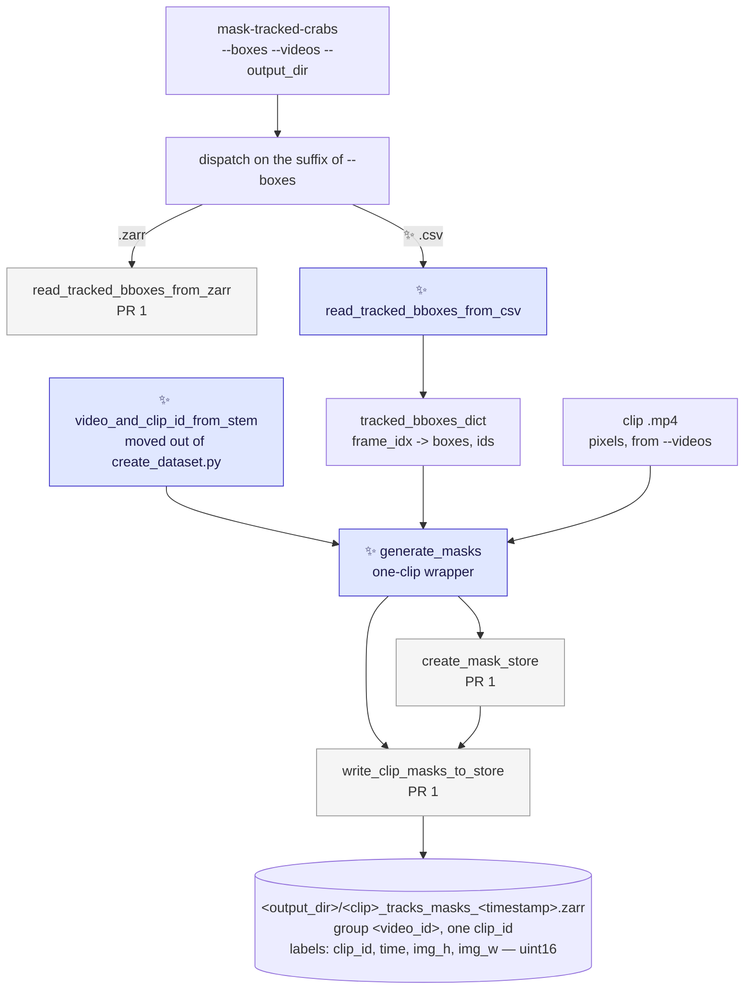

# Proposal for masking from a `<clip>_tracks.csv`

Part of [`plan-masking-crabs.md`](plan-masking-crabs.md). This document covers **PR 2**, the second of
the three; [`proposal-mask-tracked-crabs.md`](proposal-mask-tracked-crabs.md) covers PR 1 and
[`proposal-detect-and-track-mask.md`](proposal-detect-and-track-mask.md) covers PR 3.

## Description

Widens the `mask-tracked-crabs` entry point PR 1 ships so that `--boxes` also accepts a
`<clip>_tracks.csv` — one clip's output from a `detect-and-track-video` run — and adds
`generate_masks`, the one-clip wrapper over the masking pass.

It adds **no new command and no new masking code**: the pass, the store format, the config file, the
dependency group and the read-side helper all ship in
[`proposal-mask-tracked-crabs.md`](proposal-mask-tracked-crabs.md), which this PR builds on. What is
new is a ~15-line reader, a wrapper, and one widened `if`.



Arrows point from an input to the step that consumes it. ✨ marks what is new in this PR; grey nodes
are what PR 1 already landed.

> [!NOTE]
> The terms this document uses — *prompt*, *label image*, *occlusion policy*, *trajectories store* —
> are defined in [`proposal-mask-tracked-crabs.md`](proposal-mask-tracked-crabs.md).

**Why it is worth its own PR.** Masking a fresh tracking run's output is how SAM2 settings get
iterated on without re-running the detector, and it is the only path for a clip that is in no
trajectories store. It is also the PR that [`proposal-detect-and-track-mask.md`](proposal-detect-and-track-mask.md)
depends on, for `generate_masks` and `video_and_clip_id_from_stem`.

---

## References

- [`plan-masking-crabs.md`](plan-masking-crabs.md) — the umbrella plan and the PR ordering.
- **[`proposal-mask-tracked-crabs.md`](proposal-mask-tracked-crabs.md) — the prerequisite.** Its PR 1
  ships `create_mask_store`, `write_clip_masks_to_store`, `predict_masks_into`, `load_sam2_predictor`,
  `load_mask_config`, `accelerator_to_device`, the store format, `mask_config.yaml`, the `masks`
  dependency group and the `label_of` mapping. This PR is not implementable before it lands, and is ~60
  lines once it has.
- [`proposal-detect-and-track-mask.md`](proposal-detect-and-track-mask.md) — **PR 3**, which calls the
  `generate_masks` wrapper this PR adds, with the dict built from a `Tracking` run in memory.
- [`write_tracked_detections_to_csv`](../crabs/tracker/utils/io.py#L45-L101) — the writer whose output
  this reads back, and whose losses [§3](#3-what-the-csv-does-and-does-not-preserve) quantifies.
- [`extract_bounding_box_info`](../crabs/tracker/utils/tracking.py#L47-L86) — already in the file the
  new reader goes in; it parses one VIA row and recovers the frame index from the filename.
- [`proposal-tracking-score-alignment.md`](proposal-tracking-score-alignment.md) — why the reader
  drops the `confidence` column rather than parsing it back.
- [`crabs/zarr/create_dataset.py`](../crabs/zarr/create_dataset.py) — where the two clip-filename
  helpers live today, and which imports them back after this PR moves them.

---

## Overview of steps

1. Add `read_tracked_bboxes_from_csv` to
   [`crabs/tracker/utils/tracking.py`](../crabs/tracker/utils/tracking.py), built on the
   `extract_bounding_box_info` already in the file.
2. Move `create_dataset.py`'s two clip-filename helpers into the same module as
   `video_and_clip_id_from_stem`, and import them back into `create_dataset.py`.
3. Widen `--boxes` to accept `.csv`, and add `generate_masks`, the one-clip path through the same
   pass.
4. Add its unit tests and one integration test.

---

## Key aspects of suggested implementation

### 1. A widened `--boxes`, not a second command

Masking from a trajectories store and masking from a tracks csv are **the same operation** — prompt
SAM2 with boxes someone already computed, write the same store. They differ only in a reader. That is
why PR 1 made the source one argument whose **suffix** selects the reader
([prerequisite §1](proposal-mask-tracked-crabs.md)), and why this PR is a widened accepted set rather
than a new entry point:

```bash
mask-tracked-crabs --boxes CrabTracks-slurm3012633.zarr --videos /path/to/clips/   # PR 1
mask-tracked-crabs --boxes tracking_output/<clip>_tracks.csv --videos <clip>.mp4   # ✨ this PR
```

**PR 1 did not accept `.csv` at all** — not a stub, not a "not yet supported" branch. It accepted
`.zarr` and rejected anything else by suffix. So there is no dead code to delete here, and `--help`
never advertised something that did not work; this PR widens the accepted set, adds the reader, and
extends the two help strings in the same commit.

**What it costs: one conditionally-inert argument.** `--match` applies only to a store. Passing it
with a `.csv` is an error with a message saying so, not a silent no-op — PR 1 already raises that
error for every non-`.zarr` `--boxes`, and after this PR the `.csv` case is the only one a user will
realistically hit.

**`--videos` takes a single file here, not a directory.** The zarr path derives
`<videos>/<video_id>-<clip_id>.mp4` per clip; the csv path names one clip, so `--videos` is that
clip's `.mp4`. Both are "the pixels the boxes refer to", and the difference is one `Path.is_dir()`.

### 2. `generate_masks`: the one-clip wrapper over PR 1's two functions

PR 1 split the pass in two because a trajectories store holds many clips per video group
([prerequisite §2](proposal-mask-tracked-crabs.md)):

```python
create_mask_store(store_path, video_id, clip_ids, n_frames, individuals,
                  image_shape, metadata_dict, shard_n_frames, codec, zarr_mode_group) -> zarr.Array
write_clip_masks_to_store(video_path, tracked_bboxes_dict, mask_array, clip_index,
                          individuals, predictor, max_prompts_per_batch) -> int
```

This PR calls both with a **single clip** — one `clip_id`, one `write_clip_masks_to_store` — and
wraps the pair in `generate_masks` so the one-clip case is one call:

```python
# crabs/tracker/mask_video.py                                                     ✨ new
def generate_masks(video_path, tracked_bboxes_dict, output_dir, boxes_file, device,
                   mask_config, boxes_source, id_source, video_id, clip_id) -> Path:
    """Mask one clip's tracked boxes into a new store. Returns the store path."""
```

**The wrapper exists because there are two callers, not one.** PR 3 calls exactly this function with
a dict built from a `Tracking` run in memory — same clip, same store shape, different producer — so
writing it here is not speculative. Its arguments are the union of what the two one-clip callers can
supply and the store's `.attrs` need: `boxes_source` is `"tracks_csv"` here and `"tracker"` there,
`id_source` is `"sort_track_id"` in both.

**It loads its own predictor.** `mask-tracked-crabs`'s multi-clip loop loads one predictor for the
whole run and passes it down, because the predictor is the expensive object and there are many clips.
A one-clip run has nothing to amortise over, so `generate_masks` calls `load_sam2_predictor` itself
and the two callers do not have to.

### 3. What the CSV does and does not preserve

`read_tracked_bboxes_from_csv` is ~15 lines, built on `extract_bounding_box_info`
([tracking.py:47-86](../crabs/tracker/utils/tracking.py#L47-L86)), which already parses one VIA row
and recovers the frame index from the `frame_{:08d}.png` filename.

> [!NOTE]
> `write_tracked_detections_to_csv` stores `x`, `y`, `width`, `height`
> ([io.py:45-101](../crabs/tracker/utils/io.py#L45-L101)), and the reader rebuilds
> `[x, y, x + width, y + height]`.
>
> `x` and `y` are written through an f-string on a numpy float64, whose `str` is the round-tripping
> repr, so they come back **bit-identical** — but only in float64. Narrowing to float32, as
> `TrackerEvaluate` does for ground truth, would quietly lose that.
>
> `width` and `height` are written through `int(...)` — **truncated, not rounded** — so `xmax` and
> `ymax` come back up to 1 px small, and never large. Track IDs round-trip exactly.
>
> Checked numerically over 10,000 synthetic boxes through the real format string: `x`/`y` bit-exact
> in 10,000 of 10,000, `xmax`/`ymax` error in `(-1, 0]` px, float32 narrowing bit-exact in **0**.

So **the reader must emit float64**, and the test must assert the truncation as a property rather
than pretending the round trip is exact ([test 1](#tests)).

The bit-exactness argument above is about **this path only**. The zarr path's boxes are float32 —
`load_bboxes` allocates `position_array` as float32, checked on movement 0.17.0 — so it has no
float64 round-trip guarantee at all ([prerequisite §3d](proposal-mask-tracked-crabs.md)). Irrelevant
for a SAM2 prompt either way.

**The `confidence` column is dropped rather than parsed back**: it is written misaligned with the
boxes beside it — see [`proposal-tracking-score-alignment.md`](proposal-tracking-score-alignment.md).

**The dict this produces is sparse**, with no key for a frame that had no boxes, and carries no
`"scores"` key. Both are within the `tracked_bboxes_dict` contract
([prerequisite §4](proposal-mask-tracked-crabs.md)), which `write_clip_masks_to_store` reads with
`.get` and a length check; [test 4](#tests) pins that this PR's shape and PR 3's dense,
`"scores"`-carrying shape produce the same store.

### 4. Where `video_id` and `clip_id` come from

The store is grouped by video and indexed by clip, so the csv path has to name both. It derives them
from `Path(--videos).stem` with the same helpers `create_dataset.py` uses, so a clip masked this way
lands in the group the trajectories store would give it:

| stem | `video_id` | `clip_id` |
|---|---|---|
| `04.09.2023-01-Right-Loop05` | `04.09.2023-01-Right` | `Loop05` |
| `my_clip` | `my_clip` | `my_clip` |

The helpers ([create_dataset.py:212-234](../crabs/zarr/create_dataset.py#L212-L234)) **move to
`crabs/tracker/utils/tracking.py` and are imported back**, rather than duplicated. Ten lines of pure
string handling, one rule rather than two, and it makes the "lands in the same group" claim
checkable — [test 2](#tests) asserts the new helper and `create_dataset.py`'s own naming agree.

The fallback row is a judgement call — *Points to discuss* [#1](#points-to-discuss).

> [!NOTE]
> **This is the one change in this PR that touches existing code.** PR 1 touched no existing Python
> at all; moving these helpers is a pure move plus an import, with no behaviour change, and the zarr
> tests must stay green unmodified as the proof of that.

### 5. Identity: the `individual` axis is the SORT IDs, sorted numerically

The store's identity model is PR 1's and does not change here: plane `i` belongs to `individual[i]`,
whatever string that is, and `.attrs["id_source"]` says where the strings came from
([prerequisite §5](proposal-mask-tracked-crabs.md)).

| boxes from | `individual` values | `id_source` |
|---|---|---|
| a trajectories store (PR 1) | `"id_0000"`, `"id_0001"`, … — copied from `ds_video.individual` | `trajectories_store_individual` |
| ✨ a `<clip>_tracks.csv` (this PR) | `"1"`, `"7"`, `"12"` — the SORT IDs actually emitted, as strings | `sort_track_id` |
| a `Tracking` run (PR 3) | the same | `sort_track_id` |

**`M` is the number of IDs actually present, not `max(id)`** — here, the distinct SORT IDs in one
clip's csv. Counter values SORT burned on tracks suppressed below `min_hits`
([sort.py:39](../crabs/tracker/sort.py#L39), [:76](../crabs/tracker/sort.py#L76)) never inflate the
axis, because there is no offset convention needing gaps left in it. This `M` is a genuinely
different quantity from PR 1's, which is a coordinate read straight off the input store — see
*Points to discuss* [#2](#points-to-discuss).

**The coordinate is built with `sorted(..., key=int)`**, so it reads `["2", "9", "10"]` rather than
lexical `["10", "2", "9"]`.

> [!IMPORTANT]
> **This is the coordinate shape that makes `np.searchsorted` wrong**, and it is why PR 1's
> `write_clip_masks_to_store` resolves labels through a `{label: position}` dict instead
> ([prerequisite §6](proposal-mask-tracked-crabs.md)). `searchsorted` compares strings **lexically**,
> so it resolves `"10"` to position 1 in a `sorted(key=int)` coordinate; and on a label missing
> altogether it returns an insertion point rather than raising, turning a bug into a silently
> mis-assigned mask. The dict raises `KeyError` on the second and has no ordering assumption for the
> first. [Test 6](#tests) is the one that fails if it is ever "simplified" back.

### 6. The read side: here the pixel values *are* the SORT track IDs

The zarr path's `label_of` maps `id_0006` to some integer; this path can do something nicer, because
SORT IDs are already positive integers. **`label_of` is set to the track IDs themselves**, so a pixel
in `labels` literally holds the track ID that produced it:

```python
ds.label_of.sel(individual="7").item()      # -> 7
regionprops(ds.labels.isel(clip_id=0, time=t).values)[k].label    # -> a SORT track ID
```

That means `regionprops` output needs no decoding at all on this path, and a label image lifted out
of the store stays meaningful on its own. It is also why `label_of` exists as an explicit array
rather than an offset rule ([prerequisite §5](proposal-mask-tracked-crabs.md)): the two paths assign
pixel values by genuinely different rules, and neither reader has to know which.

The one constraint: SORT IDs must fit `uint16`, i.e. stay under 65,535. They are per-clip counters
([sort.py:39](../crabs/tracker/sort.py#L39)), and the largest clip in the trajectories store has
8,082 individuals, so there is room — but the writer asserts it rather than assuming.


### 7. What changes in the parser

Two help strings, and the suffix check behind them. No new arguments.

```python
    parser.add_argument(
        "--boxes", type=str, required=True,
        help=(
            "Location of the tracked boxes to prompt SAM2 with: a trajectories "
            "zarr store written by create-zarr-dataset, "
            "or a <clip>_tracks.csv written by detect-and-track-video. "   # ✨
            "The suffix selects how it is read."
        ),
    )
    parser.add_argument(
        "--videos", type=str, required=True,
        help=(
            "The clip videos the boxes refer to: a directory holding files named "
            "<video-id>-<clip-id>.mp4 for a zarr store, "
            "or a single .mp4 for a tracks csv."                           # ✨
        ),
    )
```

The `epilog` PR 1 wrote is unchanged, and `formatter_class=RawDescriptionHelpFormatter` still has to
stay — see [prerequisite §9](proposal-mask-tracked-crabs.md) for why that is load-bearing rather than
cosmetic.

---

## Detailed implementation

### The changes

| # | Change | Signature / notes |
|---|---|---|
| 1 | [`crabs/tracker/utils/tracking.py`](../crabs/tracker/utils/tracking.py) | `read_tracked_bboxes_from_csv`, reusing `extract_bounding_box_info`; plus the two filename helpers moved in, behind `video_and_clip_id_from_stem` ([§4](#4-where-video_id-and-clip_id-come-from)) |
| 2 | [`crabs/zarr/create_dataset.py`](../crabs/zarr/create_dataset.py) | import the moved helpers instead of defining them — no behaviour change |
| 3 | `crabs/tracker/mask_video.py` | widen `--boxes` to `.csv`; add `generate_masks`, the one-clip wrapper ([§2](#2-generate_masks-the-one-clip-wrapper-over-pr-1s-two-functions)) |
| 4 | `tests/test_unit/test_mask_video.py`, `tests/test_unit/test_tracking_io.py` | the csv reader, the filename helpers, the widened dispatch |
| 5 | `tests/test_integration/` | one end-to-end test: track a clip, then mask its csv |
| 6 | [`crabs/tracker/README.md`](../crabs/tracker/README.md) | the second `--boxes` form, beside the one PR 1 documented |

<details>
<summary><b>1. The new reader and wrapper in full outline</b></summary>

```python
# crabs/tracker/utils/tracking.py                                    ✨ added to an existing file

def read_tracked_bboxes_from_csv(csv_path) -> tuple[dict, list[str]]:
    """A <clip>_tracks.csv -> (tracked_bboxes_dict, individual labels).

    Returns the same contract read_tracked_bboxes_from_zarr does: a sparse
    mapping of frame index to {"tracked_boxes": (n, 4) float64, "ids": (n,) str},
    and the sorted label list for the `individual` coordinate.  [§3]
    """
    rows = defaultdict(list)
    FOR EACH row IN csv.DictReader(open(csv_path)):
        frame_idx, _fname, bbox, track_id = extract_bounding_box_info(row)   # tracking.py:47
        # x, y, width, height -> [xmin, ymin, xmax, ymax], float64 throughout  [§3]
        rows[frame_idx].append((corners_from(bbox), str(track_id)))

    individuals = sorted({tid for f in rows.values() for _, tid in f}, key=int)   # §5: not lexical
    boxes = {
        frame_idx: {
            "tracked_boxes": np.array([c for c, _ in f], dtype=np.float64),
            "ids": np.array([t for _, t in f], dtype=object),
        }
        for frame_idx, f in rows.items() if f
    }
    return boxes, individuals


def video_and_clip_id_from_stem(stem) -> tuple[str, str]:
    """'<video>-Loop05' -> ('<video>', 'Loop05'); no -Loop -> (stem, stem).  [§4]

    Wraps the two helpers moved here from create_dataset.py:212-234, which
    imports them back.
    """
```

```python
# crabs/tracker/mask_video.py                                        ✨ added beside PR 1's code

def generate_masks(video_path, tracked_bboxes_dict, output_dir, boxes_file, device,
                   mask_config, boxes_source, id_source, video_id, clip_id) -> Path:
    """Mask one clip's tracked boxes into a new store. Returns the store path.  [§2]"""
    individuals = sorted({str(i) for d in tracked_bboxes_dict.values()
                          for i in d["ids"]}, key=int)          # §5
    IF not individuals:
        raise ValueError(f"{clip_id}: no tracked boxes to mask")   # §4 of the prerequisite

    params = get_video_parameters(str(video_path))                 # io.py:21
    H, W, T = params["frame_height"], params["frame_width"], params["total_frames"]

    # a frame index past the end of the clip means the csv is not this clip's
    IF max(tracked_bboxes_dict) >= T:
        raise ValueError(...)                                      # names both numbers

    predictor = load_sam2_predictor(
        mask_config.get("sam2_model_id", "facebook/sam2.1-hiera-base-plus"), device
    )
    timestamp = datetime.now().strftime("%Y%m%d_%H%M%S")
    store_path = Path(output_dir) / f"{Path(boxes_file).stem}_masks_{timestamp}.zarr"

    mask_array = create_mask_store(
        store_path, video_id, [clip_id], T, individuals, (H, W),
        metadata_from(boxes_file, boxes_source, id_source, ...),
        mask_config.get("shard_n_frames", 32), codec, zarr_mode_group="w-",
    )
    write_clip_masks_to_store(
        str(video_path), tracked_bboxes_dict, mask_array, 0, individuals,
        predictor, mask_config.get("max_prompts_per_batch", 32),
    )
    return store_path
```

**`clip_ids` is a one-element list**, so the store's `clip_id` axis has length 1 and the array is
`(1, T, H, W)`. That is the same shape the zarr path writes for a one-clip video group, which is
what lets a csv-masked clip and a store-masked clip be compared with the same code.

**The frame-index check is the one loud failure this path needs.** A csv from a different clip has
frame indices that are perfectly valid integers; without the check they would either write masks past
the end of the store or silently land on the wrong frames.

</details>

<details>
<summary><b>2. <code>main</code>'s widened dispatch</b></summary>

```python
def main(args):                            # mask-tracked-crabs
    boxes_path = Path(args.boxes)
    IF boxes_path.suffix not in (".zarr", ".csv"):     # ✨ was: != ".zarr"
        raise ValueError(...)                          # names the suffixes it accepts  [§1]
    IF args.match != "*" and boxes_path.suffix != ".zarr":
        raise ValueError("--match only applies to a trajectories zarr store")

    mask_config = load_mask_config(args.mask_config_file)
    device = accelerator_to_device(args.accelerator)

    IF boxes_path.suffix == ".csv":                    # ✨ the whole new branch
        video_path = Path(args.videos)
        video_id, clip_id = video_and_clip_id_from_stem(video_path.stem)     # §4
        boxes, _individuals = read_tracked_bboxes_from_csv(boxes_path)       # §3
        generate_masks(
            video_path, boxes, args.output_dir, boxes_path, device, mask_config,
            boxes_source="tracks_csv", id_source="sort_track_id",
            video_id=video_id, clip_id=clip_id,
        )
        return

    ... PR 1's zarr branch, unchanged ...
```

The zarr branch keeps its own loop rather than calling `generate_masks` per clip: it loads one
predictor for the whole run and writes many clips into **one** store, while `generate_masks` loads a
predictor and creates a store per call. Routing the multi-clip path through the wrapper would mean
either reloading SAM2 per clip or giving the wrapper two optional arguments to thread a predictor and
an existing array through — both worse than the ten lines above.

</details>

---

## Tests

**Pure unit — must pass with no `sam2` installed (this is the CI shape).** Added to
`tests/test_unit/test_mask_video.py` and `tests/test_unit/test_tracking_io.py`.

1. **`read_tracked_bboxes_from_csv`, against a CSV written by the real writer.** Build a small dict,
   write it with `write_tracked_detections_to_csv`, read it back, and assert: the frame indices
   recovered are exactly those that had at least one box; `ids` exactly equal; `xmin`/`ymin` exactly
   equal; `xmax`/`ymax` within `[original - 1, original]` — **asserting the truncation as a property
   rather than pretending the round trip is exact** ([§3](#3-what-the-csv-does-and-does-not-preserve)).
   [`test_tracking_io.py`](../tests/test_unit/test_tracking_io.py) already has a fixture of this
   shape. Also: a frame whose boxes are all absent yields no key, a header-only CSV yields `{}`, and
   the arrays are `float64`.
2. **`video_and_clip_id_from_stem` agrees with `create_dataset.py`'s own naming.** For a
   `<video>-Loop05` stem it returns what `_via_tracks_to_video_filename` / `_clip_filename_to_clip_id`
   return for the matching `_tracks.csv` — which makes "lands in the group the trajectories store
   would give it" ([§4](#4-where-video_id-and-clip_id-come-from)) a checked claim. Plus the fallback:
   a stem with no `-Loop` gives `(stem, stem)`.
3. **A CSV from a different clip fails loudly.** A frame index outside `0..T-1` raises rather than
   writing masks past the end of the store.
4. **Forward compatibility with PR 3.** Call `generate_masks` (with the SAM2 call monkeypatched)
   twice on the same boxes: once with a **sparse** dict with no `"scores"` key, as the csv reader
   returns; once with a **dense** dict carrying a `"scores"` key of a *different length*, as
   `core_detection_and_tracking` returns
   ([track_video.py:264-269](../crabs/tracker/track_video.py#L264-L269)). Assert both produce the
   same populated `(frame, individual)` set, the same `individual` coordinate and the same store
   shape. **This exists so PR 3's `main` stays ten lines.**
5. **Dispatch by suffix, widened.** `--boxes foo.csv` is now accepted where PR 1's test asserted it
   exits; `--boxes foo.txt` still is not; `--match` with a `.csv` is still an error naming why. PR 1's
   version of this test is **edited, not added to** — it is the one test in this PR that changes an
   existing assertion, and the diff is where a reviewer sees the widening.
6. **Numerically-sorted string labels resolve correctly.** With `individual` built by
   `sorted(..., key=int)` — `["2", "9", "10"]`, this PR's shape — masks for IDs `10` and `2` land on
   planes 2 and 0. `np.searchsorted` would put `"10"` on plane 1
   ([§5](#5-identity-the-individual-axis-is-the-sort-ids-sorted-numerically)). PR 1 ships this test
   already, written against this PR's coordinate shape; it is listed here because this is the PR that
   makes it a live case rather than a hypothetical one.
7. **A one-clip store has a length-1 `clip_id` axis**, and `labels.shape == (1, T, H, W)` — the same
   shape the zarr path writes for a one-clip video group.

**Existing tests that must stay green, unmodified.** `pytest tests/test_unit`, and in particular the
**zarr tests, which must not notice that `create_dataset.py`'s filename helpers moved**
([§4](#4-where-video_id-and-clip_id-come-from)). That is the whole verification of the move.

**Integration (slow, opt-in)**, `@pytest.mark.skipif` on `sam2` being importable.

8. **Masking a `detect-and-track-video` output.** Run `detect-and-track-video` as
   [`test_detect_and_track_video`](../tests/test_integration/test_inference.py) does, then
   `mask-tracked-crabs --boxes <that dir>/<video>_tracks.csv --videos <clip>` — **with no checkpoint
   on the second command line**, which is what proves the entry point needs no trained detector.
   Assert exit `0`, one group, `labels` of dtype `uint16`, and `individual` equal to the sorted set of
   track IDs in the csv.

This PR needs **no new pooch fixture**: the registry already has the video, tracking config and
checkpoint that `detect-and-track-video` needs, and the csv is produced by the run itself. (The
fixture PR 1 adds — a trajectories store plus its clip `.mp4`s — exists because the registry has no
metadata csv, so `create-zarr-dataset` cannot be run against the existing clip.)

---

## Verifications for agent to run

```bash
# lint + full unit suite (no sam2 needed)
pre-commit run --all-files
pytest tests

# the zarr tests specifically — the proof that moving the filename helpers changed nothing
pytest tests/test_unit -k zarr

# slow end-to-end CLI tests (pooch downloads test data on first run)
pytest -m slow tests/test_integration/
```

Manual check on a real clip:

```bash
uv sync --group masks   # in a conda env instead:
# pip install --no-build-isolation "sam-2 @ git+https://github.com/facebookresearch/sam2.git"

# track a clip, then mask its csv — no checkpoint on the second command
detect-and-track-video --trained_model_path <ckpt> --video_path <clip>.mp4 --config_file <cfg>

mask-tracked-crabs \
    --boxes tracking_output_<timestamp>/<clip>_tracks.csv \
    --videos <clip>.mp4 \
    --output_dir mask_output \
    --accelerator=gpu
```

Failure paths worth confirming by hand:

```bash
# exits non-zero: --match does not apply to a csv
mask-tracked-crabs --boxes clip_tracks.csv --videos clip.mp4 --match "04.09*"

# exits non-zero naming the accepted suffixes — .csv is now accepted, .txt is not
mask-tracked-crabs --boxes clip_tracks.txt --videos clip.mp4

# exits non-zero naming both frame counts: a csv from a different, longer clip
mask-tracked-crabs --boxes other_clip_tracks.csv --videos clip.mp4
```

Then confirm the contract:

```python
import csv
import xarray as xr
from pathlib import Path
from skimage.measure import regionprops

store = sorted(Path("mask_output").glob("*_masks_*.zarr"))[-1]   # the name is timestamped
ds = xr.open_datatree(store, engine="zarr", chunks={})["<video_id>"]
print(ds.labels.shape, ds.labels.dtype)   # (1, T, 2160, 4096) uint16
print(ds.attrs["boxes_source"], ds.attrs["id_source"])   # "tracks_csv", "sort_track_id"

# the contract: the individual axis is exactly the track IDs the csv emitted
with open("tracking_output_<timestamp>/<clip>_tracks.csv") as f:
    ids_in_csv = {r["region_attributes"].split(":")[-1].strip("}\" ") for r in csv.DictReader(f)}
print(list(ds.individual.values) == sorted(ids_in_csv, key=int))    # True

# on this path the pixel values ARE the SORT track IDs  [§6]
print((ds.label_of.values == [int(s) for s in ds.individual.values]).all())   # True
props = regionprops(ds.labels.isel(clip_id=0, time=0).values)
print(sorted(p.label for p in props))     # SORT track IDs, straight out of regionprops
```

---

## Points to discuss

| # | To discuss | Conclusion |
|---|---|---|
| 1 | **The `video_id` / `clip_id` fallback for a video with no `-Loop` in its name.** [§4](#4-where-video_id-and-clip_id-come-from) gives `(stem, stem)` — the video is its own single clip. The alternatives are a literal placeholder, or two optional `--video_id` / `--clip_id` arguments. The last is most explicit and is rejected for now because they would be inert for every loop clip. If arbitrary non-clip videos turn out to be common, they are the right answer. | |
| 2 | **The SORT track IDs must fit `uint16`.** This path writes them into `label_of` verbatim ([§6](#6-the-read-side-here-the-pixel-values-are-the-sort-track-ids)), so a clip whose tracker burned more than 65,535 counter values would overflow. The largest video group in the trajectories store has 8,082 individuals, so there is an order of magnitude of headroom — but `M` here counts distinct SORT IDs in one clip's csv, which nothing has written down, and the writer asserts the bound rather than assuming it. Cheapest check: `max(track_id)` over a real `_tracks.csv`. | |
| 3 | **Whether the multi-clip path should also route through `generate_masks`.** It does not, for the predictor-and-store reasons in [Detailed implementation](#detailed-implementation). The alternative is two optional arguments on the wrapper to thread an existing predictor and array through, which would make one function serve all three callers at the cost of two arguments that are `None` in two of the three. Recommend leaving the ten-line duplication. | |
| 4 | **`write_tracked_detections_to_csv` truncates box `width`/`height` through `int(...)`**, so every box in every `_tracks.csv` is up to 1 px narrower and shorter than the tracker produced — which is why [§3](#3-what-the-csv-does-and-does-not-preserve) can only promise a one-sided bound. `int(round(...))` would make the error unbiased and halve it, but it alters a CSV the VIA workflow and [test_tracking_io.py](../tests/test_unit/test_tracking_io.py) both pin. **Out of scope here and deserves its own PR** — this PR reads the format as it is. | |
