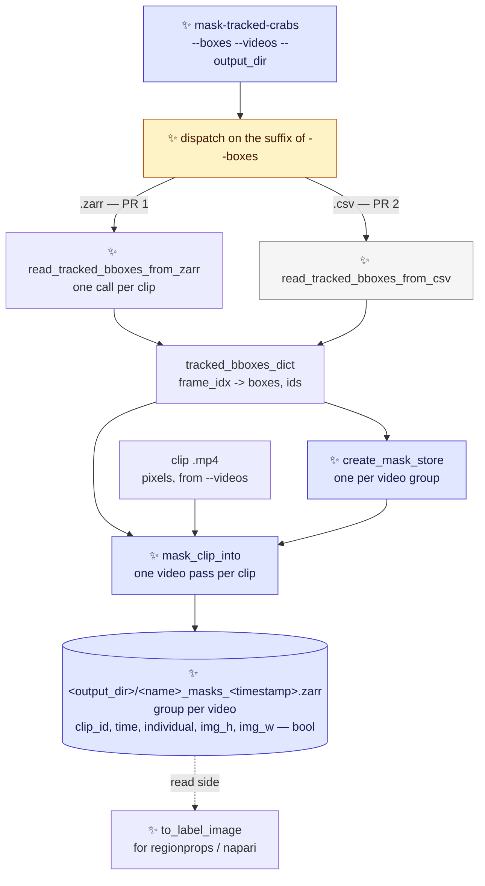
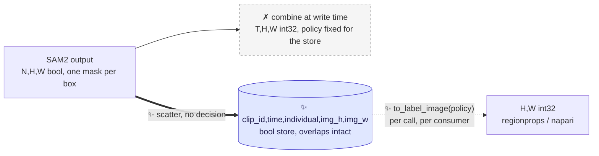
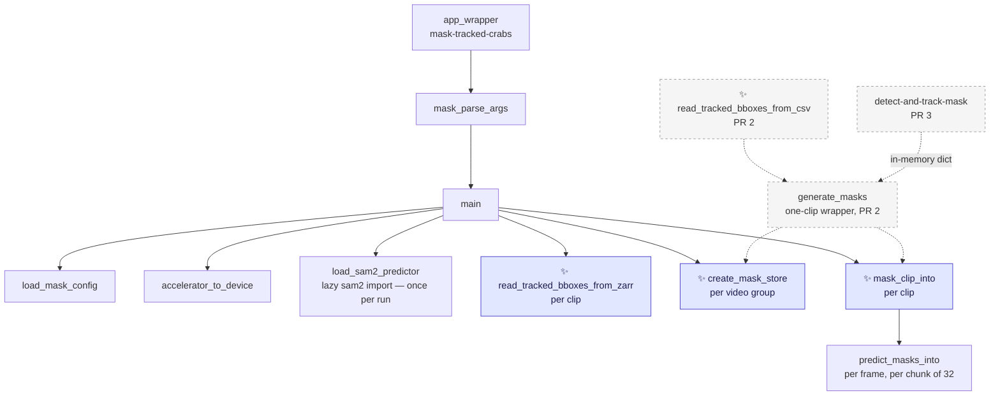

# Proposal for the `mask-tracked-crabs` entry point

Part of [`plan-masking-crabs.md`](plan-masking-crabs.md). This document covers **PR 1 and PR 2**;
[`proposal-detect-and-track-mask.md`](proposal-detect-and-track-mask.md) covers PR 3.

## Description

A new CLI entry point, `mask-tracked-crabs`, that prompts SAM2 with **boxes someone already
computed** and writes one boolean mask per crab per frame.

It needs no trained detector model and no detector pass.



* Arrows point from an input to the step that consumes it.
* Dashed arrows are read-side, not part of the run.
* ✨ marks what is new here. The grey node is **PR 2**; everything else is **PR 1**.

**The store mirrors the trajectories datatree** that
[`create-zarr-dataset`](../crabs/zarr/create_dataset.py) writes — one zarr group per video, holding
an xarray dataset whose `clip_id`, `time` and `individual` coordinates are the same ones the
trajectories store uses. Masks and trajectories for the same clips then align 1:1 with no
reindexing. See [§5](#5-output-format-an-xarray-store-mirroring-the-trajectories-datatree).

> [!NOTE]
> Nomenclature
>
> - **Prompt** — a hint telling SAM2 *which* object to segment. Here, one bounding box in
>   `[x1, y1, x2, y2]` pixel coordinates per tracked crab.
> - **Instance plane** — a 2-D **boolean** array holding exactly one crab's mask. The store is a
>   stack of these, indexed by the `individual` coordinate. This is what is written to disk.
> - **Label image** — a 2-D **integer** array where `0` is background and every other value
>   identifies one object. This is the array `skimage.measure.regionprops` takes. Here it is derived
>   on read, never stored.
> - **Trajectories store** — the zarr store `create-zarr-dataset` writes: a `movement` bboxes
>   dataset per video, with a `clip_id` dimension. Boxes, not pixels.

---

## References

- [`plan-masking-crabs.md`](plan-masking-crabs.md) — the umbrella plan, and where the three PRs and
  the decisions common to them are listed.
- [`proposal-detect-and-track-mask.md`](proposal-detect-and-track-mask.md) — **PR 3**, which adds a
  second entry point running detection, tracking and masking in one command. Built entirely on the
  masking pass PR 1 ships.
- [`crabs/zarr/create_dataset.py`](../crabs/zarr/create_dataset.py) — the trajectories store this
  reads from and whose shape the output mirrors.
- [PR #291](https://github.com/SainsburyWellcomeCentre/crabs-exploration/pull/291) — made the
  trajectories `time` axis dense and clip-anchored. It is the reason PR 1 is implementable now; see
  [§3](#3-reading-boxes-from-a-trajectories-store-pr-1).
- [`scripts/generate_masks_from_bboxes.py`](../scripts/generate_masks_from_bboxes.py) — the existing
  standalone SAM2 script this entry point supersedes for tracked boxes.

---

## Overview of steps

**PR 1**

1. Add `crabs/tracker/mask_video.py`: `create_mask_store`, `mask_clip_into`, `predict_masks_into`,
   `load_sam2_predictor`, `load_mask_config`, `accelerator_to_device`, the parser and the entry
   point.
2. Add `crabs/tracker/utils/masks.py`: `to_label_image`, the read-side helper, pure Python.
3. Add `read_tracked_bboxes_from_zarr` to a new `crabs/tracker/utils/boxes_from_zarr.py`.
4. Add `crabs/tracker/config/mask_config.yaml`: the three SAM2 and store knobs.
5. Declare the dependencies in [`pyproject.toml`](../pyproject.toml): the `mask-tracked-crabs`
   script, `zarr>=3`, `xarray`, and an opt-in `masks` dependency group for SAM2.
6. Add a pooch fixture: a small trajectories store plus the clip `.mp4`s it names.
7. Add unit tests that run without SAM2 installed, and one opt-in integration test.
8. Document the entry point, the install, and the store layout.

**PR 2**

9. Add `read_tracked_bboxes_from_csv` to [`crabs/tracker/utils/tracking.py`](../crabs/tracker/utils/tracking.py),
   built on the `extract_bounding_box_info` already in the file.
10. Move `create_dataset.py`'s two clip-filename helpers into the same module as
    `video_and_clip_id_from_stem`, and import them back into `create_dataset.py`.
11. Widen `--boxes` to accept `.csv`, and add the one-clip path through the same pass.
12. Add its unit tests and one integration test.

---

## Key aspects of suggested implementation

### 1. One entry point, one `--boxes` argument

Masking from a trajectories store and masking from a tracks csv are **the same operation** — prompt
SAM2 with boxes someone already computed, write the same store. They differ only in a reader. So
they are one command, and the source is one argument whose **suffix** selects the reader:

```bash
mask-tracked-crabs --boxes CrabTracks-slurm3012633.zarr --videos /path/to/clips/   # PR 1
mask-tracked-crabs --boxes tracking_output/<clip>_tracks.csv --videos <clip>.mp4   # PR 2
```

**Why not two commands.** The two would share every argument but one, produce the same store, and
need a cross-referencing `epilog` in each `--help` so that someone holding one kind of input
discovers the other command exists. That is a signpost standing in for a seam that should not have
been cut there.

**Why not a mutually-exclusive `--zarr_store` / `--tracks_csv` pair.** It needs argparse's
`add_mutually_exclusive_group` *plus* hand-written validation for the arguments that depend on each
(`--match` requires the store), and `--help` lists options inert in half its uses. Dispatching on
the suffix needs neither: there is one argument, and it is always required.

**What it costs: one conditionally-inert argument.** `--match` applies only to a store. Passing it
with a `.csv` is an error with a message saying so, not a silent no-op. Against that, the
alternative the sibling proposal rejected for `detect-and-track-mask` had **seven** inert arguments
— the difference in degree is the whole argument.

**PR 1 does not accept `.csv` at all** — not a stub, not a "not yet supported" branch. It accepts
`.zarr` and rejects anything else by suffix; PR 2 widens the accepted set and adds the reader. No
dead code at any point, and `--help` never advertises something that does not work.

**Naming.** `mask-tracked-crabs` follows the repo's verb-first convention
(`detect-and-track-video`, `extract-frames`, `train-detector`, `create-zarr-dataset`). It is not
`mask-tracked-video` — it masks many clips across many videos — and not `mask-tracked-clips`, since
one of its inputs is a single clip.

### 2. The masking pass: two functions, because the store holds many clips

SAM2 runs over one clip's video file at a time, but a store holds a whole video's clips. So the pass
splits where that boundary is:

```python
# crabs/tracker/mask_video.py                                                     ✨ new
def create_mask_store(store_path, video_id, clip_ids, n_frames, individuals,
                      image_shape, metadata_dict, shard_n_planes,
                      zarr_mode_group) -> zarr.Array:
    """Write the xarray template for one video group; return its raw zarr array."""


def mask_clip_into(video_path, tracked_bboxes_dict, mask_array, clip_index,
                   individuals, predictor, max_prompts_per_batch) -> int:
    """One video pass. SAM2 per frame, scattered into mask_array[clip_index]."""
```

This shape is the whole reason there is no class here.

- **PR 1 calls `create_mask_store` once per video group and `mask_clip_into` once per clip**, with a
  single SAM2 predictor loaded once for the whole run. The predictor is the expensive object; it is
  the caller's, not the pass's.
- **PR 2 calls both with a single clip** — one `clip_id`, one `mask_clip_into`. It adds a thin
  `generate_masks` wrapper over the two, for the one-clip case.
- **PR 3 calls that same wrapper**, with the dict built from a `Tracking` run in memory.

**The split is load-bearing from the first commit.** PR 1's own loop is the multi-clip caller, so
there is no speculative generality here: if the store held one clip, the pass would be one function.

**A `TrackingAndMasking(Tracking)` subclass could not work.** `Tracking.__init__` loads a checkpoint
eagerly ([track_video.py:48-86](../crabs/tracker/track_video.py#L48-L86)) and `prep_outputs` creates
a new timestamped output directory ([track_video.py:93-132](../crabs/tracker/track_video.py#L93-L132)).
This entry point has no checkpoint, so the subclass could only be constructed by bypassing its own
parent's `__init__`.

### 3. Reading boxes from a trajectories store (PR 1)

The reader turns one clip of one video group into the `tracked_bboxes_dict` contract
([§4](#4-the-tracked_bboxes_dict-contract)):

```python
# crabs/tracker/utils/boxes_from_zarr.py                                          ✨ new
def read_tracked_bboxes_from_zarr(ds_video, clip_id) -> tuple[dict, list[str]]:
    """One clip of a trajectories store -> (tracked_bboxes_dict, individual labels).

    Takes the already-open video dataset rather than a path, so the loop opens
    the datatree once for the whole run.
    """
    ds = ds_video.sel(clip_id=clip_id)
    n_clip_frames = int(ds.clip_last_frame_0idx - ds.clip_first_frame_0idx) + 1

    _validate_store_is_post_291(ds, n_clip_frames, clip_id)      # below

    ds = ds.isel(time=slice(0, n_clip_frames))
    ds = ds.dropna(dim="individual", how="all")      # this clip's individuals only

    xy, wh = ds.position.values, ds.shape.values                  # (t, 2, m) float32
    corners = np.concatenate([xy - wh / 2, xy + wh / 2], axis=1)  # (t, 4, m)

    individuals = [str(v) for v in ds.individual.values]
    boxes = {}
    for i, t in enumerate(ds.time.values):
        present = ~np.isnan(corners[i, 0])
        if present.any():
            boxes[int(t)] = {
                "tracked_boxes": corners[i][:, present].T.astype(np.float64),
                "ids": np.array(individuals, dtype=object)[present],
            }
    return boxes, individuals
```

Four things the trajectories store does differently from a tracks csv, and what each costs:

#### 3a. Frame indices: settled by PR #291, guarded anyway

Before [#291](https://github.com/SainsburyWellcomeCentre/crabs-exploration/pull/291), a VIA tracks
file held no rows for a frame with no boxes, `from_via_tracks_file` dropped that frame, and the
survivors were renumbered `0, 1, 2, …` — so row *p* held clip frame `frames[p]`, at or later than
*p*. Masking the wrong frames is the worst possible failure for this feature.

**#291 fixed it at the source.** `load_extended_ds` now reads the real frame numbers and reindexes
onto the clip's full span:

```python
ds = load_bboxes.from_via_tracks_file(via_tracks_file_path, use_frame_numbers_from_file=True)
_validate_frames_in_clip_range(...)                  # create_dataset.py:154
ds = ds.reindex(time=np.arange(n_clip_frames))       # create_dataset.py:106
```

So in a post-291 store the `time` axis is **dense and clip-anchored**, row *p* is clip frame *p*, and
a frame with no boxes is a real row of NaNs. The reader takes indices from `ds.time.values` anyway —
it costs nothing and does not depend on the reindex staying.

**The guard that remains is a provenance check**, not a length computation: an older store is short
along `time`, and `escape_state` is written densely per clip
([create_dataset.py:120](../crabs/zarr/create_dataset.py#L120)), so its finite count is the clip's
true stored length.

```python
def _validate_store_is_post_291(ds, n_clip_frames, clip_id):
    n_stored = int(np.isfinite(ds.escape_state.values).sum())
    if n_stored != n_clip_frames:
        raise ValueError(
            f"{clip_id}: {n_stored} of {n_clip_frames} frames stored. This store "
            f"predates PR #291 and its time axis is not clip-anchored; rebuild it "
            f"with create-zarr-dataset before masking."
        )
```

> [!IMPORTANT]
> **It must count finite `escape_state` rows, not compare `ds.sizes["time"]`.** After
> `xr.concat(..., join="outer")` ([create_dataset.py:379](../crabs/zarr/create_dataset.py#L379))
> every clip in a video reports the same `sizes["time"]` — the video's longest — so a length
> comparison never fires. Verified against the real concat call: three clips of 10 / 7 / 4 rows all
> report `sizes["time"] == 10`, with finite `escape_state` counts of 10 / 7 / 4.

[`audit-zarr-time-coordinate.md`](audit-zarr-time-coordinate.md) is what this guard is checking for,
and is worth running over any pre-291 store still in use.

#### 3b. Clip-local frames are not a problem, because clips have their own videos

`extract-loop-clips` ([scripts/extract_loop_clips.py](../scripts/extract_loop_clips.py)) writes one
`.mp4` per row of the metadata csv, named `<video_id>-<clip_id>.mp4`. Those are the files the
store's clip-local `time` axis refers to, so **the clip `.mp4` is the video `mask_clip_into` reads**
and `clip_first_frame_0idx` never has to be applied. This is also why the output store is grouped by
video and indexed by clip: it is the shape the input already has.

The entry point derives `<videos>/<video_id>-<clip_id>.mp4` and fails naming the path if it is
missing. That is a *format* rule, not a parse — PR 1 never has to take a filename apart, which is
why it touches no existing Python at all.

#### 3c. IDs are per-clip renumbered strings

`_renumber_individuals` ([create_dataset.py:251-259](../crabs/zarr/create_dataset.py#L251-L259))
runs **once per clip**, inside the list comprehension at
[:380](../crabs/zarr/create_dataset.py#L380), so every clip is renumbered from `id_0000`. The
explicit `individual` coordinate ([§5](#5-output-format-an-xarray-store-mirroring-the-trajectories-datatree))
carries them through unchanged — no mapping, no offset arithmetic, and the mask store's coordinate
is *identical* to the trajectories store's, which is what makes the two align.

> [!WARNING]
> **`individual` labels mean "the *i*-th individual of this clip", not a crab.** `id_0003` in
> `Loop00` and `id_0003` in `Loop09` are **different crabs**. Verified against the real concat call:
> because every clip is renumbered from zero, the outer join's union along `individual` is just
> `id_0000 … id_{max nᵢ − 1}`, and a clip with fewer individuals than the video's maximum is
> NaN-padded at the **end** — so `dropna(dim="individual", how="all")` above is exactly
> `isel(individual=slice(0, nᵢ))`.
>
> This is a property of the trajectories store, not one this PR introduces. Mirroring it exactly is
> better than inventing a second, differently-wrong convention — and it is why every read selects a
> `clip_id` before selecting an `individual`.

#### 3d. Boxes are centroid + size

`movement` stores `position` (the centroid) and `shape`, so corners are `position ± shape / 2` —
three lines. The values are **float32** (`load_bboxes` allocates `position_array` as float32,
checked on movement 0.17.0), so this path has no float64 round-trip guarantee. Irrelevant for a SAM2
prompt, but it means [§4a](#4a-what-the-csv-does-and-does-not-preserve-pr-2)'s bit-exactness
argument is about the csv path only.

### 4. The `tracked_bboxes_dict` contract

`mask_clip_into` reads a mapping of frame index to
`{"tracked_boxes": (n, 4) float, "ids": (n,) labels}`, and must tolerate all three producers:

```python
FOR EACH frame_idx IN 0 .. total_n_frames - 1:
    frame_data = tracked_bboxes_dict.get(frame_idx)        # .get, never [...]
    IF frame_data is None or len(frame_data["tracked_boxes"]) == 0:
        skip                                               # leave the planes at fill_value
```

- **Keys may be sparse or dense.** The zarr and csv readers emit no key for a frame with no boxes;
  `core_detection_and_tracking` emits a key for *every* frame
  ([track_video.py:264-269](../crabs/tracker/track_video.py#L264-L269)), some with zero boxes.
  `.get(frame_idx)` plus the length check covers both.
- **Values may carry extra keys.** The tracker's dict has a `"scores"` key
  ([track_video.py:267](../crabs/tracker/track_video.py#L267)). `mask_clip_into` never reads it and
  never validates the key set.
- **`len(tracked_bboxes_dict)` is not `total_n_frames`.** The frame count comes from the video, via
  `get_video_parameters` ([io.py:21](../crabs/tracker/utils/io.py#L21)), so all three producers
  yield the same `T`.
- **`ids` are labels, not necessarily numbers.** `id_0003` from a store, `"7"` from a csv or the
  tracker. They are looked up against the `individual` coordinate, never arithmetic
  ([§6](#6-chunking-sharding-and-the-whole-frame-write-they-force)).
- **An empty dict must not raise** inside the pass. The entry point skips a clip with no boxes at
  all, naming it, rather than creating a zero-length `individual` axis.

#### 4a. What the CSV does and does not preserve (PR 2)

`read_tracked_bboxes_from_csv` is ~15 lines, built on `extract_bounding_box_info`
([tracking.py:47-86](../crabs/tracker/utils/tracking.py#L47-L86)), which already parses one VIA row
and recovers the frame index from the `frame_{:08d}.png` filename.

> [!NOTE]
> `write_tracked_detections_to_csv` stores `x`, `y`, `width`, `height`
> ([io.py:45-101](../crabs/tracker/utils/io.py#L45-L101)), and the reader rebuilds
> `[x, y, x + width, y + height]`.
>
> `x` and `y` are written through an f-string on a numpy float64, whose `str` is the round-tripping
> repr, so they come back **bit-identical** — but only in float64. Narrowing to float32, as
> `TrackerEvaluate` does for ground truth, would quietly lose that.
>
> `width` and `height` are written through `int(...)` — **truncated, not rounded** — so `xmax` and
> `ymax` come back up to 1 px small, and never large. Track IDs round-trip exactly.
>
> Checked numerically over 10,000 synthetic boxes through the real format string: `x`/`y` bit-exact
> in 10,000 of 10,000, `xmax`/`ymax` error in `(-1, 0]` px, float32 narrowing bit-exact in **0**.

**The `confidence` column is dropped rather than parsed back**: it is written misaligned with the
boxes beside it — see [`proposal-tracking-score-alignment.md`](proposal-tracking-score-alignment.md).

**Where `video_id` and `clip_id` come from in PR 2.** The store is grouped by video and indexed by
clip, so the csv path has to name both. It derives them from `Path(--videos).stem` with the same
helpers `create_dataset.py` uses, so a clip masked this way lands in the group the trajectories store
would give it:

| stem | `video_id` | `clip_id` |
|---|---|---|
| `04.09.2023-01-Right-Loop05` | `04.09.2023-01-Right` | `Loop05` |
| `my_clip` | `my_clip` | `my_clip` |

The helpers ([create_dataset.py:212-234](../crabs/zarr/create_dataset.py#L212-L234)) **move to
`crabs/tracker/utils/tracking.py` and are imported back**, rather than duplicated. Ten lines of pure
string handling, one rule rather than two, and it makes the "lands in the same group" claim
checkable. The fallback row is a judgement call — *Points to discuss* [#5](#points-to-discuss).

### 5. Output format: an xarray store mirroring the trajectories datatree

```
<output_dir>/<name>_masks_<timestamp>.zarr/     # one zarr store
└── <video_id>/                                 # one group per video, as create_dataset writes
    ├── masks  (clip_id, time, individual, img_h, img_w)  bool
    ├── clip_id      <U     e.g. ["Loop00", "Loop05"]
    ├── time         int    0 .. T-1            — clip-local frame index
    └── individual   <U     e.g. ["id_0000", …] — copied from whatever produced the boxes
```

The same shape `create-zarr-dataset` writes for trajectories, with `space` replaced by the two pixel
axes. **A mask store and a trajectories store for the same clips align 1:1 with no reindexing**, and
one entry point fills the shape from either input.

- **Identity lives in the `individual` coordinate, not in a convention.** There is no
  `track_id_offset` and no `m = track_id - 1` arithmetic to get wrong: plane `i` belongs to
  `individual[i]`, whatever string that is. Each producer writes the IDs **its own input used**, and
  `.attrs["id_source"]` says which:

    | boxes from | `individual` values | `id_source` |
    |---|---|---|
    | a trajectories store (PR 1) | `"id_0000"`, `"id_0001"`, … — copied from `ds_video.individual` | `trajectories_store_individual` |
    | a `<clip>_tracks.csv` (PR 2) | `"1"`, `"7"`, `"12"` — the SORT IDs actually emitted, as strings | `sort_track_id` |
    | a `Tracking` run (PR 3) | the same | `sort_track_id` |

    ```python
    import xarray as xr

    dt = xr.open_datatree("<name>_masks_<timestamp>.zarr", engine="zarr", chunks={})
    masks = dt["<video_id>"].masks      # (clip_id, time, individual, img_h, img_w) bool

    m = masks.sel(clip_id="Loop05")
    m.isel(time=t).sel(individual="id_0003")   # (img_h, img_w) — one crab in one frame
    m.isel(time=t)                             # (individual, …) — every crab in frame t
    m.sel(individual="id_0003")                # (time, …)       — one crab's whole trajectory
    ```

    > [!IMPORTANT]
    > **Read this store through `xarray`, not through `zarr` directly.** xarray encodes a boolean
    > array as `int8` plus a `dtype: bool` attribute on the array; `xr.open_datatree` decodes it
    > back to `bool`, while `zarr.open(...)` hands you `int8`. Checked on xarray 2026.7.0 /
    > zarr 3.4.0. The write path uses the raw zarr array
    > ([§6](#6-chunking-sharding-and-the-whole-frame-write-they-force)), where the two are the same
    > bytes and the distinction does not arise.

- **Why per-instance planes and not a single label image.** A label image cannot represent two crabs
  occupying the same pixel, and this scene has ~100 frequently touching individuals — so flattening
  would silently discard one crab's overlapping pixels. Here each crab owns its plane: overlap is
  representable, nothing is discarded, and there is **no overlap policy to choose**.

- **`bool`, and the whole dtype question disappears.** Identity lives in the coordinate, not in the
  pixel values, so there is nothing to encode and no `int16`/`int32`/`uint16` ceiling to argue about.
  Under this format the defect in
  [`generate_masks_from_bboxes.py`](../scripts/generate_masks_from_bboxes.py) — declaring `bool` and
  writing `int16` IDs into it — **cannot be expressed**. See
  [`proposal-mask-zarr-dtype.md`](proposal-mask-zarr-dtype.md).

- **`M` is the number of IDs actually present, not `max(id)`.** For PR 1 it is the video group's own
  `individual` size, copied straight across; for PR 2 it is the sorted set of IDs the csv emits.
  Counter values SORT burned on tracks suppressed below `min_hits`
  ([sort.py:39](../crabs/tracker/sort.py#L39), [:76](../crabs/tracker/sort.py#L76)) never inflate
  the axis, because there is no offset convention needing gaps left in it.

- **Padding is `False`, and `False` is not "not applicable".** `bool` has no NaN, so where the array
  is padded — along `time` for a short clip, or along `individual` for a clip with fewer crabs than
  its video's maximum — it holds `False`, indistinguishable from *"this crab is on screen and SAM2
  returned an empty mask"*. **Presence belongs to the trajectories store**, whose `position` is NaN
  exactly where a crab is absent. The README has to say this before someone infers presence from a
  mask store.

- **The store name is timestamped**, `<name>_masks_<YYYYMMDD_HHMMSS>.zarr`, which is what both
  existing SAM2/SAM3 mask scripts already do — the latter documented as *"timestamped so runs don't
  collide"* ([scripts/burrows/README.md](../scripts/burrows/README.md)). It is what makes re-masking
  with a different SAM2 model safe, which is half the point of this entry point. The cost is that
  readers glob for the store instead of naming it.

**Metadata in `.attrs` on each video group:**

```python
{
    "timestamp": ..., "sam2_model": ..., "device": ...,
    "source_video": [...],                       # one clip .mp4 per clip_id entry, in order
    "boxes_file": str(boxes_path),               # the store or csv these IDs refer to
    "boxes_source": "trajectories_zarr",         # or "tracks_csv" (PR 2), "tracker" (PR 3)
    "id_source": "trajectories_store_individual",# or "sort_track_id"
    "image_shape": [H, W],
    "mask_encoding": "instance_planes",
    "prompt_type": "bounding_box",
    "prompt_source": "tracked_boxes",
    "multimask_output": False,
}
```

`source_video` is a **list**, mirroring the trajectories store's own list-valued `source_file` attr
([create_dataset.py:324-327](../crabs/zarr/create_dataset.py#L324-L327)), so one clip video per
`clip_id` fits without the key changing type between PRs.

There is deliberately **no `overlap_policy`, no `background_label` and no `track_id_offset`**: this
format has none of them, which is the point of it. Nor `n_frames`, `n_track_ids` or `dims` — the
coordinates carry all three.

### 6. Chunking, sharding, and the whole-frame write they force

**`chunks=(1, 1, 1, H, W)`** — one chunk per (clip, frame, crab), the unit every access pattern in
[§5](#5-output-format-an-xarray-store-mirroring-the-trajectories-datatree) reads.

A chunk is 2.07 MB raw at 1920×1080 and ~0.17% non-zero, so it compresses to a few KB, and zarr does
not write all-`False` chunks at all. The count is the problem: ~`n_frames × n_crabs` ≈ **300,000
chunks** for a 3000-frame clip, which means 300,000 files in a directory store — genuinely bad on
the cluster's network filesystem.

**The mitigation is zarr 3's sharding codec**, `shards=(1, 1, 128, H, W)`, packing 128 planes per
file. Only shards actually written become files, so a store's file count is `Σᵢ nᵢ × ceil(M/128)`
over its clips — the `time` padding of a short clip costs nothing.

**Both are set through xarray's `encoding`**, because the array has to carry xarray's dimension
metadata to be readable as a dataset. Verified end to end on xarray 2026.7.0 / zarr 3.4.0 —
template write, sharded region write, read-back with coordinates intact:

```python
enc = {"masks": {"chunks": (1, 1, 1, H, W), "shards": (1, 1, shard_n_planes, H, W)}}
ds.to_zarr(store_path, group=video_id, compute=False, encoding=enc)   # metadata only, no data
mask_array = zarr.open_group(store_path)[f"{video_id}/masks"]         # fill this, region by region
```

**`compute=False` is what makes a two-pass temp store unnecessary.** `create-zarr-dataset` needs one
([create_dataset.py:261-333](../crabs/zarr/create_dataset.py#L261-L333)) because it cannot know a
video's concatenated shape without holding every clip dataset in memory. The mask store has no such
problem: every dimension is known from the trajectories store and the video headers before SAM2
runs, so the template is written once and each clip fills its own region.

**This is measured, not assumed** (zarr 3.2.1, 60 frames at 1920×1080, M=100; full numbers in
*Points to discuss* [#1](#points-to-discuss)). Sharding delivers **61 files instead of 6001**,
1.80 MB vs 1.68 MB on disk, and a whole-frame write no slower than unsharded.

A coarser chunk — one per frame — is the obvious alternative way to cut the file count, and it is
rejected on measurements, not taste: same file count, while making one crab's trajectory **~8×
slower** to read. See [*Formats considered and rejected*](#detailed-implementation).

#### Sharding dictates how the writer must write

**A shard is one file holding many chunks, and zarr can only write a shard whole.**

- **Writing one plane at a time makes zarr rewrite the whole file, once per plane** — measured at
  **×58.6 write amplification** and 703 ms/frame, against 27 ms/frame when the frame goes in as one
  assignment.
- **The natural spelling does not merely degrade, it fails.**
  `mask_array.oindex[clip_i, frame_idx, plane_idx] = masks` raises `ValueError: shape mismatch` from
  inside zarr's sharding partial-write path, on 3.2.1 and 3.3.0. Plain `arr[c, t, planes]` fails
  identically, and so do contiguous planes and a one-element list — so it is neither the spelling
  nor the scattering.
- **Unsharded, both spellings work fine**, which is the trap: a test written against an unsharded
  fixture passes while production crashes on frame 0.

**So the writer scatters in numpy, where partial indexing is free, and hands zarr a complete frame:**

```python
dense[:] = False                            # (M, H, W) bool, allocated once outside the frame loop
dense[plane_idx] = masks                    # numpy: (N, H, W) into N of the M planes — cheap
mask_array[clip_index, frame_idx] = dense   # zarr: one whole-shard write, no read-modify-write
```

zarr never sees a partial frame, so there is nothing to splice and nothing to read back. **This
holds with the `clip_id` axis in front**: `mask_array[c, t]` names a whole shard-aligned slab just as
`mask_array[t]` did, verified on a sharded store at xarray 2026.7.0 / zarr 3.4.0.

`plane_idx` is where the emitted IDs land on the `individual` axis: a **dict lookup**,
`{label: position}` built once per clip from the coordinate `create_mask_store` was given.

> [!IMPORTANT]
> **Not `np.searchsorted`**, the tempting one-liner, which is wrong twice over. It compares strings
> **lexically**, so a `sorted(..., key=int)` coordinate — `["1", "2", "10"]`, which is what PR 2
> wants for readability — resolves `"10"` to position 1. And on a label missing altogether it
> returns an insertion point rather than raising, turning a bug into a silently mis-assigned mask. A
> dict raises `KeyError` on the second and has no ordering assumption for the first.

> [!IMPORTANT]
> If sharding is ever disabled (`shard_n_planes: null`), indexed assignment starts working again —
> so this must not be "simplified" back to `oindex` after a test run without shards. Test
> [6b](#tests) pins the dense write against a sharded store.

**The cost is the buffer**, `M × H × W` bool — **207 MB at M=100 and 1920×1080** — counted against
the memory budget in [Gotchas](#gotchas). It is allocated **once per run**, not per clip, since `M`
is the video group's `individual` size. The empty planes in it cost nothing on disk.

### 7. Where the flattening happens: planes on disk, label image on read

`regionprops` and `napari.add_labels` both take an `(H, W)` **integer label image**; the store holds
**boolean instance planes**. So the flattening has to happen somewhere. The question is **which side
of the disk**.

**A label image holds one ID per pixel, so flattening is a decision, not a conversion.** Wherever two
masks meet, something decides which ID takes the pixel and which loses it.

- **On the write side**, the decision would be made once, by this entry point, for every future
  consumer. The losing ID would never reach the store. Changing the policy would mean re-running
  SAM2.
- **On the read side**, it is an argument to a pure function over data already on disk. Every
  consumer picks its own policy, the store never changes, and a wrong pick costs a re-read.

**This PR takes the read side**, which is why the write path has no flattening step at all: SAM2
returns one mask per prompt box already, so the writer only scatters them into the frame buffer.



The grey node is the design not taken. The dashed arrow is run later by a consumer, not by this entry
point.

**Read side**: one helper in a new `crabs/tracker/utils/masks.py`, pure (no `sam2`, no torch), so it
is unit-testable on CI:

```python
def to_label_image(mask_planes, labels=None, policy="last_wins"):
    """(M, H, W) bool -> (H, W) int32 label image, for regionprops and napari.

    `labels` is an optional length-M array of **integers**, one pixel value per
    plane, defaulting to 1..M — positional, and honest about being positional.

    This is where the overlap decision lives: it is the caller's, per call,
    and it never touches what is stored.
    """
```

**A label image cannot hold the store's IDs when those IDs are strings**, which is the one place the
explicit coordinate costs something:

| store's `individual` | pass as `labels` | result |
|---|---|---|
| `"id_0000"`, `"id_0001"`, … (PR 1) | nothing — take the `1..M` default | labels are positions; carry the coordinate alongside to name them |
| `"1"`, `"7"`, `"12"` (PR 2) | `[int(s) for s in individual]` | `regionprops` labels **are** the SORT track IDs |

**The overlap policy is positional, not ID-based.** `"id_0010"` versus `"id_0009"` has no meaningful
ordering to break a tie on. `last_wins` — later position along `individual` takes the contested pixel
— is deterministic, depends only on the coordinate order the store already fixes, and does not
invite the reader to believe a higher ID means anything.

`ellipses_from_labels` in
[`notebook_visualise_masks_from_zarr.py`](../notebooks/notebook_visualise_masks_from_zarr.py)
consumes `to_label_image`'s output unchanged, so the same shape reaches the same geometry code.

**What this costs.** The store is not directly droppable into napari — `viewer.add_labels` on the
5-D boolean array gives sliders over clips and crabs, not a frame view. A caller who wants a frame
view goes through `to_label_image` per frame, and so picks the overlap policy at that moment. A lazy
`(time, img_h, img_w)` label-image view over one clip would be droppable and is ~10 lines, but bakes
in one policy as a default — *Points to discuss* [#3](#points-to-discuss).

### 8. Configuration: a separate mask config file

Three knobs, in a file of their own rather than in the tracking config:

```yaml
# crabs/tracker/config/mask_config.yaml   ✨ new file
sam2_model_id: facebook/sam2.1-hiera-base-plus   # matches the existing script's default
max_prompts_per_batch: 32                        # see Gotchas
shard_n_planes: 128                              # see §6; null disables sharding
```

**Why not a `masks:` block in `tracking_config.yaml`.** `mask-tracked-crabs` never reads the tracking
config at all — it has no `--config_file` and no SORT parameters to load, so the SAM2 knobs cannot
live in a file it does not open. That alone settles it. Beyond that,
[`tracking_config.yaml`](../crabs/tracker/config/tracking_config.yaml) is four flat SORT scalars and
a `masks:` block would be the first nested structure in it; the two have unrelated tuning lifecycles;
and the integration test fetches its `tracking_config.yaml` from the pooch/GIN registry, which has no
`masks:` key, so a merged block would need defensive defaulting.

**Read the file verbatim, and default at the point of use.** `load_mask_config` is
`yaml.safe_load(f)` and nothing else, matching `load_config_yaml`
([track_video.py:88-91](../crabs/tracker/track_video.py#L88-L91)). Each knob is then read as
`mask_config.get(key, default)` at the one place it is used — the idiom `train_model` already uses
for its one optional section.

- **A user's own config need only name the keys it changes.** Comparing `-tiny` against `-base-plus`
  is a one-key file.
- **No merge layer and no `MASK_DEFAULTS` dict**, so there is no second place where a key can exist
  but the shipped YAML not mention it.
- **An empty or malformed config raises**, exactly as it does for the tracking and training entry
  points today. Guarding that here and nowhere else in the package was the divergence not worth
  having.
- **The defaults are written twice**, in the YAML and at each access site. Test [10](#tests) pins the
  two against each other so they cannot drift.

### 9. The argument parser

```python
# crabs/tracker/mask_video.py                                                ✨ new
def mask_parse_args(args):
    """Parse arguments for mask-tracked-crabs."""
    parser = argparse.ArgumentParser(
        formatter_class=argparse.RawDescriptionHelpFormatter,
        epilog=(
            "To run detection, tracking and masking in one command, "
            "use detect-and-track-mask."
        ),
    )
    parser.add_argument(
        "--boxes", type=str, required=True,
        help=(
            "Location of the tracked boxes to prompt SAM2 with: a trajectories "
            "zarr store written by create-zarr-dataset. "        # PR 2 adds: "or a "
            "The suffix selects how it is read."                 # "<clip>_tracks.csv."
        ),
    )
    parser.add_argument(
        "--videos", type=str, required=True,
        help=(
            "Directory holding the clip videos the boxes refer to, named "
            "<video-id>-<clip-id>.mp4."                          # PR 2 adds the single-file form
        ),
    )
    parser.add_argument(
        "--output_dir", type=str, default="mask_output",
        help=(
            "Directory the mask store is written into. The store name carries a "
            "timestamp, so runs do not collide. Default: mask_output."
        ),
    )
    parser.add_argument(
        "--match", type=str, default="*",
        help=(
            "Glob selecting which video groups of the store to mask, e.g. "
            "'07.09.2023*'. Only valid with a zarr store. Default: all."
        ),
    )
    parser.add_argument("--mask_config_file", type=str, default=DEFAULT_MASK_CONFIG, ...)
    parser.add_argument("--accelerator", type=str, default="gpu", ...)
    return parser.parse_args(args)
```

**`--match` matches video groups, not clips.** `dt.match()` matches group paths
([notebook:155-163](../notebooks/crabs_dataset/00_notebook_data_structure.py#L155-L163)), so
`--match "07.09.2023*"` selects videos and every clip within them is masked. Filtering *clips* by
metadata — `clip_escape_type`, say — is *Points to discuss* [#4](#points-to-discuss).

**The `epilog` is the one in-product signpost** between this command and `detect-and-track-mask`, and
`formatter_class=RawDescriptionHelpFormatter` is required rather than cosmetic: checked against
Python 3.12, the default `HelpFormatter` re-wraps the epilog to terminal width and breaks on the
hyphens in the command name, rendering it as `detect-and-` / `track-mask` across two lines —
un-copy-pasteable. The raw formatter leaves the epilog exactly as written and still wraps ordinary
argument help normally.

**PR 1 also takes `--zarr_mode_store` and `--zarr_mode_group`**, matching `create-zarr-dataset`'s own
([create_dataset.py:442-533](../crabs/zarr/create_dataset.py#L442-L533)), so a SLURM array with one
job per video can append groups to a shared store. That is the same array shape
`create-zarr-dataset` already documents, and one video per job is the natural unit here too.

---

## Detailed implementation



Arrows point from a caller to what it calls. Solid nodes are PR 1; dashed are PR 2 and PR 3.

### The changes

**PR 1**

| # | Change | Signature / notes |
|---|---|---|
| 1 | **new** `crabs/tracker/mask_video.py` — the pass and the entry point, ~250 lines | see below |
| 2 | **new** `crabs/tracker/utils/masks.py` — the read-side helper, ~25 lines | `to_label_image` ([§7](#7-where-the-flattening-happens-planes-on-disk-label-image-on-read)) |
| 3 | **new** `crabs/tracker/utils/boxes_from_zarr.py` — the reader, ~40 lines | `read_tracked_bboxes_from_zarr` ([§3](#3-reading-boxes-from-a-trajectories-store-pr-1)) |
| 4 | **new** `crabs/tracker/config/mask_config.yaml` | the three knobs ([§8](#8-configuration-a-separate-mask-config-file)) |
| 5 | [`pyproject.toml`](../pyproject.toml) | `mask-tracked-crabs` script; `zarr>=3`, `xarray`; `[dependency-groups] masks` + `[tool.uv] no-build-isolation-package` |
| 6 | **new** `tests/test_unit/test_mask_video.py` | no `sam2` needed |
| 7 | pooch/GIN registry | a small trajectories store + the clip `.mp4`s it names ([Tests](#tests)) |
| 8 | [`crabs/tracker/README.md`](../crabs/tracker/README.md) + [`guides/DetectAndTrackHPC.md`](../guides/DetectAndTrackHPC.md) | install, run, read back |

**Nothing existing is touched.** `create_dataset.py`, `track_video.py`, `sort.py`, `utils/io.py`,
`utils/tracking.py`, the trajectories store format, the CSV format and the detector are all
untouched — PR 1 only *formats* clip filenames, never parses them
([§3b](#3b-clip-local-frames-are-not-a-problem-because-clips-have-their-own-videos)).

**PR 2**

| # | Change | Signature / notes |
|---|---|---|
| 9 | [`crabs/tracker/utils/tracking.py`](../crabs/tracker/utils/tracking.py) | `read_tracked_bboxes_from_csv`, reusing `extract_bounding_box_info`; plus the two filename helpers moved in as `video_and_clip_id_from_stem` ([§4a](#4a-what-the-csv-does-and-does-not-preserve-pr-2)) |
| 10 | [`crabs/zarr/create_dataset.py`](../crabs/zarr/create_dataset.py) | import the moved helpers instead of defining them — no behaviour change |
| 11 | `crabs/tracker/mask_video.py` | widen `--boxes` to `.csv`; add `generate_masks`, the one-clip wrapper |
| 12 | tests | the csv reader, the widened dispatch, one integration test |

<details>
<summary><b>1. The new module in full outline</b></summary>

Module-level functions only — no new class. Everything except `load_sam2_predictor`,
`predict_masks_into` and the video loop in `mask_clip_into` is pure — no `sam2`, no torch, no I/O
beyond zarr and the config file — which is what makes the unit tests possible on CI.

```python
"""Mask tracked crabs in a video with SAM2."""

def mask_parse_args(args):
    """Arguments for mask-tracked-crabs.  [§9]"""


def load_mask_config(path) -> dict:
    """Read the mask config, verbatim — as load_config_yaml does.  [§8]"""
    with open(path) as f:
        return yaml.safe_load(f)


def accelerator_to_device(accelerator):
    """"gpu" -> "cuda", mirroring Tracking.__init__ (track_video.py:79-82).

    Three lines, duplicated rather than refactored out of Tracking, so that
    track_video.py is not touched at all in PR 1.
    """


def create_mask_store(store_path, video_id, clip_ids, n_frames, individuals,
                      image_shape, metadata_dict, shard_n_planes,
                      zarr_mode_group) -> zarr.Array:
    """Write the xarray template for group `video_id`; return its raw zarr array.

    Builds a (clip_id, time, individual, img_h, img_w) bool dataset with the
    three coordinates it is given, writes it with compute=False (metadata, no
    data), and hands back the zarr array for the region writes.  [§5, §6]

    chunks=(1,1,1,H,W), shards=(1,1,shard_n_planes,H,W), fill_value=False;
    shard_n_planes=None disables sharding.
    `individuals` is the label list, already ordered by the caller — this
    function never invents IDs, which is what keeps §5's table true.
    """


def load_sam2_predictor(model_id: str, device: str):
    """Import sam2 lazily and return a SAM2ImagePredictor.  [Dependencies]"""
    try:
        from sam2.sam2_image_predictor import SAM2ImagePredictor
    except ImportError as e:
        raise ImportError(
            "mask-tracked-crabs needs SAM2. Install it with:\n"
            "  uv sync --group masks\n"
            "or, in a conda env with torch already installed:\n"
            '  pip install --no-build-isolation "sam-2 @ git+https://github.com/facebookresearch/sam2.git"'
        ) from e
    return SAM2ImagePredictor.from_pretrained(model_id, device=device)


def predict_masks_into(predictor, frame_bgr, boxes, plane_idx, dense, max_prompts_per_batch):
    """SAM2 on one frame, scattered straight into the caller's (M, H, W) bool buffer.

    `plane_idx` is positions along the `individual` axis, not IDs — the caller
    resolved them once through the plane_of dict (§6).

    Writes into `dense` rather than returning (N, H, W), so each prompt chunk's
    float masks are released before the next chunk is predicted (Gotchas), and so
    the caller holds exactly one frame-sized buffer for the whole run (§6).
    """
    predictor.set_image(cv2.cvtColor(frame_bgr, cv2.COLOR_BGR2RGB))
    FOR EACH (box_chunk, idx_chunk) OF (boxes, plane_idx), size max_prompts_per_batch:
        masks, _iou, _low_res = predictor.predict(box=box_chunk, multimask_output=False)
        dense[idx_chunk] = masks.reshape(len(box_chunk), *masks.shape[-2:]).astype(bool)


def mask_clip_into(video_path, tracked_bboxes_dict, mask_array, clip_index,
                   individuals, predictor, max_prompts_per_batch) -> int:
    """One video pass, writing into mask_array[clip_index]. Returns frames read."""
    M, H, W = mask_array.shape[2:]
    plane_of = {label: i for i, label in enumerate(individuals)}   # §6: not searchsorted
    total_n_frames = mask_array.shape[1]
    input_video_object = open_video(video_path)
    dense = np.zeros((M, H, W), dtype=bool)          # see main(): allocated once per run
    frame_idx = 0
    WHILE input_video_object.isOpened():
        ret, frame = input_video_object.read()
        IF not ret:
            parse_video_frame_reading_error_and_log(frame_idx, total_n_frames)
            break

        # .get, not [...]: no key for a frame with no boxes  [§4]
        frame_data = tracked_bboxes_dict.get(frame_idx)
        IF frame_data is not None and len(frame_data["tracked_boxes"]) > 0:
            # KeyError here means the coordinate and the dict disagree — loud, not silent
            plane_idx = np.array([plane_of[str(i)] for i in frame_data["ids"]])
            dense[:] = False
            predict_masks_into(
                predictor, frame, frame_data["tracked_boxes"],
                plane_idx, dense, max_prompts_per_batch,
            )
            mask_array[clip_index, frame_idx] = dense     # one whole-frame write  [§6]
        frame_idx += 1

    input_video_object.release()
    return frame_idx


def main(args):                            # mask-tracked-crabs
    boxes_path = Path(args.boxes)
    IF boxes_path.suffix != ".zarr":       # PR 2 widens this to accept ".csv"
        raise ValueError(...)              # names the suffixes it accepts  [§1]
    IF args.match != "*" and boxes_path.suffix != ".zarr":
        raise ValueError("--match only applies to a trajectories zarr store")

    mask_config = load_mask_config(args.mask_config_file)
    sam2_model_id = mask_config.get("sam2_model_id", "facebook/sam2.1-hiera-base-plus")
    max_prompts_per_batch = mask_config.get("max_prompts_per_batch", 32)
    shard_n_planes = mask_config.get("shard_n_planes", 128)

    predictor = load_sam2_predictor(sam2_model_id, accelerator_to_device(args.accelerator))
    timestamp = datetime.now().strftime("%Y%m%d_%H%M%S")
    store_path = Path(args.output_dir) / f"{boxes_path.stem}_masks_{timestamp}.zarr"

    dt = xr.open_datatree(args.boxes, engine="zarr", chunks={})
    FOR EACH video_node IN dt.match(args.match).leaves:
        ds_video = video_node.to_dataset()
        video_id = video_node.name
        clip_ids = [str(c) for c in ds_video.clip_id.values]
        individuals = [str(i) for i in ds_video.individual.values]   # §5: copied, not derived

        # Every shape is known before SAM2 runs  [§6]
        clip_videos = [Path(args.videos) / f"{video_id}-{c}.mp4" for c in clip_ids]
        FOR EACH p IN clip_videos:
            IF not p.exists():
                raise FileNotFoundError(...)      # names the path it looked for
        params = [get_video_parameters(str(p)) for p in clip_videos]   # io.py:21
        H, W = params[0]["frame_height"], params[0]["frame_width"]
        T = max(p["total_frames"] for p in params)

        mask_array = create_mask_store(
            store_path, video_id, clip_ids, T, individuals, (H, W),
            metadata, shard_n_planes, args.zarr_mode_group,
        )

        FOR EACH (i, clip_id) IN enumerate(clip_ids):
            boxes, clip_individuals = read_tracked_bboxes_from_zarr(ds_video, clip_id)
            IF not boxes:
                log(f"{video_id}/{clip_id}: no tracked boxes, skipping")   # §4
                continue
            mask_clip_into(
                str(clip_videos[i]), boxes, mask_array, i,
                individuals, predictor, max_prompts_per_batch,
            )


def app_wrapper():                         # mask-tracked-crabs
    logging.getLogger().setLevel(logging.INFO)
    torch.set_float32_matmul_precision("medium")
    main(mask_parse_args(sys.argv[1:]))
```

**Note `individuals` is the *video group's* coordinate, not the clip's.** The `individual` axis is
shared across a video's clips, so `create_mask_store` gets the union and `mask_clip_into` looks each
clip's own labels up in it. The clip-level list `read_tracked_bboxes_from_zarr` also returns is
used by the tests and by [§7](#7-where-the-flattening-happens-planes-on-disk-label-image-on-read)'s
read path; the writer does not need it.

Frames with no tracked boxes are left at the store's `fill_value=False`, and those chunks are never
written — correct by construction, whether the frame was absent from the dict or present and empty.

Two invariants worth asserting at the end of a run, both cheap: every ID the dict emits is present in
`individuals` (the `plane_of` dict makes this self-enforcing — a missing label raises `KeyError` at
the frame that has it, rather than writing a mask onto the wrong crab), and every populated plane
index is `< M`.

</details>

<details>
<summary><b>2. Module naming</b></summary>

The module is `crabs/tracker/mask_video.py`, beside the existing
[`track_video.py`](../crabs/tracker/track_video.py). PR 3 adds its entry point to the same module,
which is then still correctly named: both entry points mask video, and they share everything under
`generate_masks`.

The alternative is three modules — `masking.py` for the shared pass, plus one thin module per entry
point. Cleaner on paper, and worth taking if `mask_video.py` grows past roughly 300 lines, but more
files than the content justifies. See *Points to discuss* [#2](#points-to-discuss).

</details>

<details>
<summary><b>3. Formats considered and rejected</b></summary>

All four are lossless-or-not on overlap, and all four are `regionprops`-shaped at read time. The
choice came down to the downstream access pattern. Read the shapes as *within one video group and one
`clip_id`* — the `clip_id` axis and the mirroring coordinates
([§5](#5-output-format-an-xarray-store-mirroring-the-trajectories-datatree)) are orthogonal to this
comparison and wrap whichever pixel layout wins.

| Format | Lossless on overlap | per-crab slice | Opens in napari as-is | Note |
|---|---|---|---|---|
| **bool, one plane per individual** ✅ chosen | yes | **yes, one slice** | no | chunk count is the cost — answered by sharding ([§6](#6-chunking-sharding-and-the-whole-frame-write-they-force)) |
| `(T, H, W)` int32 label image | **no** | no | yes | simplest; discards the lower-ID crab's overlapping pixels |
| `(T, K, H, W)` int32 overlap layers | yes | no | plane 0 ≈ whole frame | `K`≈2–4; needs a greedy packing pass at write time |
| bbox-local crops + index table | yes | no (needs a scan) | no | ~500× smaller raw, but ragged and no time-slicing |

**Why not the label image.** It cannot represent two crabs on one pixel, and the ellipse fits the
orientation work wants would be biased by exactly the neighbours that touch most. Rejected on
losslessness, not size — zarr compresses a label image well enough that size was never deciding.

**Why not overlap layers.** Genuinely close, and better on chunk count and napari. It loses because
the axis carries no identity, so `m.sel(individual=...)` — one crab's whole trajectory in a single
read — is not expressible. That slice is what the orientation work will be built on, and it is also
the axis carrying the IDs, so losing it would cost the 1:1 alignment with the trajectories store.

**Why not crops.** Much the smallest, and the only one that scales to long clips without thought.
Rejected for now because it is ragged, needs a scan to assemble one crab's time series, and cannot be
read without the repo's helpers. Worth revisiting if [#1](#points-to-discuss) comes back badly.

**Why not one chunk per frame** — same format, coarser chunking. The obvious way to kill the
file-count problem without the sharding codec, and it makes the write trivially correct. Measured,
60 frames at 1920×1080, M=100 (pre-`clip_id` notation: read `masks[t, tid]` as one plane of one frame
of one clip):

| layout | files | disk | `masks[t, tid]` | `masks[t]` | `masks[:, tid]` |
|---|---|---|---|---|---|
| per-instance chunks, unsharded | 6001 | 1.68 MB | 0.6 ms | 15.9 ms | 9.9 ms |
| **per-instance chunks + shards of 128** ✅ | **61** | 1.80 MB | **0.9 ms** | 23.5 ms | **22.1 ms** |
| one chunk per frame | 61 | 1.42 MB | 5.4 ms | 10.5 ms | **170.5 ms** |

Extrapolated to 3000 frames, one crab's trajectory costs **1.1 s** chunked-and-sharded versus
**8.5 s** with per-frame chunks. Three reasons per-frame chunking loses:

1. **It buys nothing sharding does not.** Both give 3050 files. Sharding *is* the mechanism for "many
   chunks, one file", so per-frame chunking gives up per-plane granularity for free.
2. **One crab's trajectory costs ~8× more**, because reading one crab means decompressing every
   frame's entire `M`-plane chunk — ~100× more data than asked for.
3. **The chunk size scales with `M`.** A chunk is zarr's minimum decompression unit, so a per-frame
   chunk means every read — napari asking for a single plane included — decompresses `M × H × W`:

    | layout | M | chunk raw size | per-crab slice |
    |---|---|---|---|
    | one chunk per frame | 100 | 52 MB | 17.4 ms |
    | one chunk per frame | 400 | **207 MB** | 40.1 ms |
    | per-plane chunks + shards | 100 | 1 MB | 14.2 ms |
    | per-plane chunks + shards | 400 | **1 MB** | 14.2 ms |

    (540×960 here, so raw sizes are a quarter of full resolution.) Sharding holds the chunk at
    2.07 MB whatever `M` does, and just packs more chunks per file.

</details>

---

## Tests

The unit tests are the substance here, because the format contract is what PR 2, PR 3 and every
downstream consumer depend on.

**Pure unit — must pass with no `sam2` installed (this is the CI shape).** New file
`tests/test_unit/test_mask_video.py`.

1. **The ID↔axis mapping, the core contract.** With `individual = ["id_0000", "id_0001", "id_0002"]`,
   scatter three masks through the `plane_of` lookup and write `mask_array[c, t] = dense`. Assert,
   **through xarray and by label rather than by position**, that `m.sel(individual="id_0001")` is the
   mask that went in for that label, and that every other plane in the frame is all-`False`.

    **1a. The lookup raises rather than mis-assigns.** A dict whose `ids` contain a label absent from
    `individual` raises `KeyError` naming it. This is the test standing between the format and a
    silently mis-assigned mask.

    **1b. Numerically-sorted string labels resolve correctly.** With `individual` built by
    `sorted(..., key=int)` — `["2", "9", "10"]`, PR 2's shape — masks for IDs `10` and `2` land on
    planes 2 and 0. `np.searchsorted` would put `"10"` on plane 1
    ([§6](#6-chunking-sharding-and-the-whole-frame-write-they-force)).
2. **Overlap is preserved.** Two masks sharing a block of pixels: both planes contain the shared
   pixels in full, and each plane's `sum()` equals its input's. The test that would fail under the
   label-image format.
3. **`to_label_image`.** Non-overlapping planes give a label image whose non-zero values are `{1,2,3}`
   by default and `{3,7,12}` under `labels=[3,7,12]`, with regions in the right places; overlapping
   planes resolve by `policy`; and the result depends only on plane order, not on label values.
4. **Round-trip through the consumer.** Feed `to_label_image` output to
   `skimage.measure.regionprops` and assert `{p.label for p in props} == {3, 7, 12}`.
5. **A frame with no tracked boxes** leaves every plane all-`False` and does not raise.
6. **`create_mask_store`.** The array is `(n_clips, T, M, H, W)`; `fill_value` is `False`; chunks are
   `(1,1,1,H,W)`; shards are `(1,1,128,H,W)`; the `clip_id`, `time` and `individual` coordinates are
   exactly what was passed in, **in order**; `.attrs["mask_encoding"] == "instance_planes"`.

    **6a. `bool` survives the xarray round trip.** The raw zarr array is `int8`, and
    `xr.open_datatree(...)[video_id].masks.dtype` is `bool`. Both halves asserted, because
    [§5](#5-output-format-an-xarray-store-mirroring-the-trajectories-datatree)'s read guidance rests
    on exactly this asymmetry and a future xarray could change it without anything else failing.

    **6b. The write path against a *sharded* store — the one zarr will not forgive.** Build the store
    through `create_mask_store` (so `shards` is set, as in production — *not* a bare
    `zarr.create_array` with chunks only), write two frames of scattered IDs through the dense
    assignment, and round-trip them. Indexed assignment (`arr[c, t, planes]` or `oindex`) raises
    `ValueError` on a sharded array in zarr 3.2.1 and 3.3.0 but works fine unsharded — so a test built
    on an unsharded fixture would pass while production crashed on frame 0. **Assert the fixture *is*
    sharded**, so the test cannot quietly stop covering the thing it exists to cover.

    **6c. A template write puts no data on disk.** After `create_mask_store` and before any region
    write, the store holds metadata only — no chunk or shard files. One `os.walk`.
7. **Two clips into one store.** `create_mask_store` with **two** `clip_id`s, then `mask_clip_into`
   once per clip with different box dicts and one predictor shared across both. Assert each clip's
   populated `(frame, individual)` set is its own and neither write disturbed the other's shard; that
   the `individual` coordinate is the union passed in; and that a clip shorter than `time` leaves the
   tail `False` rather than raising.
8. **`read_tracked_bboxes_from_zarr` against a synthetic store.** Build a two-clip video group the way
   `create_final_zarr_store` does — per-clip `_renumber_individuals`, then
   `xr.concat(join="outer")` — and assert: frame indices come back as the `time` values; boxes are
   `position ± shape/2`; a clip's `individual` list excludes the trailing all-NaN padding
   ([§3c](#3c-ids-are-per-clip-renumbered-strings)); and a frame of all-NaN positions yields no key.

    **8a. A pre-291 store is refused.** A clip whose finite `escape_state` count is short of
    `n_clip_frames` raises, with a message naming the clip and telling the user to rebuild.
    **And the check must be able to fire**: assert that the same fixture's `ds.sizes["time"]` is
    *equal* to `n_clip_frames` for the affected clip, so the test would fail if the guard were ever
    "simplified" to a `sizes["time"]` comparison
    ([§3a](#3a-frame-indices-settled-by-pr-291-guarded-anyway)).
9. **`load_sam2_predictor`** raises `ImportError` with the install command in the message when `sam2`
   is absent (`monkeypatch` the import) — assert the message names `uv sync --group masks`, so it
   cannot drift from the group declared in [`pyproject.toml`](../pyproject.toml).
10. **`load_mask_config` and the defaults it does *not* apply.** The loader returns the file verbatim,
    so a config naming only `sam2_model_id` comes back with one key — and the run still works, taking
    the other two from the `.get` defaults. Plus the drift guard: **every key in the shipped
    `mask_config.yaml` is read somewhere with a `.get` whose default equals the shipped value**, so a
    knob cannot be renamed in the YAML, or given a different default in code, without failing here.
11. **`mask_parse_args`.** `--boxes` and `--videos` each missing exits `2`; `--help` exits `0` and
    contains the unbroken string `detect-and-track-mask`, so the epilog cannot be dropped silently and
    dropping `RawDescriptionHelpFormatter` fails the test rather than quietly hyphenating the command
    name across two lines ([§9](#9-the-argument-parser)).
12. **Dispatch by suffix.** In PR 1, `--boxes foo.csv` exits with a message naming the accepted
    suffixes; `--match` with a non-`.zarr` `--boxes` is an error. In PR 2, `--boxes foo.csv` is
    accepted and `--boxes foo.txt` still is not.
13. **A missing clip video fails loudly**, naming the path it looked for, **before** SAM2 is loaded —
    so a mis-pointed `--videos` costs a second rather than a model download.

**PR 2 adds**

14. **`read_tracked_bboxes_from_csv`, against a CSV written by the real writer.** Build a small dict,
    write it with `write_tracked_detections_to_csv`, read it back, and assert: the frame indices
    recovered are exactly those that had at least one box; `ids` exactly equal; `xmin`/`ymin` exactly
    equal; `xmax`/`ymax` within `[original - 1, original]` — **asserting the truncation as a property
    rather than pretending the round trip is exact**
    ([§4a](#4a-what-the-csv-does-and-does-not-preserve-pr-2)).
    [`test_tracking_io.py`](../tests/test_unit/test_tracking_io.py) already has a fixture of this
    shape. Also: a frame whose boxes are all absent yields no key, a header-only CSV yields `{}`, and
    the arrays are `float64`.
15. **`video_and_clip_id_from_stem` agrees with `create_dataset.py`'s own naming.** For a
    `<video>-Loop05` stem it returns what `_via_tracks_to_video_filename` /
    `_clip_filename_to_clip_id` return for the matching `_tracks.csv` — which makes "lands in the
    group the trajectories store would give it" a checked claim. Plus the fallback: a stem with no
    `-Loop` gives `(stem, stem)`.
16. **A CSV from a different clip fails loudly.** A frame index outside `0..T-1` raises rather than
    writing masks past the end of the store.
17. **Forward compatibility with PR 3.** Call `generate_masks` (with the SAM2 call monkeypatched)
    twice on the same boxes: once with a **sparse** dict with no `"scores"` key, as the csv reader
    returns; once with a **dense** dict carrying a `"scores"` key of a *different length*, as
    `core_detection_and_tracking` returns
    ([track_video.py:264-269](../crabs/tracker/track_video.py#L264-L269)). Assert both produce the
    same populated `(frame, individual)` set, the same `individual` coordinate and the same store
    shape. This exists so PR 3's `main` stays ten lines.

**Existing tests that must stay green, unmodified.** `pytest tests/test_unit`, and for PR 2 the zarr
tests, which must not notice that `create_dataset.py`'s filename helpers moved. Extend
[`test_entry_points.py`](../tests/test_unit/test_entry_points.py) with `mask-tracked-crabs`.

**Integration (slow, opt-in)**, `@pytest.mark.skipif` on `sam2` being importable.

**This needs a new pooch fixture**, because the registry has a video, a ground-truth VIA csv, a
tracking config and a checkpoint, but **no metadata csv** — so `create-zarr-dataset` cannot be run
against the existing clip. Add:

- a small **trajectories store**: one video group, **two clips**, built by `create-zarr-dataset` so
  the fixture exercises the real writer rather than a hand-assembled dataset;
- the **two clip `.mp4`s** it names, `<video_id>-Loop00.mp4` and `-Loop01.mp4`, a few frames each.

Two clips rather than one, so the multi-clip write that test 7 covers synthetically is also covered
end to end. The names matter: the existing fixture video is
`04.09.2023-04-Right_RE_test_3_frames.mp4`, which has no `-Loop` and so would exercise the fallback
naming rule rather than the real one.

18. **A whole video group, end to end.** Run `mask-tracked-crabs --boxes <fixture store> --videos
    <fixture clips dir>`. Assert: exit `0`; one group named for the fixture video, holding `masks` of
    shape `(2, T, M, H, W)` and dtype `bool`; `clip_id` and `individual` **equal to the trajectories
    store's own coordinates**; and, for each clip and frame, the set of `individual` labels with any
    `True` pixel is exactly the set with non-NaN `position` in the trajectories store for that frame.
    **That last assertion is the real contract of this feature**, and it reads as a set comparison on
    labels rather than arithmetic on plane indices.
19. **`--match` selects.** A pattern matching nothing produces no groups and exits with a message
    rather than an empty store.
20. **Two runs into one output directory do not collide** — different `sam2_model_id`, two stores side
    by side. The timestamped-name property, and the one that would regress if the name were ever made
    deterministic.
21. **PR 2: masking a `detect-and-track-video` output.** Run `detect-and-track-video` as
    [`test_detect_and_track_video`](../tests/test_integration/test_inference.py) does, then
    `mask-tracked-crabs --boxes <that dir>/<video>_tracks.csv --videos <clip>` — **with no checkpoint
    on the second command line**, which is what proves the entry point needs no trained detector.

---

## Dependencies

**`sam-2` is not on PyPI, and a plain `pip install` from git pulls a second torch.** The only source
is the git URL used in
[generate_masks_from_bboxes.py:35](../scripts/generate_masks_from_bboxes.py#L35). SAM2's own
`pyproject.toml` declares `torch>=2.5.1` as a **build** requirement (its `setup.py` imports
`torch.utils.cpp_extension` to build the CUDA extension), so `pip install "sam-2 @ git+..."`
downloads an entire extra torch into the isolated build environment — possibly a different variant
from the one already installed. That, not the clone, is the slow surprise on the cluster.

**So declare it as a PEP 735 dependency group, and disable build isolation for it:**

```toml
# pyproject.toml
[dependency-groups]
masks = ["sam-2 @ git+https://github.com/facebookresearch/sam2.git"]

[tool.uv]
no-build-isolation-package = ["sam-2"]   # build sam-2 against the env's torch
```

Installed with `uv sync --group masks` (or `pip install --group masks` on pip ≥ 25.1 — the pips on
this machine are older, so that form has not been run).

Dependency groups are **never written into distribution metadata**, so the sdist built by
[test_and_deploy.yml](../.github/workflows/test_and_deploy.yml) is untouched. The group is opt-in,
the lazy import inside `load_sam2_predictor` raises the actionable error, nothing in the default
install pulls SAM2, and CI keeps running the unit suite on ubuntu and macOS without it.

**The conda/pip path still needs a plain command.** [README.md](../README.md) and the HPC guides
install with conda + `pip install -e .[dev]`, and `uv` appears in neither. The README documents both
routes: `uv sync --group masks`, and, for a conda environment with torch already installed,

```bash
pip install --no-build-isolation "sam-2 @ git+https://github.com/facebookresearch/sam2.git"
```

**`zarr` and `xarray` are imported directly but not declared** —
[`create_dataset.py:20-21`](../crabs/zarr/create_dataset.py#L20-L21) relies on both arriving
transitively via `movement`. This PR adds a second direct importer of each, so declare them:
`zarr>=3`, because [§6](#6-chunking-sharding-and-the-whole-frame-write-they-force)'s sharding needs
3.x, and `xarray`, which the store template and the documented read path both need. **Neither belongs
in the `masks` group**: they are needed to read a mask store and to run the unit tests, both of which
must work without SAM2.

**Licence: Apache-2.0 for both the code and the weights.** The `sam-2` package is Apache-2.0 (read
from the installed `dist-info`), and the Hugging Face model cards for `facebook/sam2.1-hiera-tiny`,
`-small`, `-base-plus` and `-large` all declare `license: apache-2.0` (all four checked 2026-09-11).

<details>
<summary><b>Two alternatives to the dependency group, and why not</b></summary>

- **An optional extra plus `[tool.uv.sources]`.** Checked rather than assumed: built with uv 0.7.15,
  both the wheel and the sdist come out carrying `Requires-Dist: sam-2; extra == "masks"` — the URL
  *is* stripped, so the sdist would stay publishable. But the published package would then advertise
  a `sam-2` that PyPI cannot resolve, so `pip install crabs[masks]` fails for anyone not building
  from this repo. The group has neither problem.
- **A prebuilt wheel.** `sam_2-1.0.dist-info/direct_url.json` in the local `.venv` shows the copy
  installed here came from
  `https://github.com/horsto/sam2/releases/download/v0.0.2/sam_2-1.0-py3-none-any.whl` — pure Python,
  no build step and no torch build dependency at all. The simplest of the three, at the cost of
  trusting a third-party fork's release artefact rather than Meta's repo. Worth keeping in mind if the
  source build proves painful on the cluster.

</details>

---

## Gotchas

| Detail | Consequence | Handling |
|---|---|---|
| `cv2.VideoCapture.read()` returns **BGR**; `set_image` documents **RGB** | Silently worse masks — no error, no warning. The existing script never hit this because it reads RGB PNGs via PIL | `cv2.cvtColor(frame, cv2.COLOR_BGR2RGB)` |
| `predict()` ends with `masks.squeeze(0)`: returns `(N, 1, H, W)` for N>1 but `(1, H, W)` for N==1 | Crash or wrong axis on any frame with exactly one tracked crab. The same latent bug is in [generate_masks_from_bboxes.py:171](../scripts/generate_masks_from_bboxes.py#L171) | `masks.reshape(len(boxes), *masks.shape[-2:])` |
| Every prompt gets a **full-frame** mask: `_predict` upsamples to `self._orig_hw`, then `predict()` does `.float().cpu().numpy()` | At 1920×1080 that is 8.29 MB per prompt in float32 — **829 MB on CPU for a 100-crab frame** | Chunk the prompts (`max_prompts_per_batch`, default 32 → 265 MB peak) and scatter each chunk into the dense `bool` buffer, releasing the float masks before the next chunk |
| The dense `(M, H, W)` bool buffer the sharded store requires ([§6](#6-chunking-sharding-and-the-whole-frame-write-they-force)) | `M × H × W` bytes — **207 MB at M=100, 1920×1080** — scaling with the video group's `individual` count — i.e. **exactly the input store's `individual` size** for PR 1. Not yet looked up (*Points to discuss* [#6](#points-to-discuss)) | Allocate **once per run**, outside both loops, and `dense[:] = False` per frame. Live at the same time as the 265 MB above, so budget ~0.5 GB |
| One SAM2 predictor for a whole run, many clips | Loading it per clip would dominate a many-clip run | `load_sam2_predictor` is called once in `main` and passed down. It is also why `mask_clip_into` takes a predictor rather than a model id |
| Clips of one video group may differ in frame size | `create_mask_store` fixes one `(H, W)` per group | Read all the group's video headers up front and fail naming the offending clip, rather than writing a truncated mask |

Also: skip SAM2 entirely on frames with zero tracked boxes, rather than calling `set_image` and then
`predict` with an empty array.

---

## Verifications for agent to run

```bash
# lint + full unit suite (no sam2 needed)
pre-commit run --all-files
pytest tests

# slow end-to-end CLI tests (pooch downloads test data on first run)
pytest -m slow tests/test_integration/
```

Manual check on a real store:

```bash
uv sync --group masks   # in a conda env instead:
# pip install --no-build-isolation "sam-2 @ git+https://github.com/facebookresearch/sam2.git"

mask-tracked-crabs \
    --boxes CrabTracks-slurm3012633.zarr \
    --videos /path/to/loop-clips/ \
    --match "04.09.2023*" \
    --output_dir mask_output \
    --accelerator=gpu
```

Failure paths worth confirming by hand, since they are the ones a user will hit:

```bash
# exits non-zero naming the accepted suffixes (PR 1)
mask-tracked-crabs --boxes tracking_output/clip_tracks.csv --videos clip.mp4

# exits non-zero: --match does not apply to a csv (PR 2)
mask-tracked-crabs --boxes clip_tracks.csv --videos clip.mp4 --match "04.09*"

# FileNotFoundError naming <video_id>-<clip_id>.mp4, before SAM2 is loaded
mask-tracked-crabs --boxes <store>.zarr --videos /wrong/dir/
```

Then confirm the contract and eyeball the masks:

```python
import xarray as xr
from pathlib import Path
from skimage.measure import regionprops
from crabs.tracker.utils.masks import to_label_image

store = sorted(Path("mask_output").glob("*_masks_*.zarr"))[-1]   # the name is timestamped
dt = xr.open_datatree(store, engine="zarr", chunks={})
node = dt["<video_id>"]
masks = node.masks
print(masks.shape, masks.dtype)          # ... and bool — NOT int8; see §5
print(node.attrs["boxes_source"], node.attrs["id_source"])

# the contract: the same crabs the trajectories store has, in the same frames
tracks = xr.open_datatree("CrabTracks-slurm3012633.zarr", engine="zarr", chunks={})["<video_id>"]
assert list(masks.individual.values) == list(tracks.individual.values)
assert list(masks.clip_id.values) == list(tracks.clip_id.values)

frame = masks.isel(clip_id=0, time=0).compute()
present_in_masks = set(frame.individual[frame.any(dim=("img_h", "img_w"))].values)
present_in_tracks = set(
    tracks.position.isel(clip_id=0, time=0).dropna(dim="individual", how="all").individual.values
)
print(present_in_masks == present_in_tracks)     # True

# the read path
props = regionprops(to_label_image(frame.values))
print([p.area for p in props][:10])       # sanity: no zero-area or whole-frame regions
```

To eyeball the masks, build a label image per frame with `to_label_image` and drop that into napari
over the clip's frames.

**Record three numbers once**, since they decide the format's viability: `du -sh` **and the file
count** (`find ... | wc -l`) of the store for one real video, and the wall-clock time of the masking
pass. Expect `Σᵢ nᵢ × ceil(M/128)` files (~3000 per 3000-frame clip, not 300,000) and a store of order
100 MB per clip. A file count near `n_frames × n_crabs` means sharding is not on; a pass that crawls
means the whole-frame write has regressed to a per-plane one.

---

## Points to discuss

| # | To discuss | Conclusion |
|---|---|---|
| 1 | **Chunk count was this format's one weak spot; sharding answers it, but dictates the write.** Measured numbers in [*Formats considered and rejected*](#detailed-implementation). `shard_n_planes` stays a config value so it can be tuned without a format change. Still unmeasured: the cluster's network filesystem specifically — these numbers are local APFS. | |
| 2 | **Module layout: one module or three.** PR 1 puts the pass and the entry point in `crabs/tracker/mask_video.py`, and PR 3 adds its entry point to the same file. The alternative is `masking.py` plus one thin module per entry point. Recommend one module now, and the split if it grows past ~300 lines. | |
| 3 | **A convenience view that makes the store droppable into napari.** A lazy `(time, img_h, img_w)` label image — `to_label_image` under a dask `map_blocks` — would be droppable, and is ~10 lines reusing the helper this PR adds. The catch is that it bakes in one overlap policy as a default, which is the decision [§7](#7-where-the-flattening-happens-planes-on-disk-label-image-on-read) deliberately moved to the caller. Recommend adding it **after** the first real clip has been looked at, so the default is chosen from what overlap actually looks like. | |
| 4 | **Selecting clips, not just videos.** `--match` is video-level, because that is what `dt.match()` matches. Filtering clips by metadata — `--escape_type triggered`, say, using the `clip_escape_type` coordinate — is a natural next argument, but it interacts with the store layout: a group whose `clip_id` axis is a *subset* of the trajectories store's no longer aligns 1:1 by position, only by label. Recommend deferring until there is a reason to mask a subset of a video's clips. | |
| 5 | **The `video_id` / `clip_id` fallback for a video with no `-Loop` in its name** (PR 2 only). [§4a](#4a-what-the-csv-does-and-does-not-preserve-pr-2) gives `(stem, stem)` — the video is its own single clip. The alternatives are a literal placeholder, or two optional `--video_id` / `--clip_id` arguments. The last is most explicit and is rejected for now because they would be inert for every loop clip. If arbitrary non-clip videos turn out to be common, they are the right answer. | |
| 6 | **`M` has not been looked up — but for PR 1 it is not an unknown, it is a coordinate.** Every memory figure — the 207 MB dense buffer, the ~0.5 GB budget — uses M=100, and that 100 is the *detector's* `box_detections_per_img` cap ([#7](#points-to-discuss)), which bounds crabs **per frame**. PR 1's `M` is something else: `create_mask_store` is given `ds_video.individual` verbatim ([§5](#5-output-format-an-xarray-store-mirroring-the-trajectories-datatree)), so **`M` is exactly the input store's `individual` axis size** for that video group — which, after the outer join, is the largest clip's individual count. It is readable off any existing store today, without running anything: `max(len(node.ds.individual) for node in dt.leaves)`. PR 2's `M` is a genuinely different quantity (distinct SORT IDs in one clip's csv) and needs its own look. Reads are immune either way — sharding holds the chunk at 2.07 MB whatever `M` does — so this is a write-buffer question only. | |
| 7 | **⚠️ The detector is running at its detection cap.** `fasterrcnn_resnet50_fpn_v2` is constructed with no kwargs ([models.py:82](../crabs/detector/models.py#L82)), so torchvision's default `box_detections_per_img=100` applies — and this scene has ~100 crabs per frame. Dense frames are plausibly truncated to the top 100 by score, silently, before tracking. Nothing here changes it, but it caps what the masks can ever cover. Worth its own issue and a quick check: log `max(len(boxes))` over a real clip. | |
| 8 | **`sam2_model_id` default.** Matched to the existing script's `-base-plus` so the two agree. `-tiny` / `-small` are considerably faster and may well be enough at this object size — comparing them is exactly what the timestamped store name is for. | |
| 9 | **The dependency group only helps a uv checkout, and this repo is not one yet.** `uv.lock` is gitignored and untracked, and the install docs are conda + pip throughout. Committing `uv.lock` and making uv the documented path would also pin the SAM2 commit rather than tracking whatever `main` is on the day someone installs — a bigger, separate decision. | |
| 10 | **Two things found while reading, both out of scope.** (a) `--max_frames_to_read` is parsed at [track_video.py:440](../crabs/tracker/track_video.py#L440) and never used — see PR [#245](https://github.com/SainsburyWellcomeCentre/crabs-exploration/pull/245); it would make iterating on masking much cheaper. (b) `write_tracked_detections_to_csv` writes box `width`/`height` through `int(...)`, which **truncates** rather than rounds, so every box in every `_tracks.csv` is up to 1 px narrower and shorter than the tracker produced. `int(round(...))` would make the error unbiased and halve it, but it alters a CSV the VIA workflow and [test_tracking_io.py](../tests/test_unit/test_tracking_io.py) both pin. Both deserve separate PRs. | |
