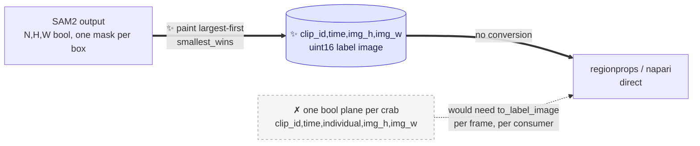
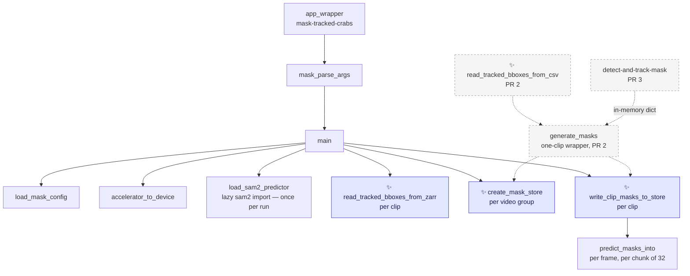

# Proposal for the `mask-tracked-crabs` entry point

Part of [`plan-masking-crabs.md`](plan-masking-crabs.md). This document covers **PR 1**, the first of
the three; [`proposal-mask-tracked-crabs-from-csv.md`](proposal-mask-tracked-crabs-from-csv.md)
covers PR 2 and [`proposal-detect-and-track-mask.md`](proposal-detect-and-track-mask.md) covers PR 3.

## Description

A new CLI entry point, `mask-tracked-crabs`, that prompts SAM2 with **boxes someone already
computed** and exist as a zarr store, and writes a zarr store that follows the structure of the
input zarr as much as possible, holding **one label image per frame**: a single integer array in
which each crab's pixels carry that crab's own value.

It needs no trained detector model and no detector pass.


* Arrows point from an input to the step that consumes it.
* Dashed arrows are read-side, or land in a later PR — not part of this run.
* ✨ marks what is new here. The grey node is
  [**PR 2**](proposal-mask-tracked-crabs-from-csv.md), which widens the dispatch; everything else is
  this PR.

**The store mirrors the trajectories datatree** that
[`create-zarr-dataset`](../crabs/zarr/create_dataset.py) writes — one zarr group per video, holding
an xarray dataset whose `clip_id`, `time` and `individual` coordinates are the same ones the
trajectories store uses. Masks and trajectories for the same clips then align 1:1 with no
reindexing. See [§5](#5-output-format-a-label-image-mirroring-the-trajectories-datatree).

> [!NOTE]
> Nomenclature
>
> - **Prompt** — a hint telling SAM2 *which* object to segment. Here, one bounding box in
>   `[x1, y1, x2, y2]` pixel coordinates per tracked crab.
> - **Label image** — a 2-D **integer** array where `0` is background and every other value
>   identifies one object. This is the array `skimage.measure.regionprops` and
>   `napari.add_labels` take, and it is exactly what this store holds, one per frame.
> - **Occlusion policy** — the rule deciding which crab keeps a pixel where two masks overlap.
>   Applied once, by the writer; see [§5a](#5a-the-occlusion-policy-and-what-it-costs).
> - **Trajectories store** — the zarr store `create-zarr-dataset` writes: a `movement` bboxes
>   dataset per video, with a `clip_id` dimension. Boxes, not pixels.

---

## References

- [`plan-masking-crabs.md`](plan-masking-crabs.md) — the umbrella plan, and where the three PRs and
  the decisions common to them are listed.
- [`proposal-mask-tracked-crabs-from-csv.md`](proposal-mask-tracked-crabs-from-csv.md) — **PR 2**,
  which widens this entry point's `--boxes` to a `<clip>_tracks.csv` and adds the one-clip
  `generate_masks` wrapper over the pass this PR ships. Everything here is written so that PR is ~60
  lines, and the places it will touch are marked.
- [`proposal-detect-and-track-mask.md`](proposal-detect-and-track-mask.md) — **PR 3**, which adds a
  second entry point running detection, tracking and masking in one command. Built entirely on the
  masking pass this PR ships, through PR 2's wrapper.
- [`crabs/zarr/create_dataset.py`](../crabs/zarr/create_dataset.py) — the trajectories store this
  reads from and whose shape the output mirrors.
- [PR #291](https://github.com/SainsburyWellcomeCentre/crabs-exploration/pull/291) — made the
  trajectories `time` axis dense and clip-anchored. It is the reason PR 1 is implementable now; see
  [§3](#3-reading-boxes-from-a-trajectories-store).
- [`scripts/generate_masks_from_bboxes.py`](../scripts/generate_masks_from_bboxes.py) — the existing
  standalone SAM2 script this entry point supersedes for tracked boxes.

---

## Overview of steps

1. Add `crabs/tracker/mask_video.py`:
    - `create_mask_store`,
    - `write_clip_masks_to_store`,
   - `predict_masks_into`,
   - `load_sam2_predictor`,
   - `load_mask_config`,
   - `accelerator_to_device`,
   - the parser and
   - the entry point.
3. Add `read_tracked_bboxes_from_zarr` to a new `crabs/tracker/utils/boxes_from_zarr.py`.
4. Add `crabs/tracker/config/mask_config.yaml`: the three SAM2 and store knobs.
5. Declare the dependencies in [`pyproject.toml`](../pyproject.toml): the `mask-tracked-crabs`
   script, `zarr>=3`, `xarray`, and an opt-in `masks` dependency group for SAM2.
6. Add a pooch fixture: a small trajectories store plus the clip `.mp4`s it names.
7. Add unit tests that run without SAM2 installed, and one opt-in integration test.
8. Document the entry point, the install, and the store layout.

---

## Key aspects of suggested implementation

### 1. One entry point, one `--boxes` argument

Masking from a trajectories store and masking from a tracks csv are **the same operation** — prompt
SAM2 with boxes someone already computed, write the same store. They differ only in a reader. So
they are one command, and the source is one argument whose **suffix** selects the reader:

```bash
mask-tracked-crabs --boxes CrabTracks-slurm3012633.zarr --videos /path/to/clips/   # this PR
mask-tracked-crabs --boxes tracking_output/<clip>_tracks.csv --videos <clip>.mp4   # PR 2
```

The second line is [PR 2](proposal-mask-tracked-crabs-from-csv.md). It is here because the argument
has to be designed for both from the start, not because this PR implements it.

**Why not two commands.** The two would share every argument but one, produce the same store, and
need a cross-referencing `epilog` in each `--help` so that someone holding one kind of input
discovers the other command exists. That is a signpost standing in for a seam that should not have
been cut there.

**Why not a mutually-exclusive `--zarr_store` / `--tracks_csv` pair.** It needs argparse's
`add_mutually_exclusive_group` *plus* hand-written validation for the arguments that depend on each
(`--match` requires the store), and `--help` lists options inert in half its uses. Dispatching on
the suffix needs neither: there is one argument, and it is always required.

**What it costs: one conditionally-inert argument.** `--match` applies only to a store. Passing it
with a `.csv` is an error with a message saying so, not a silent no-op. Against that, the
alternative the sibling proposal rejected for `detect-and-track-mask` had **seven** inert arguments
— the difference in degree is the whole argument.

**This PR does not accept `.csv` at all** — not a stub, not a "not yet supported" branch. It accepts
`.zarr` and rejects anything else by suffix; [PR 2](proposal-mask-tracked-crabs-from-csv.md) widens
the accepted set and adds the reader. No dead code at any point, and `--help` never advertises
something that does not work.

**Naming.** `mask-tracked-crabs` follows the repo's verb-first convention
(`detect-and-track-video`, `extract-frames`, `train-detector`, `create-zarr-dataset`). It is not
`mask-tracked-video` — it masks many clips across many videos — and not `mask-tracked-clips`, since
one of its inputs is a single clip.

### 2. The masking pass: two functions, because the store holds many clips

SAM2 runs over one clip's video file at a time, but a store holds a whole video's clips. So the pass
splits where that boundary is:

```python
# crabs/tracker/mask_video.py                                                     ✨ new
def create_mask_store(store_path, video_id, clip_ids, n_frames, individuals,
                      image_shape, metadata_dict, shard_n_frames, codec,
                      zarr_mode_group) -> zarr.Array:
    """Write the xarray template for one video group; return its raw `labels` array.

    Also writes `label_of`, the individual -> pixel value mapping.  [§5]
    """


def write_clip_masks_to_store(video_path, tracked_bboxes_dict, labels_array, clip_index,
                              label_of, predictor, max_prompts_per_batch,
                              shard_n_frames) -> int:
    """One video pass. SAM2 per frame, painted into one label image per frame,
    buffered a shard at a time and written whole.  [§5a, §6]
    """
```

This shape is the whole reason there is no class here.

- **This PR calls `create_mask_store` once per video group and `write_clip_masks_to_store` once per
  clip**, with a single SAM2 predictor loaded once for the whole run. The predictor is the expensive
  object; it is the caller's, not the pass's.
- **[PR 2](proposal-mask-tracked-crabs-from-csv.md) calls both with a single clip** — one `clip_id`,
  one `write_clip_masks_to_store`. It adds a thin `generate_masks` wrapper over the two, for the
  one-clip case.
- **PR 3 calls that same wrapper**, with the dict built from a `Tracking` run in memory.

**The split is load-bearing from the first commit.** This PR's own loop is the multi-clip caller, so
there is no speculative generality here: if the store held one clip, the pass would be one function.

**A `TrackingAndMasking(Tracking)` subclass could not work.** `Tracking.__init__` loads a checkpoint
eagerly ([track_video.py:48-86](../crabs/tracker/track_video.py#L48-L86)) and `prep_outputs` creates
a new timestamped output directory ([track_video.py:93-132](../crabs/tracker/track_video.py#L93-L132)).
This entry point has no checkpoint, so the subclass could only be constructed by bypassing its own
parent's `__init__`.

### 3. Reading boxes from a trajectories store

The reader turns one clip of one video group into the `tracked_bboxes_dict` contract
([§4](#4-the-tracked_bboxes_dict-contract)):

```python
# crabs/tracker/utils/boxes_from_zarr.py                                          ✨ new
def read_tracked_bboxes_from_zarr(ds_video, clip_id) -> tuple[dict, list[str]]:
    """One clip of a trajectories store -> (tracked_bboxes_dict, individual labels).

    Takes the already-open video dataset rather than a path, so the loop opens
    the datatree once for the whole run.
    """
    ds = ds_video.sel(clip_id=clip_id)
    n_clip_frames = int(ds.clip_last_frame_0idx - ds.clip_first_frame_0idx) + 1

    _validate_store_is_post_291(ds, n_clip_frames, clip_id)      # below

    ds = ds.isel(time=slice(0, n_clip_frames))
    ds = ds.dropna(dim="individual", how="all")      # this clip's individuals only

    xy, wh = ds.position.values, ds.shape.values                  # (t, 2, m) float32
    corners = np.concatenate([xy - wh / 2, xy + wh / 2], axis=1)  # (t, 4, m)

    individuals = [str(v) for v in ds.individual.values]
    boxes = {}
    for i, t in enumerate(ds.time.values):
        present = ~np.isnan(corners[i, 0])
        if present.any():
            boxes[int(t)] = {
                "tracked_boxes": corners[i][:, present].T.astype(np.float64),
                "ids": np.array(individuals, dtype=object)[present],
            }
    return boxes, individuals
```

Four things the trajectories store does differently from a tracks csv, and what each costs:

#### 3a. Frame indices: settled by PR #291, guarded anyway

Before [#291](https://github.com/SainsburyWellcomeCentre/crabs-exploration/pull/291), a VIA tracks
file held no rows for a frame with no boxes, `from_via_tracks_file` dropped that frame, and the
survivors were renumbered `0, 1, 2, …` — so row *p* held clip frame `frames[p]`, at or later than
*p*. Masking the wrong frames is the worst possible failure for this feature.

**#291 fixed it at the source.** `load_extended_ds` now reads the real frame numbers and reindexes
onto the clip's full span:

```python
ds = load_bboxes.from_via_tracks_file(via_tracks_file_path, use_frame_numbers_from_file=True)
_validate_frames_in_clip_range(...)                  # create_dataset.py:154
ds = ds.reindex(time=np.arange(n_clip_frames))       # create_dataset.py:106
```

So in a post-291 store the `time` axis is **dense and clip-anchored**, row *p* is clip frame *p*, and
a frame with no boxes is a real row of NaNs. The reader takes indices from `ds.time.values` anyway —
it costs nothing and does not depend on the reindex staying.

**The guard that remains is a provenance check**, not a length computation: an older store is short
along `time`, and `escape_state` is written densely per clip
([create_dataset.py:120](../crabs/zarr/create_dataset.py#L120)), so its finite count is the clip's
true stored length.

```python
def _validate_store_is_post_291(ds, n_clip_frames, clip_id):
    n_stored = int(np.isfinite(ds.escape_state.values).sum())
    if n_stored != n_clip_frames:
        raise ValueError(
            f"{clip_id}: {n_stored} of {n_clip_frames} frames stored. This store "
            f"predates PR #291 and its time axis is not clip-anchored; rebuild it "
            f"with create-zarr-dataset before masking."
        )
```

> [!IMPORTANT]
> **It must count finite `escape_state` rows, not compare `ds.sizes["time"]`.** After
> `xr.concat(..., join="outer")` ([create_dataset.py:379](../crabs/zarr/create_dataset.py#L379))
> every clip in a video reports the same `sizes["time"]` — the video's longest — so a length
> comparison never fires. Verified against the real concat call: three clips of 10 / 7 / 4 rows all
> report `sizes["time"] == 10`, with finite `escape_state` counts of 10 / 7 / 4.

[`audit-zarr-time-coordinate.md`](audit-zarr-time-coordinate.md) is what this guard is checking for,
and is worth running over any pre-291 store still in use.

#### 3b. Clip-local frames are not a problem, because clips have their own videos

`extract-loop-clips` ([scripts/extract_loop_clips.py](../scripts/extract_loop_clips.py)) writes one
`.mp4` per row of the metadata csv, named `<video_id>-<clip_id>.mp4`. Those are the files the
store's clip-local `time` axis refers to, so **the clip `.mp4` is the video
`write_clip_masks_to_store` reads** and `clip_first_frame_0idx` never has to be applied. This is also
why the output store is grouped by video and indexed by clip: it is the shape the input already has.

The entry point derives `<videos>/<video_id>-<clip_id>.mp4` and fails naming the path if it is
missing. That is a *format* rule, not a parse — PR 1 never has to take a filename apart, which is
why it touches no existing Python at all.

#### 3c. IDs are per-clip renumbered strings

`_renumber_individuals` ([create_dataset.py:251-259](../crabs/zarr/create_dataset.py#L251-L259))
runs **once per clip**, inside the list comprehension at
[:380](../crabs/zarr/create_dataset.py#L380), so every clip is renumbered from `id_0000`. The
explicit `individual` coordinate ([§5](#5-output-format-a-label-image-mirroring-the-trajectories-datatree))
carries them through unchanged — no mapping, no offset arithmetic, and the mask store's coordinate
is *identical* to the trajectories store's, which is what makes the two align.

> [!WARNING]
> **`individual` labels mean "the *i*-th individual of this clip", not a crab.** `id_0003` in
> `Loop00` and `id_0003` in `Loop09` are **different crabs**. Verified against the real concat call:
> because every clip is renumbered from zero, the outer join's union along `individual` is just
> `id_0000 … id_{max nᵢ − 1}`, and a clip with fewer individuals than the video's maximum is
> NaN-padded at the **end** — so `dropna(dim="individual", how="all")` above is exactly
> `isel(individual=slice(0, nᵢ))`.
>
> This is a property of the trajectories store, not one this PR introduces. Mirroring it exactly is
> better than inventing a second, differently-wrong convention — and it is why every read selects a
> `clip_id` before selecting an `individual`.

#### 3d. Boxes are centroid + size

`movement` stores `position` (the centroid) and `shape`, so corners are `position ± shape / 2` —
three lines. The values are **float32** (`load_bboxes` allocates `position_array` as float32,
checked on movement 0.17.0), so this path has no float64 round-trip guarantee. Irrelevant for a SAM2
prompt, but it means the bit-exactness argument in
[PR 2 §3](proposal-mask-tracked-crabs-from-csv.md) is about the csv path only.

### 4. The `tracked_bboxes_dict` contract

`write_clip_masks_to_store` reads a mapping of frame index to
`{"tracked_boxes": (n, 4) float, "ids": (n,) labels}`, and must tolerate all three producers:

```python
FOR EACH frame_idx IN 0 .. total_n_frames - 1:
    frame_data = tracked_bboxes_dict.get(frame_idx)        # .get, never [...]
    IF frame_data is None or len(frame_data["tracked_boxes"]) == 0:
        skip                                               # leave the planes at fill_value
```

- **Keys may be sparse or dense.** The zarr and csv readers emit no key for a frame with no boxes;
  `core_detection_and_tracking` emits a key for *every* frame
  ([track_video.py:264-269](../crabs/tracker/track_video.py#L264-L269)), some with zero boxes.
  `.get(frame_idx)` plus the length check covers both.
- **Values may carry extra keys.** The tracker's dict has a `"scores"` key
  ([track_video.py:267](../crabs/tracker/track_video.py#L267)). `write_clip_masks_to_store` never
  reads it and never validates the key set.
- **`len(tracked_bboxes_dict)` is not `total_n_frames`.** The frame count comes from the video, via
  `get_video_parameters` ([io.py:21](../crabs/tracker/utils/io.py#L21)), so all three producers
  yield the same `T`.
- **`ids` are labels, not necessarily numbers.** `id_0003` from a store, `"7"` from a csv or the
  tracker. They are looked up against the `individual` coordinate, never arithmetic
  ([§6](#6-chunking-sharding-and-the-frame-at-a-time-write)).
- **An empty dict must not raise** inside the pass. The entry point skips a clip with no boxes at
  all, naming it, rather than creating a zero-length `individual` axis.

#### 4a. The csv producer is designed for, not implemented here

[PR 2](proposal-mask-tracked-crabs-from-csv.md) adds `read_tracked_bboxes_from_csv`, the third
producer of this contract. Two of its properties are worth knowing while reading the contract above,
because they are what the `.get`-and-length-check shape exists for:

- **its dict is sparse and carries no `"scores"` key**, where the tracker's is dense and does — the
  two extremes the pass has to tolerate;
- **its `ids` are bare SORT numbers as strings** — `"1"`, `"7"`, `"12"` — sorted numerically, which
  is the coordinate shape that makes `np.searchsorted` wrong
  ([§6](#6-chunking-sharding-and-the-frame-at-a-time-write)).

What the CSV round trip preserves and loses, and where that path's `video_id` / `clip_id` come from,
are in [PR 2 §3 and §4](proposal-mask-tracked-crabs-from-csv.md).

### 5. Output format: a label image, mirroring the trajectories datatree

```
<output_dir>/<name>_masks_<timestamp>.zarr/     # one zarr store
└── <video_id>/                                 # one group per video, as create_dataset writes
    ├── labels    (clip_id, time, img_h, img_w)  uint16   # 0 = background
    ├── label_of  (individual,)                  uint16   # this crab's pixel value
    ├── clip_id     <U   e.g. ["Loop00", "Loop05"]
    └── individual  <U   e.g. ["id_0000", …]  — copied from the trajectories store
```

**One integer per pixel**, naming which crab owns it. The `clip_id`, `time` and `individual`
coordinates are the trajectories store's own, so the two stores align 1:1 with no reindexing.

Everything a reader does, with **no arithmetic anywhere**:

```python
import xarray as xr

ds = xr.open_datatree("<name>_masks_<timestamp>.zarr", engine="zarr", chunks={})["<video_id>"]

v = int(ds.label_of.sel(individual="id_0003"))         # this crab's pixel value
mask = ds.labels.sel(clip_id="Loop05") == v            # (time, img_h, img_w) bool
frame = ds.labels.sel(clip_id="Loop05").isel(time=t)   # (img_h, img_w) — straight into regionprops
```

- **`label_of` is what keeps the mapping explicit.** The writer happens to assign
  `label_of[i] = i + 1`, but **no reader is ever told that** — the offset is an implementation
  detail, and [PR 2](proposal-mask-tracked-crabs-from-csv.md) sets `label_of` to the SORT IDs
  directly, which are not contiguous. The inverse, for decoding `regionprops` output, is two lines
  built once:

    ```python
    inv = np.empty(int(ds.label_of.max()) + 1, dtype=int)
    inv[ds.label_of.values] = np.arange(ds.sizes["individual"])
    ds.individual.values[inv[[p.label for p in props]]]     # -> ['id_0002', 'id_0000', …]
    ```

- **`.attrs["id_source"]` says whose IDs these are:**

    | boxes from | `individual` values | `id_source` |
    |---|---|---|
    | a trajectories store (this PR) | `"id_0000"`, `"id_0001"`, … — copied from `ds_video.individual` | `trajectories_store_individual` |
    | a `<clip>_tracks.csv` ([PR 2](proposal-mask-tracked-crabs-from-csv.md)) | `"1"`, `"7"`, `"12"` — the SORT IDs actually emitted, as strings | `sort_track_id` |
    | a `Tracking` run (PR 3) | the same | `sort_track_id` |

- **It opens in napari and feeds `regionprops` with no reconstruction step.**
  `viewer.add_labels(ds.labels)` gives sliders over clip and time; `regionprops(ds.labels[c, t].values)`
  returns `orientation`, `area` and the rest per crab. Those were the two things the format had to
  deliver, and a label image is exactly their native input.

- **`uint16`, which covers the real data with room to spare.** The largest video group in
  `CrabTracks-slurm3644250.zarr` has **M = 8,082** individuals, against uint16's ceiling of 65,535.
  Background is `0`, so `label_of` starts at 1.

- **It is lossy on overlap, and that is the deliberate trade.** A label image holds one ID per pixel,
  so where two masks meet, one crab takes the pixel and the other loses it.
  See [§5a](#5a-the-occlusion-policy-and-what-it-costs).

- **Everything is per video group**, and must stay that way. The `individual` names are **not**
  comparable across videos, and not even across clips — measured in
  [§3c](#3c-ids-are-per-clip-renumbered-strings). Nor is their *format* the same: two of the 27
  videos have M < 1000 and so use three digits (`id_000`), the other twenty-five use four
  (`id_0000`), because `create_dataset` derives the padding from each video's own M. **Never
  reconstruct a name with a format string** — read `ds.individual`.

- **The store name is timestamped**, `<name>_masks_<YYYYMMDD_HHMMSS>.zarr`, which is what both
  existing SAM2/SAM3 mask scripts already do — the latter documented as *"timestamped so runs don't
  collide"* ([scripts/burrows/README.md](../scripts/burrows/README.md)). It is what makes re-masking
  with a different SAM2 model safe, which is half the point of this entry point. The cost is that
  readers glob for the store instead of naming it.

**Metadata in `.attrs` on each video group:**

```python
{
    "timestamp": ..., "sam2_model": ..., "device": ...,
    "source_video": [...],                       # one clip .mp4 per clip_id entry, in order
    "boxes_file": str(boxes_path),               # the store or csv these IDs refer to
    "boxes_source": "trajectories_zarr",         # or "tracks_csv" (PR 2), "tracker" (PR 3)
    # ^ the other two values are written by the later PRs; the key ships here
    "id_source": "trajectories_store_individual",# or "sort_track_id"
    "image_shape": [H, W],
    "background_label": 0,
    "occlusion_policy": "smallest_wins",         # [§5a]
    "prompt_type": "bounding_box",
    "prompt_source": "tracked_boxes",
    "multimask_output": False,
}
```

`source_video` is a **list**, mirroring the trajectories store's own list-valued `source_file` attr
([create_dataset.py:324-327](../crabs/zarr/create_dataset.py#L324-L327)), so one clip video per
`clip_id` fits without the key changing type between PRs.

There is deliberately **no `mask_encoding`**. An earlier draft carried one, to say "label image"
rather than "one boolean plane per crab" — but `labels.dims` and `labels.dtype` already say that, and
a declaration that merely restates the data is the thing that goes stale. That is precisely the
defect in [`generate_masks_from_bboxes.py`](../scripts/generate_masks_from_bboxes.py), which opens
its store as `dtype="bool"` while declaring `"mask_encoding": "instance_id"` and writing `int16` into
it (see [`proposal-mask-zarr-dtype.md`](proposal-mask-zarr-dtype.md)): the attribute could not guard
against the mismatch, because the attribute *was* the mismatch.

**What is kept is what the data cannot say for itself** — `boxes_source`, `boxes_file`,
`source_video`, `id_source`, `occlusion_policy`, and the SAM2 provenance. `prompt_type` and
`prompt_source` never vary today, and are kept anyway so that a store prompted some other way (a
point, a mask, an untracked detection) is distinguishable from this one without guessing.

There is also deliberately **no `track_id_offset`** — `label_of` is the mapping — and no `n_frames`,
`n_track_ids` or `dims`, which the coordinates carry.

#### 5a. The occlusion policy, and what it costs

**Measured first.** Box overlap across 27,458 crab-instances sampled from all 27 videos — and since a
crab fills only ~π/4 of its box, mask overlap is strictly lower than this:

| | |
|---|---|
| crabs whose box overlaps **no** other box | **94.0%** |
| total box area that is contested | **0.62%** (a ceiling for masks) |
| crabs losing >10% of their box | 3.2% |
| crabs losing >25% | 2.4% |

So overlap is **rare but severe when it happens** — a heavy tail of touching pairs. Losing 0.62% of
pixels to buy napari and `regionprops` directly is a good trade; losing them *silently* would not be,
hence the rest of this section.

**The policy is `smallest_wins`**: masks are painted largest-area first, smallest last, so the
smaller crab keeps the contested pixels. That is the common convention in instance-segmentation
rendering, and the reason is that a large crab losing a few pixels barely moves its fitted ellipse,
whereas a small crab losing pixels to a large neighbour can be gutted. Smallest-wins minimises the
worst *relative* distortion. SAM2's predicted-IoU score is the other plausible precedence and is
worth comparing once there are real masks — *Points to discuss* [#3](#points-to-discuss).

> [!IMPORTANT]
> **The lost pixels are not recoverable from the store.** An earlier draft carried an `n_px_lost`
> array recording, per crab per frame, how many pixels it lost — deliberately dropped for simplicity.
> Nothing downstream can now distinguish a clean mask from a remnant, and recovering that would mean
> re-running SAM2.
>
> **On read, occluded crabs are found by adjacency**: if two labelled regions touch in `labels`, they
> were plausibly overlapping. That over-flags (touching ≠ overlapping) but needs no extra storage,
> and it is what the README tells a reader to do. The mask area can also be compared against the
> tracked box area from the trajectories store, which is already aligned.

The policy name is written into `.attrs["occlusion_policy"]` so a store records which one produced
it, and so a future store written under a different policy is distinguishable from this one.

### 6. Chunking, sharding, and the frame-at-a-time write

**`chunks=(1, 1, H, W)` — one chunk is one frame.** That is the unit both access patterns want:
napari dragging the time slider, and the `regionprops` sweep. A frame is 4096×2160 uint16 =
**17.7 MB raw**, ~26 KB compressed.

**Bigger chunks are pure loss here**, which was measured rather than assumed:

| chunk | on disk | compression | read one frame |
|---|---|---|---|
| **1 frame** | 13.2 KB/frame | 315× | **3.7 ms** |
| 8 frames | 13.1 KB/frame | 315× | 6.9 ms |
| 32 frames | 13.2 KB/frame | 315× | **21.0 ms** |

*(measured at 1920×1080 for speed; the ratios are what matter)*

**Identical compression, 5.7× slower reads.** A label frame is ~96% zeros and the compressor already
exploits that *within* one frame; zarr compresses each chunk independently and does not delta-encode
along time, so grouping frames adds no exploitable redundancy — just more bytes to decompress when
you want one.

> **Chunk size is set by the access pattern. Shard size is set by the filesystem.**
>
> Before zarr 3 these fought each other, so you compromised on both. Sharding decouples them. Never
> inflate a chunk to fix a file-count problem — that is the shard's job now.

#### How sharding works, and why reads and writes are asymmetric

A **shard** is one file holding many chunks, plus an index at the end giving each chunk's byte offset
and length. Measured on a real sharded array (16 planes, 8 per shard, ~18 KB per shard file):

| operation | reads | bytes read | writes | bytes written |
|---|---|---|---|---|
| **read one chunk** | 2, **both ranged** | **2.0 KB** | – | – |
| read the whole shard | 1, unranged | 17.6 KB | – | – |
| **write a whole shard at once** | **0** | **0 KB** | 1 | 17.6 KB |
| **write one chunk into an existing shard** | 1, **unranged** | **17.6 KB** | 1 | **17.6 KB** |

**Reads stay granular**: ranged-read the index, ranged-read that chunk's bytes, decompress only it —
2.0 KB of a 17.6 KB file. Works on a local filesystem (`seek`) and over S3/HTTP (`Range:`) alike. So
sharding costs nothing on the read side.

**Writes cannot do the equivalent.** Chunks are compressed, so replacing one shifts every later
byte offset and invalidates the index; inserting bytes mid-file means moving everything after them.
So zarr reads the shard, splices, recomputes offsets and rewrites it whole — visible in the last row
above, and the source of the **×58.6 write amplification** measured when filling a 128-chunk shard
one chunk at a time.

#### Which is why one frame per chunk matters

**A frame's write is exactly one chunk, contiguous.** So the writer buffers one shard's worth of
frames and writes them in a single assignment — zarr never sees a partial shard, and there is no
read-modify-write at all:

```python
buf[k] = label_frame                          # (shard_n_frames, H, W) uint16, filled in order
...
labels_array[clip_index, t0:t0 + shard_n_frames] = buf      # one whole-shard write
```

**`shards=(1, 32, H, W)` — 32 frames per file.** The constraint is the write buffer, not the file
count:

| shard | write buffer (4K) | file size | files, whole store |
|---|---|---|---|
| **32 frames** | **566 MB** | **~0.85 MB** | **~155,000** |
| 64 frames | 1.13 GB | ~1.7 MB | ~77,000 |
| 128 frames | 2.27 GB | ~3.4 MB | ~39,000 |

155,000 files across 234 clips is ~660 per clip — nothing for GPFS — so 32 is the default and
`shard_n_frames` is a config knob ([§8](#8-configuration-a-separate-mask-config-file)) for a cluster
that prefers fewer, larger files. A larger shard also means more work lost if a job dies mid-shard.

**Both chunks and shards are set through xarray's `encoding`**, because the array has to carry
xarray's dimension metadata to be readable as a dataset. Verified end to end on xarray 2026.7.0 /
zarr 3.4.0 — template write, sharded region write, read-back with coordinates intact:

```python
enc = {"labels": {"chunks": (1, 1, H, W),
                  "shards": (1, shard_n_frames, H, W),
                  "compressors": [BloscCodec(cname="zstd", clevel=9, shuffle="bitshuffle")]}}
ds.to_zarr(store_path, group=video_id, compute=False, encoding=enc)   # metadata only, no data
labels_array = zarr.open_group(store_path)[f"{video_id}/labels"]      # fill this, shard by shard
```

**`compute=False` is what makes a two-pass temp store unnecessary.** `create-zarr-dataset` needs one
([create_dataset.py:261-333](../crabs/zarr/create_dataset.py#L261-L333)) because it cannot know a
video's concatenated shape without holding every clip dataset in memory. The mask store has no such
problem: every dimension is known from the trajectories store and the video headers before SAM2
runs, so the template is written once and each clip fills its own region.

#### The codec

**`blosc-zstd level 9 + bitshuffle`**, measured on realistic 4K label frames with ragged mask
boundaries:

| codec | KB/frame | whole store |
|---|---|---|
| default (zstd level 0) | 30.4 | 151 GB |
| zstd level 9 | 26.8 | 133 GB |
| **blosc-zstd 9 + bitshuffle** | **26.5** | **131 GB** |
| blosc-zstd 5 + *byte* shuffle | 41.0 | 203 GB ❌ |

Byte shuffle is actively worse — don't use it. The ~13% win costs only write CPU, which is
negligible beside SAM2.

> [!IMPORTANT]
> **`label_of` takes a different codec.** It is tiny, and the same measurement run showed bitshuffle
> *hurting* on a mostly-zero integer array (70× vs 96× for plain zstd). Codec per array, not per
> store.

### 7. Flattening happens on write, and the read side needs no helper

`regionprops` and `napari.add_labels` both take an `(H, W)` **integer label image**, and that is now
exactly what the store holds ([§5](#5-output-format-a-label-image-mirroring-the-trajectories-datatree)).
So there is no conversion step on read at all:

```python
regionprops(ds.labels.sel(clip_id="Loop05").isel(time=t).values)   # that is the whole read path
viewer.add_labels(ds.labels)                                       # sliders over clip and time
```

**The flattening happens once, in the writer**, where SAM2's per-prompt masks are painted into one
frame under the `smallest_wins` policy ([§5a](#5a-the-occlusion-policy-and-what-it-costs)).



The grey node is the design not taken — one boolean plane per crab, overlaps intact, flattened by a
`to_label_image` helper on every read. It was rejected on measurement, not taste: at the real
`M` of 791–8,082 it needs a 1.6–16.8 GB write buffer, spreads one frame's write across 2–19 shard
files, and produces 54k–979k files per clip. The numbers are in
[*Formats considered and rejected*](#detailed-implementation).

**So `crabs/tracker/utils/masks.py` and `to_label_image` do not exist in this design.** An earlier
draft added both; the label image makes them unnecessary, which is one new module and one helper
fewer to ship, test and document.

`ellipses_from_labels` in
[`notebook_visualise_masks_from_zarr.py`](../notebooks/notebook_visualise_masks_from_zarr.py) takes a
label image, so it consumes `ds.labels[c, t]` unchanged — the same geometry code, with nothing in
between.

**What this costs** is stated plainly in [§5a](#5a-the-occlusion-policy-and-what-it-costs): the
policy is fixed at write time, the pixels a crab lost are gone, and changing the policy means
re-running SAM2. Measured at 0.62% of box area contested, with 94% of crabs untouched.

### 8. Configuration: a separate mask config file

Four knobs, in a file of their own rather than in the tracking config:

```yaml
# crabs/tracker/config/mask_config.yaml   ✨ new file
sam2_model_id: facebook/sam2.1-hiera-base-plus   # matches the existing script's default
max_prompts_per_batch: 32                        # see Gotchas
shard_n_frames: 32                               # see §6; null disables sharding
occlusion_policy: smallest_wins                  # see §5a
```

`shard_n_frames` is the one to tune per filesystem: it sets both the write buffer
(`shard_n_frames × 17.7 MB` at 4K) and the file count. `occlusion_policy` is a knob rather than a
constant so that a second policy can be compared without a format change — its value is copied into
`.attrs` so a store always records which one produced it.

**Why not a `masks:` block in `tracking_config.yaml`.** `mask-tracked-crabs` never reads the tracking
config at all — it has no `--config_file` and no SORT parameters to load, so the SAM2 knobs cannot
live in a file it does not open. That alone settles it. Beyond that,
[`tracking_config.yaml`](../crabs/tracker/config/tracking_config.yaml) is four flat SORT scalars and
a `masks:` block would be the first nested structure in it; the two have unrelated tuning lifecycles;
and the integration test fetches its `tracking_config.yaml` from the pooch/GIN registry, which has no
`masks:` key, so a merged block would need defensive defaulting.

**Read the file verbatim, and default at the point of use.** `load_mask_config` is
`yaml.safe_load(f)` and nothing else, matching `load_config_yaml`
([track_video.py:88-91](../crabs/tracker/track_video.py#L88-L91)). Each knob is then read as
`mask_config.get(key, default)` at the one place it is used — the idiom `train_model` already uses
for its one optional section.

- **A user's own config need only name the keys it changes.** Comparing `-tiny` against `-base-plus`
  is a one-key file.
- **No merge layer and no `MASK_DEFAULTS` dict**, so there is no second place where a key can exist
  but the shipped YAML not mention it.
- **An empty or malformed config raises**, exactly as it does for the tracking and training entry
  points today. Guarding that here and nowhere else in the package was the divergence not worth
  having.
- **The defaults are written twice**, in the YAML and at each access site. Test [10](#tests) pins the
  two against each other so they cannot drift.

### 9. The argument parser

```python
# crabs/tracker/mask_video.py                                                ✨ new
def mask_parse_args(args):
    """Parse arguments for mask-tracked-crabs."""
    parser = argparse.ArgumentParser(
        formatter_class=argparse.RawDescriptionHelpFormatter,
        epilog=(
            "To run detection, tracking and masking in one command, "
            "use detect-and-track-mask."
        ),
    )
    parser.add_argument(
        "--boxes", type=str, required=True,
        help=(
            "Location of the tracked boxes to prompt SAM2 with: a trajectories "
            "zarr store written by create-zarr-dataset. "        # PR 2 widens this
            "The suffix selects how it is read."                 # string; see its §7
        ),
    )
    parser.add_argument(
        "--videos", type=str, required=True,
        help=(
            "Directory holding the clip videos the boxes refer to, named "
            "<video-id>-<clip-id>.mp4."                          # PR 2 adds the single-file form
        ),
    )
    parser.add_argument(
        "--output_dir", type=str, default="mask_output",
        help=(
            "Directory the mask store is written into. The store name carries a "
            "timestamp, so runs do not collide. Default: mask_output."
        ),
    )
    parser.add_argument(
        "--match", type=str, default="*",
        help=(
            "Glob selecting which video groups of the store to mask, e.g. "
            "'07.09.2023*'. Only valid with a zarr store. Default: all."
        ),
    )
    parser.add_argument("--mask_config_file", type=str, default=DEFAULT_MASK_CONFIG, ...)
    parser.add_argument("--accelerator", type=str, default="gpu", ...)
    return parser.parse_args(args)
```

**`--match` matches video groups, not clips.** `dt.match()` matches group paths
([notebook:155-163](../notebooks/crabs_dataset/00_notebook_data_structure.py#L155-L163)), so
`--match "07.09.2023*"` selects videos and every clip within them is masked. Filtering *clips* by
metadata — `clip_escape_type`, say — is *Points to discuss* [#4](#points-to-discuss).

**The `epilog` is the one in-product signpost** between this command and `detect-and-track-mask`, and
`formatter_class=RawDescriptionHelpFormatter` is required rather than cosmetic: checked against
Python 3.12, the default `HelpFormatter` re-wraps the epilog to terminal width and breaks on the
hyphens in the command name, rendering it as `detect-and-` / `track-mask` across two lines —
un-copy-pasteable. The raw formatter leaves the epilog exactly as written and still wraps ordinary
argument help normally.

**This PR also takes `--zarr_mode_store` and `--zarr_mode_group`**, matching `create-zarr-dataset`'s own
([create_dataset.py:442-533](../crabs/zarr/create_dataset.py#L442-L533)), so a SLURM array with one
job per video can append groups to a shared store. That is the same array shape
`create-zarr-dataset` already documents, and one video per job is the natural unit here too.

---

## Detailed implementation



Arrows point from a caller to what it calls. Solid nodes are this PR; dashed are
[PR 2](proposal-mask-tracked-crabs-from-csv.md) and
[PR 3](proposal-detect-and-track-mask.md), shown so the seams they attach to are visible.

### The changes

| # | Change | Signature / notes |
|---|---|---|
| 1 | **new** `crabs/tracker/mask_video.py` — the pass and the entry point, ~250 lines | see below |
| 3 | **new** `crabs/tracker/utils/boxes_from_zarr.py` — the reader, ~40 lines | `read_tracked_bboxes_from_zarr` ([§3](#3-reading-boxes-from-a-trajectories-store)) |
| 4 | **new** `crabs/tracker/config/mask_config.yaml` | the three knobs ([§8](#8-configuration-a-separate-mask-config-file)) |
| 5 | [`pyproject.toml`](../pyproject.toml) | `mask-tracked-crabs` script; `zarr>=3`, `xarray`; `[dependency-groups] masks` + `[tool.uv] no-build-isolation-package` |
| 6 | **new** `tests/test_unit/test_mask_video.py` | no `sam2` needed |
| 7 | pooch/GIN registry | a small trajectories store + the clip `.mp4`s it names ([Tests](#tests)) |
| 8 | [`crabs/tracker/README.md`](../crabs/tracker/README.md) + [`guides/DetectAndTrackHPC.md`](../guides/DetectAndTrackHPC.md) | install, run, read back, and the five things in [Documentation updates](#documentation-updates) that the store cannot say for itself |

**Nothing existing is touched.** `create_dataset.py`, `track_video.py`, `sort.py`, `utils/io.py`,
`utils/tracking.py`, the trajectories store format, the CSV format and the detector are all
untouched — this PR only *formats* clip filenames, never parses them
([§3b](#3b-clip-local-frames-are-not-a-problem-because-clips-have-their-own-videos)).
[PR 2](proposal-mask-tracked-crabs-from-csv.md) is the first to touch existing Python, and only to
move two filename helpers.

<details>
<summary><b>1. The new module in full outline</b></summary>

Module-level functions only — no new class. Everything except `load_sam2_predictor`,
`predict_masks_into` and the video loop in `write_clip_masks_to_store` is pure — no `sam2`, no
torch, no I/O beyond zarr and the config file — which is what makes the unit tests possible on CI.

```python
"""Mask tracked crabs in a video with SAM2."""

def mask_parse_args(args):
    """Arguments for mask-tracked-crabs.  [§9]"""


def load_mask_config(path) -> dict:
    """Read the mask config, verbatim — as load_config_yaml does.  [§8]"""
    with open(path) as f:
        return yaml.safe_load(f)


def accelerator_to_device(accelerator):
    """"gpu" -> "cuda", mirroring Tracking.__init__ (track_video.py:79-82).

    Three lines, duplicated rather than refactored out of Tracking, so that
    track_video.py is not touched at all in PR 1.
    """


def create_mask_store(store_path, video_id, clip_ids, n_frames, individuals,
                      image_shape, metadata_dict, shard_n_frames, codec,
                      zarr_mode_group) -> zarr.Array:
    """Write the xarray template for group `video_id`; return its raw zarr array.

    Builds a (clip_id, time, individual, img_h, img_w) bool dataset with the
    three coordinates it is given, writes it with compute=False (metadata, no
    data), and hands back the zarr array for the region writes.  [§5, §6]

    chunks=(1,1,H,W), shards=(1,shard_n_frames,H,W), fill_value=0;
    shard_n_frames=None disables sharding. Also writes `label_of`.  [§5, §6]
    `individuals` is the label list, already ordered by the caller — this
    function never invents IDs, which is what keeps §5's table true.
    """


def load_sam2_predictor(model_id: str, device: str):
    """Import sam2 lazily and return a SAM2ImagePredictor.  [Dependencies]"""
    try:
        from sam2.sam2_image_predictor import SAM2ImagePredictor
    except ImportError as e:
        raise ImportError(
            "mask-tracked-crabs needs SAM2. Install it with:\n"
            "  uv sync --group masks\n"
            "or, in a conda env with torch already installed:\n"
            '  pip install --no-build-isolation "sam-2 @ git+https://github.com/facebookresearch/sam2.git"'
        ) from e
    return SAM2ImagePredictor.from_pretrained(model_id, device=device)


def predict_masks_into(predictor, frame_bgr, boxes, values, label_frame, max_prompts_per_batch):
    """SAM2 on one frame, scattered straight into the caller's (M, H, W) bool buffer.

    `plane_idx` is positions along the `individual` axis, not IDs — the caller
    `values` are the pixel values for these boxes, straight from label_of (§5).

    Paints into `label_frame` rather than returning (N, H, W), so each prompt chunk's
    float masks are released before the next chunk is predicted (Gotchas), and so
    the caller holds exactly one frame-sized buffer for the whole run (§6).
    """
    predictor.set_image(cv2.cvtColor(frame_bgr, cv2.COLOR_BGR2RGB))
    FOR EACH (box_chunk, idx_chunk) OF (boxes, plane_idx), size max_prompts_per_batch:
        masks, _iou, _low_res = predictor.predict(box=box_chunk, multimask_output=False)
        m = masks.reshape(len(box_chunk), *masks.shape[-2:]).astype(bool)
        FOR EACH (mask, value) IN order of DECREASING mask.sum():   # smallest_wins  [§5a]
            label_frame[mask] = value


def write_clip_masks_to_store(video_path, tracked_bboxes_dict, labels_array, clip_index,
                              label_of, predictor, max_prompts_per_batch,
                              shard_n_frames) -> int:
    """One video pass, writing into labels_array[clip_index]. Returns frames read."""
    total_n_frames, H, W = labels_array.shape[1:]
    # individual -> pixel value, as an ordinary dict. KeyError here means the
    # coordinate and the boxes dict disagree — loud, not a silently wrong mask.
    value_of = {name: int(v) for name, v in zip(label_of.individual.values,
                                                label_of.values)}
    input_video_object = open_video(video_path)
    # ONE shard's worth of label frames, allocated once per run  [§6, Gotchas]
    buf = np.zeros((shard_n_frames, H, W), dtype=np.uint16)
    frame_idx = 0
    WHILE input_video_object.isOpened():
        ret, frame = input_video_object.read()
        IF not ret:
            parse_video_frame_reading_error_and_log(frame_idx, total_n_frames)
            break

        k = frame_idx % shard_n_frames
        buf[k] = 0                                   # 0 = background  [§5]

        # .get, not [...]: no key for a frame with no boxes  [§4]
        frame_data = tracked_bboxes_dict.get(frame_idx)
        IF frame_data is not None and len(frame_data["tracked_boxes"]) > 0:
            values = np.array([value_of[str(i)] for i in frame_data["ids"]])
            predict_masks_into(
                predictor, frame, frame_data["tracked_boxes"],
                values, buf[k], max_prompts_per_batch,      # paints in place  [§5a]
            )

        # flush a whole shard at a time: never a partial-shard write  [§6]
        IF k == shard_n_frames - 1:
            t0 = frame_idx - k
            labels_array[clip_index, t0:frame_idx + 1] = buf
        frame_idx += 1

    # the tail: whatever is left of a part-filled shard
    IF frame_idx % shard_n_frames:
        k = frame_idx % shard_n_frames
        labels_array[clip_index, frame_idx - k:frame_idx] = buf[:k]

    input_video_object.release()
    return frame_idx


def main(args):                            # mask-tracked-crabs
    boxes_path = Path(args.boxes)
    IF boxes_path.suffix != ".zarr":       # PR 2 widens this to accept ".csv"  [§1]
        raise ValueError(...)              # names the suffixes it accepts  [§1]
    IF args.match != "*" and boxes_path.suffix != ".zarr":
        raise ValueError("--match only applies to a trajectories zarr store")

    mask_config = load_mask_config(args.mask_config_file)
    sam2_model_id = mask_config.get("sam2_model_id", "facebook/sam2.1-hiera-base-plus")
    max_prompts_per_batch = mask_config.get("max_prompts_per_batch", 32)
    shard_n_frames = mask_config.get("shard_n_frames", 32)
    occlusion_policy = mask_config.get("occlusion_policy", "smallest_wins")

    predictor = load_sam2_predictor(sam2_model_id, accelerator_to_device(args.accelerator))
    timestamp = datetime.now().strftime("%Y%m%d_%H%M%S")
    store_path = Path(args.output_dir) / f"{boxes_path.stem}_masks_{timestamp}.zarr"

    dt = xr.open_datatree(args.boxes, engine="zarr", chunks={})
    FOR EACH video_node IN dt.match(args.match).leaves:
        ds_video = video_node.to_dataset()
        video_id = video_node.name
        clip_ids = [str(c) for c in ds_video.clip_id.values]
        individuals = [str(i) for i in ds_video.individual.values]   # §5: copied, not derived

        # Every shape is known before SAM2 runs  [§6]
        clip_videos = [Path(args.videos) / f"{video_id}-{c}.mp4" for c in clip_ids]
        FOR EACH p IN clip_videos:
            IF not p.exists():
                raise FileNotFoundError(...)      # names the path it looked for
        params = [get_video_parameters(str(p)) for p in clip_videos]   # io.py:21
        H, W = params[0]["frame_height"], params[0]["frame_width"]
        T = max(p["total_frames"] for p in params)

        mask_array = create_mask_store(
            store_path, video_id, clip_ids, T, individuals, (H, W),
            metadata, shard_n_frames, codec, args.zarr_mode_group,
        )

        FOR EACH (i, clip_id) IN enumerate(clip_ids):
            boxes, clip_individuals = read_tracked_bboxes_from_zarr(ds_video, clip_id)
            IF not boxes:
                log(f"{video_id}/{clip_id}: no tracked boxes, skipping")   # §4
                continue
            write_clip_masks_to_store(
                str(clip_videos[i]), boxes, mask_array, i,
                individuals, predictor, max_prompts_per_batch,
            )


def app_wrapper():                         # mask-tracked-crabs
    logging.getLogger().setLevel(logging.INFO)
    torch.set_float32_matmul_precision("medium")
    main(mask_parse_args(sys.argv[1:]))
```

**Note `individuals` is the *video group's* coordinate, not the clip's.** The `individual` axis is
shared across a video's clips, so `create_mask_store` gets the union and
`write_clip_masks_to_store` looks each clip's own labels up in it. The clip-level list
`read_tracked_bboxes_from_zarr` also returns is used by the tests and by
[§7](#7-flattening-happens-on-write-and-the-read-side-needs-no-helper)'s read path; the writer
does not need it.

Frames with no tracked boxes are left at the store's `fill_value=False`, and those chunks are never
written — correct by construction, whether the frame was absent from the dict or present and empty.

Two invariants worth asserting at the end of a run, both cheap: every ID the dict emits is present in
`individuals` (the `plane_of` dict makes this self-enforcing — a missing label raises `KeyError` at
the frame that has it, rather than writing a mask onto the wrong crab), and every populated plane
index is `< M`.

</details>

<details>
<summary><b>2. Module naming</b></summary>

The module is `crabs/tracker/mask_video.py`, beside the existing
[`track_video.py`](../crabs/tracker/track_video.py). PR 3 adds its entry point to the same module,
which is then still correctly named: both entry points mask video, and they share everything under
`generate_masks`.

The alternative is three modules — `masking.py` for the shared pass, plus one thin module per entry
point. Cleaner on paper, and worth taking if `mask_video.py` grows past roughly 300 lines, but more
files than the content justifies. See *Points to discuss* [#2](#points-to-discuss).

</details>

<details>
<summary><b>3. Formats considered and rejected</b></summary>

Four layouts were compared, and the choice was settled by measuring the real store rather than by
argument. Read the shapes as *within one video group and one `clip_id`* — the `clip_id` axis and the
mirroring coordinates ([§5](#5-output-format-a-label-image-mirroring-the-trajectories-datatree)) wrap
whichever pixel layout wins.

| Format | Lossless on overlap | napari / regionprops direct | store | Note |
|---|---|---|---|---|
| **`(T, H, W)` uint16 label image** ✅ chosen | **no** — 0.62% of box area contested | **yes, both** | ~131 GB | one crab loses each contested pixel; measured cost in [§5a](#5a-the-occlusion-policy-and-what-it-costs) |
| `(T, M, H, W)` bool, one plane per crab | yes | no | — | **fails at the real `M`**; see below |
| `(T, K, H, W)` int32 overlap layers | yes | plane 0 only | — | `K`≈2–4; needs a greedy packing pass at write time, and the axis carries no identity |
| bbox-local crops + index table | yes | no (needs reconstruction) | ~150 GB | ~386× smaller per mask, but not viewable without a helper |

**Why not one boolean plane per crab — the design this proposal originally had.** It was rejected on
measurements of `CrabTracks-slurm3644250.zarr`, not on taste. `M` is the `individual` axis size, and
it is **791–8,082** (median 3,326), because it counts distinct track IDs over a whole clip while only
~60 crabs are on screen at once:

| | designed for | measured |
|---|---|---|
| dense write buffer (`M×H×W`, needed whole for a shard-aligned write) | 207 MB | **1.6–16.8 GB** |
| shard files touched per frame write | 1 | **2–19** (the live crabs span 226–2,262 positions) |
| files per clip | ~3,000 | **54,000–979,000** |
| decompressed to read one frame's 60 crabs | — | **186 MB** (vs 0.9 MB for crops, 17.7 MB for the label image) |

Compression does not help with any of those: all-`False` chunks are never written, but the buffer is
uncompressed by construction, the file count follows where the live crabs land, and a chunk is the
minimum *decompression* unit. Spatial chunking would fix the last one, but then you can fix the file
count **or** the write buffer, not both. The label image has no `M` axis, so none of it arises.

**Why not the label image's own losses matter less than they look.** 94.0% of crabs have no box
overlap at all, and box overlap is a ceiling for mask overlap. The tail is heavy — 2.4% lose >25% of
their box — which is why the policy is recorded in `.attrs` and the README says how to find affected
crabs by adjacency ([§5a](#5a-the-occlusion-policy-and-what-it-costs)).

**Why not crops.** The strongest rival: ~386× smaller per mask, and a frame reads in 0.32 MB against
17.7 MB. It loses because it is not a label image — napari cannot open it and `regionprops` cannot
read it without a reconstruction helper, and those two were the requirements. Worth revisiting if the
store turns out larger than *Points to discuss* [#1](#points-to-discuss) expects.

**Why not overlap layers.** Genuinely lossless and compact, but the axis carries no identity, so
every read needs the companion array to say which crab is in which layer — all of the label image's
reconstruction cost with none of its simplicity.


**Why not the label image.** It cannot represent two crabs on one pixel, and the ellipse fits the
orientation work wants would be biased by exactly the neighbours that touch most. Rejected on
losslessness, not size — zarr compresses a label image well enough that size was never deciding.

**Why not overlap layers.** Genuinely close, and better on chunk count and napari. It loses because
the axis carries no identity, so `m.sel(individual=...)` — one crab's whole trajectory in a single
read — is not expressible. That slice is what the orientation work will be built on, and it is also
the axis carrying the IDs, so losing it would cost the 1:1 alignment with the trajectories store.

**Why not crops.** Much the smallest, and the only one that scales to long clips without thought.
Rejected for now because it is ragged, needs a scan to assemble one crab's time series, and cannot be
read without the repo's helpers. Worth revisiting if [#1](#points-to-discuss) comes back badly.

**Why not a coarser chunk than one frame** — the chunk-size question, now that the layout is
settled. Measured in [§6](#6-chunking-sharding-and-the-frame-at-a-time-write): grouping 8 or 32
frames into a chunk gives **identical compression** (13.1–13.2 KB/frame either way) and makes reading
one frame **5.7× slower**, because a label frame is ~96% zeros that the compressor already exploits
within a single frame, and a chunk is the minimum decompression unit. There is nothing to gain and a
frame read to lose, so the chunk stays one frame and the shard carries the file-count job.

</details>

---

## Tests

The unit tests are the substance here, because the format contract is what
[PR 2](proposal-mask-tracked-crabs-from-csv.md), [PR 3](proposal-detect-and-track-mask.md) and every
downstream consumer depend on. Several of them are written against **PR 2's** coordinate shape rather
than this PR's, deliberately — noted where that is so.

**Pure unit — must pass with no `sam2` installed (this is the CI shape).** New file
`tests/test_unit/test_mask_video.py`.

1. **The ID↔axis mapping, the core contract.** With `individual = ["id_0000", "id_0001", "id_0002"]`,
   scatter three masks through the `plane_of` lookup and write `mask_array[c, t] = dense`. Assert,
   **through xarray and by label rather than by position**, that `m.sel(individual="id_0001")` is the
   mask that went in for that label, and that every other plane in the frame is all-`False`.

    **1a. The lookup raises rather than mis-assigns.** A dict whose `ids` contain a label absent from
    `individual` raises `KeyError` naming it. This is the test standing between the format and a
    silently mis-assigned mask.

    **1b. Numerically-sorted string labels resolve correctly.** With `individual` built by
    `sorted(..., key=int)` — `["2", "9", "10"]`, **[PR 2](proposal-mask-tracked-crabs-from-csv.md)'s
    shape, written here on purpose** — masks for IDs `10` and `2` land on planes 2 and 0.
    `np.searchsorted` would put `"10"` on plane 1
    ([§6](#6-chunking-sharding-and-the-frame-at-a-time-write)). The dict lookup this pins is
    shipped by this PR, so the test that guards it ships here too rather than waiting for the PR that
    makes it a live case.
2. **The occlusion policy is applied, and in the stated direction.** Two masks overlapping, the
   smaller one second in prompt order: in the written frame the **smaller** crab owns every contested
   pixel, the larger owns the rest, and neither is erased. Repeat with the prompt order reversed and
   assert the result is identical — the policy must depend on area, not on the order SAM2 happened to
   return things in ([§5a](#5a-the-occlusion-policy-and-what-it-costs)).
3. **Non-overlapping masks are untouched.** Three crabs apart from each other: each region's pixel
   count in `labels` equals its input mask's `sum()` exactly. This is the 94% case
   ([§5a](#5a-the-occlusion-policy-and-what-it-costs)) and it must be lossless.
4. **Round-trip through the consumer.** `regionprops(labels[c, t])` returns exactly the crabs that
   were painted, and `{p.label for p in props}` equals the set of `label_of` values used — so the
   store feeds the analysis with no conversion step
   ([§7](#7-flattening-happens-on-write-and-the-read-side-needs-no-helper)).
5. **A frame with no tracked boxes** stays all-`0` and does not raise.
6. **`create_mask_store`.** `labels` is `(n_clips, T, H, W)` uint16 with `fill_value` 0; chunks are
   `(1,1,H,W)`; shards are `(1,32,H,W)`; `label_of` is `(M,)` uint16 with no zero in it; the
   `clip_id` and `individual` coordinates are exactly what was passed in, **in order**; and
   `.attrs["occlusion_policy"]` matches the config, and `.attrs` carries `boxes_file`,
   `source_video`, `prompt_type` and `prompt_source`. Assert **`mask_encoding` is absent** — it was
   dropped deliberately and re-adding it would restate what `labels.dims` and `labels.dtype` say.

    **6a. `label_of` round-trips, in both directions.** `ds.label_of.sel(individual="id_0003")` gives
    the value that crab's pixels carry in `labels`, and the two-line inverse
    ([§5](#5-output-format-a-label-image-mirroring-the-trajectories-datatree)) maps it back. Assert
    `label_of` has no duplicates and no zeros, since 0 is background — a collision would silently
    merge two crabs.

    **6b. The write path against a *sharded* store.** Build the store through `create_mask_store`
    (so `shards` is set, as in production — *not* a bare `zarr.create_array` with chunks only), write
    `2 × shard_n_frames + 3` frames so that two whole shards **and** a part-filled tail are exercised,
    and round-trip every frame. **Assert the fixture *is* sharded.** Sharding is where writes go
    wrong: a partial-shard write costs a full read-modify-write (measured: one chunk into an existing
    shard reads 17.6 KB and writes 17.6 KB, against 0 read for a whole-shard write), so a test on an
    unsharded fixture would pass while production crawled.

    **6c. The tail of a clip is written.** A clip whose frame count is not a multiple of
    `shard_n_frames` still has its last partial shard flushed — the one line in the writer that is
    easy to drop and would silently lose up to 31 frames per clip.

    **6d. A template write puts no data on disk.** After `create_mask_store` and before any region
    write, the store holds metadata only — no chunk or shard files. One `os.walk`.
7. **Two clips into one store.** `create_mask_store` with **two** `clip_id`s, then
   `write_clip_masks_to_store` once per clip with different box dicts and one predictor shared across
   both. Assert each clip's set of painted label values per frame is its own and neither write
   disturbed the other's shard; that the `individual` coordinate is the union passed in; and that a
   clip shorter than `time` leaves the tail `0` rather than raising.
8. **`read_tracked_bboxes_from_zarr` against a synthetic store.** Build a two-clip video group the way
   `create_final_zarr_store` does — per-clip `_renumber_individuals`, then
   `xr.concat(join="outer")` — and assert: frame indices come back as the `time` values; boxes are
   `position ± shape/2`; a clip's `individual` list excludes the trailing all-NaN padding
   ([§3c](#3c-ids-are-per-clip-renumbered-strings)); and a frame of all-NaN positions yields no key.

    **8a. A pre-291 store is refused.** A clip whose finite `escape_state` count is short of
    `n_clip_frames` raises, with a message naming the clip and telling the user to rebuild.
    **And the check must be able to fire**: assert that the same fixture's `ds.sizes["time"]` is
    *equal* to `n_clip_frames` for the affected clip, so the test would fail if the guard were ever
    "simplified" to a `sizes["time"]` comparison
    ([§3a](#3a-frame-indices-settled-by-pr-291-guarded-anyway)).
9. **`load_sam2_predictor`** raises `ImportError` with the install command in the message when `sam2`
   is absent (`monkeypatch` the import) — assert the message names `uv sync --group masks`, so it
   cannot drift from the group declared in [`pyproject.toml`](../pyproject.toml).
10. **`load_mask_config` and the defaults it does *not* apply.** The loader returns the file verbatim,
    so a config naming only `sam2_model_id` comes back with one key — and the run still works, taking
    the other two from the `.get` defaults. Plus the drift guard: **every key in the shipped
    `mask_config.yaml` is read somewhere with a `.get` whose default equals the shipped value**, so a
    knob cannot be renamed in the YAML, or given a different default in code, without failing here.
11. **`mask_parse_args`.** `--boxes` and `--videos` each missing exits `2`; `--help` exits `0` and
    contains the unbroken string `detect-and-track-mask`, so the epilog cannot be dropped silently and
    dropping `RawDescriptionHelpFormatter` fails the test rather than quietly hyphenating the command
    name across two lines ([§9](#9-the-argument-parser)).
12. **Dispatch by suffix.** `--boxes foo.csv` exits with a message naming the accepted suffixes, and
    `--match` with a non-`.zarr` `--boxes` is an error.
    [PR 2](proposal-mask-tracked-crabs-from-csv.md) edits the first half of this test rather than
    adding beside it — the diff is where a reviewer sees the widening.
13. **A missing clip video fails loudly**, naming the path it looked for, **before** SAM2 is loaded —
    so a mis-pointed `--videos` costs a second rather than a model download.

**[PR 2](proposal-mask-tracked-crabs-from-csv.md) adds four more** — the csv reader, the moved
filename helpers, a frame index out of range, and a forward-compatibility test that calls
`generate_masks` with both a sparse and a dense dict. They are listed in its own *Tests* section.

**Existing tests that must stay green, unmodified.** `pytest tests/test_unit`. Extend
[`test_entry_points.py`](../tests/test_unit/test_entry_points.py) with `mask-tracked-crabs`.

**Integration (slow, opt-in)**, `@pytest.mark.skipif` on `sam2` being importable.

**This needs a new pooch fixture**, because the registry has a video, a ground-truth VIA csv, a
tracking config and a checkpoint, but **no metadata csv** — so `create-zarr-dataset` cannot be run
against the existing clip. Add:

- a small **trajectories store**: one video group, **two clips**, built by `create-zarr-dataset` so
  the fixture exercises the real writer rather than a hand-assembled dataset;
- the **two clip `.mp4`s** it names, `<video_id>-Loop00.mp4` and `-Loop01.mp4`, a few frames each.

Two clips rather than one, so the multi-clip write that test 7 covers synthetically is also covered
end to end. The names matter: the existing fixture video is
`04.09.2023-04-Right_RE_test_3_frames.mp4`, which has no `-Loop` and so would exercise the fallback
naming rule rather than the real one.

18. **A whole video group, end to end.** Run `mask-tracked-crabs --boxes <fixture store> --videos
    <fixture clips dir>`. Assert: exit `0`; one group named for the fixture video, holding `masks` of
    shape `(2, T, M, H, W)` and dtype `bool`; `clip_id` and `individual` **equal to the trajectories
    store's own coordinates**; and, for each clip and frame, the set of `individual` labels with any
    `True` pixel is exactly the set with non-NaN `position` in the trajectories store for that frame.
    **That last assertion is the real contract of this feature**, and it reads as a set comparison on
    labels rather than arithmetic on plane indices.
19. **`--match` selects.** A pattern matching nothing produces no groups and exits with a message
    rather than an empty store.
20. **Two runs into one output directory do not collide** — different `sam2_model_id`, two stores side
    by side. The timestamped-name property, and the one that would regress if the name were ever made
    deterministic.

[PR 2](proposal-mask-tracked-crabs-from-csv.md) adds one more, masking a `detect-and-track-video`
output, and needs **no new fixture** to do it — the registry already has what that run needs, and the
csv comes out of the run itself.

---

## Documentation updates

Two files, and the README carries five things a reader cannot work out from the store itself.

**[`crabs/tracker/README.md`](../crabs/tracker/README.md)** — the entry point, its arguments, the
store layout, and:

1. **⚠️ Occlusion is resolved at write time, and the losses are not recorded.** Where two masks
   overlapped, the smaller crab kept the contested pixels (`smallest_wins`,
   [§5a](#5a-the-occlusion-policy-and-what-it-costs)) and the larger one's are **gone from the
   store**. Measured on the trajectories store: 94% of crabs never overlap and 0.62% of box area is
   contested, but the tail is heavy — 2.4% of crabs lose more than a quarter of their box.

    An `n_px_lost` array recording the per-crab loss was considered and **deliberately dropped** for
    simplicity, so **filtering occluded crabs is a read-side job**:

    - **by adjacency** — two labelled regions that touch in `labels` were plausibly overlapping.
      Over-flags (touching ≠ overlapping) but needs nothing extra;
    - **by area** — compare a crab's `regionprops` area against its tracked box area from the
      trajectories store, which is already aligned on `(clip_id, time, individual)`. A mask much
      smaller than its box is a candidate.

    Either way the orientation work should exclude flagged instances rather than fit ellipses to
    remnants. Recovering the exact loss would mean re-running SAM2.

2. **`individual` names mean something only within a clip.** `id_003` in `Loop00` and in `Loop01`
   are different crabs — measured, [§3c](#3c-ids-are-per-clip-renumbered-strings). Always select a
   `clip_id` before an `individual`.

3. **And only within a video.** The names are not comparable across video groups, and their *format*
   differs too: 2 of 27 videos use `id_000`, the rest `id_0000`, because the padding is derived from
   each video's own `M`. **Never rebuild a name with a format string** — read `ds.individual`.

4. **`label_of` is the mapping, in both directions.** `ds.label_of.sel(individual=...)` gives a
   crab's pixel value; the two-line inverse
   ([§5](#5-output-format-a-label-image-mirroring-the-trajectories-datatree)) decodes `regionprops`
   output. There is no offset to remember, and the rule differs between this path and
   [PR 2](proposal-mask-tracked-crabs-from-csv.md).

5. **The trajectories store is the index for the mask store.** `labels` has no `individual` axis, so
   fetching one crab is a full-clip scan unless you narrow it first — `position` is NaN where a crab
   is absent, so `isel(time=frames_present)` cuts a real example from 27,054 frames to 1,158, a ~23×
   saving.

**[`guides/DetectAndTrackHPC.md`](../guides/DetectAndTrackHPC.md)** — installing the `masks` group on
the cluster, staging the mask config, and the SLURM array: **one task per video**, 27 tasks,
`--gres=gpu:1` (the existing `create-zarr-dataset` script requests `-p gpu` but no device), `--mem
16G`, `-t 1-00:00`, and the same `--zarr_mode_store a` / `--zarr_mode_group w-` append pattern
[`bash_scripts/run_zarr_dataset.sh`](../bash_scripts/run_zarr_dataset.sh) already uses. Measured
sizing: 1.9–9.1 h per video at 10 fps, 137 GPU-hours for the whole store.


## Dependencies

**`sam-2` is not on PyPI, and a plain `pip install` from git pulls a second torch.** The only source
is the git URL used in
[generate_masks_from_bboxes.py:35](../scripts/generate_masks_from_bboxes.py#L35). SAM2's own
`pyproject.toml` declares `torch>=2.5.1` as a **build** requirement (its `setup.py` imports
`torch.utils.cpp_extension` to build the CUDA extension), so `pip install "sam-2 @ git+..."`
downloads an entire extra torch into the isolated build environment — possibly a different variant
from the one already installed. That, not the clone, is the slow surprise on the cluster.

**So declare it as a PEP 735 dependency group, and disable build isolation for it:**

```toml
# pyproject.toml
[dependency-groups]
masks = ["sam-2 @ git+https://github.com/facebookresearch/sam2.git"]

[tool.uv]
no-build-isolation-package = ["sam-2"]   # build sam-2 against the env's torch
```

Installed with `uv sync --group masks` (or `pip install --group masks` on pip ≥ 25.1 — the pips on
this machine are older, so that form has not been run).

Dependency groups are **never written into distribution metadata**, so the sdist built by
[test_and_deploy.yml](../.github/workflows/test_and_deploy.yml) is untouched. The group is opt-in,
the lazy import inside `load_sam2_predictor` raises the actionable error, nothing in the default
install pulls SAM2, and CI keeps running the unit suite on ubuntu and macOS without it.

**The conda/pip path still needs a plain command.** [README.md](../README.md) and the HPC guides
install with conda + `pip install -e .[dev]`, and `uv` appears in neither. The README documents both
routes: `uv sync --group masks`, and, for a conda environment with torch already installed,

```bash
pip install --no-build-isolation "sam-2 @ git+https://github.com/facebookresearch/sam2.git"
```

**`zarr` and `xarray` are imported directly but not declared** —
[`create_dataset.py:20-21`](../crabs/zarr/create_dataset.py#L20-L21) relies on both arriving
transitively via `movement`. This PR adds a second direct importer of each, so declare them:
`zarr>=3`, because [§6](#6-chunking-sharding-and-the-frame-at-a-time-write)'s sharding needs
3.x, and `xarray`, which the store template and the documented read path both need. **Neither belongs
in the `masks` group**: they are needed to read a mask store and to run the unit tests, both of which
must work without SAM2.

**Licence: Apache-2.0 for both the code and the weights.** The `sam-2` package is Apache-2.0 (read
from the installed `dist-info`), and the Hugging Face model cards for `facebook/sam2.1-hiera-tiny`,
`-small`, `-base-plus` and `-large` all declare `license: apache-2.0` (all four checked 2026-09-11).

<details>
<summary><b>Two alternatives to the dependency group, and why not</b></summary>

- **An optional extra plus `[tool.uv.sources]`.** Checked rather than assumed: built with uv 0.7.15,
  both the wheel and the sdist come out carrying `Requires-Dist: sam-2; extra == "masks"` — the URL
  *is* stripped, so the sdist would stay publishable. But the published package would then advertise
  a `sam-2` that PyPI cannot resolve, so `pip install crabs[masks]` fails for anyone not building
  from this repo. The group has neither problem.
- **A prebuilt wheel.** `sam_2-1.0.dist-info/direct_url.json` in the local `.venv` shows the copy
  installed here came from
  `https://github.com/horsto/sam2/releases/download/v0.0.2/sam_2-1.0-py3-none-any.whl` — pure Python,
  no build step and no torch build dependency at all. The simplest of the three, at the cost of
  trusting a third-party fork's release artefact rather than Meta's repo. Worth keeping in mind if the
  source build proves painful on the cluster.

</details>

---

## Gotchas

| Detail | Consequence | Handling |
|---|---|---|
| `cv2.VideoCapture.read()` returns **BGR**; `set_image` documents **RGB** | Silently worse masks — no error, no warning. The existing script never hit this because it reads RGB PNGs via PIL | `cv2.cvtColor(frame, cv2.COLOR_BGR2RGB)` |
| `predict()` ends with `masks.squeeze(0)`: returns `(N, 1, H, W)` for N>1 but `(1, H, W)` for N==1 | Crash or wrong axis on any frame with exactly one tracked crab. The same latent bug is in [generate_masks_from_bboxes.py:171](../scripts/generate_masks_from_bboxes.py#L171) | `masks.reshape(len(boxes), *masks.shape[-2:])` |
| Every prompt gets a **full-frame** mask: `_predict` upsamples to `self._orig_hw`, then `predict()` does `.float().cpu().numpy()` | At **4096×2160** that is **35.4 MB per prompt** in float32 — **2.1 GB on CPU for a 60-crab frame**, and the videos really are 4K (measured: box corners reach x=4096, y=2160) | Chunk the prompts (`max_prompts_per_batch`, default 32 → **1.13 GB** peak) and paint each chunk into the frame's `uint16` label image, releasing the float masks before the next chunk. **Lower the default if that is too much** — it is the one knob that trades speed for peak memory |
| The shard buffer ([§6](#6-chunking-sharding-and-the-frame-at-a-time-write)) | `shard_n_frames × H × W × 2` bytes — **566 MB at 32 frames, 4096×2160**. It does **not** scale with `M`, which is the whole point of the label image: the old one-plane-per-crab layout needed `M × H × W` and `M` is 791–8,082 in the real store, i.e. **1.6–16.8 GB** | Allocate **once per run**, outside both loops. Live at the same time as the 1.13 GB above, so budget **~2 GB** for the masking pass |
| One SAM2 predictor for a whole run, many clips | Loading it per clip would dominate a many-clip run | `load_sam2_predictor` is called once in `main` and passed down. It is also why `write_clip_masks_to_store` takes a predictor rather than a model id |
| Clips of one video group may differ in frame size | `create_mask_store` fixes one `(H, W)` per group | Read all the group's video headers up front and fail naming the offending clip, rather than writing a truncated mask |

Also: skip SAM2 entirely on frames with zero tracked boxes, rather than calling `set_image` and then
`predict` with an empty array.

---

## Verifications for agent to run

```bash
# lint + full unit suite (no sam2 needed)
pre-commit run --all-files
pytest tests

# slow end-to-end CLI tests (pooch downloads test data on first run)
pytest -m slow tests/test_integration/
```

Manual check on a real store:

```bash
uv sync --group masks   # in a conda env instead:
# pip install --no-build-isolation "sam-2 @ git+https://github.com/facebookresearch/sam2.git"

mask-tracked-crabs \
    --boxes CrabTracks-slurm3012633.zarr \
    --videos /path/to/loop-clips/ \
    --match "04.09.2023*" \
    --output_dir mask_output \
    --accelerator=gpu
```

Failure paths worth confirming by hand, since they are the ones a user will hit:

```bash
# exits non-zero naming the accepted suffixes — a csv is not one of them yet
mask-tracked-crabs --boxes tracking_output/clip_tracks.csv --videos clip.mp4

# FileNotFoundError naming <video_id>-<clip_id>.mp4, before SAM2 is loaded
mask-tracked-crabs --boxes <store>.zarr --videos /wrong/dir/
```

Then confirm the contract and eyeball the masks:

```python
import xarray as xr
from pathlib import Path
from skimage.measure import regionprops

store = sorted(Path("mask_output").glob("*_masks_*.zarr"))[-1]   # the name is timestamped
ds = xr.open_datatree(store, engine="zarr", chunks={})["<video_id>"]
print(ds.labels.shape, ds.labels.dtype)          # (n_clips, T, 2160, 4096) uint16
print(ds.attrs["boxes_source"], ds.attrs["id_source"], ds.attrs["occlusion_policy"])

# the contract: the same crabs the trajectories store has, in the same frames
tracks = xr.open_datatree("CrabTracks-slurm3644250.zarr", engine="zarr", chunks={})["<video_id>"]
assert list(ds.individual.values) == list(tracks.individual.values)
assert list(ds.clip_id.values) == list(tracks.clip_id.values)

frame = ds.labels.isel(clip_id=0, time=0).compute()
inv = np.empty(int(ds.label_of.max()) + 1, dtype=int)
inv[ds.label_of.values] = np.arange(ds.sizes["individual"])
present_in_masks = set(ds.individual.values[inv[np.unique(frame.values[frame.values > 0])]])
present_in_tracks = set(
    tracks.position.isel(clip_id=0, time=0).dropna(dim="individual", how="all").individual.values
)
print(present_in_masks == present_in_tracks)     # True

# the read path — no conversion step
props = regionprops(frame.values)
print([p.area for p in props][:10])       # sanity: no zero-area or whole-frame regions
print([p.orientation for p in props][:5]) # what the orientation work is actually after
```

To eyeball the masks, drop the store straight into napari — `viewer.add_labels(ds.labels)` — over
the clip's frames. No helper, no per-frame conversion.

**Record three numbers once**, since they decide the format's viability: `du -sh` **and the file
count** (`find ... | wc -l`) of the store for one real video, and the wall-clock time of the masking
pass. Expect `Σᵢ nᵢ × ceil(M/128)` files (~3000 per 3000-frame clip, not 300,000) and a store of order
100 MB per clip. A file count near `n_frames × n_crabs` means sharding is not on; a pass that crawls
means the whole-frame write has regressed to a per-plane one.

---

## Points to discuss

| # | To discuss | Conclusion |
|---|---|---|
| 1 | **Chunk count was this format's one weak spot; sharding answers it, but dictates the write.** Measured numbers in [*Formats considered and rejected*](#detailed-implementation). `shard_n_frames` stays a config value so it can be tuned without a format change. Still unmeasured: the cluster's network filesystem specifically — these numbers are local APFS. | |
| 2 | **Module layout: one module or three.** This PR puts the pass and the entry point in `crabs/tracker/mask_video.py`; PR 2 adds `generate_masks` and PR 3 its entry point to the same file. The alternative is `masking.py` plus one thin module per entry point. Recommend one module now, and the split if it grows past ~300 lines. | |
| 3 | **The occlusion policy is a guess until there are real masks.** `smallest_wins` is argued from what it does to a fitted ellipse ([§5a](#5a-the-occlusion-policy-and-what-it-costs)), not measured. SAM2's predicted-IoU score is the other plausible precedence — higher-quality mask wins — and comparing them needs one real clip and two runs, which the timestamped store name already makes cheap. The policy name is in `.attrs`, so stores written under each are distinguishable. | |
| 4 | **Selecting clips, not just videos.** `--match` is video-level, because that is what `dt.match()` matches. Filtering clips by metadata — `--escape_type triggered`, say, using the `clip_escape_type` coordinate — is a natural next argument, but it interacts with the store layout: a group whose `clip_id` axis is a *subset* of the trajectories store's no longer aligns 1:1 by position, only by label. Recommend deferring until there is a reason to mask a subset of a video's clips. | |
| 5 | **`M` was looked up, and it is not ~100 — it is 791 to 8,082.** Measured across all 27 video groups of `CrabTracks-slurm3644250.zarr`: median 3,326, max 8,082, because `individual` counts *distinct track IDs over a whole clip* and clips run 1,947–108,922 frames with constant ID churn. Crabs **per frame** are a different and much smaller number — 26 to 81, median ~60 — which is what the ~100 figure was really about. **This is why the store is a label image and not one boolean plane per crab** ([§7](#7-flattening-happens-on-write-and-the-read-side-needs-no-helper)): under the plane layout, `M` sized the write buffer (1.6–16.8 GB), spread one frame's write across 2–19 shard files, and gave 54k–979k files per clip. Under the label image, `M` sizes nothing but the `label_of` lookup and the uint16 ceiling, both of which it is nowhere near. Nothing here is outstanding; the entry stays as the record of why the format changed. | |
| 6 | **⚠️ The detector is running at its detection cap.** `fasterrcnn_resnet50_fpn_v2` is constructed with no kwargs ([models.py:82](../crabs/detector/models.py#L82)), so torchvision's default `box_detections_per_img=100` applies — and this scene has ~100 crabs per frame. Dense frames are plausibly truncated to the top 100 by score, silently, before tracking. Nothing here changes it, but it caps what the masks can ever cover. Worth its own issue and a quick check: log `max(len(boxes))` over a real clip. | |
| 7 | **`sam2_model_id` default.** Matched to the existing script's `-base-plus` so the two agree. `-tiny` / `-small` are considerably faster and may well be enough at this object size — comparing them is exactly what the timestamped store name is for. | |
| 8 | **The dependency group only helps a uv checkout, and this repo is not one yet.** `uv.lock` is gitignored and untracked, and the install docs are conda + pip throughout. Committing `uv.lock` and making uv the documented path would also pin the SAM2 commit rather than tracking whatever `main` is on the day someone installs — a bigger, separate decision. | |
| 9 | **Found while reading, out of scope.** `--max_frames_to_read` is parsed at [track_video.py:440](../crabs/tracker/track_video.py#L440) and never used — see PR [#245](https://github.com/SainsburyWellcomeCentre/crabs-exploration/pull/245); it would make iterating on masking much cheaper. Deserves its own PR. (The other thing found this way — `write_tracked_detections_to_csv` truncating box `width`/`height` — only bites the csv path, and is [PR 2 *Points to discuss* #4](proposal-mask-tracked-crabs-from-csv.md).) | |
