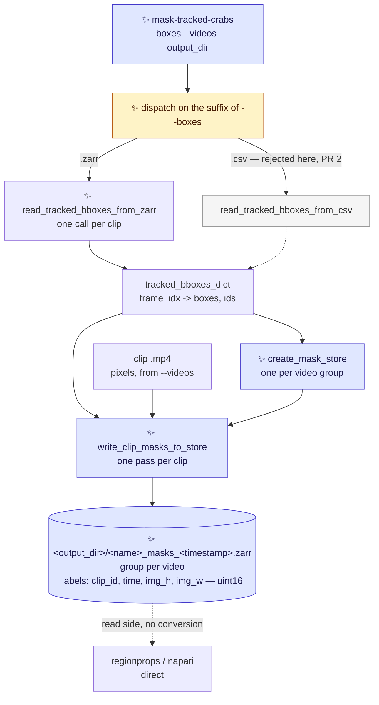
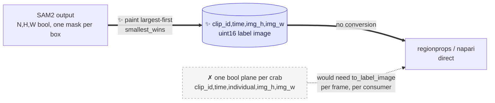
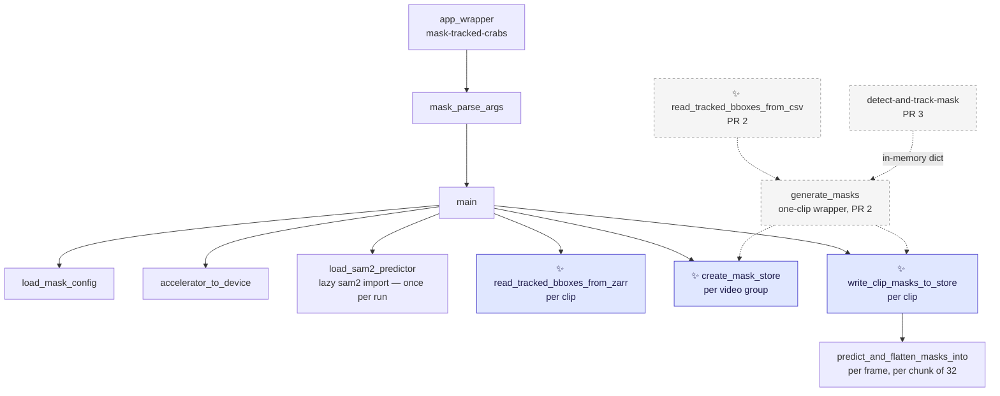

# Proposal for the `mask-tracked-crabs` entry point

Part of [`plan-masking-crabs.md`](plan-masking-crabs.md). This document covers **PR 1**, the first of
the three; [`proposal-mask-tracked-crabs-from-csv.md`](proposal-mask-tracked-crabs-from-csv.md)
covers PR 2 and [`proposal-detect-and-track-mask.md`](proposal-detect-and-track-mask.md) covers PR 3.

## Description

A new CLI entry point, `mask-tracked-crabs`, that prompts SAM2 with **boxes someone already
computed** and exist as a zarr store, and writes a zarr store that follows the structure of the
input zarr as much as possible, holding **one label image per frame**: a single integer array in
which each crab's pixels carry that crab's own label.

It needs no trained detector model and no detector pass.



* Arrows point from an input to the step that consumes it.
* Dashed arrows are read-side, or land in a later PR — not part of this run.
* ✨ marks what is new here. The grey node is
  [**PR 2**](proposal-mask-tracked-crabs-from-csv.md), which widens the dispatch; everything else is
  this PR.

**The store mirrors the trajectories datatree** that
[`create-zarr-dataset`](../crabs/zarr/create_dataset.py) writes:
* one zarr group per video, holding
an xarray dataset whose `clip_id`, `time` and `individual` coordinates are the same ones the
trajectories store uses.
* Masks and trajectories for the same clips then align 1:1 with no
reindexing. See [§5](#5-output-format-a-label-image-mirroring-the-trajectories-datatree).

> [!NOTE]
> Nomenclature
>
> - **Prompt** — a hint telling SAM2 *which* object to segment. Here, one bounding box in
>   `[x1, y1, x2, y2]` pixel coordinates per tracked crab.
> - **Label image** — a 2-D **integer** array where `0` is background and every other value
>   identifies one object. This is the array `skimage.measure.regionprops` and
>   `napari.add_labels` take, and it is exactly what this store holds, one per frame.
> - **Occlusion policy** — the rule deciding which crab keeps a pixel where two masks overlap.
>   Applied once, by the writer; see [§5a](#5a-the-occlusion-policy-and-what-it-costs).
> - **Trajectories store** — the zarr store `create-zarr-dataset` writes: a `movement` bboxes
>   dataset per video, with a `clip_id` dimension. Boxes, not pixels.

---

## References

- [`plan-masking-crabs.md`](plan-masking-crabs.md) — the umbrella plan, and where the three PRs and
  the decisions common to them are listed.
- [`proposal-mask-tracked-crabs-from-csv.md`](proposal-mask-tracked-crabs-from-csv.md) — **PR 2**,
  which widens this entry point's `--boxes` to a `<clip>_tracks.csv` and adds the one-clip
  `generate_masks` wrapper over the pass this PR ships. Everything here is written so that PR is ~60
  lines, and the places it will touch are marked.
- [`proposal-detect-and-track-mask.md`](proposal-detect-and-track-mask.md) — **PR 3**, which adds a
  second entry point running detection, tracking and masking in one command. Built entirely on the
  masking pass this PR ships, through PR 2's wrapper.
- [`crabs/zarr/create_dataset.py`](../crabs/zarr/create_dataset.py) — the trajectories store this
  reads from and whose shape the output mirrors.
- [PR #291](https://github.com/SainsburyWellcomeCentre/crabs-exploration/pull/291) — made the
  trajectories `time` axis dense and clip-anchored. It is the reason PR 1 is implementable now; see
  [§3](#3-reading-boxes-from-a-trajectories-store).
- [`scripts/generate_masks_from_bboxes.py`](../scripts/generate_masks_from_bboxes.py) — the existing
  standalone SAM2 script this entry point supersedes for tracked boxes.

---

## Overview of steps

1. Add `crabs/tracker/mask_video.py`:
    - `create_mask_store`,
    - `write_clip_masks_to_store`,
   - `predict_and_flatten_masks_into`,
   - `load_sam2_predictor`,
   - `load_mask_config`,
   - `accelerator_to_device`,
   - the parser and
   - the entry point.
3. Add `crabs/tracker/utils/boxes_from_zarr.py` with `read_tracked_bboxes_from_zarr`.
4. Add `crabs/tracker/config/mask_config.yaml`:
    - the three SAM2 and store knobs.
5. Declare the dependencies in [`pyproject.toml`](../pyproject.toml):
    - the `mask-tracked-crabs`
   script entrypoint ,
   - `zarr>=3`, `xarray`, and
   - two opt-in dependency groups for SAM2: `masks` (source, for the cluster) and `masks-ci`
     (prebuilt wheel, for the runner).
6. Add a pooch fixture: a small trajectories store plus the clip `.mp4`s it names, downscaled.
7. Add the opt-in integration tests — what this PR is verified by — **and one CI job that runs them
   on CPU**, ~1 min ([Running the integration tests on CI](#running-the-integration-tests-on-ci)).
   The unit suite is designed but **deferred**; see [Tests](#tests) for the five corners that
   leaves uncovered.
8. Document the entry point, the install, and the store layout.

---

## Key aspects of suggested implementation

### 1. One entry point, one `--boxes` argument

Masking from a trajectories store and masking from a tracks csv are **the same operation** — prompt
SAM2 with boxes someone already computed, write the same store. They differ only in a reader. So
they are one command, and the source is one argument whose **suffix** selects the reader:

```bash
mask-tracked-crabs --boxes CrabTracks-slurm3012633.zarr --videos /path/to/clips/   # this PR
mask-tracked-crabs --boxes tracking_output/<clip>_tracks.csv --videos <clip>.mp4   # PR 2
```

The second line is [PR 2](proposal-mask-tracked-crabs-from-csv.md). It is here because the argument
has to be designed for both from the start, not because this PR implements it.

* **Why not two commands.** The two would share every argument but one, and produce the same store. They would
need a cross-referencing `epilog` in each `--help` so that someone holding one kind of input
discovers the other command exists.

* **Why not a mutually-exclusive `--zarr_store` / `--tracks_csv` pair.** It needs argparse's
`add_mutually_exclusive_group` *plus* hand-written validation for the arguments that depend on each
(`--match` requires the store), and `--help` lists options inert in half its uses. Dispatching on
the suffix is simpler: there is one argument, and it is always required.

* **What it costs: one conditionally-inert argument.** `--match` applies only to a store. Passing it
with a `.csv` is an error with a message saying so, not a silent no-op.

**This PR does not accept `.csv` at all** — not a stub, not a "not yet supported" branch. It accepts
`.zarr` and rejects anything else by suffix;
* [PR 2](proposal-mask-tracked-crabs-from-csv.md) widens
the accepted set and adds the reader. No dead code at any point, and `--help` never advertises
something that does not work.

**Naming.** `mask-tracked-crabs` follows the repo's verb-first convention
(`detect-and-track-video`, `extract-frames`, `train-detector`, `create-zarr-dataset`).
* It is not
`mask-tracked-video` — it masks many clips across many videos — and not `mask-tracked-clips`, since
one of its inputs is a single clip.

### 2. The masking pass: two functions, because the store holds many clips

SAM2 runs over one clip's video file at a time, but a store holds a whole set of a video's clips. So the pass
splits where that boundary is:

```python
# crabs/tracker/mask_video.py                                                     ✨ new
def create_mask_store(store_path, video_id, clip_ids, n_frames, individuals,
                      image_shape, metadata_dict, shard_n_frames, codec,
                      zarr_mode_group) -> zarr.Array:
    """Write the xarray template for one video group; return its raw `labels` array.

    Also writes `label_of`, the individual -> pixel value mapping.  [§5]
    """


def write_clip_masks_to_store(video_path, tracked_bboxes_dict, labels_array, clip_index,
                              label_of, predictor, max_prompts_per_batch,
                              shard_n_frames) -> int:
    """One clip pass. SAM2 per frame, painted into one label image per frame,
    buffered a shard at a time and written whole.  [§5a, §6]
    """
```

This shape is the whole reason there is no class here.

**A *run* here is one invocation of `mask-tracked-crabs`**: one `--boxes` store processed end to
end — every video group, and every clip within each — into one output store. The counts below are
all per run.

This PR's entry point is the caller that uses the full nesting:

```python
predictor = load_sam2_predictor(...)                    # ONCE PER RUN — the expensive object
for video_id, ds_video in datatree.items():             # once per video group
    labels_array = create_mask_store(...)
    for clip_index, clip_id in enumerate(ds_video.clip_id.values):   # once per clip
        write_clip_masks_to_store(..., predictor=predictor, ...)
```

- **This PR** runs all three levels, so the one predictor is reused across every clip of every video
  in the run. **The predictor is the caller's, not the pass's**: neither function ever constructs
  one, both take it as an argument, and how long it lives is the entry point's decision. A class
  holding it as state would be this loop with the loop hidden.
- **[PR 2](proposal-mask-tracked-crabs-from-csv.md) collapses the two outer levels** — one video,
  one `clip_id`, so one `create_mask_store` and one `write_clip_masks_to_store`, still with one
  predictor per run. It adds a thin `generate_masks` wrapper over the two, for that one-clip case.
- **PR 3 calls that same wrapper**, with the dict built by a `Tracking` pass in the same process
  rather than read from a file.


**A `TrackingAndMasking(Tracking)` subclass could not work.** `Tracking.__init__` loads a checkpoint
eagerly ([track_video.py:48-86](../crabs/tracker/track_video.py#L48-L86)) and `prep_outputs` creates
a new timestamped output directory ([track_video.py:93-132](../crabs/tracker/track_video.py#L93-L132)).
This entry point has no checkpoint, so the subclass could only be constructed by bypassing its own
parent's `__init__`.

### 3. Reading boxes from a trajectories store

The reader turns one clip of one video group into the `tracked_bboxes_dict` contract
([§4](#4-the-tracked_bboxes_dict-contract)):

```python
# crabs/tracker/utils/boxes_from_zarr.py                                          ✨ new
def read_tracked_bboxes_from_zarr(ds_video, clip_id) -> tuple[dict, list[str]]:
    """One clip of a trajectories store -> (tracked_bboxes_dict, individual labels).

    Takes the already-open video dataset rather than a path, so the loop opens
    the datatree once for the whole run.
    """
    ds = ds_video.sel(clip_id=clip_id)
    n_clip_frames = int(ds.clip_last_frame_0idx - ds.clip_first_frame_0idx) + 1

    _validate_time_axis_is_dense(ds, n_clip_frames, clip_id)      # below

    ds = ds.isel(time=slice(0, n_clip_frames))
    ds = ds.dropna(dim="individual", how="all")      # this clip's individuals only

    xy, wh = ds.position.values, ds.shape.values                  # (t, 2, m) float32
    corners = np.concatenate([xy - wh / 2, xy + wh / 2], axis=1)  # (t, 4, m)

    individuals = [str(v) for v in ds.individual.values]
    boxes = {}
    for i, t in enumerate(ds.time.values):
        present = ~np.isnan(corners[i, 0])
        if present.any():
            boxes[int(t)] = {
                "tracked_boxes": corners[i][:, present].T.astype(np.float64),
                "ids": np.array(individuals, dtype=object)[present],
            }
    return boxes, individuals
```

Four things the trajectories store does differently from a tracks csv, and what each costs:

#### 3a. Frame indices: settled by PR #291, guarded anyway

A VIA tracks
file holds no rows for a frame with no boxes. Before [#291](https://github.com/SainsburyWellcomeCentre/crabs-exploration/pull/291), when loading a dataset with movement's `from_via_tracks_file` we also dropped those frames, and the
survivors were renumbered `0, 1, 2, …` .

**#291 fixed it at the movement source.**  We then changed `load_extended_ds` to now read the real frame numbers and reindex onto the clip's full span:

```python
ds = load_bboxes.from_via_tracks_file(via_tracks_file_path, use_frame_numbers_from_file=True)
_validate_frames_in_clip_range(...)                  # create_dataset.py:154
ds = ds.reindex(time=np.arange(n_clip_frames))       # create_dataset.py:106
```

So in a post-291 store the `time` axis is **dense and clip-anchored**, row *p* is clip frame *p*, and
a frame with no boxes is a real row of NaNs. The reader takes indices from `ds.time.values` anyway —
it costs nothing and does not depend on the reindex staying.

**The guard that remains checks that one property** — the clip's `time` axis holds one row per frame
of the clip — rather than asserting anything about which version wrote the store. A dense axis is
what makes "row *p* is clip frame *p*" true, and it is the only thing the reader needs. `escape_state`
is written densely per clip ([create_dataset.py:120](../crabs/zarr/create_dataset.py#L120)), so its
finite count is the clip's true stored length.

```python
def _validate_time_axis_is_dense(ds, n_clip_frames, clip_id):
    """One stored row per frame of the clip, so row p is clip frame p."""
    n_frames_stored = int(np.isfinite(ds.escape_state.values).sum())
    if n_frames_stored != n_clip_frames:
        raise ValueError(
            f"{clip_id}: the time axis holds {n_frames_stored} of the clip's "
            f"{n_clip_frames} frames, so row p is not clip frame p and the masks "
            f"would land on the wrong frames. This store predates PR #291; rebuild "
            f"it with create-zarr-dataset before masking."
        )
```

The name says what is checked; #291 stays in the *message*, where it is the likely cause and the
route to a fix, rather than in the name, where it would go stale the moment a second way of
producing a short axis appears.

> [!IMPORTANT]
> **It must count finite `escape_state` rows, not compare `ds.sizes["time"]`.** After
> `xr.concat(..., join="outer")` ([create_dataset.py:379](../crabs/zarr/create_dataset.py#L379))
> every clip in a video reports the same `sizes["time"]` — the video's longest — so a length
> comparison never fires. Verified against the real concat call: three clips of 10 / 7 / 4 rows all
> report `sizes["time"] == 10`, with finite `escape_state` counts of 10 / 7 / 4.


#### 3b. Clip-local frames are not a problem, because clips have their own videos

`extract-loop-clips` ([scripts/extract_loop_clips.py](../scripts/extract_loop_clips.py)) writes one
`.mp4` per row of the metadata csv, named `<video_id>-<clip_id>.mp4`. Those are the files the
store's clip-local `time` axis refers to, so **the clip `.mp4` is the video
`write_clip_masks_to_store` reads** and `clip_first_frame_0idx` never has to be applied. This is also
why the output store is grouped by video and indexed by clip: it is the shape the input already has.

The entry point derives `<videos>/<video_id>-<clip_id>.mp4` and fails naming the path if it is
missing. That is a *format* rule, not a parse — PR 1 never has to take a filename apart, which is
why it touches no existing Python at all.

#### 3c. IDs are per-clip renumbered strings

When creating the tracks zarr store, `_renumber_individuals` ([create_dataset.py:251-259](../crabs/zarr/create_dataset.py#L251-L259))
runs **once per clip**, inside the list comprehension at
[:380](../crabs/zarr/create_dataset.py#L380), so every clip is renumbered from `id_0000`. The
explicit `individual` coordinate ([§5](#5-output-format-a-label-image-mirroring-the-trajectories-datatree))
carries them through unchanged — no mapping, no offset arithmetic, and the mask store's coordinate
is *identical* to the trajectories store's, which is what makes the two align.

> [!WARNING]
> **`individual` labels mean "the *i*-th individual of this clip". This is a tracklet ID, not necessarily a crab.** `id_0003` in
> `Loop00` and `id_0003` in `Loop09` are **different crabs**.
>
> Verified against the real concat call:
> because every clip is renumbered from zero, the outer join's union along `individual` is just
> `id_0000 … id_{max nᵢ − 1}`, and a clip with fewer individuals than the video's maximum is
> NaN-padded at the **end** — so `dropna(dim="individual", how="all")` above is exactly
> `isel(individual=slice(0, nᵢ))`.
>
> This is a property of the trajectories store, not one this PR introduces. Mirroring it exactly is
> better than inventing a second, differently-wrong convention — and it is why every read selects a
> `clip_id` before selecting an `individual`.

#### 3d. Boxes are centroid + size

`movement` stores `position` (the centroid) and `shape`, so corners are `position ± shape / 2` —
three lines. The values are **float32** (`load_bboxes` allocates `position_array` as float32,
checked on movement 0.17.0), so this path has no float64 round-trip guarantee. Irrelevant for a SAM2
prompt, but it means the bit-exactness argument in
[PR 2 §3](proposal-mask-tracked-crabs-from-csv.md) is about the csv path only.

### 4. The `tracked_bboxes_dict` contract

`write_clip_masks_to_store` reads a mapping of frame index to
`{"tracked_boxes": (n, 4) float, "ids": (n,) labels}`, and must tolerate all three producers:

```python
FOR EACH frame_idx IN 0 .. total_n_frames - 1:
    frame_data = tracked_bboxes_dict.get(frame_idx)        # .get, never [...]
    IF frame_data is None or len(frame_data["tracked_boxes"]) == 0:
        skip                                               # leave the planes at fill_value
```

- **Keys may be sparse or dense.** The zarr and csv readers produce a `tracked_bboxes_dict` that has no key for a frame with no boxes;
  `core_detection_and_tracking` emits a key for *every* frame
  ([track_video.py:264-269](../crabs/tracker/track_video.py#L264-L269)), some with zero boxes.
  `.get(frame_idx)` plus the length check covers both.
- **Values may carry extra keys.** The tracker's dict has a `"scores"` key
  ([track_video.py:267](../crabs/tracker/track_video.py#L267)). `write_clip_masks_to_store` never
  reads it and never validates the key set.
- **`len(tracked_bboxes_dict)` is not `total_n_frames`.** The frame count comes from the video, via
  `get_video_parameters` ([io.py:21](../crabs/tracker/utils/io.py#L21)), so all three producers
  yield the same `T`.
- **`ids` are labels, not necessarily numbers.** `id_0003` from a store, `"7"` from a csv or the
  tracker. They are looked up in `value_of` — a plain dict built from `label_of` — never by position
  and never by arithmetic ([§5](#5-output-format-a-label-image-mirroring-the-trajectories-datatree)).
- **An empty dict must not raise** inside the pass. The entry point skips a clip with no boxes at
  all, naming it, rather than creating a zero-length `individual` axis.

#### 4a. The csv producer is designed for, not implemented here

[PR 2](proposal-mask-tracked-crabs-from-csv.md) adds `read_tracked_bboxes_from_csv`, the third
producer of this contract. Two of its properties are worth knowing while reading the contract above,
because they are what the `.get`-and-length-check shape exists for:

- **its dict is sparse and carries no `"scores"` key**, where the tracker's is dense and does — the
  two extremes the pass has to tolerate. Note this is a property of the *reader*, not of the file:
  every csv row does carry a `confidence`, written into `region_attributes` alongside the track id
  ([io.py:99](../crabs/tracker/utils/io.py#L99)), and [PR 2](proposal-mask-tracked-crabs-from-csv.md)
  drops it deliberately rather than parsing it back, because it is written misaligned with the box on
  its own row ([`proposal-tracking-score-alignment.md`](proposal-tracking-score-alignment.md)). The
  masking pass never reads scores from any producer, so this costs it nothing;
- **its `ids` are bare SORT numbers as strings** — `"1"`, `"7"`, `"12"` — sorted numerically, which
  is the coordinate shape that makes an `np.searchsorted` into `label_of` silently wrong
  ([§5](#5-output-format-a-label-image-mirroring-the-trajectories-datatree), and deferred unit test
  [1b](#deferred-the-unit-suite)).

What the CSV round trip preserves and loses, and where that path's `video_id` / `clip_id` come from,
are in [PR 2 §3 and §4](proposal-mask-tracked-crabs-from-csv.md).

### 5. Output format: a label image, mirroring the trajectories datatree

```
<output_dir>/<name>_masks_<timestamp>.zarr/     # one zarr store
└── <video_id>/                                 # one group per video, as create_dataset writes
    ├── labels    (clip_id, time, img_h, img_w)  uint16   # 0 = background
    ├── label_of  (individual,)                  uint16   # this crab's pixel value
    ├── clip_id     <U   e.g. ["Loop00", "Loop05"]
    └── individual  <U   e.g. ["id_0000", …]  — copied from the trajectories store
```

**One integer per pixel**, representing which crab owns it. The `clip_id`, `time` and `individual`
coordinates are the trajectories store's own, so the two stores align 1:1 with no reindexing.

Everything a reader does, with **no arithmetic anywhere**:

```python
import xarray as xr

ds = xr.open_datatree("<name>_masks_<timestamp>.zarr", engine="zarr", chunks={})["<video_id>"]

v = int(ds.label_of.sel(individual="id_0003"))         # this crab's pixel value
mask = ds.labels.sel(clip_id="Loop05") == v            # (time, img_h, img_w) bool
frame = ds.labels.sel(clip_id="Loop05").isel(time=t)   # (img_h, img_w) — straight into regionprops
```

- **`label_of` is what keeps the mapping explicit.** The writer happens to assign
  `label_of[i] = i + 1`, but **no reader is ever told that** — the offset is an implementation
  detail, and [PR 2](proposal-mask-tracked-crabs-from-csv.md) sets `label_of` to the SORT IDs
  directly, which are not contiguous.

    **Going back from one pixel value is a search** — the mirror of the `sel` above, and all a
    reader chasing a single crab needs:

    ```python
    str(ds.individual.values[ds.label_of.values == v][0])   # -> 'id_0003'
    ```

    **Decoding a whole `regionprops` output is where an inverse array earns its place**, because the
    search does not vectorise over a list of labels — ~60 crabs per frame, every frame of every clip.
    Two lines, built once and hoisted out of the sweep:

    ```python
    inv = np.empty(int(ds.label_of.max()) + 1, dtype=int)
    inv[ds.label_of.values] = np.arange(ds.sizes["individual"])
    ds.individual.values[inv[[p.label for p in props]]]     # -> ['id_0002', 'id_0000', …]
    ```

- **`.attrs["boxes"]` says whose IDs these are:**

    | boxes from | `individual` values | `boxes["source"]` | `boxes["ids"]` |
    |---|---|---|---|
    | a trajectories store (this PR) | `"id_0000"`, `"id_0001"`, … — copied from `ds_video.individual` | `trajectories_zarr` | `trajectories_store_individual` |
    | a `<clip>_tracks.csv` ([PR 2](proposal-mask-tracked-crabs-from-csv.md)) | `"1"`, `"7"`, `"12"` — the SORT IDs actually emitted, as strings | `tracks_csv` | `sort_track_id` |
    | a `Tracking` run (PR 3) | the same | `tracker` | `sort_track_id` |

    **Whether the later two rows should be renumbered to match the first** — one coordinate shape
    for every mask store — is [PR 2 *Points to discuss*
    #5](proposal-mask-tracked-crabs-from-csv.md#points-to-discuss), where that choice is made. It is
    not a formatting change: `id_0000` is the output of a renumbering whose digit width comes from
    the whole video's `M`, which a one-clip run does not know.

- **It opens in napari and feeds `regionprops` with no reconstruction step.**
    - `viewer.add_labels(ds.labels)` gives sliders over clip and time;
    - `regionprops(ds.labels[c, t].values)`
  returns `orientation`, `area` and the rest per crab.

    Those were the two things the format had to
  deliver, and a label image is exactly their native input.

- **`uint16`, which covers the real data with room to spare.** The largest video group in
  `CrabTracks-slurm3644250.zarr` has **M = 8,082** individuals, against uint16's ceiling of 65,535.
  Background is `0`, so `label_of` starts at 1.

- **It is lossy on overlap, and that is a deliberate trade-off.** A label image holds one ID per pixel,
  so where two masks meet, one crab takes the pixel and the other loses it.
  See [§5a](#5a-the-occlusion-policy-and-what-it-costs).

- **Everything is per video group**, and must stay that way. The `individual` names are **not**
  comparable across videos, and not even across clips — measured in
  [§3c](#3c-ids-are-per-clip-renumbered-strings). Nor is their *format* the same: two of the 27
  videos have M < 1000 and so use three digits (`id_000`), the other twenty-five use four
  (`id_0000`), because `create_dataset` derives the padding from each video's own M. **Never
  reconstruct a name with a format string** — read `ds.individual`.

- **The store name is timestamped**, `<name>_masks_<YYYYMMDD_HHMMSS>.zarr`, which is what both
  existing SAM2/SAM3 mask scripts already do — the latter documented as *"timestamped so runs don't
  collide"* ([scripts/burrows/README.md](../scripts/burrows/README.md)). It is what makes re-masking
  with a different SAM2 model safe, which is half the point of this entry point. The cost is that
  readers glob for the store instead of naming it.

**Metadata in `.attrs` on each video group:**

```python
{
    "timestamp": ..., "sam2_model": ..., "device": ...,
    "source_video": [...],                       # one clip .mp4 per clip_id entry, in order
    "boxes": {                                   # where the prompts came from
        "file": str(boxes_path),                 # the store or csv these IDs refer to
        "source": "trajectories_zarr",           # or "tracks_csv" (PR 2), "tracker" (PR 3)
        "ids": "trajectories_store_individual",  # or "sort_track_id"
    },
    # ^ the later PRs write the other values; every key ships here
    "background_label": 0,
    "occlusion_policy": "smallest_wins",         # [§5a]
    "prompt_type": "bounding_box",
}
```

`source_video` is a **list**, mirroring the trajectories store's own list-valued `source_file` attr
([create_dataset.py:324-327](../crabs/zarr/create_dataset.py#L324-L327)), so one clip video per
`clip_id` fits without the key changing type between PRs.


**`boxes` is one nested key, not three flat ones.** `file`, `source` and `ids` answer one question —
where the prompts came from — and `ids` is a *function* of `source` today
(`trajectories_zarr` → `trajectories_store_individual`; `tracks_csv` and `tracker` → `sort_track_id`).
Nesting keeps the three together so a new producer cannot set one and forget another, and it drops
the `boxes_` prefix from every member. They stay three entries rather than collapsing to one because
the correspondence is exactly what [PR 2 *Points to discuss*
#5](proposal-mask-tracked-crabs-from-csv.md#points-to-discuss) would break: renumbering the csv path's
labels would decouple `ids` from `source`.

> [!NOTE]
> **A nested attr needs checking before it is relied on.** Zarr attributes are JSON, so a dict is
> representable, but whether xarray round-trips one through `to_zarr` / `open_datatree` untouched is
> *not* verified here — unlike the sharding and codec claims in [§6](#6-chunking-sharding-and-the-frame-at-a-time-write),
> which were. Check it on the same xarray 2026.7.0 / zarr 3.4.0 pair before this ships; if it does not
> survive, the fallback is the three flat keys.

**What is kept is what the data cannot say for itself** — `boxes`, `source_video`,
`occlusion_policy`, and the SAM2 provenance. `prompt_type` never varies today, and is kept anyway so
that a store prompted some other way (a point, a mask) is distinguishable from this one without
guessing: it says what the masks were *conditioned on*, which changes how much a reader should trust
them.

**Three keys an earlier draft carried and this one does not**, each for the same reason `mask_encoding`
went:

- **`image_shape`** is `labels.shape[-2:]`. A shape that disagrees with the array is worse than no
  shape at all.
- **`prompt_source: "tracked_boxes"`** restates `boxes_source`, which already names *which* tracked
  boxes and is finer-grained. Two keys on one axis can disagree.
- **`multimask_output: False`** is an argument to `predictor.predict`, not a decision a reader needs:
  it is hardcoded, it does not change how `labels` is read, and keeping it leaves no principle for
  excluding `max_prompts_per_batch`, the codec, or `score_threshold`. If multimask output is ever
  used, what the store would need to record is *which* of the three masks was selected — the
  selection rule, not the flag.


#### 5a. The occlusion policy, and what it costs

**Measured first.** Box overlap across 27,458 crab-instances sampled from all 27 videos — and since a
crab fills only ~π/4 of its box, mask overlap is strictly lower than this:

| | |
|---|---|
| crabs whose box overlaps **no** other box | **94.0%** |
| total box area that is contested | **0.62%** (a ceiling for masks) |
| crabs losing >10% of their box | 3.2% |
| crabs losing >25% | 2.4% |

So overlap is **rare but severe when it happens** — a heavy tail of touching pairs. Losing 0.62% of
pixels to buy napari and `regionprops` directly is a good trade; losing them *silently* would not be,
hence the rest of this section.

**The policy is `smallest_wins`**: masks are painted largest-area first, smallest last, so the
smaller crab keeps the contested pixels. That is the common convention in instance-segmentation
rendering, and the reason is that a large crab losing a few pixels barely moves its fitted ellipse,
whereas a small crab losing pixels to a large neighbour can be gutted. Smallest-wins minimises the
worst *relative* distortion. SAM2's predicted-IoU score is the other plausible precedence and is
worth comparing once there are real masks — *Points to discuss* [#3](#points-to-discuss).

> [!WARNING]
> **Prompt chunking breaks the policy unless the prompts are sorted first.** Prompts are predicted in
> chunks of `max_prompts_per_batch` (32) to bound peak memory (Gotchas), and each chunk is painted
> into the frame before the next is predicted — so a *large* crab in chunk 2 overwrites a *small*
> crab already painted from chunk 1, which is exactly backwards. Ordering by area *within* a chunk
> does not fix it. With ~60 crabs per frame against a chunk of 32, this is the normal case, not an
> edge one.
>
> **The fix is one `argsort` before chunking**: sort the prompts by **box** area, descending, so the
> largest boxes land in the earliest chunk and chunk order already agrees with the policy. Box area
> is a proxy for mask area — the two can disagree — so the ordering is exact within a chunk (real
> mask area) and near-exact across chunk boundaries. Residual error needs a pair that overlaps, that
> straddles a chunk boundary, *and* whose box and mask area orders disagree.

**Without the sort, the written frame depends on `max_prompts_per_batch`** — a knob documented as a
memory/speed trade ([§8](#8-configuration-a-separate-mask-config-file)) would quietly change the
pixels. With it, the output is knob-independent. Deferred unit test
[2b](#deferred-the-unit-suite) pins exactly that, and is worth writing before anyone tunes the knob.

> [!IMPORTANT]
> **The lost pixels are not recoverable from the store.** An earlier draft carried an `n_px_lost`
> array recording, per crab per frame, how many pixels it lost — deliberately dropped for simplicity.
> Nothing downstream can now distinguish a clean mask from a remnant, and recovering that would mean
> re-running SAM2.
>
> **On read, occluded crabs are found by adjacency**: if two labelled regions touch in `labels`, they
> were plausibly overlapping. That over-flags (touching ≠ overlapping) but needs no extra storage,
> and it is what the README tells a reader to do. The mask area can also be compared against the
> tracked box area from the trajectories store, which is already aligned.

The policy name is written into `.attrs["occlusion_policy"]` so a store records which one produced
it, and so a future store written under a different policy is distinguishable from this one.

### 6. Chunking, sharding, and the frame-at-a-time write

**`chunks=(1, 1, H, W)` — one chunk is one frame.** That is the unit both access patterns want:
napari dragging the time slider, and the `regionprops` sweep. A frame is 4096×2160 uint16 =
**17.7 MB raw**, ~26 KB compressed.

**Bigger chunks are pure loss here**, which was measured rather than assumed:

| chunk | on disk | compression | read one frame |
|---|---|---|---|
| **1 frame** | 13.2 KB/frame | 315× | **3.7 ms** |
| 8 frames | 13.1 KB/frame | 315× | 6.9 ms |
| 32 frames | 13.2 KB/frame | 315× | **21.0 ms** |

*(measured at 1920×1080 for speed; the ratios are what matter)*

**Identical compression, 5.7× slower reads.** A label frame is ~96% zeros and the compressor already
exploits that *within* one frame; zarr compresses each chunk independently and does not delta-encode
along time, so grouping frames adds no exploitable redundancy — just more bytes to decompress when
you want one.

> **Chunk size is set by the access pattern. Shard size is set by the filesystem.**
>
> Before zarr 3 these fought each other, so you compromised on both. Sharding decouples them. Never
> inflate a chunk to fix a file-count problem — that is the shard's job now.

#### How sharding works, and why reads and writes are asymmetric

A **shard** is one file holding many chunks, plus an index at the end giving each chunk's byte offset
and length. Measured on a real sharded array (16 planes, 8 per shard, ~18 KB per shard file):

| operation | reads | bytes read | writes | bytes written |
|---|---|---|---|---|
| **read one chunk** | 2, **both ranged** | **2.0 KB** | – | – |
| read the whole shard | 1, unranged | 17.6 KB | – | – |
| **write a whole shard at once** | **0** | **0 KB** | 1 | 17.6 KB |
| **write one chunk into an existing shard** | 1, **unranged** | **17.6 KB** | 1 | **17.6 KB** |

**Reads stay granular**: ranged-read the index, ranged-read that chunk's bytes, decompress only it —
2.0 KB of a 17.6 KB file. Works on a local filesystem (`seek`) and over S3/HTTP (`Range:`) alike. So
sharding costs nothing on the read side.

**Writes cannot do the equivalent.** Chunks are compressed, so replacing one shifts every later
byte offset and invalidates the index; inserting bytes mid-file means moving everything after them.
So zarr reads the shard, splices, recomputes offsets and rewrites it whole — visible in the last row
above, and the source of the **×58.6 write amplification** measured when filling a 128-chunk shard
one chunk at a time.

#### Which is why one frame per chunk matters

**A frame's write is exactly one chunk, contiguous.** So the writer buffers one shard's worth of
frames and writes them in a single assignment — zarr never sees a partial shard, and there is no
read-modify-write at all:

```python
buf[k] = label_frame                          # (shard_n_frames, H, W) uint16, filled in order
...
labels_array[clip_index, t0:t0 + shard_n_frames] = buf      # one whole-shard write
```

**`shards=(1, 32, H, W)` — 32 frames per file.** The constraint is the write buffer, not the file
count:

| shard | write buffer (4K) | file size | files, whole store |
|---|---|---|---|
| **32 frames** | **566 MB** | **~0.85 MB** | **~155,000** |
| 64 frames | 1.13 GB | ~1.7 MB | ~77,000 |
| 128 frames | 2.27 GB | ~3.4 MB | ~39,000 |

155,000 files across 234 clips is ~660 per clip — nothing for GPFS — so 32 is the default and
`shard_n_frames` is a config knob ([§8](#8-configuration-a-separate-mask-config-file)) for a cluster
that prefers fewer, larger files. A larger shard also means more work lost if a job dies mid-shard.

**Both chunks and shards are set through xarray's `encoding`**, because the array has to carry
xarray's dimension metadata to be readable as a dataset. Verified end to end on xarray 2026.7.0 /
zarr 3.4.0 — template write, sharded region write, read-back with coordinates intact:

```python
enc = {"labels": {"chunks": (1, 1, H, W),
                  "shards": (1, shard_n_frames, H, W),
                  "compressors": [BloscCodec(cname="zstd", clevel=9, shuffle="bitshuffle")]}}
ds.to_zarr(store_path, group=video_id, compute=False, encoding=enc)   # metadata only, no data
labels_array = zarr.open_group(store_path)[f"{video_id}/labels"]      # fill this, shard by shard
```

**`compute=False` is what makes a two-pass temp store unnecessary.** `create-zarr-dataset` needs one
([create_dataset.py:261-333](../crabs/zarr/create_dataset.py#L261-L333)) because it cannot know a
video's concatenated shape without holding every clip dataset in memory. The mask store has no such
problem: every dimension is known from the trajectories store and the video headers before SAM2
runs, so the template is written once and each clip fills its own region.

#### The codec

**`blosc-zstd level 9 + bitshuffle`**, measured on realistic 4K label frames with ragged mask
boundaries:

| codec | KB/frame | whole store |
|---|---|---|
| default (zstd level 0) | 30.4 | 151 GB |
| zstd level 9 | 26.8 | 133 GB |
| **blosc-zstd 9 + bitshuffle** | **26.5** | **131 GB** |
| blosc-zstd 5 + *byte* shuffle | 41.0 | 203 GB ❌ |

Byte shuffle is actively worse — don't use it. The ~13% win costs only write CPU, which is
negligible beside SAM2.

> [!IMPORTANT]
> **`label_of` takes a different codec.** It is tiny, and the same measurement run showed bitshuffle
> *hurting* on a mostly-zero integer array (70× vs 96× for plain zstd). Codec per array, not per
> store.

### 7. Flattening happens on write, and the read side needs no helper

`regionprops` and `napari.add_labels` both take an `(H, W)` **integer label image**, and that is now
exactly what the store holds ([§5](#5-output-format-a-label-image-mirroring-the-trajectories-datatree)).
So there is no conversion step on read at all:

```python
regionprops(ds.labels.sel(clip_id="Loop05").isel(time=t).values)   # that is the whole read path
viewer.add_labels(ds.labels)                                       # sliders over clip and time
```

**The flattening happens once, in the writer**, where SAM2's per-prompt masks are painted into one
frame under the `smallest_wins` policy ([§5a](#5a-the-occlusion-policy-and-what-it-costs)).



The grey node is the design not taken — one boolean plane per crab, overlaps intact, flattened by a
`to_label_image` helper on every read. It was rejected on measurement, not taste: at the real
`M` of 791–8,082 it needs a 1.6–16.8 GB write buffer, spreads one frame's write across 2–19 shard
files, and produces 54k–979k files per clip. The numbers are in
[*Formats considered and rejected*](#detailed-implementation).

**So `crabs/tracker/utils/masks.py` and `to_label_image` do not exist in this design.** An earlier
draft added both; the label image makes them unnecessary, which is one new module and one helper
fewer to ship, test and document.

`ellipses_from_labels` in
[`notebook_visualise_masks_from_zarr.py`](../notebooks/notebook_visualise_masks_from_zarr.py) takes a
label image, so it consumes `ds.labels[c, t]` unchanged — the same geometry code, with nothing in
between.

**What this costs** is stated plainly in [§5a](#5a-the-occlusion-policy-and-what-it-costs): the
policy is fixed at write time, the pixels a crab lost are gone, and changing the policy means
re-running SAM2. Measured at 0.62% of box area contested, with 94% of crabs untouched.

### 8. Configuration: a separate mask config file

Four knobs, in a file of their own rather than in the tracking config:

```yaml
# crabs/tracker/config/mask_config.yaml   ✨ new file
sam2_model_id: facebook/sam2.1-hiera-base-plus   # matches the existing script's default
max_prompts_per_batch: 32                        # see Gotchas
shard_n_frames: 32                               # see §6; null disables sharding
occlusion_policy: smallest_wins                  # see §5a
```

`shard_n_frames` is the one to tune per filesystem: it sets both the write buffer
(`shard_n_frames × 17.7 MB` at 4K) and the file count. `occlusion_policy` is a knob rather than a
constant so that a second policy can be compared without a format change — its value is copied into
`.attrs` so a store always records which one produced it.

**Why not a `masks:` block in `tracking_config.yaml`.** `mask-tracked-crabs` never reads the tracking
config at all — it has no `--config_file` and no SORT parameters to load, so the SAM2 knobs cannot
live in a file it does not open. That alone settles it. Beyond that,
[`tracking_config.yaml`](../crabs/tracker/config/tracking_config.yaml) is four flat SORT scalars and
a `masks:` block would be the first nested structure in it; the two have unrelated tuning lifecycles;
and the integration test fetches its `tracking_config.yaml` from the pooch/GIN registry, which has no
`masks:` key, so a merged block would need defensive defaulting.

**Read the file verbatim, and default at the point of use.** `load_mask_config` is
`yaml.safe_load(f)` and nothing else, matching `load_config_yaml`
([track_video.py:88-91](../crabs/tracker/track_video.py#L88-L91)). Each knob is then read as
`mask_config.get(key, default)` at the one place it is used — the idiom `train_model` already uses
for its one optional section.

- **A user's own config need only name the keys it changes.** Comparing `-tiny` against `-base-plus`
  is a one-key file.
- **No merge layer and no `MASK_DEFAULTS` dict**, so there is no second place where a key can exist
  but the shipped YAML not mention it.
- **An empty or malformed config raises**, exactly as it does for the tracking and training entry
  points today. Guarding that here and nowhere else in the package was the divergence not worth
  having.
- **The defaults are written twice**, in the YAML and at each access site. Deferred unit test
  [10](#deferred-the-unit-suite) pins the two against each other so they cannot drift — until it
  lands, that drift is unguarded ([Tests](#tests)).

### 9. The argument parser

```python
# crabs/tracker/mask_video.py                                                ✨ new
def mask_parse_args(args):
    """Parse arguments for mask-tracked-crabs."""
    parser = argparse.ArgumentParser(
        formatter_class=argparse.RawDescriptionHelpFormatter,
        epilog=(
            "To run detection, tracking and masking in one command, "
            "use detect-and-track-mask."
        ),
    )
    parser.add_argument(
        "--boxes", type=str, required=True,
        help=(
            "Location of the tracked boxes to prompt SAM2 with: a trajectories "
            "zarr store written by create-zarr-dataset. "        # PR 2 widens this
            "The suffix selects how it is read."                 # string; see its §7
        ),
    )
    parser.add_argument(
        "--videos", type=str, required=True,
        help=(
            "Directory holding the clip videos the boxes refer to, named "
            "<video-id>-<clip-id>.mp4."                          # PR 2 adds the single-file form
        ),
    )
    parser.add_argument(
        "--output_dir", type=str, default="mask_output",
        help=(
            "Directory the mask store is written into. The store name carries a "
            "timestamp, so runs do not collide. Default: mask_output."
        ),
    )
    parser.add_argument(
        "--match", type=str, default="*",
        help=(
            "Glob selecting which video groups of the store to mask, e.g. "
            "'07.09.2023*'. Only valid with a zarr store. Default: all."
        ),
    )
    parser.add_argument("--mask_config_file", type=str, default=DEFAULT_MASK_CONFIG, ...)
    parser.add_argument("--accelerator", type=str, default="gpu", ...)
    return parser.parse_args(args)
```

**`--match` matches video groups, not clips.** `dt.match()` matches group paths
([notebook:155-163](../notebooks/crabs_dataset/00_notebook_data_structure.py#L155-L163)), so
`--match "07.09.2023*"` selects videos and every clip within them is masked. Filtering *clips* by
metadata — `clip_escape_type`, say — is *Points to discuss* [#4](#points-to-discuss).

**The `epilog` is the one in-product signpost** between this command and `detect-and-track-mask`, and
`formatter_class=RawDescriptionHelpFormatter` is required rather than cosmetic: checked against
Python 3.12, the default `HelpFormatter` re-wraps the epilog to terminal width and breaks on the
hyphens in the command name, rendering it as `detect-and-` / `track-mask` across two lines —
un-copy-pasteable. The raw formatter leaves the epilog exactly as written and still wraps ordinary
argument help normally.

**This PR also takes `--zarr_mode_store` and `--zarr_mode_group`**, matching `create-zarr-dataset`'s own
([create_dataset.py:442-533](../crabs/zarr/create_dataset.py#L442-L533)), so a SLURM array with one
job per video can append groups to a shared store. That is the same array shape
`create-zarr-dataset` already documents, and one video per job is the natural unit here too.

---

## Detailed implementation



Arrows point from a caller to what it calls. Solid nodes are this PR; dashed are
[PR 2](proposal-mask-tracked-crabs-from-csv.md) and
[PR 3](proposal-detect-and-track-mask.md), shown so the seams they attach to are visible.

### The changes

| # | Change | Signature / notes |
|---|---|---|
| 1 | **new** `crabs/tracker/mask_video.py` — the pass and the entry point, ~250 lines | see below |
| 3 | **new** `crabs/tracker/utils/boxes_from_zarr.py` — the reader, ~40 lines | `read_tracked_bboxes_from_zarr` ([§3](#3-reading-boxes-from-a-trajectories-store)) |
| 4 | **new** `crabs/tracker/config/mask_config.yaml` | the three knobs ([§8](#8-configuration-a-separate-mask-config-file)) |
| 5 | [`pyproject.toml`](../pyproject.toml) | `mask-tracked-crabs` script; `zarr>=3`, `xarray`; `[dependency-groups] masks` + `[tool.uv] no-build-isolation-package` |
| 6 | **new** `tests/test_integration/test_mask_video.py` — opt-in, `skipif` on `sam2` | four end-to-end tests ([Tests](#tests)). `tests/test_unit/test_mask_video.py` is **deferred**, so this PR adds no CI-visible coverage of the new code beyond `test_entry_points.py` |
| 7 | pooch/GIN registry | a small trajectories store + the clip `.mp4`s it names ([Tests](#tests)) |
| 8 | [`crabs/tracker/README.md`](../crabs/tracker/README.md) + [`guides/DetectAndTrackHPC.md`](../guides/DetectAndTrackHPC.md) | install, run, read back, and the five things in [Documentation updates](#documentation-updates) that the store cannot say for itself |

**Nothing existing is touched.** `create_dataset.py`, `track_video.py`, `sort.py`, `utils/io.py`,
`utils/tracking.py`, the trajectories store format, the CSV format and the detector are all
untouched — this PR only *formats* clip filenames, never parses them
([§3b](#3b-clip-local-frames-are-not-a-problem-because-clips-have-their-own-videos)).
[PR 2](proposal-mask-tracked-crabs-from-csv.md) is the first to touch existing Python, and only to
move two filename helpers.

<details>
<summary><b>1. The new module in full outline</b></summary>

Module-level functions only — no new class. Everything except `load_sam2_predictor`,
`predict_and_flatten_masks_into` and the video loop in `write_clip_masks_to_store` is pure — no
`sam2`, no torch, no I/O beyond zarr and the config file — which is what makes the unit tests
possible on CI.

```python
"""Mask tracked crabs in a video with SAM2."""

def mask_parse_args(args):
    """Arguments for mask-tracked-crabs.  [§9]"""


def load_mask_config(path) -> dict:
    """Read the mask config, verbatim — as load_config_yaml does.  [§8]"""
    with open(path) as f:
        return yaml.safe_load(f)


def accelerator_to_device(accelerator):
    """"gpu" -> "cuda", mirroring Tracking.__init__ (track_video.py:79-82).

    Three lines, duplicated rather than refactored out of Tracking, so that
    track_video.py is not touched at all in PR 1.
    """


def create_mask_store(store_path, video_id, clip_ids, n_frames, individuals,
                      image_shape, metadata_dict, shard_n_frames, codec,
                      zarr_mode_group) -> zarr.Array:
    """Write the xarray template for group `video_id`; return its raw zarr array.

    Builds a (clip_id, time, img_h, img_w) uint16 dataset — there is no
    `individual` axis, that lives on `label_of` — with the coordinates it is
    given, writes it with compute=False (metadata, no data), and hands back
    the zarr array for the region writes.  [§5, §6]

    chunks=(1,1,H,W), shards=(1,shard_n_frames,H,W), fill_value=0;
    shard_n_frames=None disables sharding. Also writes `label_of`, on the
    `individual` axis and with its own codec (not bitshuffle).  [§5, §6]
    `individuals` is the label list, already ordered by the caller — this
    function never invents IDs, which is what keeps §5's table true.
    """


def load_sam2_predictor(model_id: str, device: str):
    """Import sam2 lazily and return a SAM2ImagePredictor.  [Dependencies]"""
    try:
        from sam2.sam2_image_predictor import SAM2ImagePredictor
    except ImportError as e:
        raise ImportError(
            "mask-tracked-crabs needs SAM2. Install it with:\n"
            "  uv sync --group masks\n"
            "or, in a conda env with torch already installed:\n"
            '  pip install --no-build-isolation "sam-2 @ git+https://github.com/facebookresearch/sam2.git"'
        ) from e
    return SAM2ImagePredictor.from_pretrained(model_id, device=device)


def predict_and_flatten_masks_into(predictor, frame_bgr, boxes, values, label_frame,
                                   max_prompts_per_batch) -> None:
    """In place: SAM2 on one frame, flattened into the caller's (H, W) uint16 buffer.

    `values` are the pixel values for these boxes, straight from `label_of` (§5) —
    they are the numbers written into `label_frame`, not positions along any axis.

    Returns nothing. Flattening into `label_frame` rather than returning (N, H, W)
    is what releases each prompt chunk's float masks before the next chunk is
    predicted (Gotchas), and what keeps exactly one frame-sized buffer alive for
    the whole run (§6).

    The prompts are sorted by *box* area before chunking, because painting is
    chunk-by-chunk and a later chunk overwrites an earlier one — without the
    sort, smallest_wins would hold only within a chunk.  [§5a]
    """
    predictor.set_image(cv2.cvtColor(frame_bgr, cv2.COLOR_BGR2RGB))

    # largest box first, so chunk order agrees with the policy  [§5a]
    order = np.argsort(-(boxes[:, 2] - boxes[:, 0]) * (boxes[:, 3] - boxes[:, 1]))
    boxes, values = boxes[order], values[order]

    FOR EACH (box_chunk, value_chunk) OF (boxes, values), size max_prompts_per_batch:
        masks, _iou, _low_res = predictor.predict(box=box_chunk, multimask_output=False)
        m = masks.reshape(len(box_chunk), *masks.shape[-2:]).astype(bool)
        FOR EACH (mask, value) IN zip(m, value_chunk), DECREASING mask.sum():
            label_frame[mask] = value                      # smallest_wins  [§5a]


def write_clip_masks_to_store(video_path, tracked_bboxes_dict, labels_array, clip_index,
                              label_of, predictor, max_prompts_per_batch,
                              shard_n_frames) -> int:
    """One video pass, writing into labels_array[clip_index]. Returns frames read."""
    total_n_frames, H, W = labels_array.shape[1:]
    # individual -> pixel value, as an ordinary dict. KeyError here means the
    # coordinate and the boxes dict disagree — loud, not a silently wrong mask.
    value_of = {name: int(v) for name, v in zip(label_of.individual.values,
                                                label_of.values)}
    input_video_object = open_video(video_path)
    # ONE shard's worth of label frames, allocated once per run  [§6, Gotchas]
    buf = np.zeros((shard_n_frames, H, W), dtype=np.uint16)
    frame_idx = 0
    WHILE input_video_object.isOpened():
        ret, frame = input_video_object.read()
        IF not ret:
            parse_video_frame_reading_error_and_log(frame_idx, total_n_frames)
            break

        k = frame_idx % shard_n_frames
        buf[k] = 0                                   # 0 = background  [§5]

        # .get, not [...]: no key for a frame with no boxes  [§4]
        frame_data = tracked_bboxes_dict.get(frame_idx)
        IF frame_data is not None and len(frame_data["tracked_boxes"]) > 0:
            values = np.array([value_of[str(i)] for i in frame_data["ids"]])
            predict_and_flatten_masks_into(
                predictor, frame, frame_data["tracked_boxes"],
                values, buf[k], max_prompts_per_batch,      # -> None; fills buf[k]  [§5a]
            )

        # flush a whole shard at a time: never a partial-shard write  [§6]
        IF k == shard_n_frames - 1:
            t0 = frame_idx - k
            labels_array[clip_index, t0:frame_idx + 1] = buf
        frame_idx += 1

    # the tail: whatever is left of a part-filled shard
    IF frame_idx % shard_n_frames:
        k = frame_idx % shard_n_frames
        labels_array[clip_index, frame_idx - k:frame_idx] = buf[:k]

    input_video_object.release()
    return frame_idx


def main(args):                            # mask-tracked-crabs
    boxes_path = Path(args.boxes)
    IF boxes_path.suffix != ".zarr":       # PR 2 widens this to accept ".csv"  [§1]
        raise ValueError(...)              # names the suffixes it accepts  [§1]
    IF args.match != "*" and boxes_path.suffix != ".zarr":
        raise ValueError("--match only applies to a trajectories zarr store")

    mask_config = load_mask_config(args.mask_config_file)
    sam2_model_id = mask_config.get("sam2_model_id", "facebook/sam2.1-hiera-base-plus")
    max_prompts_per_batch = mask_config.get("max_prompts_per_batch", 32)
    shard_n_frames = mask_config.get("shard_n_frames", 32)
    occlusion_policy = mask_config.get("occlusion_policy", "smallest_wins")

    predictor = load_sam2_predictor(sam2_model_id, accelerator_to_device(args.accelerator))
    timestamp = datetime.now().strftime("%Y%m%d_%H%M%S")
    store_path = Path(args.output_dir) / f"{boxes_path.stem}_masks_{timestamp}.zarr"

    dt = xr.open_datatree(args.boxes, engine="zarr", chunks={})
    FOR EACH video_node IN dt.match(args.match).leaves:
        ds_video = video_node.to_dataset()
        video_id = video_node.name
        clip_ids = [str(c) for c in ds_video.clip_id.values]
        individuals = [str(i) for i in ds_video.individual.values]   # §5: copied, not derived

        # Every shape is known before SAM2 runs  [§6]
        clip_videos = [Path(args.videos) / f"{video_id}-{c}.mp4" for c in clip_ids]
        FOR EACH p IN clip_videos:
            IF not p.exists():
                raise FileNotFoundError(...)      # names the path it looked for
        params = [get_video_parameters(str(p)) for p in clip_videos]   # io.py:21
        H, W = params[0]["frame_height"], params[0]["frame_width"]
        T = max(p["total_frames"] for p in params)

        labels_array = create_mask_store(
            store_path, video_id, clip_ids, T, individuals, (H, W),
            metadata, shard_n_frames, codec, args.zarr_mode_group,
        )
        # the individual -> pixel value mapping create_mask_store just wrote  [§5]
        label_of = xr.open_datatree(store_path, engine="zarr")[video_id].label_of

        FOR EACH (i, clip_id) IN enumerate(clip_ids):
            boxes, clip_individuals = read_tracked_bboxes_from_zarr(ds_video, clip_id)
            IF not boxes:
                log(f"{video_id}/{clip_id}: no tracked boxes, skipping")   # §4
                continue
            write_clip_masks_to_store(
                str(clip_videos[i]), boxes, labels_array, i,
                label_of, predictor, max_prompts_per_batch, shard_n_frames,
            )


def app_wrapper():                         # mask-tracked-crabs
    logging.getLogger().setLevel(logging.INFO)
    torch.set_float32_matmul_precision("medium")
    main(mask_parse_args(sys.argv[1:]))
```

**Note `individuals` is the *video group's* coordinate, not the clip's.** The `individual` axis is
shared across a video's clips, so `create_mask_store` gets the union and
`write_clip_masks_to_store` looks each clip's own labels up in it. The clip-level list
`read_tracked_bboxes_from_zarr` also returns is used by the tests and by
[§7](#7-flattening-happens-on-write-and-the-read-side-needs-no-helper)'s read path; the writer
does not need it.

Frames with no tracked boxes are written as an all-zero label frame — `0` is background
([§5](#5-output-format-a-label-image-mirroring-the-trajectories-datatree)) — whether the frame was
absent from the dict or present and empty. They are not skipped, because the shard is flushed whole
and a frame's slot in `buf` has to hold something; `buf[k] = 0` is that something.

One invariant worth asserting at the end of a run, and it is cheap: every ID the dict emits is
present in `label_of`'s `individual` coordinate. The `value_of` dict makes this self-enforcing — a
missing label raises `KeyError` at the frame that has it, rather than painting a mask with another
crab's value.

</details>

<details>
<summary><b>2. Module naming</b></summary>

The module is `crabs/tracker/mask_video.py`, beside the existing
[`track_video.py`](../crabs/tracker/track_video.py). PR 3 adds its entry point to the same module,
which is then still correctly named: both entry points mask video, and they share everything under
`generate_masks`.

The alternative is three modules — `masking.py` for the shared pass, plus one thin module per entry
point. Cleaner on paper, and worth taking if `mask_video.py` grows past roughly 300 lines, but more
files than the content justifies. See *Points to discuss* [#2](#points-to-discuss).

</details>

<details>
<summary><b>3. Formats considered and rejected</b></summary>

Four layouts were compared, and the choice was settled by measuring the real store rather than by
argument. Read the shapes as *within one video group and one `clip_id`* — the `clip_id` axis and the
mirroring coordinates ([§5](#5-output-format-a-label-image-mirroring-the-trajectories-datatree)) wrap
whichever pixel layout wins.

| Format | Lossless on overlap | napari / regionprops direct | store | Note |
|---|---|---|---|---|
| **`(T, H, W)` uint16 label image** ✅ chosen | **no** — 0.62% of box area contested | **yes, both** | ~131 GB | one crab loses each contested pixel; measured cost in [§5a](#5a-the-occlusion-policy-and-what-it-costs) |
| `(T, M, H, W)` bool, one plane per crab | yes | no | — | **fails at the real `M`**; see below |
| `(T, K, H, W)` int32 overlap layers | yes | plane 0 only | — | `K`≈2–4; needs a greedy packing pass at write time, and the axis carries no identity |
| bbox-local crops + index table | yes | no (needs reconstruction) | ~150 GB | ~386× smaller per mask, but not viewable without a helper |

**Why not one boolean plane per crab — the design this proposal originally had.** It was rejected on
measurements of `CrabTracks-slurm3644250.zarr`, not on taste. `M` is the `individual` axis size, and
it is **791–8,082** (median 3,326), because it counts distinct track IDs over a whole clip while only
~60 crabs are on screen at once:

| | designed for | measured |
|---|---|---|
| dense write buffer (`M×H×W`, needed whole for a shard-aligned write) | 207 MB | **1.6–16.8 GB** |
| shard files touched per frame write | 1 | **2–19** (the live crabs span 226–2,262 positions) |
| files per clip | ~3,000 | **54,000–979,000** |
| decompressed to read one frame's 60 crabs | — | **186 MB** (vs 0.9 MB for crops, 17.7 MB for the label image) |

Compression does not help with any of those: all-`False` chunks are never written, but the buffer is
uncompressed by construction, the file count follows where the live crabs land, and a chunk is the
minimum *decompression* unit. Spatial chunking would fix the last one, but then you can fix the file
count **or** the write buffer, not both. The label image has no `M` axis, so none of it arises.

**Why not the label image's own losses matter less than they look.** 94.0% of crabs have no box
overlap at all, and box overlap is a ceiling for mask overlap. The tail is heavy — 2.4% lose >25% of
their box — which is why the policy is recorded in `.attrs` and the README says how to find affected
crabs by adjacency ([§5a](#5a-the-occlusion-policy-and-what-it-costs)).

**Why not crops.** The strongest rival: ~386× smaller per mask, and a frame reads in 0.32 MB against
17.7 MB. It loses because it is not a label image — napari cannot open it and `regionprops` cannot
read it without a reconstruction helper, and those two were the requirements. Worth revisiting if the
store turns out larger than *Points to discuss* [#1](#points-to-discuss) expects.

**Why not overlap layers.** Genuinely lossless and compact, but the axis carries no identity, so
every read needs the companion array to say which crab is in which layer — all of the label image's
reconstruction cost with none of its simplicity.


**Why not the label image.** It cannot represent two crabs on one pixel, and the ellipse fits the
orientation work wants would be biased by exactly the neighbours that touch most. Rejected on
losslessness, not size — zarr compresses a label image well enough that size was never deciding.

**Why not overlap layers.** Genuinely close, and better on chunk count and napari. It loses because
the axis carries no identity, so `m.sel(individual=...)` — one crab's whole trajectory in a single
read — is not expressible. That slice is what the orientation work will be built on, and it is also
the axis carrying the IDs, so losing it would cost the 1:1 alignment with the trajectories store.

**Why not crops.** Much the smallest, and the only one that scales to long clips without thought.
Rejected for now because it is ragged, needs a scan to assemble one crab's time series, and cannot be
read without the repo's helpers. Worth revisiting if [#1](#points-to-discuss) comes back badly.

**Why not a coarser chunk than one frame** — the chunk-size question, now that the layout is
settled. Measured in [§6](#6-chunking-sharding-and-the-frame-at-a-time-write): grouping 8 or 32
frames into a chunk gives **identical compression** (13.1–13.2 KB/frame either way) and makes reading
one frame **5.7× slower**, because a label frame is ~96% zeros that the compressor already exploits
within a single frame, and a chunk is the minimum decompression unit. There is nothing to gain and a
frame read to lose, so the chunk stays one frame and the shard carries the file-count job.

</details>

---

## Tests

**The integration tests are what this PR is verified by; the unit suite is designed below but
deferred.** The end-to-end run is the only test that can say the feature works at all — real SAM2,
real store writer, real trajectories store in one pass — and its central assertion *is* the contract.
The unit tests each pin one corner of that contract, and are worth more once the design has survived
a real run than before it.

> [!IMPORTANT]
> **What the deferral costs, corrected: the integration tests do run on CI, on CPU, for about a
> minute.** An earlier draft of this section said they could not, on the assumption that SAM2 needs a
> GPU and cannot be installed on a runner. Both were measured and are false —
> [Running the integration tests on CI](#running-the-integration-tests-on-ci) has the numbers and the
> wiring. So the automated signal over the new code is the end-to-end contract assertion itself, not
> `test_entry_points.py` alone.
>
> The deferral still costs something, but something narrower: the **five corners below** that the
> end-to-end run structurally cannot reach, and the fact that one CI leg exercises one fixture rather
> than the design's edges. That is the trade being made here.

### What ships

**This needs a new pooch fixture**, because the registry has a video, a ground-truth VIA csv, a
tracking config and a checkpoint, but **no metadata csv** — so `create-zarr-dataset` cannot be run
against the existing clip. Add:

- a small **trajectories store**: one video group, **two clips**, built by `create-zarr-dataset` so
  the fixture exercises the real writer rather than a hand-assembled dataset;
- the **two clip `.mp4`s** it names, `<video_id>-Loop00.mp4` and `-Loop01.mp4`, a few frames each,
  and **downscaled** — not 4K. SAM2 resizes to 1024×1024 internally so the encoder cost is flat in
  frame size, but the returned masks are full-frame float32 and those are not
  ([Gotchas](#gotchas)). At 960×540 a frame's masks are ~17 MB; at 4096×2160 with a full prompt
  chunk they are 1.13 GB. Since this fixture now runs on a shared runner, its frame size is a CI
  cost, and there is nothing in the contract under test that 4K reaches and 960×540 does not.

Two clips rather than one, so the multi-clip write is covered end to end — with the unit suite
deferred, this is now the *only* place it is covered. The names matter: the existing fixture video is
`04.09.2023-04-Right_RE_test_3_frames.mp4`, which has no `-Loop` and so would exercise the fallback
naming rule rather than the real one.

**Integration (slow, opt-in)**, `@pytest.mark.skipif` on `sam2` being importable. New file
`tests/test_integration/test_mask_video.py`. The `skipif` is also what keeps the CI wiring to a
single line — install the group on one matrix leg and the tests run there and skip everywhere else,
with no test-selection logic in the workflow
([Running the integration tests on CI](#running-the-integration-tests-on-ci)).

1. **A whole video group, end to end.** Run `mask-tracked-crabs --boxes <fixture store> --videos
   <fixture clips dir>`. Assert: exit `0`; one group named for the fixture video, holding `labels` of
   shape `(2, T, H, W)` and dtype `uint16`; `clip_id` and `individual` **equal to the trajectories
   store's own coordinates**; and, for each clip and frame, the set of `individual` labels present in
   `labels` — decoded through `label_of`'s inverse
   ([§5](#5-output-format-a-label-image-mirroring-the-trajectories-datatree)), never by position — is
   exactly the set with non-NaN `position` in the trajectories store for that frame.
   **That last assertion is the real contract of this feature.** It is also why it carries the PR:
   a frame-index error, a mis-assigned label and a dropped shard tail all fail it, as one comparison.
2. **`--match` selects.** A pattern matching nothing produces no groups and exits with a message
   rather than an empty store.
3. **Two runs into one output directory do not collide** — different `sam2_model_id`, two stores side
   by side. The timestamped-name property, and the one that would regress if the name were ever made
   deterministic.
4. **A missing clip video fails loudly**, naming the path it looked for, **before** SAM2 is loaded —
   so a mis-pointed `--videos` costs a second rather than a model download. Promoted from the
   deferred unit list ([13](#deferred-the-unit-suite)) because it is the failure a user hits first, it needs no SAM2 to
   reach, and the fixture makes it a two-line test.

**Plus the one unit test that is not deferred:** extend
[`test_entry_points.py`](../tests/test_unit/test_entry_points.py) with `mask-tracked-crabs`. One
line, and the only check that the console script resolves on a leg *without* SAM2 — which is every
leg but one.
**Existing tests must stay green, unmodified**: `pytest tests/test_unit`.

#### Five things the end-to-end run structurally cannot reach

Not "covered less well" — **not covered at all**, until the unit suite lands:

| Deferred test | Why the end-to-end run cannot reach it |
|---|---|
| [1b](#deferred-the-unit-suite) numerically-sorted string labels, `["2", "9", "10"]` | that coordinate shape is **[PR 2](proposal-mask-tracked-crabs-from-csv.md)'s**, and never occurs in a trajectories store |
| [2](#deferred-the-unit-suite) the occlusion policy, in the stated direction | needs two crabs whose masks actually overlap — 94% of crabs never do ([§5a](#5a-the-occlusion-policy-and-what-it-costs)), so a few-frame fixture is unlikely to contain a pair |
| [2b](#deferred-the-unit-suite) the policy survives prompt chunking | needs an overlapping pair straddling a chunk of 32 — so it needs a dense frame *and* an overlap, and the fixture has neither. This is the one that makes the deferral uncomfortable: it guards a defect that is live in production at ~60 crabs per frame ([§5a](#5a-the-occlusion-policy-and-what-it-costs)) |
| [6b](#deferred-the-unit-suite) a whole-shard write | a few-frame fixture against `shard_n_frames: 32` only ever exercises the part-filled tail, which is the cheap half of [§6](#6-chunking-sharding-and-the-frame-at-a-time-write) |
| [8a](#deferred-the-unit-suite) a pre-291 store is refused | the fixture is built by today's `create-zarr-dataset`, so it is post-291 by construction |

Three of these are cheap to buy back inside the integration run, and worth doing if the unit suite
slips more than a PR — all three are config values, not code: run it a second time with
**`shard_n_frames` set below the fixture's frame count**, which exercises a whole-shard write; with
**`max_prompts_per_batch` set to 2**, which puts a chunk boundary inside even a sparse frame and so
reaches [2b](#deferred-the-unit-suite); and assert the occlusion policy on whatever overlapping pair
the fixture does contain, skipping if it contains none.

Now that the run is on CI, the price of that second pass is known rather than guessed: the model is
already loaded, so it costs one more pass over a handful of small frames — **under 10 s** at the
per-frame numbers below. That moves all three from "worth doing if the suite slips" to "cheap enough
to just ship", and they are the only way [2b](#deferred-the-unit-suite) — the
[*Points to discuss* #9](#points-to-discuss) defect that was live in production — gets any automated
guard before the unit suite lands.

### Running the integration tests on CI

**Measured, because the alternative was assuming.** Three things looked like blockers and none of
them is one.

**1. `sam-2` installs on a runner with no build step at all.** The pure-Python wheel this repo's own
`.venv` is running (`sam_2-1.0-py3-none-any.whl`, from the fork noted under
[Dependencies](#dependencies)) contains no compiled extension — `find .venv/.../sam2 -name '*.so'`
returns nothing — and its runtime dependencies beyond torch are `hydra-core`, `iopath`, `tqdm` and
`pillow`, all pure Python. None of the torch-build-isolation problem that shapes the cluster install
arises, because nothing is built.

**2. It does not need a GPU.** `facebook/sam2.1-hiera-tiny`, `device="cpu"`,
`torch.set_num_threads(4)` to match a 4-vCPU `ubuntu-latest` runner:

| | measured |
|---|---|
| cold `from_pretrained` — 149 MB checkpoint download **and** load | **12.9 s** |
| 960×540 frame, 8 boxes | `set_image` 0.60 s + `predict` 0.15 s |
| 1920×1080 frame, 16 boxes | `set_image` 0.52 s + `predict` 0.32 s |

The encoder cost barely moves with frame size because SAM2 resizes to 1024×1024 internally; only
mask upsampling scales. A two-clip fixture of a few frames each is therefore **~25 s of SAM2 for the
whole file, model download included**, against a last-green workflow wall time of 10m41s.

**3. The repo already runs integration tests this heavy.** tox runs a bare
`pytest -v --cov=crabs --cov-report=xml` with no `-m "not slow"`
([`pyproject.toml`](../pyproject.toml), `[tool.tox]`), so the `@pytest.mark.slow` detector+tracker
end-to-end run in [`test_inference.py`](../tests/test_integration/test_inference.py) — real torch,
real checkpoint fetched from GIN — is green on CI today. A SAM2 pass is the lighter of the two.

**The wiring**, two moving parts:

- **tox.** `[testenv]` already has `extras = dev`; add the group beside it. tox ≥ 4.22 supports
  `dependency_groups` and CI installs current tox, so this needs no version pin. Point the CI group
  at the prebuilt wheel and keep the git URL for the cluster — the two installs have different
  constraints and there is no reason to make one serve both:

  ```toml
  [dependency-groups]
  masks    = ["sam-2 @ git+https://github.com/facebookresearch/sam2.git"]   # cluster: builds against the env's torch
  masks-ci = ["sam-2 @ https://github.com/horsto/sam2/releases/download/v0.0.2/sam_2-1.0-py3-none-any.whl"]
  ```

- **the workflow.** The shared `neuroinformatics-unit/actions/test@v3` only exposes `tox-args`, and
  its `tox-gh-actions` mapping selects envs by Python factor, so a `py313-masks` env would either
  not run or run *in addition to* `py313`. Cleanest is a small standalone job that installs
  `.[dev]` plus the wheel and runs `pytest tests/test_integration/test_mask_video.py`: the shared
  action stays untouched, the SAM2 leg is named in the checks list, and the download is paid once
  rather than on all three matrix legs.

> [!WARNING]
> **If the checkpoint is cached, it needs its own cache key.** The existing step in
> [test_and_deploy.yml](../.github/workflows/test_and_deploy.yml) uses the static key
> `cached-test-data`. Adding `~/.cache/huggingface` to that step's `path` silently does nothing —
> the key already hits, so the cache is restored without the new path and never re-saved with it.
> Either bump the key or add a separate step. At 12.9 s cold *including* the download, not caching
> it at all is also a defensible answer.

**Two things to decide when writing the test, not after it goes red:**

- **The central assertion is exact-set equality, and an empty mask breaks it.** If SAM2 returns
  nothing for one box, that crab's label is absent from `labels` and the comparison fails. Build the
  fixture from real crab frames rather than synthetic ones, and settle up front whether an empty
  mask is a test failure or something `predict_and_flatten_masks_into` should itself refuse —
  because on CPU, on a runner, "flaky" and "the code has a hole" look identical from the log.
- **Force `device="cpu"` in the test**, rather than letting `--accelerator` default to `gpu` and
  something reach for MPS on a macOS runner. Pinning it also means the deferred unit test
  [14](#deferred-the-unit-suite) is the only place `accelerator_to_device` is exercised, which is
  worth knowing.

Nothing here asserts pixel counts or mask geometry, so none of it is sensitive to the torch version
or the runner architecture — the contract under test is a set of labels, which is exactly why it
travels to CI cheaply.

### Deferred: the unit suite

Written out in full, so the deferral stays a scheduling decision rather than becoming a design gap.
The format contract these pin is what [PR 2](proposal-mask-tracked-crabs-from-csv.md),
[PR 3](proposal-detect-and-track-mask.md) and every downstream consumer depend on, so they are owed
before the contract has three callers rather than one. Several are written against **PR 2's**
coordinate shape rather than this PR's, deliberately — noted where that is so.

<details>
<summary><b>The deferred unit tests — <code>tests/test_unit/test_mask_video.py</code>, no <code>sam2</code> needed</b></summary>

**Two fixtures make "no `sam2`" true**, and they are what tests 1–7 are built on:

- **a fake predictor** — an object with `set_image(img)` (a no-op) and
  `predict(box, multimask_output)` returning canned `(N, 1, H, W)` boolean masks keyed by the boxes
  it is handed. Every paint-path test drives `predict_and_flatten_masks_into` through this, so the
  masks are *chosen* rather than predicted and the assertions can be exact. It must return
  `(N, 1, H, W)` for N>1 and `(1, H, W)` for N==1, reproducing the squeeze in Gotchas — otherwise
  the reshape guard is never exercised;
- **a synthetic clip `.mp4`** — a handful of blank frames from `cv2.VideoWriter`, since
  `write_clip_masks_to_store` reads pixels through `open_video`. Frame *content* is irrelevant: the
  fake predictor ignores it.

1. **The ID→pixel-value mapping, the core contract.** With
   `individual = ["id_0000", "id_0001", "id_0002"]` and the `label_of` that `create_mask_store`
   wrote, paint three non-overlapping masks through `predict_and_flatten_masks_into` and flush a
   shard. Assert **by label, never by position**: for each crab,
   `labels[c, t] == int(ds.label_of.sel(individual="id_0001"))` is exactly the mask that went in for
   that label, and no value outside `label_of` appears anywhere in the frame.

    **1a. The lookup raises rather than mis-assigns.** A `tracked_bboxes_dict` whose `ids` contain a
    label absent from `label_of`'s `individual` coordinate raises `KeyError` from `value_of`, naming
    it. This is the test standing between the format and a mask painted with another crab's value.

    **1b. Numerically-sorted string labels resolve correctly.** With `individual` built by
    `sorted(..., key=int)` — `["2", "9", "10"]`, **[PR 2](proposal-mask-tracked-crabs-from-csv.md)'s
    shape, written here on purpose** — and `label_of = [1, 2, 3]`, a box with id `"10"` must be
    painted with value **3**. An `np.searchsorted(individual, "10")` would return position 1 and
    paint it **2**, silently giving it crab `"9"`'s identity. The `value_of` dict this pins ships in
    this PR, so the test guarding it belongs here rather than in the PR that makes it a live case.
2. **The occlusion policy is applied, and in the stated direction.** Two overlapping masks from the
   fake predictor, the smaller one second in prompt order: in the written frame the **smaller** crab's
   value owns every contested pixel, the larger owns the rest, and neither label vanishes entirely.
   Repeat with the prompt order reversed and assert the frame is identical — the policy must depend
   on area, not on the order SAM2 happened to return things in
   ([§5a](#5a-the-occlusion-policy-and-what-it-costs)).

    **2b. The policy survives prompt chunking.** Two overlapping crabs placed so they land in
    *different* chunks of `max_prompts_per_batch` — set the knob to `2` and hand the pass 4 boxes —
    with the **larger** crab in the later chunk. The smaller must still own the contested pixels.
    Without the pre-sort in `predict_and_flatten_masks_into` this fails, because chunk 2 is painted
    over chunk 1 ([§5a](#5a-the-occlusion-policy-and-what-it-costs)). Assert the same frame comes
    back for `max_prompts_per_batch` of 2, 3 and 8: **the output must not depend on the knob**, which
    is the property that makes it safe to tune for memory.
3. **Non-overlapping masks are untouched.** Three crabs apart from each other: each region's pixel
   count in `labels` equals its input mask's `sum()` exactly. This is the 94% case
   ([§5a](#5a-the-occlusion-policy-and-what-it-costs)) and it must be lossless.
4. **Round-trip through the consumer.** `regionprops(labels[c, t])` returns exactly the crabs that
   were painted, and `{p.label for p in props}` equals the set of `label_of` values used — so the
   store feeds the analysis with no conversion step
   ([§7](#7-flattening-happens-on-write-and-the-read-side-needs-no-helper)).
5. **A frame with no tracked boxes** is written as all-`0` and does not raise — **both** shapes the
   contract allows ([§4](#4-the-tracked_bboxes_dict-contract)): no key for that `frame_idx` at all
   (the zarr and csv readers) and a key whose `tracked_boxes` is empty (the tracker). Assert the fake
   predictor was **not called** for either, since skipping SAM2 on an empty frame is a stated
   behaviour (Gotchas) and not merely an optimisation.
6. **`create_mask_store`.** `labels` is `(n_clips, T, H, W)` uint16 with `fill_value` 0 and
   **carries no `individual` dimension** — the assertion that pins the format change in
   [§5](#5-output-format-a-label-image-mirroring-the-trajectories-datatree) against a revert to one
   plane per crab; chunks are `(1,1,H,W)`; shards are `(1,32,H,W)`; `label_of` is `(M,)` uint16 on
   the `individual` axis with no zero in it; the `clip_id` and `individual` coordinates are exactly
   what was passed in, **in order**; `.attrs["occlusion_policy"]` matches the config, and `.attrs`
   carries `source_video`, `background_label`, `prompt_type` and a `boxes` dict holding `file`,
   `source` and `ids` — **read back from a reopened store**, since that round trip is what the
   [§5](#5-output-format-a-label-image-mirroring-the-trajectories-datatree) note flags as unverified
   for a nested attr. Assert **`mask_encoding`, `image_shape`, `prompt_source` and `multimask_output`
   are absent** — each was dropped deliberately, and re-adding one would either restate what the
   array already says or record a call argument no reader uses.

    **6e. The two arrays take different codecs.** `labels` is blosc-zstd 9 + **bitshuffle**;
    `label_of` is **not** — bitshuffle measured 70× against plain zstd's 96× on a mostly-zero integer
    array ([§6](#6-chunking-sharding-and-the-frame-at-a-time-write)). Read both back from
    `.zarray`/`zarr.open`, since "codec per array, not per store" is a decision nothing else records.

    **6a. `label_of` round-trips, in both directions.** `ds.label_of.sel(individual="id_0003")` gives
    the value that crab's pixels carry in `labels`, and the two-line inverse
    ([§5](#5-output-format-a-label-image-mirroring-the-trajectories-datatree)) maps it back. Assert
    `label_of` has no duplicates and no zeros, since 0 is background — a collision would silently
    merge two crabs.

    **6b. The write path against a *sharded* store.** Build the store through `create_mask_store`
    (so `shards` is set, as in production — *not* a bare `zarr.create_array` with chunks only), drive
    `write_clip_masks_to_store` over a synthetic `.mp4` of `2 × shard_n_frames + 3` frames so that
    two whole shards **and** a part-filled tail are exercised, and round-trip every frame. Keep
    `shard_n_frames` small (4, say) so the fixture video stays cheap — the production value of 32 is
    not what is under test here, the flush arithmetic is.
    **Assert the fixture *is* sharded.** Sharding is where writes go
    wrong: a partial-shard write costs a full read-modify-write (measured: one chunk into an existing
    shard reads 17.6 KB and writes 17.6 KB, against 0 read for a whole-shard write), so a test on an
    unsharded fixture would pass while production crawled.

    **6c. The tail of a clip is written.** A clip whose frame count is not a multiple of
    `shard_n_frames` still has its last partial shard flushed — the one line in the writer that is
    easy to drop and would silently lose up to 31 frames per clip.

    **6d. A template write puts no data on disk.** After `create_mask_store` and before any region
    write, the store holds metadata only — no chunk or shard files. One `os.walk`.
7. **Two clips into one store.** `create_mask_store` with **two** `clip_id`s, then
   `write_clip_masks_to_store` once per clip with different box dicts and one predictor shared across
   both. Assert each clip's set of painted label values per frame is its own and neither write
   disturbed the other's shard; that the `individual` coordinate is the union passed in; and that a
   clip shorter than `time` leaves the tail `0` rather than raising.
8. **`read_tracked_bboxes_from_zarr` against a synthetic store.** Build a two-clip video group the way
   `create_final_zarr_store` does — per-clip `_renumber_individuals`, then
   `xr.concat(join="outer")` — and assert: frame indices come back as the `time` values; boxes are
   `position ± shape/2`; a clip's `individual` list excludes the trailing all-NaN padding
   ([§3c](#3c-ids-are-per-clip-renumbered-strings)); and a frame of all-NaN positions yields no key.

    **8a. A pre-291 store is refused.** A clip whose finite `escape_state` count is short of
    `n_clip_frames` raises, with a message naming the clip and telling the user to rebuild.
    **And the check must be able to fire**: assert that the same fixture's `ds.sizes["time"]` is
    *equal* to `n_clip_frames` for the affected clip, so the test would fail if the guard were ever
    "simplified" to a `sizes["time"]` comparison
    ([§3a](#3a-frame-indices-settled-by-pr-291-guarded-anyway)).
9. **`load_sam2_predictor`** raises `ImportError` with the install command in the message when `sam2`
   is absent (`monkeypatch` the import) — assert the message names `uv sync --group masks`, so it
   cannot drift from the group declared in [`pyproject.toml`](../pyproject.toml).
10. **`load_mask_config` and the defaults it does *not* apply.** The loader returns the file verbatim,
    so a config naming only `sam2_model_id` comes back with one key — and the run still works, taking
    the other two from the `.get` defaults. Plus the drift guard: **every key in the shipped
    `mask_config.yaml` is read somewhere with a `.get` whose default equals the shipped value**, so a
    knob cannot be renamed in the YAML, or given a different default in code, without failing here.
11. **`mask_parse_args`.** `--boxes` and `--videos` each missing exits `2`; `--help` exits `0` and
    contains the unbroken string `detect-and-track-mask`, so the epilog cannot be dropped silently and
    dropping `RawDescriptionHelpFormatter` fails the test rather than quietly hyphenating the command
    name across two lines ([§9](#9-the-argument-parser)).
12. **Dispatch by suffix.** `--boxes foo.csv` exits with a message naming the accepted suffixes, and
    `--match` with a non-`.zarr` `--boxes` is an error.
    [PR 2](proposal-mask-tracked-crabs-from-csv.md) edits the first half of this test rather than
    adding beside it — the diff is where a reviewer sees the widening.
13. *(shipped instead — promoted to integration test [4](#what-ships))* **A missing clip video fails
    loudly**, naming the path it looked for, **before** SAM2 is loaded.
14. **`accelerator_to_device`.** `"gpu"` → `"cuda"`, and the passthrough cases. Three lines of
    duplicated logic ([Detailed implementation](#detailed-implementation)), which is exactly the kind
    that drifts from the `Tracking.__init__` it mirrors without anything noticing.
15. **A video shorter than the store's `time` axis.** `T` is `max(total_frames)` across the group's
    clips ([`main`](#detailed-implementation)), so a shorter clip runs out of frames mid-array:
    assert the read loop breaks, logs through `parse_video_frame_reading_error_and_log`, flushes the
    partial shard it had, returns the real frame count, and leaves the remaining frames at `0` rather
    than raising or writing a truncated shard. This is the same tail arithmetic as
    [6c](#deferred-the-unit-suite) reached from the other side, and it is a live case in any group
    whose clips differ in length.

</details>

**Where PR 2's tests go, if this suite is still deferred by then.**
[PR 2](proposal-mask-tracked-crabs-from-csv.md) adds four unit tests of its own — the csv reader, the
moved filename helpers, a frame index out of range, and a forward-compatibility test calling
`generate_masks` with both a sparse and a dense dict — plus one integration test masking a
`detect-and-track-video` output, which needs **no new fixture** because the registry already has what
that run needs and the csv comes out of the run itself.

Those four depend on the same contract this suite pins, so **PR 2 is the deadline**: shipping it with
the unit suite still deferred means two consecutive PRs with no CI signal over the masking code, and
by then the contract has two callers instead of one. If PR 1's suite has not landed by then, land it
as part of PR 2 rather than deferring again.

---

## Documentation updates

Two files, and the README carries five things a reader cannot work out from the store itself.

**[`crabs/tracker/README.md`](../crabs/tracker/README.md)** — the entry point, its arguments, the
store layout, and:

1. **⚠️ Occlusion is resolved at write time, and the losses are not recorded.** Where two masks
   overlapped, the smaller crab kept the contested pixels (`smallest_wins`,
   [§5a](#5a-the-occlusion-policy-and-what-it-costs)) and the larger one's are **gone from the
   store**. Measured on the trajectories store: 94% of crabs never overlap and 0.62% of box area is
   contested, but the tail is heavy — 2.4% of crabs lose more than a quarter of their box.

    An `n_px_lost` array recording the per-crab loss was considered and **deliberately dropped** for
    simplicity, so **filtering occluded crabs is a read-side job**:

    - **by adjacency** — two labelled regions that touch in `labels` were plausibly overlapping.
      Over-flags (touching ≠ overlapping) but needs nothing extra;
    - **by area** — compare a crab's `regionprops` area against its tracked box area from the
      trajectories store, which is already aligned on `(clip_id, time, individual)`. A mask much
      smaller than its box is a candidate.

    Either way the orientation work should exclude flagged instances rather than fit ellipses to
    remnants. Recovering the exact loss would mean re-running SAM2.

2. **`individual` names mean something only within a clip.** `id_003` in `Loop00` and in `Loop01`
   are different crabs — measured, [§3c](#3c-ids-are-per-clip-renumbered-strings). Always select a
   `clip_id` before an `individual`.

3. **And only within a video.** The names are not comparable across video groups, and their *format*
   differs too: 2 of 27 videos use `id_000`, the rest `id_0000`, because the padding is derived from
   each video's own `M`. **Never rebuild a name with a format string** — read `ds.individual`.

4. **`label_of` is the mapping, in both directions.** `ds.label_of.sel(individual=...)` gives a
   crab's pixel value; the two-line inverse
   ([§5](#5-output-format-a-label-image-mirroring-the-trajectories-datatree)) decodes `regionprops`
   output. There is no offset to remember, and the rule differs between this path and
   [PR 2](proposal-mask-tracked-crabs-from-csv.md).

5. **The trajectories store is the index for the mask store.** `labels` has no `individual` axis, so
   fetching one crab is a full-clip scan unless you narrow it first — `position` is NaN where a crab
   is absent, so `isel(time=frames_present)` cuts a real example from 27,054 frames to 1,158, a ~23×
   saving.

**[`guides/DetectAndTrackHPC.md`](../guides/DetectAndTrackHPC.md)** — installing the `masks` group on
the cluster, staging the mask config, and the SLURM array: **one task per video**, 27 tasks,
`--gres=gpu:1` (the existing `create-zarr-dataset` script requests `-p gpu` but no device), `--mem
16G`, `-t 1-00:00`, and the same `--zarr_mode_store a` / `--zarr_mode_group w-` append pattern
[`bash_scripts/run_zarr_dataset.sh`](../bash_scripts/run_zarr_dataset.sh) already uses. Measured
sizing: 1.9–9.1 h per video at 10 fps, 137 GPU-hours for the whole store.


## Dependencies

**`sam-2` is not on PyPI, and a plain `pip install` from git pulls a second torch.** The only source
is the git URL used in
[generate_masks_from_bboxes.py:35](../scripts/generate_masks_from_bboxes.py#L35). SAM2's own
`pyproject.toml` declares `torch>=2.5.1` as a **build** requirement (its `setup.py` imports
`torch.utils.cpp_extension` to build the CUDA extension), so `pip install "sam-2 @ git+..."`
downloads an entire extra torch into the isolated build environment — possibly a different variant
from the one already installed. That, not the clone, is the slow surprise on the cluster.

**So declare it as a PEP 735 dependency group, and disable build isolation for it:**

```toml
# pyproject.toml
[dependency-groups]
masks = ["sam-2 @ git+https://github.com/facebookresearch/sam2.git"]

[tool.uv]
no-build-isolation-package = ["sam-2"]   # build sam-2 against the env's torch
```

Installed with `uv sync --group masks` (or `pip install --group masks` on pip ≥ 25.1 — the pips on
this machine are older, so that form has not been run).

Dependency groups are **never written into distribution metadata**, so the sdist built by
[test_and_deploy.yml](../.github/workflows/test_and_deploy.yml) is untouched. The group is opt-in,
the lazy import inside `load_sam2_predictor` raises the actionable error, nothing in the default
install pulls SAM2, and CI keeps running the unit suite on ubuntu and macOS without it.

**The conda/pip path still needs a plain command.** [README.md](../README.md) and the HPC guides
install with conda + `pip install -e .[dev]`, and `uv` appears in neither. The README documents both
routes: `uv sync --group masks`, and, for a conda environment with torch already installed,

```bash
pip install --no-build-isolation "sam-2 @ git+https://github.com/facebookresearch/sam2.git"
```

**`zarr` and `xarray` are imported directly but not declared** —
[`create_dataset.py:20-21`](../crabs/zarr/create_dataset.py#L20-L21) relies on both arriving
transitively via `movement`. This PR adds a second direct importer of each, so declare them:
`zarr>=3`, because [§6](#6-chunking-sharding-and-the-frame-at-a-time-write)'s sharding needs
3.x, and `xarray`, which the store template and the documented read path both need. **Neither belongs
in the `masks` group**: they are needed to read a mask store and to run the unit tests, both of which
must work without SAM2.

**Licence: Apache-2.0 for both the code and the weights.** The `sam-2` package is Apache-2.0 (read
from the installed `dist-info`), and the Hugging Face model cards for `facebook/sam2.1-hiera-tiny`,
`-small`, `-base-plus` and `-large` all declare `license: apache-2.0` (all four checked 2026-09-11).

<details>
<summary><b>Two alternatives to the dependency group, and why not</b></summary>

- **An optional extra plus `[tool.uv.sources]`.** Checked rather than assumed: built with uv 0.7.15,
  both the wheel and the sdist come out carrying `Requires-Dist: sam-2; extra == "masks"` — the URL
  *is* stripped, so the sdist would stay publishable. But the published package would then advertise
  a `sam-2` that PyPI cannot resolve, so `pip install crabs[masks]` fails for anyone not building
  from this repo. The group has neither problem.
- **A prebuilt wheel.** `sam_2-1.0.dist-info/direct_url.json` in the local `.venv` shows the copy
  installed here came from
  `https://github.com/horsto/sam2/releases/download/v0.0.2/sam_2-1.0-py3-none-any.whl` — pure Python,
  no build step and no torch build dependency at all. The simplest of the three, at the cost of
  trusting a third-party fork's release artefact rather than Meta's repo. Worth keeping in mind if the
  source build proves painful on the cluster.

</details>

---

## Gotchas

| Detail | Consequence | Handling |
|---|---|---|
| `cv2.VideoCapture.read()` returns **BGR**; `set_image` documents **RGB** | Silently worse masks — no error, no warning. The existing script never hit this because it reads RGB PNGs via PIL | `cv2.cvtColor(frame, cv2.COLOR_BGR2RGB)` |
| `predict()` ends with `masks.squeeze(0)`: returns `(N, 1, H, W)` for N>1 but `(1, H, W)` for N==1 | Crash or wrong axis on any frame with exactly one tracked crab. The same latent bug is in [generate_masks_from_bboxes.py:171](../scripts/generate_masks_from_bboxes.py#L171) | `masks.reshape(len(boxes), *masks.shape[-2:])` |
| Every prompt gets a **full-frame** mask: `_predict` upsamples to `self._orig_hw`, then `predict()` does `.float().cpu().numpy()` | At **4096×2160** that is **35.4 MB per prompt** in float32 — **2.1 GB on CPU for a 60-crab frame**, and the videos really are 4K (measured: box corners reach x=4096, y=2160) | Chunk the prompts (`max_prompts_per_batch`, default 32 → **1.13 GB** peak) and paint each chunk into the frame's `uint16` label image, releasing the float masks before the next chunk. **Lower the default if that is too much** — it is the one knob that trades speed for peak memory. **Sort the prompts by box area before chunking**, or the chunking silently inverts the occlusion policy ([§5a](#5a-the-occlusion-policy-and-what-it-costs)) |
| The shard buffer ([§6](#6-chunking-sharding-and-the-frame-at-a-time-write)) | `shard_n_frames × H × W × 2` bytes — **566 MB at 32 frames, 4096×2160**. It does **not** scale with `M`, which is the whole point of the label image: the old one-plane-per-crab layout needed `M × H × W` and `M` is 791–8,082 in the real store, i.e. **1.6–16.8 GB** | Allocate **once per run**, outside both loops. Live at the same time as the 1.13 GB above, so budget **~2 GB** for the masking pass |
| One SAM2 predictor for a whole run, many clips | Loading it per clip would dominate a many-clip run | `load_sam2_predictor` is called once in `main` and passed down. It is also why `write_clip_masks_to_store` takes a predictor rather than a model id |
| Clips of one video group may differ in frame size | `create_mask_store` fixes one `(H, W)` per group | Read all the group's video headers up front and fail naming the offending clip, rather than writing a truncated mask |

Also: skip SAM2 entirely on frames with zero tracked boxes, rather than calling `set_image` and then
`predict` with an empty array.

---

## Verifications for agent to run

```bash
# lint + the existing unit suite (no sam2 needed). This PR adds only the
# test_entry_points.py line to it — the new unit file is deferred  [Tests]
pre-commit run --all-files
pytest tests

# the slow end-to-end CLI tests — this PR's actual verification, so they are
# not optional here. Needs sam2 installed; pooch downloads the fixture on first run
pytest -m slow tests/test_integration/test_mask_video.py
```

Manual check on a real store:

```bash
uv sync --group masks   # in a conda env instead:
# pip install --no-build-isolation "sam-2 @ git+https://github.com/facebookresearch/sam2.git"

mask-tracked-crabs \
    --boxes CrabTracks-slurm3012633.zarr \
    --videos /path/to/loop-clips/ \
    --match "04.09.2023*" \
    --output_dir mask_output \
    --accelerator=gpu
```

Failure paths worth confirming by hand, since they are the ones a user will hit:

```bash
# exits non-zero naming the accepted suffixes — a csv is not one of them yet
mask-tracked-crabs --boxes tracking_output/clip_tracks.csv --videos clip.mp4

# FileNotFoundError naming <video_id>-<clip_id>.mp4, before SAM2 is loaded
mask-tracked-crabs --boxes <store>.zarr --videos /wrong/dir/
```

Then confirm the contract and eyeball the masks:

```python
import xarray as xr
from pathlib import Path
from skimage.measure import regionprops

store = sorted(Path("mask_output").glob("*_masks_*.zarr"))[-1]   # the name is timestamped
ds = xr.open_datatree(store, engine="zarr", chunks={})["<video_id>"]
print(ds.labels.shape, ds.labels.dtype)          # (n_clips, T, 2160, 4096) uint16
print(ds.attrs["boxes"], ds.attrs["occlusion_policy"])   # nested dict survived the round trip?

# the contract: the same crabs the trajectories store has, in the same frames
tracks = xr.open_datatree("CrabTracks-slurm3644250.zarr", engine="zarr", chunks={})["<video_id>"]
assert list(ds.individual.values) == list(tracks.individual.values)
assert list(ds.clip_id.values) == list(tracks.clip_id.values)

frame = ds.labels.isel(clip_id=0, time=0).compute()
inv = np.empty(int(ds.label_of.max()) + 1, dtype=int)
inv[ds.label_of.values] = np.arange(ds.sizes["individual"])
present_in_masks = set(ds.individual.values[inv[np.unique(frame.values[frame.values > 0])]])
present_in_tracks = set(
    tracks.position.isel(clip_id=0, time=0).dropna(dim="individual", how="all").individual.values
)
print(present_in_masks == present_in_tracks)     # True

# the read path — no conversion step
props = regionprops(frame.values)
print([p.area for p in props][:10])       # sanity: no zero-area or whole-frame regions
print([p.orientation for p in props][:5]) # what the orientation work is actually after
```

To eyeball the masks, drop the store straight into napari — `viewer.add_labels(ds.labels)` — over
the clip's frames. No helper, no per-frame conversion.

**Record three numbers once**, since they decide the format's viability: `du -sh` **and the file
count** (`find ... | wc -l`) of the store for one real video, and the wall-clock time of the masking
pass. Expect `Σᵢ nᵢ × ceil(M/128)` files (~3000 per 3000-frame clip, not 300,000) and a store of order
100 MB per clip. A file count near `n_frames × n_crabs` means sharding is not on; a pass that crawls
means the whole-frame write has regressed to a per-plane one.

---

## Points to discuss

| # | To discuss | Conclusion |
|---|---|---|
| 1 | **Chunk count was this format's one weak spot; sharding answers it, but dictates the write.** Measured numbers in [*Formats considered and rejected*](#detailed-implementation). `shard_n_frames` stays a config value so it can be tuned without a format change. Still unmeasured: the cluster's network filesystem specifically — these numbers are local APFS. | ok |
| 2 | **Module layout: one module or three.** This PR puts the pass and the entry point in `crabs/tracker/mask_video.py`; PR 2 adds `generate_masks` and PR 3 its entry point to the same file. The alternative is `masking.py` plus one thin module per entry point. Recommend one module now, and the split if it grows past ~300 lines. | One module for now |
| 3 | **The occlusion policy is a guess until there are real masks.** `smallest_wins` is argued from what it does to a fitted ellipse ([§5a](#5a-the-occlusion-policy-and-what-it-costs)), not measured. SAM2's predicted-IoU score is the other plausible precedence — higher-quality mask wins — and comparing them needs one real clip and two runs, which the timestamped store name already makes cheap. The policy name is in `.attrs`, so stores written under each are distinguishable. | Smallest wins for now|
| 4 | **Selecting clips, not just videos.** `--match` is video-level, because that is what `dt.match()` matches. Filtering clips by metadata — `--escape_type triggered`, say, using the `clip_escape_type` coordinate — is a natural next argument, but it interacts with the store layout: a group whose `clip_id` axis is a *subset* of the trajectories store's no longer aligns 1:1 by position, only by label. Recommend deferring until there is a reason to mask a subset of a video's clips. | Will not implement |
| 5 | **`M` was looked up, and it is not ~100 — it is 791 to 8,082.** Measured across all 27 video groups of `CrabTracks-slurm3644250.zarr`: median 3,326, max 8,082, because `individual` counts *distinct track IDs over a whole clip* and clips run 1,947–108,922 frames with constant ID churn. Crabs **per frame** are a different and much smaller number — 26 to 81, median ~60 — which is what the ~100 figure was really about. **This is why the store is a label image and not one boolean plane per crab** ([§7](#7-flattening-happens-on-write-and-the-read-side-needs-no-helper)): under the plane layout, `M` sized the write buffer (1.6–16.8 GB), spread one frame's write across 2–19 shard files, and gave 54k–979k files per clip. Under the label image, `M` sizes nothing but the `label_of` lookup and the uint16 ceiling, both of which it is nowhere near. Nothing here is outstanding; the entry stays as the record of why the format changed. | ok |
| 6 | **⚠️ The detector is running at its detection cap.** `fasterrcnn_resnet50_fpn_v2` is constructed with no kwargs ([models.py:82](../crabs/detector/models.py#L82)), so torchvision's default `box_detections_per_img=100` applies — and this scene has ~100 crabs per frame. Dense frames are plausibly truncated to the top 100 by score, silently, before tracking. Nothing here changes it, but it caps what the masks can ever cover. Worth its own issue and a quick check: log `max(len(boxes))` over a real clip. | noted and will be dealt with later|
| 7 | **`sam2_model_id` default.** Matched to the existing script's `-base-plus` so the two agree. `-tiny` / `-small` are considerably faster and may well be enough at this object size — comparing them is exactly what the timestamped store name is for. | ok |
| 8 | **The dependency group only helps a uv checkout, and this repo is not one yet.** `uv.lock` is gitignored and untracked, and the install docs are conda + pip throughout. Committing `uv.lock` and making uv the documented path would also pin the SAM2 commit rather than tracking whatever `main` is on the day someone installs — a bigger, separate decision. | updating docs to uv installation will be done in a later PR |
| 9 | **⚠️ Prompt chunking silently inverted the occlusion policy; fixed here, but it is a design change worth a look.** `max_prompts_per_batch` exists to bound peak memory (Gotchas), and each chunk is painted before the next is predicted — so a large crab in chunk 2 overwrote a small crab from chunk 1, the opposite of `smallest_wins`. At ~60 crabs per frame against a chunk of 32 this was the normal case. The fix is one `argsort` on box area before chunking ([§5a](#5a-the-occlusion-policy-and-what-it-costs)), which makes chunk order agree with the policy and makes the output independent of the knob. Box area is a proxy for mask area, so ordering is exact within a chunk and near-exact across boundaries — **if that residual matters, the alternative is an area map alongside the label frame**, which costs a second frame-sized buffer. Deferred unit test [2b](#deferred-the-unit-suite) is what pins it, and the end-to-end run cannot reach it. | |
| 10 | **The unit suite is deferred, and the deferral has a named deadline.** [Tests](#tests) ships the four integration tests and defers `test_mask_video.py`, on the grounds that the end-to-end run is what says the feature works and the unit tests are worth more once the design has survived one. The cost is concrete: **no CI signal over the new code at all**, since CI has no SAM2, plus four things the end-to-end run structurally cannot reach (PR 2's label shape, the occlusion direction, a whole-shard write, the pre-291 guard). Recommend landing the suite as part of [PR 2](proposal-mask-tracked-crabs-from-csv.md) at the latest — by then the contract has two callers and PR 2's own four unit tests depend on it. Two of the four gaps can be bought back inside the integration run meanwhile, for the cost of one config value; see [Tests](#tests). | |
| 11 | **Found while reading, out of scope.** `--max_frames_to_read` is parsed at [track_video.py:440](../crabs/tracker/track_video.py#L440) and never used — see PR [#245](https://github.com/SainsburyWellcomeCentre/crabs-exploration/pull/245); it would make iterating on masking much cheaper. Deserves its own PR. (The other thing found this way — `write_tracked_detections_to_csv` truncating box `width`/`height` — only bites the csv path, and is [PR 2 *Points to discuss* #4](proposal-mask-tracked-crabs-from-csv.md).) | will be dealt with later |
