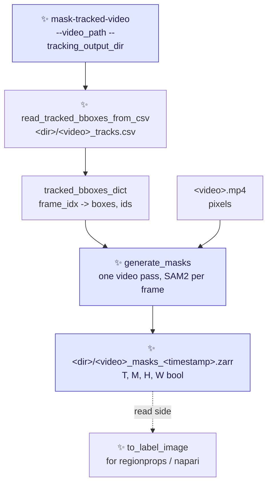
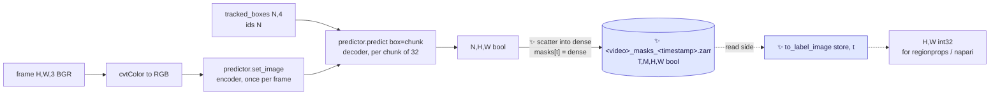
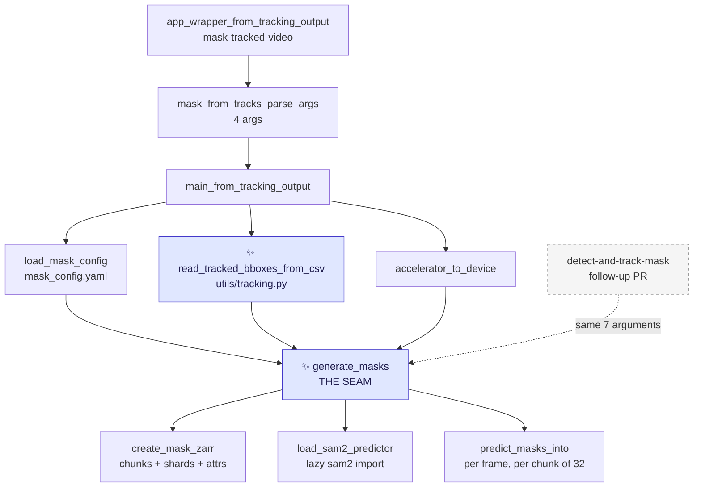

# Proposal for the `mask-tracked-video` entry point

## Description

A new CLI entry point, `mask-tracked-video`, that reads the `<video>_tracks.csv` of a previous
tracking run and writes one boolean mask per crab per frame, by prompting SAM2 with the tracked
boxes.

It needs no trained model and no detector pass.



Arrows point from an input to the step that consumes it. Dashed arrows are read-side, not part of
the run. ✨ marks what is new in this PR.

Node → code legend:

- `read_tracked_bboxes_from_csv` → [`crabs/tracker/utils/tracking.py`](../crabs/tracker/utils/tracking.py) (new function)
- `generate_masks` → `crabs/tracker/mask_video.py` (new module)
- `to_label_image` → `crabs/tracker/utils/masks.py` (new module)
- `<video>_tracks.csv` → written by [`write_tracked_detections_to_csv`](../crabs/tracker/utils/io.py#L84-L98)

> [!NOTE]
> Nomenclature
>
> - **Prompt** — a hint telling SAM2 *which* object to segment. Here, one bounding box in
>   `[x1, y1, x2, y2]` pixel coordinates per tracked crab.
> - **Instance plane** — a 2-D boolean array holding exactly one crab's mask. The store is a stack
>   of these, indexed by track ID. This is what is written to disk.
> - **Label image** — a 2-D integer array where `0` is background and every other value identifies
>   one object. This is the array `skimage.measure.regionprops` takes. Here it is derived on read
>   from the instance planes, never stored.

---

## References

- Issue [#249](https://github.com/SainsburyWellcomeCentre/crabs-exploration/issues/249)
  ("Uncouple pipeline steps"). This PR is a first, narrow instance of it: it uncouples *masking*
  from *detection + tracking*.
- [`proposal-detect-and-track-mask.md`](proposal-detect-and-track-mask.md) — the follow-up PR, which
  adds a second entry point running detection, tracking and masking in one command. It is built
  entirely on the masking pass this PR ships.
- [`this-repo-collects-tools-pure-kernighan.md`](this-repo-collects-tools-pure-kernighan.md) — this
  PR is a scoped-down first slice of its Phase 3.
- [`scripts/generate_masks_from_bboxes.py`](../scripts/generate_masks_from_bboxes.py) — the existing
  standalone SAM2 script this entry point supersedes for tracked boxes.

---

## Overview of steps

1. Add `read_tracked_bboxes_from_csv` to
   [`crabs/tracker/utils/tracking.py`](../crabs/tracker/utils/tracking.py), built on the
   `extract_bounding_box_info` already in the file.
2. Add `crabs/tracker/mask_video.py`: the masking pass `generate_masks`, and the
   `mask-tracked-video` entry point that calls it.
3. Add `crabs/tracker/utils/masks.py`: `to_label_image`, the read-side helper, pure Python.
4. Add `crabs/tracker/config/mask_config.yaml`: the three SAM2 and store knobs.
5. Declare the dependencies in [`pyproject.toml`](../pyproject.toml): the `mask-tracked-video`
   script, `zarr>=3`, and an opt-in `masks` dependency group for SAM2.
6. Update [`notebooks/notebook_visualise_masks_from_zarr.py`](../notebooks/notebook_visualise_masks_from_zarr.py)
   to read the new store shape directly.
7. Add unit tests that run without SAM2 installed, and one opt-in integration test.
8. Document the entry point, the install, and the store layout.

---

## Key aspects of suggested implementation

### 1. The masking pass is a function, and the entry point only builds its arguments

`generate_masks` needs exactly four things from its caller: the **video path**, a
**`tracked_bboxes_dict`**, an **output directory**, and the **device**.

```python
# crabs/tracker/mask_video.py                                                     ✨ new
def generate_masks(video_path, tracked_bboxes_dict, output_dir,
                   csv_file_path, device, mask_config, boxes_source):
    """Prompt SAM2 with tracked boxes and write one instance plane per track ID."""
```

This shape is the whole reason there is no class here.

- **`mask-tracked-video` builds those four from a directory and a CSV.** It parses
  `<dir>/<video>_tracks.csv` into the dict, and writes the store back into the directory it was
  given.
- **The follow-up PR builds the same four from a `Tracking` run**, in memory, with no change to
  `generate_masks` at all. See [§2](#2-the-seam-with-the-follow-up-pr).
- **A `TrackingAndMasking(Tracking)` subclass could not work here.** `Tracking.__init__` loads a
  checkpoint eagerly — it calls `get_mlflow_parameters_from_ckpt` and `get_config_from_ckpt` on
  `args.trained_model_path` ([track_video.py:56-68](../crabs/tracker/track_video.py#L56-L68)) — and
  then `prep_outputs` creates a *new* timestamped output directory
  ([track_video.py:104-111](../crabs/tracker/track_video.py#L104-L111)). `mask-tracked-video` has
  no checkpoint and its output directory already exists, so the subclass could only be constructed
  by bypassing its own parent's `__init__`.

**This PR touches no existing Python except one added function in `utils/tracking.py`.**
[`track_video.py`](../crabs/tracker/track_video.py), [`sort.py`](../crabs/tracker/sort.py),
[`utils/io.py`](../crabs/tracker/utils/io.py), `tracking_config.yaml`, the CSV format and the
detector are all untouched.

### 2. The seam with the follow-up PR

The follow-up PR, [`proposal-detect-and-track-mask.md`](proposal-detect-and-track-mask.md), adds a
second entry point and nothing else. Four things in this PR are what make that true, and each is
pinned by a test here so it cannot drift before the second PR lands.

| # | What this PR freezes | Why the follow-up PR needs it |
|---|---|---|
| 1 | The `generate_masks` signature above — plain values, no `args` namespace, no `Tracking` object | Its `main` is then ten lines that pass `inference.tracked_bboxes_dict`, `inference.tracking_output_dir` and `inference.csv_file_path` straight in |
| 2 | The `tracked_bboxes_dict` contract below | The tracker's in-memory dict has a different shape from the one parsed from CSV, in two ways |
| 3 | The `.attrs` key set, `boxes_source` included ([§4](#4-output-format-a-zarr-t-m-h-w-boolean-array-one-plane-per-track-id)) | Stores written by this PR and by the follow-up PR have identical metadata keys, so one reader handles both |
| 4 | `accelerator_to_device`, `load_mask_config`, `MASK_DEFAULTS`, `DEFAULT_MASK_CONFIG` and `MASK_CONFIG_HELP` as module-level names | The second entry point reuses all five rather than restating them |

**The `tracked_bboxes_dict` contract.** `generate_masks` reads a mapping of frame index to
`{"tracked_boxes": (n, 4) float64, "ids": (n,) float64}`, and must tolerate both producers:

```python
FOR EACH frame_idx IN 0 .. total_n_frames - 1:
    frame_data = tracked_bboxes_dict.get(frame_idx)        # .get, never [...]
    IF frame_data is None or len(frame_data["tracked_boxes"]) == 0:
        skip                                               # leave the planes at fill_value
```

- **Keys may be sparse or dense.** A CSV has no row for a frame with no tracked boxes, so that
  frame is simply absent as a key. `core_detection_and_tracking` instead emits a key for *every*
  frame ([track_video.py:264-268](../crabs/tracker/track_video.py#L264-L268)), some with zero
  boxes. `.get(frame_idx)` plus the length check covers both.
- **Values may carry extra keys.** The tracker's dict has a `"scores"` key
  ([track_video.py:267](../crabs/tracker/track_video.py#L267)); the one parsed from CSV does not.
  `generate_masks` never reads `"scores"` and never validates the key set, so both are accepted.
- **`len(tracked_bboxes_dict)` is not `total_n_frames`.** The frame count comes from the video, via
  `get_video_parameters` ([io.py:21](../crabs/tracker/utils/io.py#L21)), never from the dict.
- **An empty dict must not raise.** `M = max(track_id)` over an empty dict has no maximum, so the
  entry point fails early with a clear message instead.

> [!IMPORTANT]
> Test 12 in [Tests](#tests) feeds `generate_masks` a **dense** dict carrying a `"scores"` key —
> the exact shape the follow-up PR will pass — and asserts it produces the same store as the sparse
> one. That test exists only for the second PR, and it is the cheapest possible insurance that the
> second PR stays a ten-line `main`.

### 3. Reading the boxes back: ~15 lines, and one lossy column pair

Both halves already exist in the repo. `extract_bounding_box_info` parses one VIA row
([tracking.py:47-86](../crabs/tracker/utils/tracking.py#L47-L86)), including recovering the frame
index from the `frame_{:08d}.png` filename, and `TrackerEvaluate` already reassembles corner
coordinates and IDs from its output
([evaluate_tracker.py:73-105](../crabs/tracker/evaluate_tracker.py#L73-L105)).

The new function is that same loop, regrouped:

```python
# crabs/tracker/utils/tracking.py                                            ✨ new
def read_tracked_bboxes_from_csv(csv_file_path: str) -> dict:
    """Read a <video>_tracks.csv back into the dict core_detection_and_tracking returns.

    Maps frame index -> {"tracked_boxes": (n, 4) float64, "ids": (n,) float64}.
    float64, not float32: that is what Sort.update emits (sort.py:204-210), so
    this matches the in-memory dict exactly rather than approximately.

    The "scores" key is deliberately absent: masking never reads it, and the
    confidence column is known to be unreliable (Points to discuss #6c).
    """
```

> [!NOTE]
> **What the CSV does and does not preserve.** `write_tracked_detections_to_csv` stores
> `x`, `y`, `width`, `height` ([io.py:84-98](../crabs/tracker/utils/io.py#L84-L98)), and the reader
> rebuilds `[x, y, x + width, y + height]`.
>
> `x` and `y` are written through an f-string on a numpy float64, whose `str` is the round-tripping
> repr, so they come back **bit-identical** — but only if the reader stays in float64. Narrowing to
> float32, as `TrackerEvaluate` does for ground truth
> ([evaluate_tracker.py:95](../crabs/tracker/evaluate_tracker.py#L95)), would quietly lose that.
>
> `width` and `height`, by contrast, are written through `int(...)` — **truncated, not rounded** —
> so `xmax` and `ymax` come back up to 1 px small, and never large. Track IDs round-trip exactly
> (`int(id)` out, `int(float(...))` back in).
>
> Checked numerically rather than assumed, over 10,000 synthetic boxes through the real format
> string: `x`/`y` bit-exact in 10,000 cases out of 10,000, `xmax`/`ymax` error in `(-1, 0]` px, and
> float32 narrowing bit-exact in **0** of 10,000.

**The prompts are therefore up to 1 px smaller than the boxes the tracker actually produced.** That
is acceptable at this object size, and it is a property of the CSV, not of this entry point — see
*Points to discuss* [#6b](#points-to-discuss) for the one-line fix that belongs in its own PR.

**One validity check at load time** catches a CSV belonging to a different clip: every frame index
parsed from the CSV must be in `0..T-1` for the video passed as `--video_path`.

### 4. Output format: a zarr `(T, M, H, W)` boolean array, one plane per track ID

```
<video>_masks_<timestamp>.zarr/      # zarr group, matching the existing store layout
└── masks   (T, M, H, W) bool        # dims: image_id, id, img_h, img_w
```

- **Axis 1 is indexed by track ID, with `m = track_id - 1`.** That mapping is exact, not a
  convention: `KalmanBoxTracker` numbers itself from a 0-based class counter
  ([sort.py:76-77](../crabs/tracker/sort.py#L76-L77)) and `Sort.update` emits `trk.id + 1`
  ([sort.py:210](../crabs/tracker/sort.py#L210)), so the IDs in `<video>_tracks.csv` are 1-based.

    ```python
    import zarr

    masks = zarr.open("<video>_masks_<timestamp>.zarr", mode="r")["masks"]
    masks[t, track_id - 1]     # (H, W) bool — one crab in one frame, SAM2's output verbatim
    masks[t]                   # (M, H, W)   — every crab in frame t
    masks[:, track_id - 1]     # (T, H, W)   — one crab's whole trajectory, in a single slice
    ```

- **Why per-instance planes and not a single label image.** A label image cannot represent two
  crabs occupying the same pixel, and this scene has ~100 frequently touching individuals — so
  flattening would silently discard one crab's overlapping pixels. Here each crab owns its plane:
  overlap is representable, nothing is discarded, and there is **no overlap policy to choose**.

- **It is the shape the existing consumer already builds by hand.**
  [`notebook_visualise_masks_from_zarr.py`](../notebooks/notebook_visualise_masks_from_zarr.py)
  takes a `(T, H, W)` label image and one-hot expands it into exactly
  `(image_id, id, img_h, img_w)` boolean with a dask `map_blocks`
  ([:142-174](../notebooks/notebook_visualise_masks_from_zarr.py#L142-L174)), under the comment
  *"CONS: can be slow to compute"*. Writing the planes directly deletes that expansion and its
  cost, and `sel(image_id=..., id=...)`
  ([:181](../notebooks/notebook_visualise_masks_from_zarr.py#L181)) keeps working unchanged. The
  dim names above are taken from that notebook.

- **`bool`, and the whole dtype question disappears.** Identity lives in the *axis*, not in the
  pixel values, so there is nothing to encode and no `int16`/`int32`/`uint16` ceiling to argue
  about.

    > [!NOTE]
    > [`generate_masks_from_bboxes.py`](../scripts/generate_masks_from_bboxes.py) opens its store as
    > `dtype="bool"` ([:120](../scripts/generate_masks_from_bboxes.py#L120)) but writes an `int16`
    > ID-encoded array into it ([:191](../scripts/generate_masks_from_bboxes.py#L191)), so every ID
    > is silently coerced to `True` and the instance IDs are lost. Under this format `bool` is the
    > *correct* dtype, because no ID is ever stored in a pixel. The bug cannot be expressed.

- **The whole shape is known before the masking loop starts**, so the array is never resized.
  `T`, `H` and `W` come from the video, via `get_video_parameters`
  ([io.py:21](../crabs/tracker/utils/io.py#L21)); `M = max(track_id)` over the
  `tracked_bboxes_dict`. Not every ID in `1..M` is necessarily emitted — a tracker suppressed below
  `min_hits` still burns a counter value — so a few planes stay empty for the whole video. Those
  are never written.

- **The store filename is timestamped**, `<video>_masks_<YYYYMMDD_HHMMSS>.zarr`, which is what both
  existing SAM2/SAM3 mask scripts in this repo already do — `masks_{timestamp}.zarr` in
  [generate_masks_from_bboxes.py:219-221](../scripts/generate_masks_from_bboxes.py#L219-L221) and
  in [segment_burrows_sam3.py:181-184](../scripts/burrows/segment_burrows_sam3.py#L181-L184), the
  latter documented as *"timestamped so runs don't collide"*
  ([scripts/burrows/README.md](../scripts/burrows/README.md)). It is what makes re-masking the same
  directory with a different SAM2 model safe, which is the whole point of this entry point. The
  cost is that readers glob for the store instead of naming it.

**Metadata in `.attrs` on the group.** This key set is frozen here and the follow-up PR adds
nothing to it ([§2](#2-the-seam-with-the-follow-up-pr)):

```python
{
    "timestamp": ..., "sam2_model": ..., "device": ...,
    "source_video": str(input_video_path),
    "tracks_csv": str(csv_file_path),           # the file these IDs refer to
    "boxes_source": "tracks_csv",               # or "tracker", from the follow-up PR
    "n_frames": ..., "image_shape": [H, W],
    "dims": ["image_id", "id", "img_h", "img_w"],
    "mask_encoding": "instance_planes",          # asserted against the array dtype (bool)
    "track_id_offset": 1,                        # m = track_id - track_id_offset
    "n_track_ids": ...,                          # M, the size of axis 1
    "n_track_ids_emitted": ...,                  # planes non-empty in at least one frame
    "prompt_type": "bounding_box",
    "prompt_source": "tracked_boxes",
    "multimask_output": False,
}
```

There is deliberately **no `overlap_policy` and no `background_label`** key: this format has
neither, which is the point of it.

`boxes_source` takes only one value in this PR. It is declared as a `generate_masks` parameter
anyway, so that stores written before and after the follow-up PR carry the same keys and one reader
handles both.

### 5. Chunking, sharding, and the whole-frame write they force

**`chunks=(1, 1, H, W)`** — one chunk per (frame, crab), the unit every access pattern in
[§4](#4-output-format-a-zarr-t-m-h-w-boolean-array-one-plane-per-track-id) reads.

A chunk is 2.07 MB raw at 1920×1080 and ~0.17% non-zero, so it compresses to a few KB, and zarr
does not write all-`False` chunks at all. The count is the problem: ~`n_frames × n_crabs` ≈
**300,000 chunks** for a 3000-frame clip, which means 300,000 files in a directory store — genuinely
bad on the cluster's network filesystem.

**The mitigation is zarr 3's sharding codec**, `shards=(1, 128, H, W)`, packing 128 planes per file
and cutting the count to `n_frames × ceil(M/128)`.

**This is measured, not assumed** (zarr 3.2.1, 60 frames at 1920×1080, M=100; full numbers in
*Points to discuss* [#1](#points-to-discuss)). Sharding delivers **61 files instead of 6001**,
1.80 MB vs 1.68 MB on disk, and a whole-frame write no slower than unsharded.

**But it dictates how the writer must write.** A frame goes in as a single dense `(M, H, W)`
assignment:

```python
dense[:] = False                  # (M, H, W) bool, allocated once outside the frame loop
dense[track_ids - 1] = masks      # (N, H, W) scattered into N of the M planes
mask_zarr[frame_idx] = dense      # one whole-frame write
```

The obvious `mask_zarr.oindex[frame_idx, track_ids - 1] = masks` does not work. It raises

```
ValueError: shape mismatch: value array of shape (N, H, W)
            could not be broadcast to indexing result of shape (H*W,)
```

from inside zarr's sharding partial-write path. Verified on zarr 3.2.1 and on 3.3.0, the current
release; `oindex` and plain `arr[t, ids - 1]` fail identically, so the spelling is not the issue,
and it is not about the IDs being scattered — contiguous IDs and a single-element list fail the
same way. Unsharded, both spellings work.

> [!IMPORTANT]
> If sharding is ever disabled (`shard_n_planes: null`), indexed assignment starts working again —
> so this must not be "simplified" back to `oindex` after a test run without shards. Test
> [6a](#tests) pins the dense write against a sharded store.

The dense write is the fast path, not merely the working one: it fills each shard in a single pass
with no read-modify-write. Its cost is the buffer — `M × H × W` bool, **207 MB at M=100 and
1920×1080** — which is counted against the memory budget in [Gotchas](#gotchas).

### 6. Writing planes, and rebuilding a label image on read

SAM2 already returns per-instance masks, so the write path has **no combining step at all**. The
flattening that `regionprops` needs happens on the read side, where the caller chooses the policy
and nothing on disk is affected.



Arrows are sequential steps within one frame. Dashed arrows are the read side, run later by a
consumer, not by this entry point.

**Read side** — one helper in a new `crabs/tracker/utils/masks.py`, pure (no `sam2`, no torch), so
it is unit-testable on CI:

```python
def to_label_image(mask_planes, track_ids=None, policy="higher_track_id_wins"):
    """(M, H, W) bool -> (H, W) int32 label image, for regionprops and napari.

    This is where the overlap decision lives: it is the caller's, per call,
    and it never touches what is stored.
    """
```

`ellipses_from_labels` in the notebook
([:52](../notebooks/notebook_visualise_masks_from_zarr.py#L52)) consumes its output unchanged.

**What this costs.** The store is no longer directly openable in napari — `viewer.add_labels` on a
`(T, M, H, W)` boolean array gives a slider over crabs, not a frame view. Callers go through
`to_label_image` instead, which is one line at the two call sites in the notebook
([:219](../notebooks/notebook_visualise_masks_from_zarr.py#L219),
[:226-229](../notebooks/notebook_visualise_masks_from_zarr.py#L226-L229)).

### 7. Configuration: a separate mask config file

The three knobs go in a new config file of their own, not into the tracking config:

```yaml
# crabs/tracker/config/mask_config.yaml   ✨ new file
sam2_model_id: facebook/sam2.1-hiera-base-plus   # matches the existing script's default
max_prompts_per_batch: 32                        # see Gotchas
shard_n_planes: 128                              # see §5; null disables sharding
```

**Why not a `masks:` block in `tracking_config.yaml`.**

- **`mask-tracked-video` never reads the tracking config at all.** It has no `--config_file`
  argument and no SORT parameters to load, so the SAM2 knobs cannot live inside a file it does not
  open. This reason alone settles it.
- [`tracking_config.yaml`](../crabs/tracker/config/tracking_config.yaml) is currently four flat SORT
  scalars. A `masks:` block would be the first nested structure in it.
- The two have unrelated tuning lifecycles. Comparing `-tiny` / `-small` / `-base-plus` is
  mask-config churn that should never touch SORT parameters.
- The integration test fetches its `tracking_config.yaml` from the pooch/GIN registry
  ([test_inference.py:45](../tests/test_integration/test_inference.py#L45)) and **that file has no
  `masks:` key**, so a merged block would have to be defensively defaulted.

**Read the file as** `{**MASK_DEFAULTS, **(yaml.safe_load(f) or {})}`. The defaults dict is needed
so that a user's older config missing `shard_n_planes` does not fail, and the `or {}` so that an
empty file yields the defaults rather than `None`.

### 8. The argument parser: four arguments, declared outright

```python
# crabs/tracker/mask_video.py                                                ✨ new
DEFAULT_MASK_CONFIG = str(Path(__file__).parent / "config" / "mask_config.yaml")

MASK_CONFIG_HELP = (
    "Location of YAML config to control masking. "
    "Default: crabs-exploration/crabs/tracker/config/mask_config.yaml. "
)


def mask_from_tracks_parse_args(args):
    """Parse arguments for mask-tracked-video. Four arguments, no inheritance."""
    parser = argparse.ArgumentParser()
    parser.add_argument(
        "--video_path", type=str, required=True,
        help="Location of the video the tracks refer to. SAM2 reads its pixels.",
    )
    parser.add_argument(
        "--tracking_output_dir", type=str, required=True,
        help=(
            "Location of an existing tracking output directory, holding the "
            "<video-name>_tracks.csv written by detect-and-track-video. The mask "
            "store is written into this same directory, with a timestamp in its "
            "name so runs do not collide. "
        ),
    )
    parser.add_argument(
        "--mask_config_file", type=str,
        default=DEFAULT_MASK_CONFIG, help=MASK_CONFIG_HELP,
    )
    parser.add_argument(
        "--accelerator", type=str, default="gpu",
        help="Accelerator for Pytorch. Valid inputs are: cpu, mps, or gpu. Default: gpu.",
    )
    return parser.parse_args(args)
```

**Every argument is one the entry point actually uses**, so there is no validation function, no
"ignored argument" logging, and no `--help` entry that does nothing.

**`--tracking_output_dir` takes a directory, not a CSV path.** The CSV path is derived from that
directory and `Path(--video_path).stem` by the same rule `prep_outputs` uses
([track_video.py:114-117](../crabs/tracker/track_video.py#L114-L117)), so a `--video_path` that
does not match the directory fails as a missing file rather than silently masking the wrong clip.

**`DEFAULT_MASK_CONFIG` and `MASK_CONFIG_HELP` are module constants** rather than inline literals,
because the follow-up PR's parser reuses both
([§2](#2-the-seam-with-the-follow-up-pr)).

This follows the shape the other entry points already have — one `*_parse_args(args)` per entry
point, returning one namespace — so `main` and `app_wrapper` take a single `args` as everywhere
else in the package.

---

## Detailed implementation



Arrows point from a caller to what it calls. The dashed node and arrow are the follow-up PR, not in
scope here — they are drawn to show that it attaches at exactly one place.

### The 8 changes

| # | Change | Signature / diff |
|---|---|---|
| 1 | **new** `crabs/tracker/mask_video.py` — the masking pass and the entry point, ~180 lines | see below |
| 2 | **new** `crabs/tracker/utils/masks.py` — the read-side helper, ~25 lines | `to_label_image` ([§6](#6-writing-planes-and-rebuilding-a-label-image-on-read)) |
| 3 | [`crabs/tracker/utils/tracking.py`](../crabs/tracker/utils/tracking.py) — read the CSV back, ~15 lines | `read_tracked_bboxes_from_csv(csv_file_path) -> dict` ([§3](#3-reading-the-boxes-back-15-lines-and-one-lossy-column-pair)), reusing `extract_bounding_box_info` |
| 4 | **new** `crabs/tracker/config/mask_config.yaml` | the three SAM2 and store knobs ([§7](#7-configuration-a-separate-mask-config-file)) |
| 5 | [`pyproject.toml`](../pyproject.toml) | one new script, `mask-tracked-video = "crabs.tracker.mask_video:app_wrapper_from_tracking_output"`; declare `zarr>=3`; add the `masks` dependency group and `[tool.uv] no-build-isolation-package` ([Dependencies](#dependencies)) |
| 6 | **new** `tests/test_unit/test_mask_video.py` | unit tests for the pure helpers, no `sam2` needed |
| 7 | [`notebooks/notebook_visualise_masks_from_zarr.py`](../notebooks/notebook_visualise_masks_from_zarr.py) | read the 4-D store directly; route napari through `to_label_image` |
| 8 | [`crabs/tracker/README.md`](../crabs/tracker/README.md) + [`guides/DetectAndTrackHPC.md`](../guides/DetectAndTrackHPC.md) | how to install the `masks` group, run the entry point, and read the store back |

<details>
<summary><b>1. The new module in full outline</b></summary>

Module-level functions only — no new class, for the reason in
[§1](#1-the-masking-pass-is-a-function-and-the-entry-point-only-builds-its-arguments). Everything
except `load_sam2_predictor`, `predict_masks_into` and the video loop in `generate_masks` is pure —
no `sam2`, no torch, no I/O beyond zarr and the config file — which is what makes the unit tests
possible on CI.

```python
"""Mask tracked crabs in a video with SAM2."""

DEFAULT_MASK_CONFIG = str(Path(__file__).parent / "config" / "mask_config.yaml")

MASK_DEFAULTS = {
    "sam2_model_id": "facebook/sam2.1-hiera-base-plus",
    "max_prompts_per_batch": 32,
    "shard_n_planes": 128,          # §5; None disables sharding
}


def mask_from_tracks_parse_args(args):
    """Arguments for mask-tracked-video: four, declared outright.  [§8]"""


def load_mask_config(path) -> dict:
    """Read the mask config, backfilled with MASK_DEFAULTS.  [§7]"""
    with open(path) as f:
        return {**MASK_DEFAULTS, **(yaml.safe_load(f) or {})}


def create_mask_zarr(path, n_frames, n_track_ids, image_shape, metadata_dict) -> zarr.Array:
    """Open a (T, M, H, W) bool array named "masks" in a group at `path`.

    chunks=(1, 1, H, W), shards=(1, shard_n_planes, H, W), fill_value=False.
    Asserts the array dtype is bool, matching metadata["mask_encoding"]
    == "instance_planes" — the guard that keeps §4's warning from recurring.
    """


def load_sam2_predictor(model_id: str, device: str):
    """Import sam2 lazily and return a SAM2ImagePredictor.  [Dependencies]"""
    try:
        from sam2.sam2_image_predictor import SAM2ImagePredictor
    except ImportError as e:
        raise ImportError(
            "mask-tracked-video needs SAM2. Install it with:\n"
            "  uv sync --group masks\n"
            "or, in a conda env with torch already installed:\n"
            '  pip install --no-build-isolation "sam-2 @ git+https://github.com/facebookresearch/sam2.git"'
        ) from e
    return SAM2ImagePredictor.from_pretrained(model_id, device=device)


def predict_masks_into(predictor, frame_bgr, boxes, track_ids, dense, max_prompts_per_batch):
    """SAM2 on one frame, scattered straight into the caller's (M, H, W) bool buffer.

    Writes into `dense` rather than returning (N, H, W), so each prompt chunk's
    float masks are released before the next chunk is predicted (Gotchas), and so
    the caller holds exactly one frame-sized buffer for the whole pass (§5).
    """
    predictor.set_image(cv2.cvtColor(frame_bgr, cv2.COLOR_BGR2RGB))
    FOR EACH (box_chunk, id_chunk) OF (boxes, track_ids), size max_prompts_per_batch:
        masks, _iou, _low_res = predictor.predict(box=box_chunk, multimask_output=False)
        dense[id_chunk - 1] = masks.reshape(len(box_chunk), *masks.shape[-2:]).astype(bool)


def generate_masks(video_path, tracked_bboxes_dict, output_dir,
                   csv_file_path, device, mask_config, boxes_source):
    """The masking pass. Takes what it needs, so a second entry point can share it.  [§1, §2]"""


def accelerator_to_device(accelerator):
    """"gpu" -> "cuda", mirroring Tracking.__init__ (track_video.py:79-82).

    Three lines, duplicated rather than refactored out of Tracking, so that
    track_video.py is not touched at all in this PR.
    """


def main_from_tracking_output(args):       # mask-tracked-video
    output_dir = Path(args.tracking_output_dir)
    csv_file_path = output_dir / f"{Path(args.video_path).stem}_tracks.csv"
    IF not csv_file_path.exists():
        raise FileNotFoundError(...)       # names the path it looked for
    generate_masks(
        args.video_path,
        read_tracked_bboxes_from_csv(csv_file_path),    # §3
        output_dir,
        csv_file_path,
        accelerator_to_device(args.accelerator),
        load_mask_config(args.mask_config_file),
        boxes_source="tracks_csv",
    )


def app_wrapper_from_tracking_output():    # mask-tracked-video
    logging.getLogger().setLevel(logging.INFO)
    torch.set_float32_matmul_precision("medium")
    main_from_tracking_output(mask_from_tracks_parse_args(sys.argv[1:]))
```

`generate_masks`, mirroring the structure of `write_all_video_frames_as_images`
([io.py:205](../crabs/tracker/utils/io.py#L205)):

```python
def generate_masks(video_path, tracked_bboxes_dict, output_dir,
                   csv_file_path, device, mask_config, boxes_source):
    predictor = load_sam2_predictor(mask_config["sam2_model_id"], device)

    # The whole shape is knowable here, identically for both producers  [§2, §4]
    video_params = get_video_parameters(video_path)        # io.py:21
    total_n_frames = video_params["total_frames"]
    H, W = video_params["frame_height"], video_params["frame_width"]
    n_track_ids = max(
        int(frame["ids"].max()) for frame in tracked_bboxes_dict.values() if len(frame["ids"])
    )
    timestamp = datetime.now().strftime("%Y%m%d_%H%M%S")      # §4; same format as the repo
    mask_zarr = create_mask_zarr(
        output_dir / f"{Path(video_path).stem}_masks_{timestamp}.zarr",
        total_n_frames, n_track_ids, (H, W), metadata,     # metadata records boxes_source
    )

    input_video_object = open_video(video_path)
    dense = np.zeros((n_track_ids, H, W), dtype=bool)   # allocated once  [§5, Gotchas]
    frame_idx = 0
    WHILE input_video_object.isOpened():
        ret, frame = input_video_object.read()
        IF not ret:
            parse_video_frame_reading_error_and_log(frame_idx, total_n_frames)
            break

        # .get, not [...]: the CSV has no key for a frame with no boxes  [§2]
        frame_data = tracked_bboxes_dict.get(frame_idx)
        IF frame_data is not None and len(frame_data["tracked_boxes"]) > 0:
            dense[:] = False
            predict_masks_into(
                predictor, frame, frame_data["tracked_boxes"],
                frame_data["ids"].astype(int), dense,
                mask_config["max_prompts_per_batch"],
            )
            mask_zarr[frame_idx] = dense      # one whole-frame write  [§5]
        frame_idx += 1

    input_video_object.release()
```

Frames with no tracked boxes are left at the store's `fill_value=False`, and those chunks are never
written — correct by construction, whether the frame was absent from the dict or present and empty.

Two invariants worth asserting at the end of the run, both cheap and both about the ID↔axis mapping
the format depends on: every emitted track ID is in `1..M`, and every populated plane index is
`< M`.

</details>

<details>
<summary><b>2. Module naming, and why not <code>track_and_mask_video.py</code></b></summary>

The module is named `crabs/tracker/mask_video.py`, sitting beside the existing
[`track_video.py`](../crabs/tracker/track_video.py).

- **It does no tracking**, so `track_and_mask_video.py` would be a wrong name for the whole life of
  this PR.
- **The follow-up PR adds its entry point to the same module**, which is then still correctly
  named: both entry points mask a video, and they share `generate_masks` and everything under it.
- **Renaming a module between the two PRs is churn with a cost**: the console-script path in
  [`pyproject.toml`](../pyproject.toml) points at it, so a rename is a user-visible break for
  anyone who installed the first PR.

The alternative is three modules — `masking.py` for the shared pass, plus one thin module per entry
point. It is cleaner on paper and worth taking if `mask_video.py` grows past roughly 300 lines, but
it is more files than this PR's content justifies. See *Points to discuss*
[#3](#points-to-discuss).

</details>

<details>
<summary><b>3. Formats considered and rejected</b></summary>

All four are lossless-or-not on overlap, and all four are `regionprops`-shaped at read time. The
choice came down to what the downstream access pattern is.

| Format | Lossless on overlap | `masks[:, tid]` per-crab slice | Opens in napari as-is | Note |
|---|---|---|---|---|
| **`(T, M, H, W)` bool, plane per track ID** ✅ chosen | yes | **yes, one slice** | no | chunk count is the cost — answered by sharding ([§5](#5-chunking-sharding-and-the-whole-frame-write-they-force)) |
| `(T, H, W)` int32 label image | **no** | no | yes | simplest; discards the lower-ID crab's overlapping pixels |
| `(T, K, H, W)` int32 overlap layers | yes | no | plane 0 ≈ whole frame | `K`≈2–4; needs a greedy packing pass at write time |
| bbox-local crops + index table | yes | no (needs a scan) | no | ~500× smaller raw, but ragged and no time-slicing |

**Why not the label image.** It cannot represent two crabs on one pixel, and the ellipse fits the
orientation work wants would be biased by exactly the neighbours that touch most. Rejected on
losslessness, not on size — zarr compresses a label image well enough that size was never the
deciding argument.

**Why not overlap layers.** Genuinely close, and better on chunk count and napari. It loses because
the axis carries no identity, so `masks[:, tid]` — one crab's whole trajectory in a single read —
is not expressible. That slice is what the orientation work will be built on.

**Why not crops.** Much the smallest, and the only one that scales to long clips without thought.
Rejected for now because it is ragged (two arrays plus offset bookkeeping), needs a scan to
assemble one crab's time series, and cannot be read without the repo's helpers. Worth revisiting if
*Points to discuss* [#1](#points-to-discuss) or [#2](#points-to-discuss) comes back badly.

**Why not one chunk per frame** — `chunks=(1, M, H, W)`, same format, coarser chunking. It is the
obvious way to kill the file-count problem without the sharding codec at all, and it makes the
write trivially correct. Measured, 60 frames at 1920×1080, M=100:

| layout | files | disk | `masks[t, tid]` | `masks[t]` | `masks[:, tid]` |
|---|---|---|---|---|---|
| per-instance chunks, unsharded | 6001 | 1.68 MB | 0.6 ms | 15.9 ms | 9.9 ms |
| **per-instance chunks + `shards=(1,128,H,W)`** ✅ | **61** | 1.80 MB | **0.9 ms** | 23.5 ms | **22.1 ms** |
| `chunks=(1, M, H, W)`, one per frame | 61 | 1.42 MB | 5.4 ms | 10.5 ms | **170.5 ms** |

Extrapolated to 3000 frames, one crab's trajectory costs **1.1 s** chunked-and-sharded versus
**8.5 s** with per-frame chunks. Three reasons per-frame chunking loses:

1. **It buys nothing sharding does not.** Both give 3050 files. Sharding *is* the mechanism for
   "many chunks, one file", so per-frame chunking gives up per-plane granularity for free.
2. **`masks[:, tid]` costs ~8× more**, because reading one crab means decompressing every frame's
   entire `M`-plane chunk — ~100× more data than asked for.
3. **The chunk size scales with `M`, and `M` is not bounded by 100.** `M = max(track_id)`, not
   crabs-per-frame. A chunk is zarr's minimum decompression unit, so a per-frame chunk means every
   read — napari asking for a single plane included — decompresses `M × H × W`:

    | layout | M | chunk raw size | `masks[:, tid]` |
    |---|---|---|---|
    | `chunks=(1, M, H, W)` | 100 | 52 MB | 17.4 ms |
    | `chunks=(1, M, H, W)` | 400 | **207 MB** | 40.1 ms |
    | `chunks=(1,1,H,W)` + shards | 100 | 1 MB | 14.2 ms |
    | `chunks=(1,1,H,W)` + shards | 400 | **1 MB** | 14.2 ms |

    (540×960 here, so the raw sizes are a quarter of full resolution.) Sharding holds the chunk at
    2.07 MB whatever `M` does, and just packs more chunks per file.

</details>

---

## Files changed

| File | Change |
|---|---|
| `crabs/tracker/mask_video.py` | **new** — the masking pass and the `mask-tracked-video` entry point |
| `crabs/tracker/utils/masks.py` | **new** — `to_label_image` |
| `crabs/tracker/config/mask_config.yaml` | **new** — SAM2 and store knobs, separate from the tracking config |
| [`crabs/tracker/utils/tracking.py`](../crabs/tracker/utils/tracking.py) | one added function, `read_tracked_bboxes_from_csv`, built on the `extract_bounding_box_info` already in the file |
| [`pyproject.toml`](../pyproject.toml) | new `mask-tracked-video` script; declare `zarr>=3`; `[dependency-groups] masks` + `[tool.uv] no-build-isolation-package` |
| `tests/test_unit/test_mask_video.py` | **new** |
| [`tests/test_unit/test_entry_points.py`](../tests/test_unit/test_entry_points.py) | add `mask-tracked-video` to the parametrised list |
| [`tests/test_integration/test_inference.py`](../tests/test_integration/test_inference.py) | add `test_mask_tracked_video`, reusing the `input_data_paths` fixture |
| [`notebooks/notebook_visualise_masks_from_zarr.py`](../notebooks/notebook_visualise_masks_from_zarr.py) | drop the one-hot `map_blocks` expansion ([:142-174](../notebooks/notebook_visualise_masks_from_zarr.py#L142-L174)) — the store is already 4-D; route the two napari calls through `to_label_image`; glob for the timestamped store name |
| [`crabs/tracker/README.md`](../crabs/tracker/README.md) | document the entry point, `--mask_config_file`, the store layout and how to read it back |
| [`guides/DetectAndTrackHPC.md`](../guides/DetectAndTrackHPC.md) | installing the `masks` group on the cluster; staging the mask config file |

**Nothing else is touched.** In particular: no change to
[`track_video.py`](../crabs/tracker/track_video.py), to [`sort.py`](../crabs/tracker/sort.py), to
[`utils/io.py`](../crabs/tracker/utils/io.py), to `tracking_config.yaml`, to the CSV format, to
`evaluate_tracker.py`, or to the detector. The existing `detect-and-track-video` command cannot
regress, because no file it executes is edited.

---

## Tests

Yes. The unit tests are the substance here, because the format contract is what the follow-up PR
and every downstream consumer depend on.

**Pure unit — must pass with no `sam2` installed (this is the CI shape).** New file
`tests/test_unit/test_mask_video.py`.

1. **The ID↔axis mapping, which is the core contract.** Scatter three masks with IDs `[7, 3, 12]`
   into a dense `(M, H, W)` buffer and write it as `masks[t] = dense`, then assert `masks[t, 6]`,
   `masks[t, 2]` and `masks[t, 11]` are the masks that went in, and that every other plane in frame
   `t` is all-`False`.
2. **Overlap is preserved.** Two masks with IDs `3` and `12` sharing a block of pixels: both planes
   still contain the shared pixels in full, and each plane's `sum()` equals its input's. This is
   the test that would fail under the label-image format.
3. **`to_label_image`.** Non-overlapping planes give a label image whose non-zero values are
   exactly `{3, 7, 12}`, regions in the right places; overlapping planes resolve by `policy`, and
   the result does not depend on plane order.
4. **Round-trip through the consumer.** Feed `to_label_image` output to
   `skimage.measure.regionprops` and assert `{p.label for p in props} == {3, 7, 12}`.
5. **A frame with no tracked boxes** leaves every plane all-`False` and does not raise.
6. **`create_mask_zarr`.** dtype is `bool`, `fill_value` is `False`, chunks are `(1, 1, H, W)`,
   shards are `(1, 128, H, W)`, and `.attrs["mask_encoding"] == "instance_planes"` — plus a test
   that the internal assertion **fires** if the dtype and the declared encoding disagree.

    **6a. The write path against a *sharded* store — the one zarr will not forgive.** Build the
    store through `create_mask_zarr` (so `shards` is set, as in production — *not* a bare
    `zarr.create_array` with chunks only), write two frames of scattered IDs through the dense
    assignment, and round-trip them. Indexed assignment (`arr[t, ids - 1]` or `oindex`) raises
    `ValueError` on a sharded array in zarr 3.2.1 and 3.3.0 but works fine unsharded — so a test
    built on an unsharded fixture would pass while production crashed on frame 0. Assert the
    fixture *is* sharded, so the test cannot quietly stop covering the thing it exists to cover.

7. **`load_sam2_predictor`** raises `ImportError` with the install command in the message when
   `sam2` is absent (`monkeypatch` the import) — assert the message names `uv sync --group masks`,
   so it cannot drift from the group actually declared in [`pyproject.toml`](../pyproject.toml).
8. **`mask_from_tracks_parse_args`.** Its namespace has **exactly** the four expected attributes —
   `set(vars(...)) == {"video_path", "tracking_output_dir", "mask_config_file", "accelerator"}`.
   That equality, not a subset check, is the test that this entry point never acquires an inert
   argument. Plus: `--video_path` and `--tracking_output_dir` each missing exits `2`, and `--help`
   exits `0`.
9. **`read_tracked_bboxes_from_csv`, against a CSV written by the real writer.** Build a small
   `tracked_bboxes_dict`, write it with `write_tracked_detections_to_csv`, read it back, and
   assert: the frame indices recovered are exactly those that had at least one box; `ids` are
   exactly equal; `xmin`/`ymin` are exactly equal; and `xmax`/`ymax` are within
   `[original - 1, original]` — **asserting the truncation as a property rather than pretending the
   round-trip is exact**. [`test_tracking_io.py`](../tests/test_unit/test_tracking_io.py)
   ([:51](../tests/test_unit/test_tracking_io.py#L51)) already has a fixture of this shape to build
   from. Also: a frame whose boxes are all absent yields no key, a CSV with only a header yields
   `{}`, and the returned arrays are `float64`.
10. **`load_mask_config`.** A config missing `shard_n_planes` is backfilled from `MASK_DEFAULTS`,
    and an empty file yields the defaults rather than raising — the guard against `yaml.safe_load`
    returning `None`.
11. **A CSV from a different clip fails loudly.** A frame index outside `0..T-1` raises, rather
    than writing masks past the end of the store.
12. **✨ Forward compatibility with the follow-up PR.** Call `generate_masks` (with the SAM2 call
    monkeypatched) twice on the same boxes: once with a **sparse** dict with no `"scores"` key, as
    `read_tracked_bboxes_from_csv` returns; once with a **dense** dict carrying a `"scores"` key of
    a *different length*, as `core_detection_and_tracking` returns
    ([track_video.py:264-268](../crabs/tracker/track_video.py#L264-L268)). Assert both produce the
    same populated `(frame, plane)` set and the same store shape.

    This test covers no behaviour `mask-tracked-video` itself exercises. It exists so that the
    follow-up PR's `main` stays ten lines, and it is the cheapest possible insurance for that —
    see [§2](#2-the-seam-with-the-follow-up-pr).

**Existing tests that must stay green, unmodified**

13. `pytest tests/test_unit` — in particular
    [`test_tracking_utils.py`](../tests/test_unit/test_tracking_utils.py), where
    `extract_bounding_box_info` gains a caller but no change, and
    [`test_tracking_io.py`](../tests/test_unit/test_tracking_io.py), where the CSV is untouched.
14. [`test_entry_points.py`](../tests/test_unit/test_entry_points.py) — extend the parametrised
    list with `mask-tracked-video`, following the existing pattern.

**Integration (slow, opt-in).** New `test_mask_tracked_video` in
[`test_inference.py`](../tests/test_integration/test_inference.py), reusing the `input_data_paths`
fixture ([:12-50](../tests/test_integration/test_inference.py#L12-L50)) and the 3-frame clip,
`@pytest.mark.skipif` on `sam2` being importable.

15. **Mask the output of a run of the *existing* command.** Run `detect-and-track-video` exactly as
    [`test_detect_and_track_video`](../tests/test_integration/test_inference.py#L71) does, to get a
    `tracking_output/<video>_tracks.csv`, then run
    `mask-tracked-video --video_path=<clip> --tracking_output_dir=<that dir>` — **with no checkpoint
    on the command line**. Assert:
    - the command exits `0` and writes `<video>_masks_*.zarr` into the directory it was given;
    - the store has shape `(3, M, H, W)` and dtype `bool`;
    - for each frame, the set of planes with any `True` pixel is exactly
      `{tid - 1 for tid in that frame's CSV rows}`. **That last assertion is the real contract of
      this feature.**

    The "no checkpoint on the command line" part is the point: it is what proves the entry point
    genuinely does not need a trained model, which is the whole reason it exists.

16. **Two runs into one directory do not collide.** Run `mask-tracked-video` twice with different
    `sam2_model_id` values and assert two stores exist side by side — the timestamped-name property
    from [§4](#4-output-format-a-zarr-t-m-h-w-boolean-array-one-plane-per-track-id), and the one
    that would regress if the store name were ever made deterministic.

---

## Documentation updates

Yes, two files.

- [`crabs/tracker/README.md`](../crabs/tracker/README.md) — the entry point, its four arguments,
  `--mask_config_file`, the store layout, and the `to_label_image` read path.
- [`guides/DetectAndTrackHPC.md`](../guides/DetectAndTrackHPC.md) — installing the `masks` group on
  the cluster, including the `pip install --no-build-isolation` line for the conda environments the
  guide already uses, and staging the second config file.

---

## Dependencies

**`sam-2` is not on PyPI, and a plain `pip install` from git pulls a second torch.** The only
source is the git URL used in
[generate_masks_from_bboxes.py:35](../scripts/generate_masks_from_bboxes.py#L35). SAM2's own
[`pyproject.toml`](https://github.com/facebookresearch/sam2/blob/main/pyproject.toml) declares
`torch>=2.5.1` as a **build** requirement (its `setup.py` imports `torch.utils.cpp_extension` to
build the CUDA extension), so `pip install "sam-2 @ git+..."` downloads an entire extra torch into
the isolated build environment — possibly a different variant from the one already installed. That,
not the clone, is the slow surprise on the cluster.

**So declare it as a PEP 735 dependency group, and disable build isolation for it:**

```toml
# pyproject.toml
[dependency-groups]
masks = ["sam-2 @ git+https://github.com/facebookresearch/sam2.git"]

[tool.uv]
no-build-isolation-package = ["sam-2"]   # build sam-2 against the env's torch
```

Installed with `uv sync --group masks` (or `pip install --group masks` on pip ≥ 25.1 — the pips on
this machine are older, so that form has not been run).

Dependency groups are **never written into distribution metadata**, so the sdist built by
[test_and_deploy.yml:59](../.github/workflows/test_and_deploy.yml#L59) is untouched. The group is
opt-in, the lazy import inside `load_sam2_predictor` raises the actionable error, nothing in the
default install pulls SAM2, and CI keeps running the unit suite on ubuntu and macOS without it.

**The conda/pip path still needs a plain command.** [README.md:33-42](../README.md#L33-L42) and the
HPC guides install with conda + `pip install -e .[dev]`, and `uv` appears in neither the guides nor
[test_and_deploy.yml](../.github/workflows/test_and_deploy.yml). The README documents both routes:
`uv sync --group masks` for a uv checkout, and, for a conda environment with torch already
installed,

```bash
pip install --no-build-isolation "sam-2 @ git+https://github.com/facebookresearch/sam2.git"
```

**`zarr` is imported directly but not declared** —
[`crabs/zarr/create_dataset.py:21`](../crabs/zarr/create_dataset.py#L21) relies on it arriving
transitively via `movement`. This PR adds a second direct importer, so it is worth declaring now,
as `zarr>=3` — [§5](#5-chunking-sharding-and-the-whole-frame-write-they-force)'s sharding needs 3.x.

**Licence: Apache-2.0 for both the code and the weights.** The `sam-2` package is Apache-2.0 (read
from the installed `dist-info`), and the checkpoints are too: the Hugging Face model cards for
`facebook/sam2.1-hiera-tiny`, `-small`, `-base-plus` and `-large` all declare `license: apache-2.0`
in their card metadata (all four checked on 2026-09-11).

<details>
<summary><b>Two alternatives to the dependency group, and why not</b></summary>

- **An optional extra plus `[tool.uv.sources]`.** Checked rather than assumed: built with uv
  0.7.15, both the wheel and the sdist come out carrying `Requires-Dist: sam-2; extra == "masks"` —
  the URL *is* stripped, so the sdist would stay publishable. But the published package would then
  advertise a `sam-2` that PyPI cannot resolve, so `pip install crabs[masks]` fails for anyone not
  building from this repo. The group has neither problem.
- **A prebuilt wheel.** `sam_2-1.0.dist-info/direct_url.json` in the local `.venv` shows the copy
  currently installed here came from
  `https://github.com/horsto/sam2/releases/download/v0.0.2/sam_2-1.0-py3-none-any.whl` — pure
  Python, no build step and no torch build dependency at all. The simplest of the three, at the
  cost of trusting a third-party fork's release artefact rather than Meta's repo. Worth keeping in
  mind if the source build proves painful on the cluster.

</details>

---

## Gotchas

Four things that will silently degrade or crash this.

| Detail | Consequence | Handling |
|---|---|---|
| `cv2.VideoCapture.read()` returns **BGR**; `set_image` documents **RGB** (`sam2_image_predictor.py:86-98`) | Silently worse masks — no error, no warning. The existing script never hit this because it reads RGB PNGs via PIL. | `cv2.cvtColor(frame, cv2.COLOR_BGR2RGB)` |
| `predict()` ends with `masks.squeeze(0)`: returns `(N, 1, H, W)` for N>1 but `(1, H, W)` for N==1 | Crash or wrong axis on any frame with exactly one tracked crab. The same latent bug is in [generate_masks_from_bboxes.py:171](../scripts/generate_masks_from_bboxes.py#L171). | `masks.reshape(len(boxes), *masks.shape[-2:])` |
| Every prompt gets a **full-frame** mask: `_predict` upsamples to `self._orig_hw`, then `predict()` does `.float().cpu().numpy()` | At 1920×1080 that is 8.29 MB per prompt in float32 — **829 MB on CPU for a 100-crab frame**, and 100 prompts is the exact worst case, since the detector caps detections per image at 100 (*Points to discuss* [#4](#points-to-discuss)) | Chunk the prompts (`max_prompts_per_batch`, default 32 → 265 MB peak) and scatter each chunk into the frame's dense `bool` buffer, releasing the float masks before predicting the next chunk |
| The dense `(M, H, W)` bool buffer the sharded store requires ([§5](#5-chunking-sharding-and-the-whole-frame-write-they-force)) | `M × H × W` bytes — **207 MB at M=100, 1920×1080** — and it scales with `M = max(track_id)`, *not* with crabs-per-frame, so a churny tracker makes it bigger without more crabs on screen | Allocate it **once**, outside the frame loop, and `dense[:] = False` per frame. It is live at the same time as the 265 MB above, so budget ~0.5 GB for the masking pass |

Also: skip SAM2 entirely on frames with zero tracked boxes, rather than calling `set_image` and
then `predict` with an empty array.

**Explicitly out of scope:** no ellipse fitting, no orientation, no angle in the CSV, no changes to
the detector or to SORT. The masks are the deliverable; geometry comes later, offline, from the
mask store.

---

## Verifications for agent to run

```bash
# lint + full unit suite (no sam2 needed)
pre-commit run --all-files
pytest tests

# slow end-to-end CLI tests (pooch downloads test data on first run)
pytest -m slow tests/test_integration/test_inference.py
```

Manual check on a real clip:

```bash
uv sync --group masks   # in a conda env instead:
# pip install --no-build-isolation "sam-2 @ git+https://github.com/facebookresearch/sam2.git"

# 1. produce a tracking output with the existing command
detect-and-track-video \
    --trained_model_path <ckpt> \
    --video_path <clip.mp4> \
    --config_file <tracking_config.yaml> \
    --accelerator=gpu \
    --output_dir_no_timestamp

# 2. mask it — no checkpoint, no detector
mask-tracked-video \
    --video_path <clip.mp4> \
    --tracking_output_dir tracking_output \
    --mask_config_file <mask_config_tiny.yaml> \
    --accelerator=gpu
```

Run step 2 twice with different `sam2_model_id` values and you get two stores side by side in the
same directory, because the name is timestamped — which is how you compare `-tiny` against
`-base-plus` (*Points to discuss* [#2](#points-to-discuss)) without re-running the detector once.

Three failure paths are worth confirming by hand, since they are the ones a user will hit:

```bash
# exits 2: --tracking_output_dir is required
mask-tracked-video --video_path <clip.mp4>

# exits 2: unrecognised argument (it is not inherited, which is the point)
mask-tracked-video --video_path <clip.mp4> \
    --tracking_output_dir tracking_output --trained_model_path <ckpt>

# raises FileNotFoundError naming <other>_tracks.csv, rather than masking the wrong clip
mask-tracked-video --video_path <other_clip.mp4> \
    --tracking_output_dir tracking_output
```

Then confirm the contract and eyeball the masks:

```python
import zarr, numpy as np
from pathlib import Path
from skimage.measure import regionprops
from crabs.tracker.utils.masks import to_label_image

# the store name carries a timestamp, so glob for the most recent one
store = sorted(Path("tracking_output").glob("<clip>_masks_*.zarr"))[-1]
root = zarr.open(store, mode="r")
masks = root["masks"]
print(masks.shape, masks.dtype, dict(root.attrs))   # (T, M, H, W) bool
print(root.attrs["boxes_source"])                   # "tracks_csv"

# the contract: which planes are populated in frame 0
print(sorted(np.flatnonzero(masks[0].any(axis=(1, 2))) + 1))   # == track IDs in frame 0 of the CSV

# the read path
props = regionprops(to_label_image(masks[0]))
print([p.area for p in props][:10])       # sanity: no zero-area or whole-frame regions
```

[`notebooks/notebook_visualise_masks_from_zarr.py`](../notebooks/notebook_visualise_masks_from_zarr.py)
loads this shape into napari once its one-hot expansion is dropped; overlaying it on the frames
written by `detect-and-track-video --save_frames` is the fastest qualitative check that the masks
are on the crabs and not on the background.

**Record two numbers once**, since both decide the format's viability: `du -sh` **and the file
count** (`find ... | wc -l`) of the store for one real clip, and the wall-clock time of the masking
pass. Expected `n_frames × ceil(M/128)` files (~3000, not 300,000) and a store of order 100 MB. A
file count near `n_frames × n_crabs` means sharding is not actually on; a masking pass that crawls
means the whole-frame write has regressed to a per-plane one, which is the read-modify-write case.

---

## Points to discuss

| # | To discuss | Conclusion |
|---|---|---|
| 1 | **Chunk count was this format's one weak spot; sharding answers it, but dictates the write.** Measured numbers in the details below. `shard_n_planes` stays a config value so it can be tuned without a format change. What is still unmeasured is the cluster's network filesystem specifically — these numbers are local APFS. | |
| 2 | **`sam2_model_id` default.** Matched to the existing script's `-base-plus` ([generate_masks_from_bboxes.py:307](../scripts/generate_masks_from_bboxes.py#L307)) so the two agree. `-tiny` / `-small` are considerably faster and may well be enough at this object size — and comparing them is exactly what this entry point is for. | |
| 3 | **Module layout: one module or three.** This PR puts the shared pass and the entry point in `crabs/tracker/mask_video.py`, and the follow-up PR adds its entry point to the same file. The alternative is `masking.py` plus one thin module per entry point. Recommend one module now, and the split if it grows past ~300 lines. | |
| 4 | **⚠️ The detector is running at its detection cap.** `fasterrcnn_resnet50_fpn_v2` is constructed with no kwargs ([models.py:82](../crabs/detector/models.py#L82)), so torchvision's default `box_detections_per_img=100` applies — and this scene has ~100 crabs per frame. Dense frames are plausibly being truncated to the top 100 by score, silently, before tracking. Nothing here changes, but it caps what the masks can ever cover. Worth its own issue and a quick check: log `max(len(boxes) for boxes in detections)` over a real clip. | |
| 5 | **The dependency group only helps a uv checkout, and this repo is not one yet.** `uv.lock` is gitignored ([.gitignore:110](../.gitignore#L110)) and untracked, and the install docs are conda + pip throughout. Committing `uv.lock` and making uv the documented path would also pin the SAM2 commit rather than tracking whatever `main` is on the day someone installs — a bigger, separate decision, not assumed here. | |
| 6 | **Three things found while reading, all out of scope.** (a) `--max_frames_to_read` is parsed at [track_video.py:440](../crabs/tracker/track_video.py#L440) and never used — see PR [#245](https://github.com/SainsburyWellcomeCentre/crabs-exploration/pull/245); it would make iterating on masking much cheaper. (b) `write_tracked_detections_to_csv` writes box `width`/`height` through `int(...)` ([io.py:85-86](../crabs/tracker/utils/io.py#L85-L86)), which **truncates** rather than rounds, so every box in every `_tracks.csv` is up to 1 px narrower and shorter than the tracker produced — `int(round(...))` would make the error unbiased and halve it, but it alters a CSV that the VIA workflow and [test_tracking_io.py:64](../tests/test_unit/test_tracking_io.py#L64) both pin. (c) `write_tracked_detections_to_csv` zips the tracked boxes against `detections_dict["scores"]`, which holds *all raw, unthresholded* detections in detector order ([track_video.py:267](../crabs/tracker/track_video.py#L267), [io.py:77-82](../crabs/tracker/utils/io.py#L77-L82)) — different length and different order, so the CSV `confidence` column is effectively arbitrary. All three deserve separate PRs. | |

<details>
<summary><b>#1 in full — the sharding measurements</b></summary>

Measured on zarr 3.2.1, 20 frames × 100 planes at 270×480, with the store instrumented to count
every `get`/`set` and byte:

| write pattern | files | ms/frame | shard rewrites | bytes re-read | write amplification |
|---|---|---|---|---|---|
| unsharded, indexed write | 2001 | 125 | 0 | 0 | ×1.0 |
| shard 128, **plane at a time** | 21 | **703** | **1980** | **14.1 MB** | **×58.6** |
| shard 128, **whole frame** | 21 | **27** | **0** | **0** | **×1.0** |
| shard 32, plane at a time | 81 | 922 | 1920 | 4.0 MB | ×17.4 |
| shard 32, whole frame | 81 | 26 | 0 | 0 | ×1.0 |

Writing a frame's planes individually rewrites the shard once per plane, and that is entirely
avoided by assigning the whole frame at once. At full resolution (1920×1080, 60 frames) sharded and
unsharded write at the same speed, 221 vs 242 ms/frame, for 61 files instead of 6001.

**`oindex` into a sharded array does not work at all.** It raises `ValueError` from zarr's sharding
partial-write path, on 3.2.1 and on 3.3.0. Plain `arr[t, ids - 1]` fails identically, so this is
not a spelling problem, and it is not about scattered IDs — contiguous IDs and a one-element list
fail the same way. Nearest upstream work is
[zarr-python #4284](https://github.com/zarr-developers/zarr-python/issues/4284) and
[#3763](https://github.com/zarr-developers/zarr-python/issues/3763), the same family of
drop-axis/partial-shard bugs, fixed for other shapes but not this one. **Worth filing.**

**Store size.** Raw `(T, M, H, W)` bool is enormous — 622 GB for `T=3000, M=100` — but it is never
stored: each plane is ~0.17% non-zero, all-`False` chunks are not written at all. A synthetic check
— 60 frames at 1920×1080 with all 100 planes populated, sharded — gives 1.80 MB, which extrapolates
to **~90 MB for 3000 frames**. Treat that as a floor rather than the answer, since synthetic solid
rectangles compress better than real SAM2 output. Sharding does not cost size and does not break
the sparsity argument: measured store size scales with the number of *populated* planes (0.06 /
0.14 / 0.24 MB for 10 / 50 / 100 of 100 planes).

If the store comes out too big, the levers are a stronger compressor, or storing bbox-local crops
rather than full-frame planes — which would drop the raw volume by ~500× but costs the direct
`masks[:, tid - 1]` slicing that motivated this shape.

</details>
