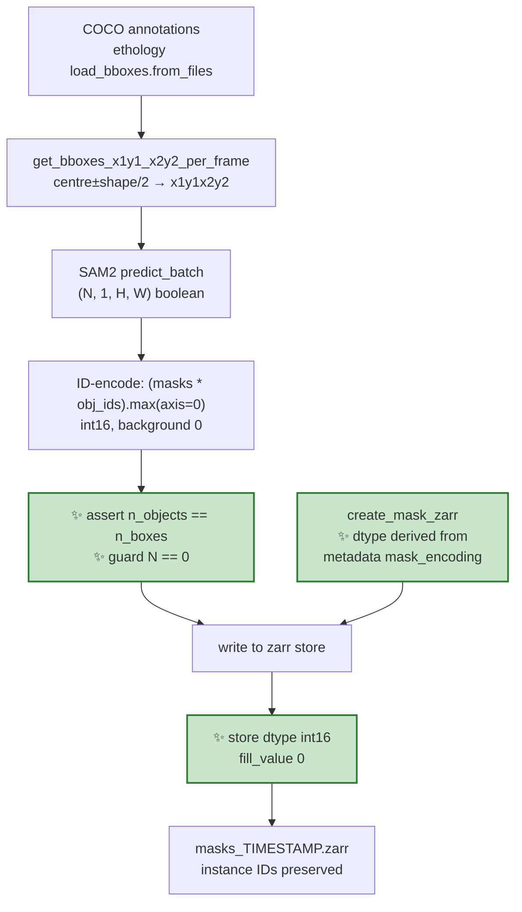

# Proposal for fixing the SAM2 mask zarr store, which silently discards instance IDs

## Description

`scripts/generate_masks_from_bboxes.py` writes SAM2-derived masks to a zarr store whose
metadata declares `"mask_encoding": "instance_id"`, but the store is opened as `dtype="bool"`.
Every nonzero instance ID is coerced to `True`, so the store on disk is a binary foreground
map and the per-instance identities are gone.

This document proposes the fix, the guards that
stop it regressing, and the tests.

> [!NOTE]
> **ID-encoded mask**: a single 2-D integer image per frame where pixel value `0` means
> background and value `k` means "this pixel belongs to instance `k`". It is the compact
> alternative to storing one boolean image per instance.

This is Phase 0 of [claude-plans/this-repo-collects-tools-pure-kernighan.md](claude-plans/this-repo-collects-tools-pure-kernighan.md),
and it blocks everything downstream of it: with ~100 touching crabs per frame, per-instance
geometry cannot be recovered from a binary foreground map.

---

## Key aspects of suggested implementation

### 1. zarr casts on write, silently — that is the whole bug

zarr does not reject a mismatched write; it casts the incoming array to the array's declared
dtype. Verified against **zarr 3.2.1** (the version in this repo's `.venv`):

```python
z = zarr.open(path, mode="w", shape=(2, 4, 4), dtype="bool",
              fill_value=False, chunks=(1, 4, 4))
z[0:2] = np.array(...)          # an int16 array containing the value 7
np.asarray(z[0])[1, 1]          # -> np.True_        (no error, no warning)
```

So the two sides of the bug are three lines apart in behaviour and eighty lines apart in the
file, and nothing connects them:

<table>
<tr><th>Where</th><th>What it says</th></tr>
<tr><td>

[scripts/generate_masks_from_bboxes.py:120](scripts/generate_masks_from_bboxes.py#L120)

</td><td>

```python
dtype="bool",
fill_value=False,
```

</td></tr>
<tr><td>

[scripts/generate_masks_from_bboxes.py:148](scripts/generate_masks_from_bboxes.py#L148)

</td><td>

```python
id_mask_batch = np.zeros(
    (actual_batch_size, img_h, img_w), dtype=np.int16
)
```

</td></tr>
<tr><td>

[scripts/generate_masks_from_bboxes.py:254](scripts/generate_masks_from_bboxes.py#L254)

</td><td>

```python
"mask_encoding": "instance_id",
"background_label": 0,
"id_offset": 1,
```

</td></tr>
</table>

The fix is two characters of substance. The interesting part is the guard: **the metadata dict
already states the contract**, so the store creation should be made to honour it rather than
merely happen to agree with it.

### 2. Everything upstream of the write is correct — verified, so nobody re-checks it

While reading this file I checked three things that *look* like they could be wrong and are not.
Recording them here saves the next reader the trip:

| Claim | Verdict | Evidence |
|---|---|---|
| `masks * obj_ids` might already be boolean | **Correct as written** — it is `int16` | numpy promotes `bool × int16 → int16`; checked directly |
| `id_offset: 1` might not match the annotation `id` | **Correct as written** | see below |
| `position ± shape/2` assumes `position` is the box centre | **Correct as written** | ethology converts corner → centre at `load_bboxes.py:742-743` |

On `id_offset`: ethology 0.1.3 builds the dataset with `id=range(max_annotations_per_image)`
(`ethology/io/annotations/load_bboxes.py:626`) and **left-packs each image's annotations with
trailing NaN padding**. So for a frame with `n` boxes, the populated ids are exactly `0..n-1`,
contiguously, and `.dropna(dim="id", how="all")` at
[scripts/generate_masks_from_bboxes.py:99](scripts/generate_masks_from_bboxes.py#L99) returns
them in that order. Therefore `np.arange(1, N+1)` at
[:176](scripts/generate_masks_from_bboxes.py#L176) genuinely equals `id + 1`.

That is true **because of how ethology happens to pack the array**, not because this script
enforces it. If ethology ever switches to a global `id` coordinate, the mask IDs would silently
stop meaning what the metadata says — the same failure mode as the dtype bug. Hence change 3
below.

### 3. Two robustness gaps found in the same function

Neither is the reported bug, but both are one line each and sit in the code being edited:

```python
# :179 — a frame with zero boxes
(masks_one_frame * obj_ids).max(axis=0)
# ValueError: zero-size array to reduction operation maximum which has no identity
```

and the mask/box count is *printed* at [:183-188](scripts/generate_masks_from_bboxes.py#L183-L188)
but never asserted, so a silent SAM2 drop would produce a shifted ID assignment that looks fine
in the log.

---

## Detailed implementation



### The 5 changes

| # | Change | Signature / diff |
|---|---|---|
| 1 | Open the store with an integer dtype | `dtype="int16"`, `fill_value=0` |
| 2 | Derive the dtype from the declared encoding, and assert | `create_mask_zarr(..., metadata_dict)` reads `metadata_dict["mask_encoding"]` |
| 3 | Assert the ethology id ↔ mask id correspondence | `assert np.array_equal(surviving_ids + id_offset, obj_ids)` |
| 4 | Guard the zero-box frame and assert the mask/box count | `if n_objects == 0: continue` + `assert n_objects == n_boxes` |
| 5 | Unit tests for the pure-numpy helpers | new `tests/test_unit/test_scripts_masks.py` |

Plus one operational step, outside the diff: **regenerate the existing mask store**. Any store
produced before this change is a binary foreground map and cannot be repaired in place.

<details><summary><b>1 & 2 — why derive the dtype from the metadata rather than just hardcode <code>int16</code></b></summary>

The minimal fix is:

```diff
     mask_zarr = zarr.open(
         path_to_zarr,
         mode="w",
         shape=(n_images, image_h, image_w),
-        dtype="bool",
-        fill_value=False,
+        dtype="int16",
+        fill_value=0,
         chunks=(1, image_h, image_w),
     )
```

That fixes today's store and leaves tomorrow's open to the same mistake, because the metadata
dict and the dtype argument remain two independent statements of the same fact. The proposal
is to make one derive from the other:

```python
MASK_ENCODING_TO_DTYPE = {"instance_id": "int16", "binary": "bool"}


def create_mask_zarr(path_to_zarr, zarr_array_shape, metadata_dict=None):
    """Create a zarr store for masks and write metadata.

    The array dtype is derived from ``metadata_dict["mask_encoding"]`` so the
    store cannot disagree with the encoding it declares.
    """
    ...
```

with `fill_value` taken from `metadata_dict["background_label"]` (already `0`) for the
`instance_id` case. An unknown `mask_encoding` raises rather than defaulting.

**Alternative rejected — assert after the fact** (`assert mask_zarr.dtype == np.int16` in
`main`). It catches the regression but still requires someone to keep two places in sync, and
it fires after the store directory has been created. Deriving is the same amount of code and
has no window in which the two can disagree.

**On `int16` vs `uint16` vs `int32`:** `int16` tops out at 32767 instances per frame against
~100 observed, so it is ample; keeping the existing `np.int16` at
[:149](scripts/generate_masks_from_bboxes.py#L149) means changes 1 and 2 introduce no new cast
anywhere. Raised in *Points to discuss* in case anyone prefers unsigned.

</details>

<details><summary><b>3 — asserting the id correspondence, and where to put it</b></summary>

`get_bboxes_x1y1_x2y2_per_frame` currently discards the annotation ids as it drops NaNs:

```python
x1y1.sel(image_id=idx).dropna(dim="id", how="all").values.T
```

The surviving `id` coordinate values are right there on the object and are thrown away. The
proposal is to return them alongside the boxes, so the ID-encoding step can assert instead of
assume:

```python
def get_bboxes_x1y1_x2y2_per_frame(ds_bboxes):
    """Build dicts mapping frame index to (N, 4) bboxes and to their (N,) ids."""
    ...
    # returns (map_frame_idx_to_boxes, map_frame_idx_to_ids)
```

and, in `predict_masks_across_images`:

```python
FOR EACH frame in batch:
    obj_ids = arange(1, n_objects + 1)
    assert obj_ids equals annotation_ids_for_this_frame + id_offset
```

If ethology ever changes its packing, this fails loudly at generation time rather than
producing a store whose IDs quietly mean something else.

**Alternative rejected — write `annotation_id + id_offset` directly as the mask value.** It is
more honest and removes the assumption entirely. It is rejected *for now* only because it
changes what the IDs mean if ethology's packing is not contiguous (IDs would become sparse,
and the `notebooks/` one-hot decoder assumes `1..n_ids`). Worth doing as a follow-up; flagged in
*Points to discuss*.

</details>

<details><summary><b>4 — the zero-box frame and the mask/box count</b></summary>

Two independent failure modes in the per-frame loop at
[:170-188](scripts/generate_masks_from_bboxes.py#L170-L188):

*Zero boxes.* `np.arange(1, 1)` is empty, `masks_one_frame` is `(0, H, W)`, and
`.max(axis=0)` raises `ValueError: zero-size array to reduction operation maximum which has no
identity` (reproduced directly with numpy). `id_mask_batch` is already zero-initialised at
[:148](scripts/generate_masks_from_bboxes.py#L148), so the correct handling is to leave the
frame as all-background and move on. Whether this can occur depends on whether every annotated
frame has at least one box — see *Points to discuss*. It is a two-line guard either way.

*Mask/box count.* The print at [:183-188](scripts/generate_masks_from_bboxes.py#L183-L188)
already computes both numbers. Turning it into `assert n_objects == boxes_batch[i].shape[0]`
costs nothing and closes the one way the ID assignment could shift without the dtype being
involved. This relies on SAM2's `predict_batch` returning masks in the same order as the input
boxes — which is its documented behaviour, but the assertion is what makes it checked rather
than assumed.

</details>

<details><summary><b>5 — what the unit tests can and cannot cover</b></summary>

`scripts/generate_masks_from_bboxes.py` is a PEP 723 standalone script whose imports include
`sam2`, which is not a repo dependency. Importing the module at test-collection time would fail.

Two ways out:

| Option | Why worse |
|---|---|
| Move the pure-numpy helpers into a module with no SAM2 import | Splits a deliberately standalone script in two; the PEP 723 header stops describing the whole thing |
| `pytest.importorskip("sam2")` at the top of the test module | Tests silently never run in CI, which is where the regression guard is needed |
| **Guard the SAM2 import in the script** (recommended) | None material — the import moves into `main()`, where it is actually used |

The third keeps `scripts.generate_masks_from_bboxes` importable for
`get_bboxes_x1y1_x2y2_per_frame`, `create_mask_zarr`, and the ID-encoding step, none of which
touch SAM2. `pyproject.toml` already sets `pythonpath = ["."]` so `scripts.*` is importable, and
[tests/test_unit/test_scripts_burrows.py](tests/test_unit/test_scripts_burrows.py) is the
precedent for testing a `scripts/` module this way.

What unit tests **cannot** cover: whether the regenerated store is correct. That needs the
round-trip check in *Verifications*.

</details>

---

## Files changed

| File | Change |
|---|---|
| [scripts/generate_masks_from_bboxes.py](scripts/generate_masks_from_bboxes.py) | dtype/fill_value derived from `mask_encoding`; ids returned from `get_bboxes_x1y1_x2y2_per_frame`; id and count assertions; zero-box guard; SAM2 import moved into `main()` |
| `tests/test_unit/test_scripts_masks.py` | **new** — unit tests for the pure-numpy helpers |
| [claude-plans/this-repo-collects-tools-pure-kernighan.md](claude-plans/this-repo-collects-tools-pure-kernighan.md) | Tick off Phase 0 once merged |

No changes to `crabs/`. The docstring at the top of the script already describes an ID-encoded
store correctly and needs no edit.

---

## Overview of tests to write

**Pure unit** (no SAM2, no zarr on disk beyond `tmp_path`):

1. `get_bboxes_x1y1_x2y2_per_frame` converts centre+shape to `[x1, y1, x2, y2]` for a
   hand-built `xarray.Dataset` — mirroring the fixture style of
   [tests/test_unit/test_scripts_burrows.py](tests/test_unit/test_scripts_burrows.py), which
   builds a synthetic `xr.Dataset` inline rather than loading a file.
2. The same helper returns the surviving annotation ids for a frame with trailing NaN padding,
   and drops the padded slots.
3. The ID-encoding step maps `N` disjoint boolean masks to values `1..N` with background `0`.
4. The ID-encoding step on overlapping masks: the higher ID wins (documents the existing
   `.max(axis=0)` behaviour rather than changing it — see *Points to discuss*).
5. A frame with zero boxes yields an all-zero mask and does not raise.

**Parity with the declared contract:**

6. `create_mask_zarr` with `mask_encoding: "instance_id"` produces an `int16` array with
   `fill_value == 0`; the store's metadata round-trips.
7. **The regression guard for this bug:** write an int16 array with IDs `1..5` into a store
   built by `create_mask_zarr`, read it back, assert `np.unique(...) == [0, 1, 2, 3, 4, 5]`.
   Against the current code this test fails with `[0, 1]`.
8. `create_mask_zarr` raises on an unrecognised `mask_encoding`.

No integration test is proposed: the only untested seam left is SAM2 itself, which needs a GPU
and model weights.

---

## Verifications for agent to run

```bash
# unit tests, including the regression guard
pytest tests/test_unit/test_scripts_masks.py -v

# whole unit suite, to confirm nothing else moved
pytest tests/test_unit

# linting and formatting
pre-commit run --all-files
```

**Manual check on a regenerated store.** The sample data is the September ground truth used by
the notebooks, at `<data_dir>/frames` + `<data_dir>/annotations/VIA_JSON_combined_coco_gen.json`
(the notebook points at `/Users/sofia/swc/CrabLabels/sep2023-full`). Regenerate on a machine
with a GPU:

```bash
uv run scripts/generate_masks_from_bboxes.py <data_dir> --batch-size 4
```

then confirm the IDs survived:

```python
import numpy as np, zarr
z = zarr.open("<data_dir>/annotations/masks_<timestamp>.zarr", mode="r")
assert z.dtype == np.int16
assert z.attrs["mask_encoding"] == "instance_id"
frame = np.asarray(z[0])
print(np.unique(frame))          # expect 0, 1, 2, ... ~100 — not just [0, 1]
```

The single number that says the fix worked is `len(np.unique(frame)) - 1` matching the number
of annotated boxes in frame 0. Before the fix it is `1`.

---

## Points to discuss

1. **`int16` vs `uint16`.** `int16` matches the existing `np.int16` at
   [:149](scripts/generate_masks_from_bboxes.py#L149) and caps at 32767 instances per frame
   against ~100 observed. *My recommendation: keep `int16`* — it introduces no new cast, and
   signed values leave room for a negative sentinel if one is ever wanted. Say if you would
   rather have `uint16`.

2. **Should the mask value be the annotation id, or the positional index?** They are equal today
   (verified — ethology left-packs per image), so this is a question about intent rather than
   behaviour. Writing `annotation_id + 1` directly would make the store self-describing and
   remove the assumption; it would also make the IDs sparse if ethology's packing ever changes,
   which the notebook decoder at
   [notebooks/notebook_visualise_masks_from_zarr.py:148](notebooks/notebook_visualise_masks_from_zarr.py#L148)
   does not expect. *My recommendation: assert now (change 3), switch to writing annotation ids
   as a separate follow-up* once the decoder is updated to match.

3. **Overlap handling is out of scope here, deliberately.** `.max(axis=0)` at
   [:179](scripts/generate_masks_from_bboxes.py#L179) lets a higher-ID crab eat the overlapping
   pixels of a lower-ID one. The orientation plan's answer is to fit ellipses to the
   **per-instance boolean masks before flattening**, which sidesteps the question entirely — so
   this proposal only *documents* the behaviour in a test rather than changing it. If the store
   is meant to be the single source of truth for downstream consumers, that is a separate
   decision about whether to persist per-instance masks (much larger store) instead.

4. **Store layout mismatch, unresolved.** `create_mask_zarr` writes a bare array at the store
   root, but [notebooks/notebook_visualise_masks_from_zarr.py:132](notebooks/notebook_visualise_masks_from_zarr.py#L132)
   does `zarr_root["masks"]`, i.e. expects a *group* with a `masks` member (the OCTRON layout).
   The notebook also points at a differently named store (`"crab masks.zarr"`), so these may
   simply be two different stores. Worth settling before the notebook is pointed at the
   regenerated output — but I did not check which layout other consumers assume, so I am not
   proposing a change.

5. **Can an annotated frame have zero boxes?** If the COCO file guarantees at least one
   annotation per image, the guard in change 4 is dead code and an `assert n_objects > 0` would
   be more honest. I did not check the annotation file, so I am proposing the permissive guard.

6. **Regenerating the store is a manual step and this proposal does not automate it.** Anyone
   holding a `masks_*.zarr` generated before this change has a binary foreground map. There is
   no in-place repair — the instance IDs are not recoverable from the store. Flagging in case
   any analysis has already been run against one.

---

## Feedback on the format of this proposal

Comments on the document itself — structure, level of detail, what is missing or superfluous —
are very welcome alongside comments on the content.
