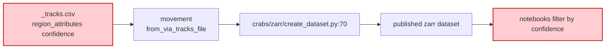
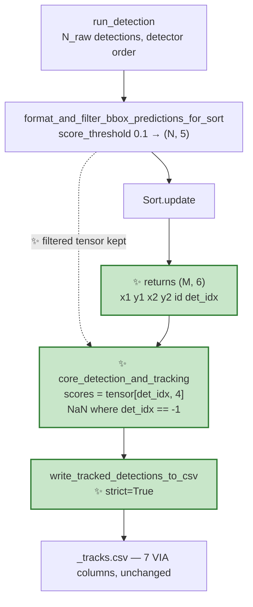

# Proposal for fixing the detection-score misalignment in the tracking output

## Description

The `confidence` value written to every row of `<video>_tracks.csv` does not belong to the
bounding box on that row. `crabs/tracker/track_video.py` stores the detector's raw scores
next to SORT's tracked boxes — two sequences with a different length, a different order and a
different filter applied — and `crabs/tracker/utils/io.py` zips them positionally with
`strict=False`, so the mismatch is silent. This document proposes carrying the score through
SORT by explicit index mapping, and the tests that pin it. It was drafted with an assistant
after reading the code and checking the behaviour against the pinned dependency versions, but
it is written for people — please comment on it before anyone implements it. Reviewers:
whoever owns the tracking pipeline, plus anyone who has filtered the published dataset by
`confidence`.

> [!NOTE]
> **Coasting track**: a SORT track that was not matched to any detection this frame but is kept
> alive by the Kalman filter's prediction. `max_age: 10` in
> [crabs/tracker/config/tracking_config.yaml](crabs/tracker/config/tracking_config.yaml) means a
> track can coast for up to 10 frames. A coasting track has no detection, so it has no score.

The bug is flagged as a "plumbing hazard" in
[claude-plans/this-repo-collects-tools-pure-kernighan.md](claude-plans/this-repo-collects-tools-pure-kernighan.md)
(Phase 3), because per-detection body orientation would have to travel the same broken path.
Fixing it first means the orientation work inherits a mechanism instead of copying a bug.

---

## Key aspects of suggested implementation

### 1. The two arrays being zipped have nothing in common but a name

```python
# crabs/tracker/track_video.py:264-268
tracked_detections_all_frames[frame_idx] = {
    "tracked_boxes": tracked_boxes_array[:, :-1],   # (M, 4) from SORT
    "ids":           tracked_boxes_array[:, -1],    # (M,)   from SORT
    "scores":        detections_dict["scores"],     # (N,)   from the detector  <-- unrelated
}
```

```python
# crabs/tracker/utils/io.py:77-82
for bbox, id, pred_score in zip(..., strict=False):
```

Three independent reasons `scores[i]` is not the score of `tracked_boxes[i]`:

| # | Divergence | Where |
|---|---|---|
| 1 | **Different filter.** `score_threshold: 0.1` is applied to the tensor handed to SORT, never to the stored `scores` | [utils/tracking.py:44](crabs/tracker/utils/tracking.py#L44) vs [track_video.py:267](crabs/tracker/track_video.py#L267) |
| 2 | **Different order.** SORT emits boxes by walking `self.trackers` in **reverse**, never in detection order | [sort.py:203-215](crabs/tracker/sort.py#L203-L215) |
| 3 | **Different count.** Coasting tracks and `min_hits` gating make `M ≠ N` | [sort.py:205-211](crabs/tracker/sort.py#L205-L211) |

Divergence 2 alone is fatal: even with `M == N` and no filtering, the reversal means row `i` of
the output is generally not detection `i`.

### 2. `strict=False` turns the mismatch into silent data loss, and `M > N` is reachable

`zip(..., strict=False)` stops at the shortest sequence. So:

- when `M ≤ N` — every row is written, each with **an arbitrary confidence**;
- when `M > N` — the last `M − N` tracked boxes are **dropped from the CSV entirely**.

`M > N` is not hypothetical here. Verified against **torchvision 0.27.0**, the model built by
[crabs/detector/models.py:82](crabs/detector/models.py#L82) (`fasterrcnn_resnet50_fpn_v2`) uses
the defaults `box_score_thresh=0.05` and **`box_detections_per_img=100`**. The scene has ~100
crabs per frame, so `N` is capped at 100 while `M` can exceed it once coasting tracks
(`max_age: 10`) accumulate. Those rows leave no trace.

### 3. This reaches the published dataset, not just a debug CSV



Verified against **movement 0.16.0**: `region_attrs.get("confidence", np.nan)` at
`movement/validators/files.py:814`, read into the `confidence` data variable and consumed by
[crabs/zarr/create_dataset.py:70](crabs/zarr/create_dataset.py#L70). Downstream it is used for
filtering and for reporting median detection confidence, e.g.
[notebooks/crabs_dataset/02_notebook_filtering.py:37](notebooks/crabs_dataset/02_notebook_filtering.py#L37)
and [notebooks/notebook_movement_trajectories_gt.py:117](notebooks/notebook_movement_trajectories_gt.py#L117).

### 4. Carry a detection *index* through SORT, not a score

SORT's `update` takes `(N, 5)` and returns `(M, 5)`
([sort.py:154](crabs/tracker/sort.py#L154)), discarding everything but the box. The proposal
adds one column — the index of the detection that updated each track this frame:

```python
def update(self, dets: np.ndarray = np.empty((0, 5))) -> np.ndarray:
    """Update the SORT tracker with new detections.

    Returns
    -------
    np.ndarray
        Array of shape (M, 6): [x1, y1, x2, y2, id, det_idx], where ``det_idx``
        is the row of ``dets`` that updated this track on this frame, or -1 if
        the track was not matched this frame (a coasting track).
    """
```

An index rather than a score, because Phase 3 of the orientation plan needs to carry
*orientation* and *eccentricity* through the same path. One index generalises to any number of
per-detection attributes; a score column would need a fresh SORT change for each. That is the
one design decision in this document a reviewer should push back on if they disagree — see
*Points to discuss* item 1.

---

## Detailed implementation



### The 5 changes

| # | File | Change |
|---|---|---|
| 1 | [crabs/tracker/sort.py](crabs/tracker/sort.py) | `KalmanBoxTracker` records the detection row that last updated it, and the frame it happened on |
| 2 | [crabs/tracker/sort.py](crabs/tracker/sort.py) | `Sort.update` returns `(M, 6)` with `det_idx` as the last column |
| 3 | [crabs/tracker/track_video.py](crabs/tracker/track_video.py) | `run_tracking` also returns the filtered tensor; `core_detection_and_tracking` maps `det_idx` → score |
| 4 | [crabs/tracker/utils/io.py](crabs/tracker/utils/io.py) | `zip(..., strict=True)`; format NaN confidence |
| 5 | tests | New unit tests for the `det_idx` contract; a regression test for the dropped rows |

<details><summary><b>1 & 2 — the SORT changes, and keeping the vendored diff small</b></summary>

`crabs/tracker/sort.py` is vendored from the upstream SORT implementation (GPL-3.0 header at
[sort.py:1-17](crabs/tracker/sort.py#L1-L17)), already lightly modified with type hints and
docstrings. Keeping the diff small and obvious matters for anyone re-syncing with upstream.

In `KalmanBoxTracker.__init__`, alongside the existing counters at
[sort.py:75-81](crabs/tracker/sort.py#L75-L81):

```diff
         self.time_since_update = 0
         self.id = KalmanBoxTracker.count
         KalmanBoxTracker.count += 1
+        # Row of the detections array that last updated this tracker, and the
+        # frame on which that happened. Used to map per-detection attributes
+        # (score, and later orientation) onto the tracker's output row.
+        self.last_det_idx = -1
+        self.last_det_frame = -1
```

`KalmanBoxTracker.update` gains the index as an argument:

```python
def update(self, bbox: np.ndarray, det_idx: int, frame_count: int) -> None:
    ...
```

and `Sort.update` passes it at the two places a tracker is fed a detection —
[sort.py:196](crabs/tracker/sort.py#L196) (matched) and
[sort.py:200](crabs/tracker/sort.py#L200) (new track):

```diff
     for m in matched:
-        self.trackers[m[1]].update(dets[m[0], :])
+        self.trackers[m[1]].update(dets[m[0], :], int(m[0]), self.frame_count)

     for i in unmatched_dets:
-        trk = KalmanBoxTracker(dets[i, :])
+        trk = KalmanBoxTracker(dets[i, :], int(i), self.frame_count)
```

and the output row at [sort.py:209-211](crabs/tracker/sort.py#L209-L211) gains the column:

```diff
-            ret.append(
-                np.concatenate((d, [trk.id + 1])).reshape(1, -1)
-            )  # +1 as MOT benchmark requires positive
+            det_idx = (
+                trk.last_det_idx
+                if trk.last_det_frame == self.frame_count
+                else -1
+            )
+            ret.append(
+                np.concatenate((d, [trk.id + 1], [det_idx])).reshape(1, -1)
+            )  # id +1 as MOT benchmark requires positive
```

with the empty return at [sort.py:218](crabs/tracker/sort.py#L218) becoming
`np.empty((0, 6))`.

**Why `last_det_frame` and not just `last_det_idx`.** A track that coasts keeps the index from
whichever earlier frame last matched it. That index points into *this* frame's detections array
— a different array — so reusing it would produce a score belonging to an unrelated detection:
exactly the class of bug being fixed. Comparing against `self.frame_count` is what makes
"coasting" explicit.

**The `min_hits` interaction, worth being aware of.** A track that *is* matched this frame but
has not yet reached `min_hits` is not emitted at all
([sort.py:205-208](crabs/tracker/sort.py#L205-L208)). With `min_hits: 1` in the shipped config
this is effectively inactive, but it is why `M` and the number of matched detections are not the
same number even ignoring coasting.

</details>

<details><summary><b>3 — the track_video changes</b></summary>

`run_tracking` currently discards the filtered tensor
([track_video.py:181-190](crabs/tracker/track_video.py#L181-L190)), which is the only thing that
can resolve a `det_idx`. It should return both:

```python
def run_tracking(
    self, prediction_dict: dict
) -> tuple[np.ndarray, torch.Tensor]:
    """Update the tracker with the latest prediction.

    Returns
    -------
    tracked_boxes_id_per_frame : np.ndarray
        (M, 6) array: xmin, ymin, xmax, ymax, id, det_idx.
    prediction_tensor : torch.Tensor
        (N, 5) filtered detections the indices refer to.
    """
```

and `core_detection_and_tracking` does the mapping at
[track_video.py:264-268](crabs/tracker/track_video.py#L264-L268):

```python
det_idx = tracked_boxes_array[:, -1].astype(int)
scores = np.full(len(det_idx), np.nan)
matched = det_idx >= 0
scores[matched] = prediction_tensor[det_idx[matched], 4].numpy()

tracked_detections_all_frames[frame_idx] = {
    "tracked_boxes": tracked_boxes_array[:, :4],
    "ids":           tracked_boxes_array[:, 4],
    "scores":        scores,
}
```

Note `[:, :4]` and `[:, 4]` replacing the current `[:, :-1]` and `[:, -1]`, which would
otherwise silently pick up the new column. This is the one place a careless edit would produce
a plausible-looking wrong result, so it is worth calling out in review.

The docstring at [track_video.py:217-235](crabs/tracker/track_video.py#L217-L235) needs
updating to say the scores are now aligned to the tracked boxes and are NaN for coasting tracks.

**Alternative rejected — re-match tracked boxes to detections by IoU after the fact.** It needs
no SORT change, but it re-does the association SORT already did, with a second threshold to
choose and its own failure modes when boxes overlap. It would be strictly worse for the
orientation work too, where an attribute has to follow a specific detection.

</details>

<details><summary><b>4 — the CSV writer, and what NaN confidence does downstream</b></summary>

```diff
         for bbox, id, pred_score in zip(
             tracked_bboxes_dict[frame_idx]["tracked_boxes"],
             tracked_bboxes_dict[frame_idx]["ids"],
             tracked_bboxes_dict[frame_idx]["scores"],
-            strict=False,
+            strict=True,
         ):
```

`strict=True` is the point of the change: once the three arrays are genuinely per-track, any
future length mismatch should raise rather than truncate. It is what stops this bug from
reappearing in a different form.

Coasting tracks then carry `"confidence":"nan"` in the `region_attributes` JSON. Verified safe
against movement 0.16.0: the value is assigned into a `float32` array
(`movement/validators/files.py:788, 867`), and numpy parses the string `"nan"` to `np.nan`
(checked directly). The alternative — omitting the `confidence` key for coasting tracks, so
movement's `.get("confidence", np.nan)` default applies — gives the identical dataset with a
ragged CSV. Recommending the uniform CSV; raised in *Points to discuss*.

**The CSV format does not change.** The 7 VIA columns at
[io.py:61-71](crabs/tracker/utils/io.py#L61-L71) stay exactly as they are — movement's
validator requires an exact header match — which is why
[tests/test_unit/test_tracking_io.py](tests/test_unit/test_tracking_io.py) should keep passing
untouched.

</details>

---

## Files changed

| File | Change |
|---|---|
| [crabs/tracker/sort.py](crabs/tracker/sort.py) | `KalmanBoxTracker` stores `last_det_idx` / `last_det_frame`; `Sort.update` returns `(M, 6)` |
| [crabs/tracker/track_video.py](crabs/tracker/track_video.py) | `run_tracking` returns the filtered tensor; `core_detection_and_tracking` maps `det_idx` → score; docstrings |
| [crabs/tracker/utils/io.py](crabs/tracker/utils/io.py) | `strict=True`; NaN confidence formatting |
| `tests/test_unit/test_sort.py` | **new** — the `det_idx` contract |
| [tests/test_unit/test_tracking_io.py](tests/test_unit/test_tracking_io.py) | Add a NaN-confidence row and a mismatched-length case; existing assertions unchanged |
| [tests/test_unit/test_track_video.py](tests/test_unit/test_track_video.py) | New test for the `det_idx` → score mapping |

No documentation change: no file under [guides/](guides/) mentions `confidence` (checked).

`crabs/tracker/evaluate_tracker.py` mentions `"scores"` in its docstring
([evaluate_tracker.py:40-41](crabs/tracker/evaluate_tracker.py#L40-L41)) but never reads the
key, so it needs no change beyond the docstring being true again.

---

## Overview of tests to write

**Pure unit — the new SORT contract** (`tests/test_unit/test_sort.py`, new file; SORT has no
tests today):

1. Single detection, single frame: `update` returns one row whose `det_idx` is `0` and whose
   `id` is positive.
2. Two detections whose SORT output order is reversed relative to the input: each row's
   `det_idx` indexes back to the detection it came from. **This is the test the current code
   cannot pass** — it is the direct expression of divergence 2.
3. A track that coasts: feed a detection, then a frame of no detections, assert the surviving
   row has `det_idx == -1`.
4. Empty input: `update(np.empty((0, 5)))` returns shape `(0, 6)`.
5. `det_idx` indexes the array *passed to this call*, not an earlier one — a track matched in
   frame 1 and matched to a different row in frame 2 reports frame 2's row.

**Parity with existing behaviour:**

6. [tests/test_unit/test_tracking_io.py::test_write_tracked_detections_to_csv](tests/test_unit/test_tracking_io.py)
   passes unchanged — the 7-column header and the row format are the invariant this change must
   not touch. Reuse it as-is.
7. New case in the same file: a row with `score = np.nan` writes `"confidence":"nan"` and, read
   back through `movement.io.load_bboxes.from_via_tracks_file`, yields a NaN confidence.
8. New case in the same file: mismatched array lengths now raise `ValueError` from `strict=True`.

**Regression for the dropped rows:**

9. Construct `tracked_bboxes_dict` with `M > N` under the *old* shape (5 boxes, 3 scores) and
   assert the writer raises rather than silently writing 3 rows. This is the test that would
   have caught the truncation.

**Integration:**

10. `tests/test_integration/test_inference.py::test_detect_and_track_video` — the end-to-end CLI
    run, using the existing pooch fixtures (`input_data_paths`, the
    `04.09.2023-04-Right_RE_test_3_frames` clip and its `tracking_config.yaml`). No new fixture
    needed.

---

## Verifications for agent to run

```bash
# the new and updated unit tests
pytest tests/test_unit/test_sort.py tests/test_unit/test_tracking_io.py \
       tests/test_unit/test_track_video.py -v

# whole unit suite
pytest tests/test_unit

# end-to-end CLI run (downloads sample data via pooch on first run)
pytest -m slow tests/test_integration/test_inference.py

pre-commit run --all-files
```

**Manual round-trip on a real clip.** The sample data comes from the pooch registry used by the
integration test (`04.09.2023-04-Right_RE_test_3_frames`), so no manual download is needed —
running the integration test once populates the cache. Then:

```bash
detect-and-track-video --trained_model_path <ckpt> --video_path <clip.mp4> \
    --output_dir /tmp/tracks --output_dir_no_timestamp
```

```python
from movement.io import load_bboxes
ds = load_bboxes.from_via_tracks_file("/tmp/tracks/<clip>_tracks.csv")
# every non-NaN confidence must be >= the config score_threshold (0.1)
c = ds.confidence.values
assert (c[~np.isnan(c)] >= 0.1).all()
```

That assertion is the cheapest end-to-end signal: **under the current code it fails**, because
unfiltered detections down to torchvision's `box_score_thresh=0.05` leak into the CSV.

> [!NOTE]
> Environment mismatch spotted while checking this: `pyproject.toml` requires
> `movement>=0.17.0`, but the repo's `.venv` has **0.16.0**. Every movement claim above was
> verified against 0.16.0. Worth resolving before running the verifications.

---

## Points to discuss

1. **Index vs. score column — the one design decision here.** Returning `(M, 6)` with a
   detection index is more indirection than returning `(M, 6)` with the score itself. The case
   for the index is Phase 3 of the orientation plan: orientation and eccentricity need the same
   ride through SORT, and an index carries any number of attributes while a score column carries
   one. *My recommendation: the index.* If the orientation work is not going ahead, the score
   column is simpler and I would switch.

2. **Is `-1` the right sentinel, or should `Sort.update` return two arrays?** `-1` inside a
   float array needs an `astype(int)` on the way out and is easy to mis-slice (see the
   `[:, :-1]` note in the detailed section). The alternative is returning
   `(boxes_ids, det_idx)` as a tuple, which is cleaner but changes the vendored function's
   signature more visibly. *My recommendation: the extra column*, on the grounds that it keeps
   the vendored diff smaller and reads the same as the existing `id` column.

3. **`"confidence":"nan"` or omit the key for coasting tracks?** Both give an identical movement
   dataset (verified). Uniform rows are easier to diff and to eyeball in VIA. *My
   recommendation: write `"nan"`.*

4. **Should coasting tracks be written to the CSV at all?** They are today, and this proposal
   does not change that — but a NaN confidence makes them visible for the first time, and
   someone may reasonably want them dropped or flagged. That is a behaviour change affecting
   MOTA and the published dataset, so it is deliberately **out of scope** here; worth its own
   issue.

5. **The published dataset was built with the wrong confidences.** Anything derived from an
   existing `_tracks.csv` — including any zarr dataset already produced by
   [crabs/zarr/create_dataset.py](crabs/zarr/create_dataset.py) — carries arbitrary confidence
   values, and may be missing rows where `M > N`. Regenerating is a separate operational
   decision, and I do not know how much analysis depends on those files.

6. **Two related issues I did not chase.** `strict=False` also appears at
   [io.py:111-115](crabs/tracker/utils/io.py#L111-L115) in `write_frame_to_output_video`, where
   boxes and ids do come from the same array and so are genuinely aligned — safe, but the same
   pattern. And [#224 "MOTA plot counts not adding up"](https://github.com/SainsburyWellcomeCentre/crabs-exploration/issues/224)
   is an open bug in the same subsystem; I have not checked whether dropped CSV rows could
   contribute to it, but the overlap is worth a look before this lands.

7. **No open pull request touches these files.** Checked `gh pr list`: the nine open PRs are on
   unrelated branches; the closest, [#245](https://github.com/SainsburyWellcomeCentre/crabs-exploration/pull/245)
   (`Recover max_frames_to_read`), touches `track_video.py` and has been a draft since November
   2024. Worth a rebase check if it is ever revived, but no ordering constraint today.

---

## Feedback on the format of this proposal

Comments on the document itself — structure, level of detail, what is missing or superfluous —
are very welcome alongside comments on the content.
