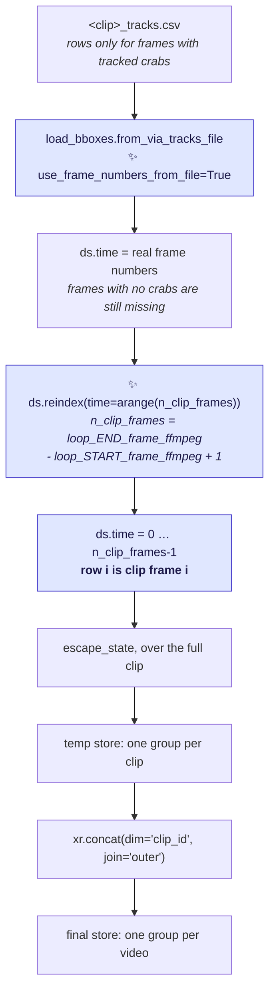
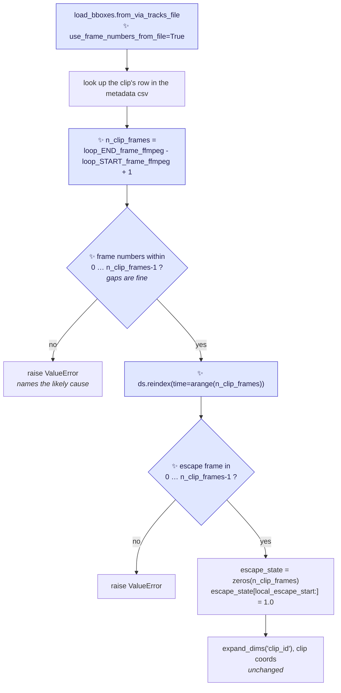

# Proposal for anchoring the `time` coordinate of the tracks zarr dataset to the clip

## Description

The `time` coordinate of the tracks zarr dataset is not the clip's frame index, so `escape_state`
marks the escape on the wrong frame. This proposal anchors `time` to the clip, in
[`load_extended_ds`](https://github.com/SainsburyWellcomeCentre/crabs-exploration/blob/main/crabs/zarr/create_dataset.py#L49).



Arrows are the data path of one clip, from its VIA tracks file to the final zarr store. ✨ marks
what this pull request adds.

Node → code:

- `B`, `C`, `D`, `E`, `F` — [`load_extended_ds`](https://github.com/SainsburyWellcomeCentre/crabs-exploration/blob/main/crabs/zarr/create_dataset.py#L49)
- `G` — [`create_temp_zarr_store`](https://github.com/SainsburyWellcomeCentre/crabs-exploration/blob/main/crabs/zarr/create_dataset.py#L203)
- `H`, `I` — [`create_final_zarr_store`](https://github.com/SainsburyWellcomeCentre/crabs-exploration/blob/main/crabs/zarr/create_dataset.py#L277)

## References


- [`guides/CreateZarrDatasetForTracks.md`](https://github.com/SainsburyWellcomeCentre/crabs-exploration/blob/main/guides/CreateZarrDatasetForTracks.md)
  — how the dataset is built on the cluster.
- [`movement.io.load_bboxes.from_via_tracks_file`](https://github.com/neuroinformatics-unit/movement/blob/main/movement/io/load_bboxes.py)
  — the loader whose default behaviour partially causes the issue (to be changed in [PR1103](https://github.com/neuroinformatics-unit/movement/pull/1103)). Behaviour checked against movement 0.16.0, the 0.17.0
  source, and `main`; identical in all three.
- No open pull request touches `crabs/zarr/`.

## Overview of steps

1. Load each VIA tracks file with `use_frame_numbers_from_file=True`.
2. Derive the clip's frame count from the metadata csv.
3. Raise if the frame numbers in the file fall outside the clip's frame range.
4. Reindex the dataset onto the clip's full frame range.
5. Build `escape_state` over that frame range, and raise if the escape frame falls outside it.
6. Strengthen `test_load_extended_ds` to assert the values of `escape_state`, not just its presence.
7. Audit the VIA tracks files on the cluster to decide whether existing stores must be rebuilt.

## Key aspects of suggested implementation

### 1. `movement` pads individuals, not frames

`from_via_tracks_file` sizes the time axis as `n_frames = len(np.unique(frame_numbers))`
* these are the frames **with data**, not `max - min + 1`. The dense grid it returns is *(unique frames
present) × (unique individuals present)*:
- a frame that **no** individual appears in is absent from the time
  coordinate altogether.

[`write_tracked_detections_to_csv`](https://github.com/SainsburyWellcomeCentre/crabs-exploration/blob/main/crabs/tracker/utils/io.py#L75-L101)
iterates over the boxes *within* a frame, so a frame with no tracked crabs contributes no rows at
all. Those frames disappear.

On a 6-frame clip whose VIA tracks file has rows only for frames 0, 1, 3 and 5, with crab 2 also
missing from frame 1:

```python
# frame numbers as written in the file:
use_frame_numbers_from_file=True
  ds.time.values : [0 1 3 5]             # frames 2 and 4 are absent, not NaN-padded
     frame 0: [125. 125.]
     frame 1: [135.  nan]                # crab 2 IS NaN-padded
     frame 3: [155. 185.]
     frame 5: [175. 225.]

# the current default:
use_frame_numbers_from_file=False
  ds.time.values : [0 1 2 3]             # frame 3's data sits at time 2, frame 5's at time 3
```

### 2. `escape_state` is written by position, not by frame

[Line 87](https://github.com/SainsburyWellcomeCentre/crabs-exploration/blob/main/crabs/zarr/create_dataset.py#L87)
takes its length from the data and its index from the metadata:

```python
escape_state = np.zeros(ds.time.shape[0], dtype=np.float16)   # however many rows survived
escape_state[local_escape_start_frame_0idx:] = 1.0            # slices frames indices in the clip --- this is the issue
```

The second line is the issue. The two lines only agree when row *i* is clip frame *i*.

There is a second failure mode. When `local_escape_start_frame_0idx` exceeds the number in `ds.time.shape[0]`,
the slice assigns nothing and the escape never switches on.

The repository's own test fixture does
this: it annotates a 101-frame clip that only has 7 frames of data with an escape starting at clip frame 51. So `escape_state`
is length 7 and `escape_state[51:] = 1.0` is a silent no-op.

### 3. The two changes are jointly necessary, and neither works alone

- **`use_frame_numbers_from_file=True` alone changes nothing.** It relabels the rows; it does not add the missing ones.
- **The reindex alone is worse than doing nothing.** The current default renumbers the
  surviving frames `0, 1, 2, …`, so the onset that relies on actual clip frames is wrong. Reindexing onto the clip's range sees those labels as genuine,
  leaves the shifted data where it is, and appends NaN rows at the end.
- **Together they work.**
  * `use_frame_numbers_from_file=True` makes the labels true frame numbers;
  * reindexing aligns the rows to those labels and fills the holes.

### 4. The clip's frame count comes from the metadata csv

`n_clip_frames` is `loop_END_frame_ffmpeg - loop_START_frame_ffmpeg + 1`, the same expression
[`extract_loop_clips.py`](https://github.com/SainsburyWellcomeCentre/crabs-exploration/blob/main/scripts/extract_loop_clips.py#L99-L101)
uses to check the clips it cuts.

- **The metadata csv is the only source available.** `create-zarr-dataset` is given a directory of
  VIA tracks files and the metadata csv. It never opens the clip videos.
- **The metadata csv is already the authority for the escape frame**, which is expressed in global
  video frames and converted with `loop_START_frame_ffmpeg`. Taking the clip length from the same
  row keeps one source of truth.
- **The frame numbers in the VIA tracks file are clip-local**, because
  [`core_detection_and_tracking`](https://github.com/SainsburyWellcomeCentre/crabs-exploration/blob/main/crabs/tracker/track_video.py#L243-L271)
  counts `frame_idx` from 0 over the video it is given, and that video is the clip that
  `extract-loop-clips` cut.

> [!NOTE]
> `--verify_frames` is opt-in
> ([`extract_loop_clips.py:388-394`](https://github.com/SainsburyWellcomeCentre/crabs-exploration/blob/main/scripts/extract_loop_clips.py#L388-L394)),
> so nothing guarantees a cut clip has exactly the frame count its metadata row states. The guard in
> step 3 is what makes a disagreement visible.

## Detailed implementation



Arrows are the order of statements inside `load_extended_ds` after this change. ✨ marks what this
pull request adds.

Node → code: every node is inside
[`load_extended_ds`](https://github.com/SainsburyWellcomeCentre/crabs-exploration/blob/main/crabs/zarr/create_dataset.py#L49-L118);
`L1` replaces [line 70](https://github.com/SainsburyWellcomeCentre/crabs-exploration/blob/main/crabs/zarr/create_dataset.py#L70)
and `L7` replaces [lines 87-89](https://github.com/SainsburyWellcomeCentre/crabs-exploration/blob/main/crabs/zarr/create_dataset.py#L87-L89).

Note that the "frame numbers within range" check is required because reindex doesn't only fill in gaps — it also drops out-of-range labels. Labels not in the new index are discarded, silently:
```
frames 99…199, reindex(time=arange(101))
  → only labels 99 and 100 match; the other 99 rows are thrown away
  → a 101-frame dataset that is NaN everywhere except two rows, no error

frames 0…101, reindex(time=arange(101))
  → frame 101's row is dropped, no warning
```

### The changes

| # | Change | Diff or signature |
|---|---|---|
| 1 | Ask `movement` for the frame numbers as written in the file | `from_via_tracks_file(path, use_frame_numbers_from_file=True)` |
| 2 | Derive the clip's frame count from the metadata row | `n_clip_frames = global_clip_end_frame_0idx - global_clip_start_frame_0idx + 1` |
| 3 | **new** guard on the frame numbers in the file | `_validate_frames_in_clip_range(...) -> None` |
| 4 | Reindex onto the clip's frame range | `ds = ds.reindex(time=np.arange(n_clip_frames))` |
| 5 | Size `escape_state` by the clip, and guard the escape frame | `np.zeros(n_clip_frames, dtype=np.float16)` |
| 6 | Assert the values of `escape_state` in the unit tests | see [Tests](#tests) |

<details>
<summary><b>1-5. <code>load_extended_ds</code> in full</b></summary>

The metadata row is looked up before the frame axis is settled, because the clip's frame count
comes from that row.

```diff
-    # Load VIA tracks file as movement dataset
-    ds = load_bboxes.from_via_tracks_file(via_tracks_file_path)
+    # Load VIA tracks file as movement dataset.
+    # We request the frame numbers as defined in the file. With the
+    # default (use_frame_numbers_from_file=False), `movement` maps them to
+    # a 0-based sequence of *consecutive* integers. Since the tracker
+    # writes no rows for frames with no tracked boxes, that would shift
+    # every subsequent frame earlier, and `time` would no longer be the
+    # clip's frame index.
+    ds = load_bboxes.from_via_tracks_file(
+        via_tracks_file_path, use_frame_numbers_from_file=True
+    )

     # Extract metadata for this row
     clip_filename = _via_tracks_to_clip_filename(ds.attrs["source_file"])
     row = df_metadata.loc[df_metadata["loop_clip_name"] == clip_filename].iloc[
         0
     ]
     global_clip_start_frame_0idx = row["loop_START_frame_ffmpeg"] - 1
     global_clip_end_frame_0idx = row["loop_END_frame_ffmpeg"] - 1
     global_escape_start_frame_0idx = row["escape_START_frame_0_based_idx"]
+    n_clip_frames = (
+        global_clip_end_frame_0idx - global_clip_start_frame_0idx + 1
+    )
+
+    # Check the frames in the VIA tracks file belong to this clip
+    _validate_frames_in_clip_range(
+        ds.time.values,
+        n_clip_frames,
+        global_clip_start_frame_0idx,
+        clip_filename,
+    )
+
+    # Pad the time coordinate to span the full clip.
+    # `movement` pads with NaNs the individuals that are missing from a
+    # frame, but a frame that no individual appears in is absent from the
+    # time coordinate altogether, so we reindex to add it back.
+    n_frames_wout_boxes = n_clip_frames - ds.sizes["time"]
+    if n_frames_wout_boxes:
+        print(
+            f"{clip_filename}: {n_frames_wout_boxes} of {n_clip_frames} "
+            "frames have no tracked boxes; padding them with NaNs."
+        )
+    ds = ds.reindex(time=np.arange(n_clip_frames))

     # Add escape_state as data variable
     local_escape_start_frame_0idx = (
         global_escape_start_frame_0idx - global_clip_start_frame_0idx
     )
+    if not 0 <= local_escape_start_frame_0idx < n_clip_frames:
+        raise ValueError(
+            f"{clip_filename}: the escape start frame "
+            f"({local_escape_start_frame_0idx} as a clip frame index) is "
+            f"outside the clip's frame range 0-{n_clip_frames - 1}."
+        )
     # we use float16 (not int/bool) to allow for NaN padding after
     # concatenating along clip_id
-    escape_state = np.zeros(ds.time.shape[0], dtype=np.float16)
+    escape_state = np.zeros(n_clip_frames, dtype=np.float16)
     escape_state[local_escape_start_frame_0idx:] = 1.0
     ds["escape_state"] = ("time", escape_state)
```

`print` rather than `logging`, to match the progress output the module already writes at
[line 242](https://github.com/SainsburyWellcomeCentre/crabs-exploration/blob/main/crabs/zarr/create_dataset.py#L242).
`np` and `Path` are already imported.

Verified across five patterns of crab-free frames — none, leading, interior, two consecutive interior, and
trailing. All give `len(time) == n_clip_frames`, the escape onset on the right frame, the crab-free
frames present as all-NaN rows, and `ds.attrs` preserved through `reindex`.

</details>

<details>
<summary><b>3. The new guard, and what it separates</b></summary>

The guard sits beside the other `_`-prefixed helpers in the module.

```python
def _validate_frames_in_clip_range(
    frames_0idx: np.ndarray,
    n_clip_frames: int,
    clip_first_frame_0idx: int,
    clip_filename: str,
) -> None:
    """Check the frame numbers in a VIA tracks file belong to the clip.

    The frame numbers are expected to be 0-based indices into the clip,
    which is how `detect-and-track-video` numbers the frames of the clip
    it is given.
    """
    if frames_0idx.min() >= 0 and frames_0idx.max() < n_clip_frames:
        return

    raise ValueError(
        f"{clip_filename}: the VIA tracks file holds frame numbers "
        f"{frames_0idx.min()}-{frames_0idx.max()}, outside the clip's "
        f"frame range 0-{n_clip_frames - 1}. Frame numbers are expected "
        f"to be 0-based indices into the clip, which starts at video "
        f"frame {clip_first_frame_0idx}. Either the file was tracked on "
        f"the full video or paired with the wrong metadata row, or the "
        f"cut clip does not have the frame count the metadata csv states "
        f"(re-run extract-loop-clips --verify_frames)."
    )
```

One message names both causes, and the numbers in it tell them apart:

| frames in the file | cause | how the numbers show it |
|---|---|---|
| `99..199` for a 101-frame clip starting at video frame 99 | tracked on the full video, or paired with the wrong metadata row | the range matches the clip's *global* span, not `0..100` |
| `0..101` for a 101-frame clip | the cut clip is longer than the metadata states | the range starts at 0 and overshoots the end by a little |

Measured against both cases, and against three clip-based cases (no gaps, interior gaps, trailing
gaps) which pass.

</details>

<details>
<summary><b>Rejected alternative — fix <code>escape_state</code> only, and leave the holes</b></summary>

Writing `escape_state` by label rather than by position fixes the onset without any reindex:

```python
ds["escape_state"] = (ds.time >= local_escape_start_frame_0idx).astype(np.float16)
```

It is three lines rather than twenty, and it is rejected for three reasons:

1. **It makes the stored time axis depend on which clips are in the job.**
[`create_final_zarr_store`](https://github.com/SainsburyWellcomeCentre/crabs-exploration/blob/main/crabs/zarr/create_dataset.py#L321-L327)
concatenates the clips of a video with `join="outer"`, which takes the union of their time labels. A clip missing frame 4 keeps that hole only if no sibling clip fills it:

    ```
    job = {Loop01}         -> time = [0 1 2 3 5]      hole at 4
    job = {Loop01, Loop03} -> time = [0 1 2 3 4 5]    Loop03 filled it
    ```

    The current code cannot produce a hole, because it renumbers every clip to `arange(n_present)` and a
    union of nested ranges is a range. Leaving the holes in would therefore introduce a new problem
    rather than only failing to fix one.

2. **It leaves `escape_state` undefined at frames where it is perfectly well defined.** The outer join
NaN-fills every `time`-dimensioned variable, `escape_state` included:

    ```
    time                : [0 1 2 3 4 5]
    escape_state Loop01 : [ 0.  0.  0.  1. nan  1.]     escape began at frame 3
    ```

    That overloads the NaN. The comment at
    [lines 85-87](https://github.com/SainsburyWellcomeCentre/crabs-exploration/blob/main/crabs/zarr/create_dataset.py#L85-L87)
    says `float16` is chosen so that clips shorter than the longest clip can be NaN-padded. A mid-clip
    hole would make "past the end of this clip" and "no crabs were detected here" the same value.

3. **It leaves `len(time)` smaller than the clip.**

    [`00_notebook_data_structure.py:262`](https://github.com/SainsburyWellcomeCentre/crabs-exploration/blob/main/notebooks/crabs_dataset/00_notebook_data_structure.py#L262)
    reads `len(position_clip.time)` directly, and
    [`clip_last_frame_0idx - clip_first_frame_0idx + 1`](https://github.com/SainsburyWellcomeCentre/crabs-exploration/blob/main/crabs/zarr/create_dataset.py#L99-L116)
    would keep disagreeing with it.

</details>

## Files changed

| File | Change |
|---|---|
| [`crabs/zarr/create_dataset.py`](https://github.com/SainsburyWellcomeCentre/crabs-exploration/blob/main/crabs/zarr/create_dataset.py) | `load_extended_ds`: anchor `time` to the clip; **new** `_validate_frames_in_clip_range` |
| [`tests/test_unit/test_create_zarr_dataset.py`](https://github.com/SainsburyWellcomeCentre/crabs-exploration/blob/main/tests/test_unit/test_create_zarr_dataset.py) | assert the values of `escape_state` and `time`; cover both guards |
| [`guides/CreateZarrDatasetForTracks.md`](https://github.com/SainsburyWellcomeCentre/crabs-exploration/blob/main/guides/CreateZarrDatasetForTracks.md) | state what `time` means, and that existing stores predate the fix |

Nothing else is touched. In particular, no change to `create_temp_zarr_store`,
`create_final_zarr_store`, `_renumber_individuals`, `DEFAULT_CHUNK_SIZES`, the metadata csv schema,
or the tracker.

## Tests

Required. The behaviour is currently untested, and the fixture that would have caught it is the one that
demonstrates the bug.

**Keep the existing fixtures.**
* `sample_via_tracks_file_factory`
([`:23-52`](https://github.com/SainsburyWellcomeCentre/crabs-exploration/blob/main/tests/test_unit/test_create_zarr_dataset.py#L23-L52))
writes frames `[0, 10, 20, 50, 60, 80, 100]` and
* `sample_metadata_df_factory`
([`:55-82`](https://github.com/SainsburyWellcomeCentre/crabs-exploration/blob/main/tests/test_unit/test_create_zarr_dataset.py#L55-L82))
describes a 101-frame clip with the escape at clip frame 51. That pairing is the bug's best witness,
so it must not be tidied into a contiguous range.

Unit tests to add, all in
[`test_create_zarr_dataset.py`](https://github.com/SainsburyWellcomeCentre/crabs-exploration/blob/main/tests/test_unit/test_create_zarr_dataset.py):

1. **`escape_state` values, on the existing gappy fixture.** Fails before the change, passes after.

    ```python
    ds = load_extended_ds(via_tracks_path, df_metadata)
    escape_state = ds.escape_state.values.ravel()
    assert ds.sizes["time"] == 101
    assert np.array_equal(ds.time.values, np.arange(101))
    assert int(np.argmax(escape_state)) == 51
    assert escape_state.sum() == 101 - 51
    ```

2. **Crab-free frames are all-NaN rows.**

    Frames 1 to 9 hold no boxes in the fixture, so
   `ds.position.isel(time=1).isnull().all()`.

3. **A contiguous VIA tracks file is unaffected.**

    One row per frame of the clip gives the same
   `escape_state` as test 1, and no NaN rows.

4. **The frame-range guard fires on out-of-range frame numbers.**

    Parametrized over both causes: a file whose frames run `99 … 199` (video-based numbering)
   and one whose frames run `0 … 101` (cut clip longer than the metadata states). Both raise
   `ValueError`. Assert that the message reports the file's own range and the clip's
   `0-100` — the numbers, not the wording.

5. **The escape-frame guard fires.**

    A metadata row whose `escape_START_frame_0_based_idx` falls
   outside the clip raises `ValueError`. Today the slice silently assigns nothing.

Integration: none added.
[`test_create_temp_zarr_store`](https://github.com/SainsburyWellcomeCentre/crabs-exploration/blob/main/tests/test_unit/test_create_zarr_dataset.py#L205)
and
[`test_create_final_zarr_store`](https://github.com/SainsburyWellcomeCentre/crabs-exploration/blob/main/tests/test_unit/test_create_zarr_dataset.py#L269)
already exercise the path end to end and must stay green with the same fixtures.

## Documentation updates

Yes, one file.
[`guides/CreateZarrDatasetForTracks.md`](https://github.com/SainsburyWellcomeCentre/crabs-exploration/blob/main/guides/CreateZarrDatasetForTracks.md)
gains two lines under *Expected output*:

- `time` is the clip's 0-based frame index and always spans the whole clip, with frames that hold no
  tracked crabs stored as NaNs.
- add a suggestion for how to get the full range of a clip (without trailing nan-padding, but with any NaN frames that are inside the clip range). E.g.

  ```python
  # Preferred option to get a clip's full range without trailing NaN-padding
  d = ds_video.isel(clip_id=0)
  n_clip_frames = int(d.clip_last_frame_0idx - d.clip_first_frame_0idx) + 1
  d_clip = d.isel(time=slice(0, n_clip_frames))   # no dropna, no NaN archaeology
  ```

- stores built before this change have a `time` coordinate that does not mean this, and should be
  rebuilt if the audit below finds affected clips.

## Verifications for agent to run

```bash
# the strengthened test must fail before the change and pass after
pytest tests/test_unit/test_create_zarr_dataset.py -v

pytest tests/test_unit
pytest tests/test_integration # run at the end, slower
pre-commit run --all-files
```


**Rebuild a small store and check the invariant**, on two or three clips:

```bash
create-zarr-dataset \
    --via_tracks_dir <dir> --metadata_csv <loop-frames-ffmpeg.csv> \
    --zarr_store /tmp/check.zarr --zarr_mode_store w
```

```python
import xarray as xr, numpy as np
ds = xr.open_datatree("/tmp/check.zarr", engine="zarr", chunks={})["<video-id>"].to_dataset()
for c in ds.clip_id.values:
    d = ds.sel(clip_id=c)
    expected = int(d.clip_escape_first_frame_0idx - d.clip_first_frame_0idx)
    assert int(np.argmax(d.escape_state.values)) == expected, c
```

## Points to discuss

| # | To discuss | Conclusion |
|---|---|---|
| 1 | **Pad the time axis, or only fix `escape_state`?** Writing `escape_state` by label is a three-line fix that corrects the onset but leaves holes in `time`. Padding is larger and also makes the axis a stated property of the clip. **I recommend padding**, for the three reasons in *Rejected alternative*. | We do padding |
| 2 | **Are existing stores affected?** Unknown until the audit runs — `/ceph` was not reachable while writing this. With ~100 crabs per frame, `min_hits: 1` and `max_age: 10`, a crab-free frame should be rare; but the source directory is named `…above_10th_percentile…`, which suggests sparse loops are deliberately included. **Run the audit before merging**, so the guide can say whether a rebuild is needed. | I will run the audit separately and regenerate the zarr store in any case after this is merged. The guide does not need to signal where a rebuilt is needed, just that it may be if generated prior to this change. |
| 3 | **Should `movement` change too?** `from_via_tracks_file` can return a non-uniformly sampled `time` axis, and movement's own kinematics handle that inconsistently — `compute_forward_displacement` uses positional `.diff`, `compute_velocity` uses coordinate-aware `.differentiate`, so on a gapped axis they disagree about what one time step is. **I recommend filing an upstream issue** proposing that `use_frame_numbers_from_file=True` reindex to `arange(min, max+1)`. It would not remove the reindex here, because only the metadata csv knows the clip's length. Not a blocker. | I opened a PR in movement that does not fill gaps in time (in line with their current treatment of pose data), but it retains any gaps in the original VIA tracks file frame numbers if `use_frame_numbers_from_file=True`. See PR [1103](https://github.com/neuroinformatics-unit/movement/pull/1103)  |
| 4 | **`output_video.py:176` has the same hazard.** It reads a `_tracks.csv` with `use_frame_numbers_from_file=False` and draws the boxes onto video frames, so a crab-free frame would shift the overlay. Out of scope here; worth its own issue. | Fix implemented as part of this PR |
| 5 | **`_renumber_individuals` discards the original track IDs** ([lines 193-200](https://github.com/SainsburyWellcomeCentre/crabs-exploration/blob/main/crabs/zarr/create_dataset.py#L193-L200)), resetting each clip's individuals to `id_0 … id_{N-1}`. That makes the store unusable as a source of tracker track IDs. Deliberate for the escape analysis, but worth recording. Out of scope. | We don't care about retaining the exact ID returned by the tracker. We just care about them being "distinct" as the tracker defined them (regardless of their exact name). We force them to be consecutive and monotonically increasing to keep the `individual` axis compact in the zarr store. So that can be left as is.|
