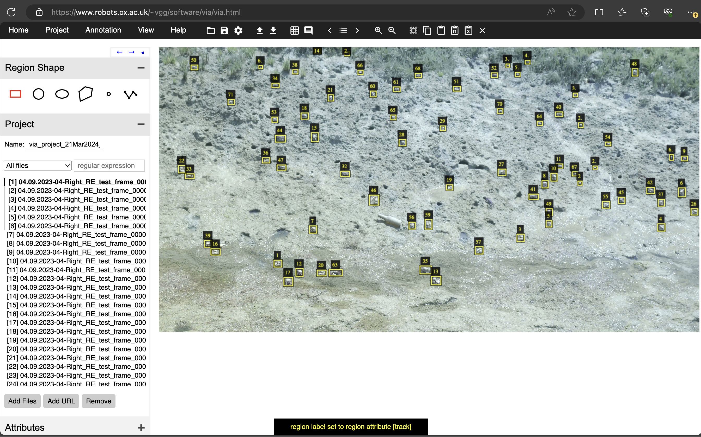
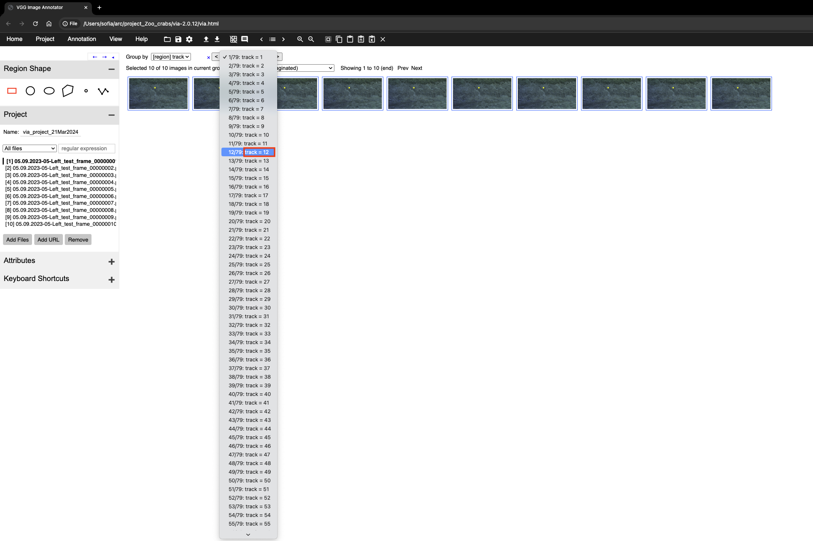
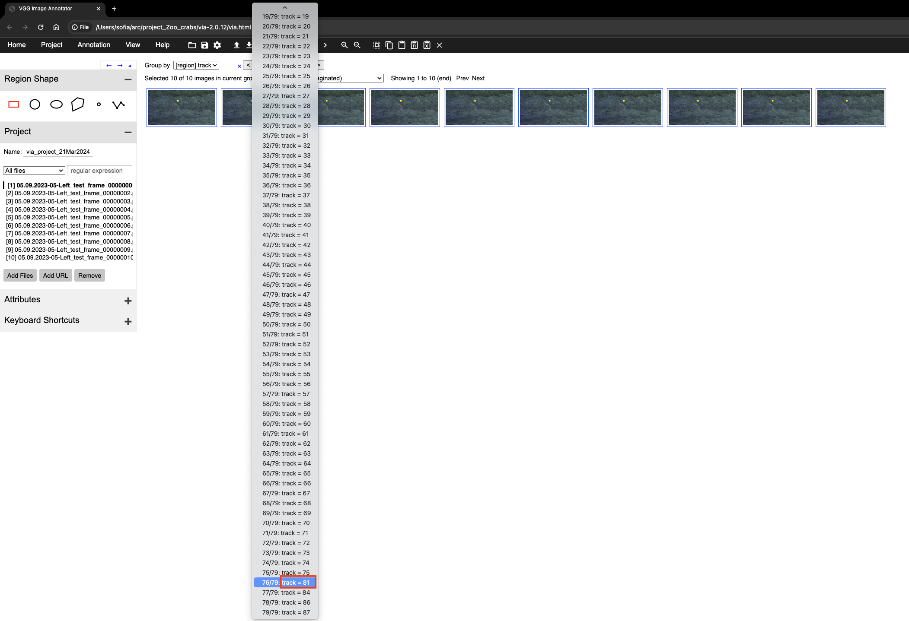

# Guide to correcting track labels

Authors: Nik Khadijah Nik Aznan and Sofía Miñano

The tracks to correct (frames and csv file) will typically be in a subdirectory under

```
/ceph/zoo/users/sminano/crabs_tracks_label/<clip-subdirectory>
```

Below we outline the steps on how to correct the data.

## Steps

### 0. Mount the server from `ceph` with the frames and tracks to correct

- Remember that to mount the server you need to be connected to the SWC network (or SWC VPN)
- In Mac, mounting the server can be done in the Finder app, by pressing CMD+K and writing the following address:
  ```
  smb://ceph-gw02.hpc.swc.ucl.ac.uk
  ```
- Once the directory with the csv file is mounted, we can access it under `Volumes` on Mac. For example, for an escape clip called `09.08.2023-01-Right-Triggered1.mov`, the path could look like:
  ```
  /Volumes/zoo/users/sminano/crabs_tracks_label/09.08.2023-01-Right-Triggered1/
  ```

### 1. Download and launch the VIA annotation tool

- Access the online version of the tool [here](https://www.robots.ox.ac.uk/~vgg/software/via/via.html) or download it locally [via this link](https://www.robots.ox.ac.uk/~vgg/software/via/) (click on `Downloads` > `Image annotator` section and download the zip file).
- It is very lightweight, browser-based and can be run offline.
- If you download the tool locally, launch it by selecting the `via.html` file from the expanded zip archive

> [!IMPORTANT]
>
> We recommend using Firefox or Edge to use the VIA tool.

### 2. Define the project settings

If we are launching the tool for the first time for a new project:

- Click on the gear icon on the top bar to go to `Settings`
- Edit the following settings:

  - `Project Name`: use the name of the parent directory (i.e., the name of the clip) and add `_corrected_`+ your initials as a suffix. For example, for Sofia and the clip `09.08.2023-01-Right-Triggered1.mov`:
    ```
    09.08.2023-01-Right-Triggered1_corrected_SM
    ```
  - `Default Path`: this will be the starting point of the file explorer when loading the images to label, so we want the folder with the frames we want to label here. For the example above, the default path to input would be:
  <!-- ToDO -->

  ```
  /Volumes/zoo/users/sminano/crabs_tracks_label/09.08.2023-01-Right-Triggered1/
  ```

> [!IMPORTANT]
>
> A trailing slash is needed!

- Leave the rest of the settings with their default values
- Click `Save`
- NOTE: We found the default path bit doesn't work very reliably, so sometimes you will need to browse the image to label and select them manually.

### 3. Load the data to label

- Import the csv file with the tracks for this clip: `Annotations` > `Import annotations (from csv)`

  - It will look for the image files in the same directory as the csv.

- If the frames aren't loaded automatically:

  - On the left-hand side, find the `Project` section and click on the `Add Files` button
  - Select the frames to load. Multiple selection is allowed, and also across folders at the same level (at least in Mac 🍎)

- Once loaded, use the left/right arrows to navigate through the images

### 4. Correcting the tracks

- Now you see all the images and the bounding boxes with a bounding box number.

  - Notice that when we flick through the frames, the numbers on the bounding boxes change! This is because this is not the track ID.

- Make sure the track id is shown instead of the bounding box number.

  - To do so, press the up key. The Up key toggles between `region label cleared `or `region label set to region attribute [track]`. To show the track ID, we want the second one: `region label set to region attribute [track]`.
    |  |
    | :------------------------------: |

> [!TIP]
> Pressing the bottom key will change the colour of the bounding box, but notice that the colour is not consistent across frames. However, it may be helpful to disentangle boxes when they are overlapping.

#### 4.1 Recommended approach:

> [!CAUTION]
> There is no undo action in the annotation tool!
>
> - Be sure to save frequently, at least every labelled frame.
> - The easiest way to save is as a VIA json file (click `Project` > `Save`) - this captures the full project.
> - If you are using the "copy+paste" approach to reuse the annotations of the previous frame: note that the copied annotations stay in the clipboard after pasting!

The idea is to repeat the following steps for all crab IDs in the clip.

- Select a crab ID to follow across frames.

  - You can highlight the crab with a certain ID by using the Annotation editor. To show this editor, click under `Attributes` > `Toggle Annotation Editor`. Then click on the row with the track ID of interest.
  - Be careful now, when it is highlighted, if you press the right-arrow key, the bounding box will be shifted to the right. Just click anywhere to disable the highlight.

- If the crab you are following has no bounding box in one of the frames: copy the box from the previous frame.

  - Use `ctrl+c` to copy the box from the same crab in the previous frame, then paste it (`ctrl+v`) on the current frame. This ensures we pass the same track ID. You can adjust the bounding box to where the crab is either by dragging with your mouse or using the arrow keys.

- If the crab you are following is assigned to a new ID for a large number of frames (i.e., it has been re-IDed/there was an ID switch): change all the annotations to match the ID in the previous frames.

  - In the menu bar, select the grid icon (6th icon after the `Help` menu).
    - All the frames will be shown in a grid style.
    - You do not need to wait until the grid images are finished loading before doing any of the steps below.
  - Choose `Group by` `region [track]` - a selector for the track number will pop up next to it.
  - In the selector, choose the track you want to edit.

    - For example: if the original ID is 9, and the crab has now been re-IDed to 12, then choose `12/79: track = 12`.
    - Notice that the first number shown in the dropdown menu options does not necessarily match the second one - see the figures below for two examples. This usually happens at the end of the list (you may see e.g. `78/79: track = 86`). The one we care about is the track ID (shown in red).

    |  |  |
    | :----------------------------------: | :----------------------------------: |

  - Toggle the Annotation Editor to edit the tracks.
    - You should see the Annotation Editor panel with the track ID field at the bottom of the screen.
    - If the track ID field is not editable:
      - Make sure the subset of frames shown in the grid are selected.
      - If they are and the ID is still not editable, try clicking a few times on the `Toggle Annotation Editor` button (it may show something like `xxx different values:...`).
  - Edit the track ID in the Annotation Editor field.
    - You want to change the ID from the one is being re-id to the original one (for example from 12 to 9)
    - To input the value click anywhere in the Annotation Editor.
    - There should be a notification at the bottom of the window saying `updated region attribute of <how many> region` (this seems to be flaky on Chrome tho - you may need to toggle the Annotation Editor for the change to take effect).
  - Check the ID change took effect:
    - You can go back to the usual one-frame visualisation by clicking on the grid icon (now crossed out).
    - See if the changes happened correctly.

- If the crab has been re-ID for only a few frames: it may be easier to edit the ID in each frame (rather than following the grid method).

  - Make sure the Toggle Annotation Editor is closed.
  - Click on the bounding box whose ID we need to edit: a box with the track number will appear next to it.
  - Simply edit the correct ID there.

- If there is a false positive (something incorrectly detected as a crab):
  - If it is tracked for a few (<= 2) frames only: delete the bounding box in those frames.
  - If it is tracked for more than 2 frames: you cannot easily delete boxes in bulk, so we recommend to
    - Follow the steps above to edit the track ID, but instead delete it.
    - If you cannot delete it (we saw this happen in Firefox), edit the track ID to be `_` (underscore).

#### 4.2 Notes:

- Notice that some crabs appear at later frames (not all crabs are present in frame 1), and their tracks should be checked too.
- If there are false positives whose tracks are not very long-lived (under 6 frames), we will discard them, so don't worry about deleting them.
- We saw some small crabs that are not detected. We wouldn't recommend labelling and tracking these, as we don't think they were labelled in the detector dataset.

> [!TIP]
>
> Browser:
>
> - We tried using the following:
> - Edge: good results, so far the best behaving.
> - Firefox: some issues with deleting track IDs.
> - Chrome: some issues saving an edited track ID.
> - Safari: temperamental, it will randomly reload the page and you will lose the unsaved work. Save regularly.

> [!TIP]
>
> - Some convenient shortcuts for track correction:
>   - Press the `Up` arrow to toggle between the track ID of the bounding box and the bounding box number.

### 5. Save and reloading an unfinished project

The easiest way to save a VIA project is by saving a VIA json file:

- In the top bar, click `Project` > `Save`.
- Leave all settings `ON` (as by default) and click `OK` to export.
- This generates a json file with the name `<project_name>.json` that we can load again later in VIA to continue labelling.

To later load and continue working on an unfinished project:

- In the top bar, click `Project` > `Load`, and then select the VIA json file.

### 6. Export the final annotations

Please export the final annotations as a csv format:

- in the top menu, click `Annotation` > `Export annotations (as csv)`
- This will download a csv file to your Downloads folder named `<project_name>_csv.csv`

Once you are done, please upload the final VIA json file and the csv file to the directory where the input data is. For our example, we would save the output files at:

```
/ceph/zoo/users/sminano/crabs_tracks_label/09.08.2023-01-Right-Triggered1/09.08.2023-01-Right-Triggered1_corrected_SM_csv.csv  # for the csv file
/ceph/zoo/users/sminano/crabs_tracks_label/09.08.2023-01-Right-Triggered1/09.08.2023-01-Right-Triggered1_corrected_SM.json  # for the VIA json file
```
